# Parecer do verificador: consertos da janela (05/10/2026)

**Em uma frase:** **PRONTO PARA CONFERIR, com ressalvas.** Os três consertos fazem o que prometem, conferido na janela de verdade: gerar o mesmo livro de novo não trava mais; o cartão mostra "pronto, PDF gerado"; e a trava do atalho da Horas 11 não mudou nenhuma imagem (96 de 96 idênticas). Mas os **dois bugs que o implementador deduziu existem de verdade** (vistos na janela), e o primeiro é grave: **"substituir o antigo" e depois "cancelar" apaga o PDF antigo**, sem aviso. E apareceu um terceiro, menor: depois de cancelar, o cartão continua verde dizendo "PDF gerado", até fechar e abrir o programa.

Ramo `consertos-janela-2026-10-05` (3 commits sobre `aab746f`: `8081335`, `5e68098`, `120e46b`). Nenhum código foi mexido por mim.

> **Defeito conhecido (aviso obrigatório até a Fase 1 ficar pronta):** moldura dourada e iluminura ainda são defeito conhecido (itens 1.4 e 1.5). Nada destes consertos mexe nisso.

---

## 1. Como foi feito

- **Máquina:** `pytest` inteiro na worktree, `teste_botoes.py`, e as 32 páginas-gabarito × 3 filtros comparadas ponto a ponto entre `aab746f` e `120e46b` (cópias limpas do código, feitas com `git archive`, com a pasta `modelos/` copiada nas duas).
- **Olho, na janela real:** instância minha do programa (código igual ao `120e46b`), **fora da tela** (não apareceu para o Samuel), em **1600 × 821 pixels = 1280 × 657 pontos** como na rodada de 02/10. Cliques e teclas por mensagens nativas do Windows; menus pelo teclado (setas + Enter); `WM_SETFOCUS` só na janela de teste. As caixas do Windows "abrir PDF" e "escolher pasta" foram respondidas por arquivo. **Pasta de dados própria** (`LOCALAPPDATA` e a pasta do usuário trocadas), nunca a do Samuel.
- **Livro de teste:** `livro-teste.pdf`, 4 folhas copiadas das páginas-gabarito do Boécio (p. 3, 7, 8, 22), "Dividir folhas ao meio" desligado, filtro Preto e branco, "Montar cadernos" desligado (o normal do programa).
- No fim, fechei a minha janela com WM_CLOSE (fechou nas 4 vezes). Nenhuma linha no `erros.log` da pasta de teste.

---

## 2. Testes de máquina

| O quê | Resultado |
|---|---|
| `pytest tests -q` na worktree, com `EDITOR_IMPRESSAO_GABARITO` | **1301 passaram, 87 pularam, 0 falhas** (8 min 8 s, PC ocupado) |
| Os que pularam, rodados de novo numa cópia limpa com o gabarito e `saida_teste` ligados (só leitura) | **273 passaram, 7 pularam, 0 falhas** |
| `teste_botoes.py` | **132 ações, 0 falhas** (inclui "salvar como (2)") |
| 32 páginas-gabarito × 3 filtros, `aab746f` × `120e46b` | **96 de 96 idênticas, ponto a ponto** |

**Por que pularam os 87 na worktree:**

- **28** (`test_camadas`, `test_gravura_scantailor`, `test_medidor_nas_paginas_otsu`): "pasta gabarito/ ausente". Esses testes procuram o gabarito **dentro da pasta do código** e **não leem** a variável `EDITOR_IMPRESSAO_GABARITO` (só o teste novo da Horas 11 lê). Rodados de novo com o gabarito ligado: passaram.
- **52** de OCR: os resultados guardados em `saida_teste/ocr-1.3` e `saida_teste/ocr-comparar` ficam fora do git. Rodados de novo com `saida_teste` ligado: passaram.
- **7** continuam pulando: 6 porque o motor do Kraken não está montado na cópia (fica fora do git), 1 que só roda com `OCR_22=1` (~5 min, de propósito).
- O teste novo **`test_horas_11_de_verdade_continua_no_atalho` rodou e passou** (a variável do gabarito funcionou para ele).

---

## 3. Item por item

### Conserto 1 (`8081335`): gerar o mesmo livro de novo — **funciona** (olho, na janela)

1. Abri o livro, processei até o PDF (`livro-teste - preto e branco.pdf`, 4 páginas).
2. Fechei o programa, abri de novo, reabri o livro (duplo clique no cartão) e cliquei "Confirmar e processar".
3. A janela abriu **com a pasta do PDF anterior e o mesmo nome**, **"Processar" aceso (azul)**, a frase "Já existe um arquivo com esse nome - eu pergunto antes de substituir." e a **faixa laranja "Já existe um arquivo chamado livro-teste - preto e branco.pdf nessa pasta"**. Antes deste conserto aparecia "Esse caminho não é uma pasta." com "Processar" apagado.

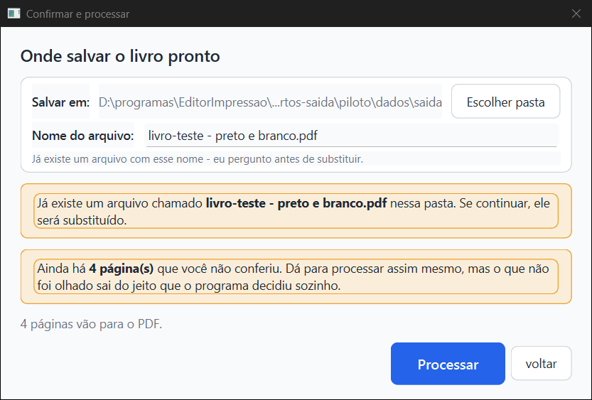

4. Cliquei "Processar": veio a caixa "substituir o antigo / salvar como … (2).pdf / cancelar".

5. **"salvar como (2)" (S1 do Samuel, conferido de verdade):** escolhi "salvar como livro-teste - preto e branco (2).pdf". Chegou em "Ficou pronto!" com o nome (2). No disco: o **(2).pdf existe, com 4 páginas**, e as 4 páginas são **iguais ponto a ponto** às do primeiro; o **antigo ficou intacto** (mesma impressão digital sha256 `ebd46667…` e mesma data, 13:47:32). Abri a página 1 do (2): é a capa do Boécio, filtrada.

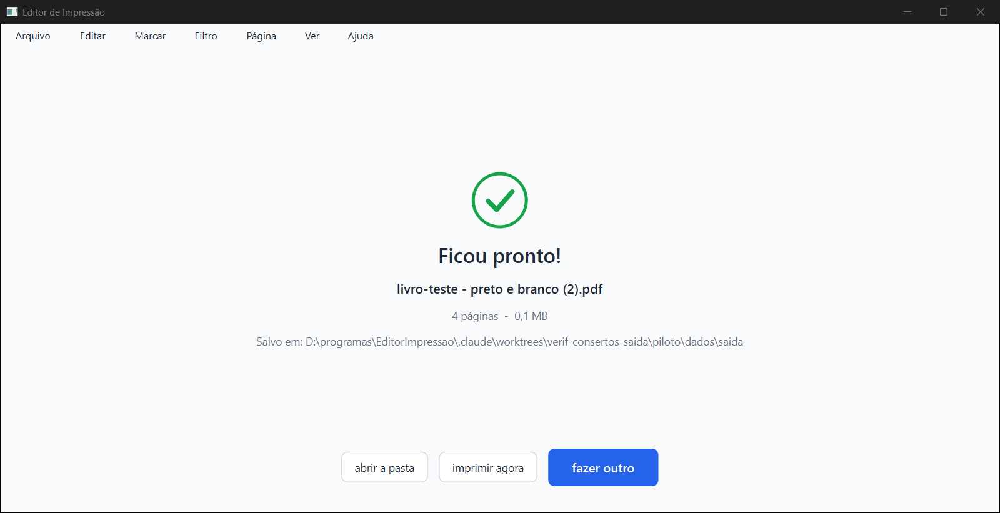

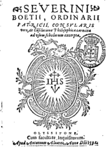

6. **Menu "Nome do arquivo…":** escolhi Arquivo > "Nome do arquivo…", digitei `meu-livro-teste.pdf` e dei OK. "Confirmar e processar" abriu **com esse nome**, na mesma pasta, sem faixa "Já existe" (o arquivo não existia). Processei e o `meu-livro-teste.pdf` foi gerado.

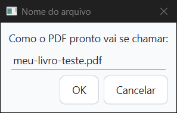

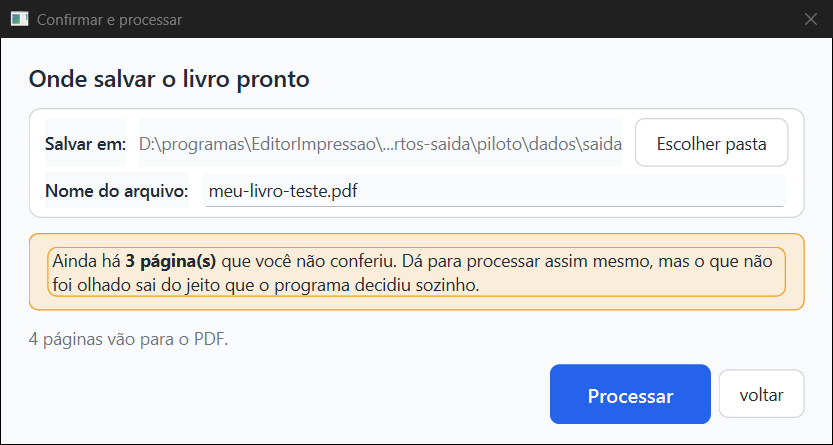

7. **Pasta sumiu (pendrive tirado):** gerei o PDF numa pasta `pendrive`, fechei o programa e apaguei a pasta. Ao reabrir, "Confirmar e processar" veio com a **pasta sugerida** (`…\home\Editor de Impressão`), o nome guardado e "Processar" aceso, e **a pasta `pendrive` não foi recriada** (conferido no disco).

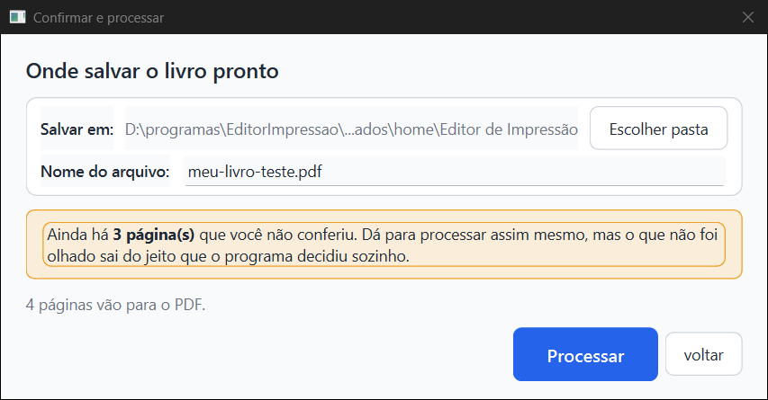

### Conserto 2 (`5e68098`): cartão "pronto, PDF gerado" — **funciona** (olho, na janela), com um buraco (ver bug 3)

Depois de gerar o PDF e clicar "fazer outro", o cartão ficou com a **barra verde cheia, "pronto, PDF gerado" e o botão "abrir a pasta"**. Continuou assim depois de fechar e abrir o programa. No disco, `resumo.json` com `"pdf_gerado": true`. Não cliquei "abrir a pasta" (abriria o Explorer na tela do Samuel); o `teste_botoes.py` clica nele por máquina.

### Conserto 3 (`120e46b`): trava do atalho da Horas 11 — **nenhuma imagem mudou** (máquina)

- **96 de 96 imagens idênticas** ponto a ponto ao `aab746f` (32 páginas-gabarito × Preto e branco, Mágico pro, Melhorar).
- Olhei a Horas 11 nos 3 filtros (a única página do gabarito que passa pelo atalho): página inteira, iluminura com as cores, texto preto no Preto e branco e colorido nos outros dois. Igual ao antes.
- **Tempo, só como indicação (PC ocupado com outros dois agentes):** Horas 11 no Preto e branco **15,3 s antes × 15,3 s agora**; Mágico pro 20,2 × 20,0 s; Melhorar 20,8 × 19,1 s. Soma das 32 páginas: 132 × 135 s, 240 × 236 s, 236 × 234 s. Sem diferença além do ruído: **o atalho continua agindo na Horas 11** (se não agisse, ela pagaria a medida grande, ~9,5 s a mais). O teste com a Horas 11 de verdade também passou.

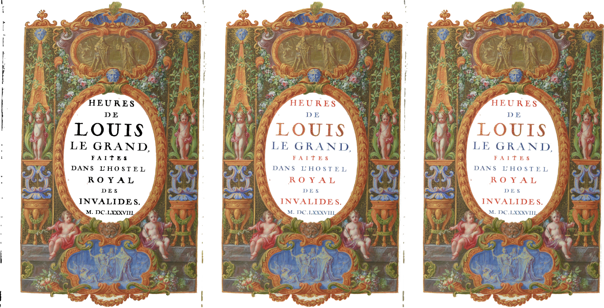

---

## 4. Os dois bugs que o implementador deduziu: **os dois existem** (vistos na janela)

### Bug 1 (GRAVE): "substituir o antigo" + "cancelar" apaga o PDF antigo — **CONFIRMADO**

**Como testei:** com `meu-livro-teste.pdf` gerado (1,1 MB), reabri o livro, "Confirmar e processar" > "Processar" > **"substituir o antigo"** e, logo em seguida, **"cancelar"** na tela de progresso. Resultado: o programa voltou para a tela Conferir **sem nenhuma mensagem**, e o **`meu-livro-teste.pdf` sumiu do disco**. O Kaique perde o PDF que já tinha, e não fica sabendo.

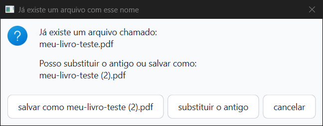

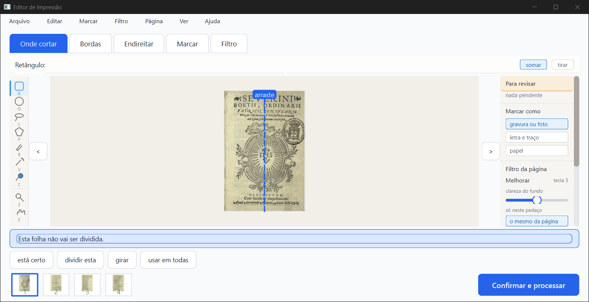

**Por que acontece (leitura do código, `core/pipeline.py`):** sem "Montar cadernos" (o normal), o PDF é gravado **direto no lugar do arquivo final** (l. 1038, `destino = saida_final`). Ao cancelar, o `EscritorPDF` grava por cima o que já tinha (`__exit__` → `fechar` → `save`), e depois o tratamento do cancelamento apaga o destino (l. 1133–1137, `Path(destino).unlink(missing_ok=True)`). Mesmo cancelando antes da primeira página, o `unlink` apaga o antigo. **Com "Montar cadernos" ligado o antigo escapa**, porque aí se grava num arquivo temporário e só no fim no lugar certo.

**É antigo** (não foi criado por estes commits), mas o conserto 1 deixa o caminho mais comum: agora reabrir o livro leva direto à caixa "substituir / salvar como". Fica a sugestão para quem consertar: gravar sempre num arquivo temporário ao lado e só trocar pelo final quando terminar bem (como já se faz com os cadernos).

### Bug 2: o cartão continua "PDF gerado" depois de mudar páginas sem gerar de novo — **CONFIRMADO**

**Como testei:** com o PDF gerado, reabri o livro, troquei o filtro da página 1 para Melhorar (menu Filtro), voltei ao início **sem processar**. O cartão continuou **verde, "pronto, PDF gerado"**; no disco, `pdf_gerado: true` e `conferidas: 1`. O PDF não tem mais a página 1 como ela está no trabalho.

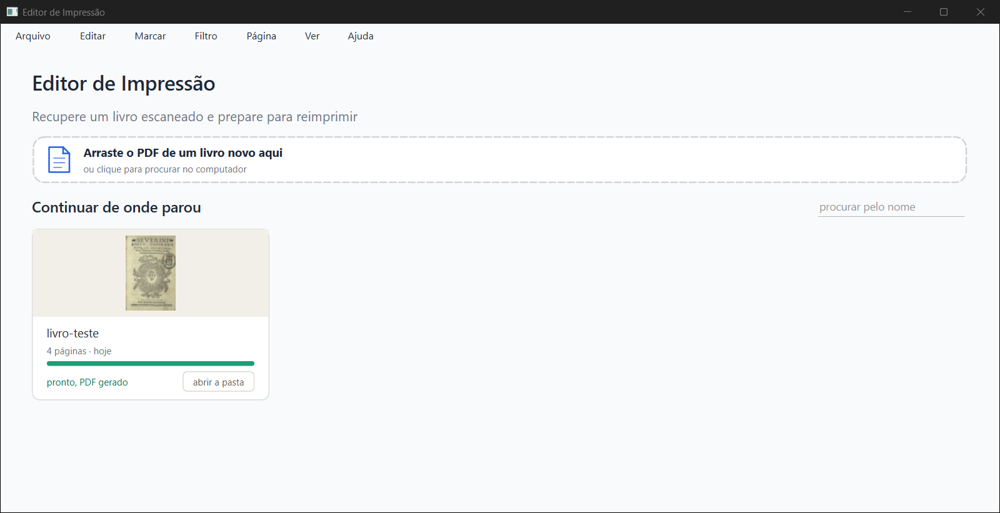

Nada põe `pdf_gerado` em falso quando o trabalho muda (só ao começar a processar e no "começar de novo"). É menos grave que o bug 1, e é uma decisão de como o cartão deve falar ("pronto" × "mudou depois do PDF").

### Bug 3 (novo, menor): depois de cancelar, o cartão continua verde até fechar o programa

No teste do bug 1, depois de cancelar fui ao início por Arquivo > "Voltar para as opções" > "voltar". O disco e a memória do programa já diziam `pdf_gerado: false`, mas o **cartão ainda mostrava "pronto, PDF gerado" e "abrir a pasta"**, para um PDF que não existe mais. Só ficou certo ("1 de 4 conferidas", "continuar") depois de **fechar e abrir o programa**.

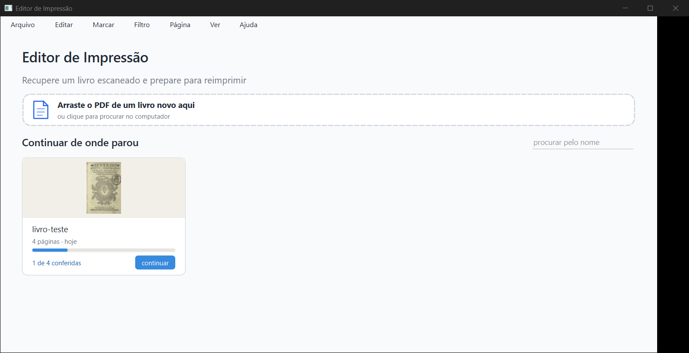

**Por que:** o botão "voltar" da tela "O que fazer" vai para o início sem recarregar os cartões (`ui/janela_principal.py` l. 132, `setCurrentIndex(INICIO)` sem `tela_inicio.recarregar()`). O `processar` põe `pdf_gerado` em falso, mas o cartão na tela é o de antes. Antigo (a contagem "X de Y conferidas" também fica velha nesse caminho), mas agora aparece como uma promessa errada em verde.

---

## 5. Ressalvas e coisas estranhas (nenhuma impede os três consertos)

- **Velocidade:** o teste oficial (`teste_velocidade.py`, ~12 min, só com o PC parado) **não foi rodado**: o PC estava com outros dois agentes. Os tempos acima são indicação.
- **Três frases sobre o mesmo arquivo** (N9 de 02/10, antigo): a janela diz "eu pergunto antes de substituir" **e** "Se continuar, ele será substituído", e a caixa seguinte vem com "salvar como (2)" de padrão. Com o conserto 1, o Kaique vai ver isso **toda vez** que gerar o mesmo livro de novo.
- **Depois de um "salvar como (2)", a próxima vez propõe o nome "(2)"** (e a caixa oferece "(3)"). É o comportamento pedido ("o mesmo destino da vez anterior"), mas pode juntar (2), (3), (4)… na pasta. Pergunta para o Samuel, não defeito.
- **Pasta do PDF sumiu:** a janela de confirmar faz a coisa certa, mas o cartão continua dizendo "pronto, PDF gerado" com "abrir a pasta" para uma pasta que não existe (o menu do botão direito já apaga "abrir a pasta de saída" nesse caso; o botão do cartão não).
- **Os 28 testes que procuram o gabarito dentro da pasta do código** não leem `EDITOR_IMPRESSAO_GABARITO`: numa worktree eles pulam sem avisar. Rodados por mim numa cópia com o gabarito ligado: passaram.
- **Caixinhas e bolinhas sem o quadrado/círculo** na tela "O que fazer" (O1 de 02/10, ainda não feito) — visto no print abaixo, antigo.
- **Nos prints 07 e 19** há uma faixa preta à direita: é o primeiro desenho da janela logo depois de eu a mover para fora da tela (no print seguinte some), não é defeito do programa.
- Não testei "cancelar" com "Montar cadernos" ligado na janela; a leitura do código diz que aí o antigo escapa.

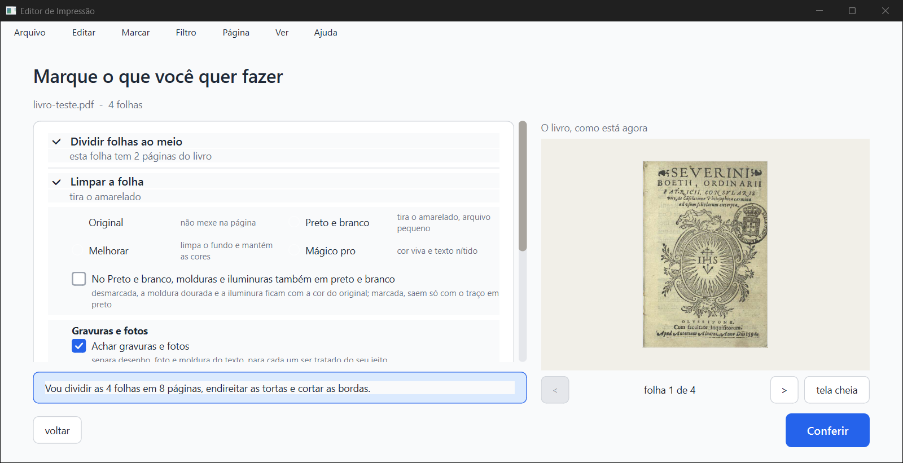

---

## 6. O que eu vi em cada print (todos abertos)

| Print | O que mostra |
|---|---|
| 01b-inicio-vazia | Tela inicial vazia, 1600 × 821 |
| 02-o-que-fazer | Opções do livro de teste (Preto e branco escolhido depois) |
| 03-conferir | Conferir, página 1, "Confirmar e processar" |
| 04-confirmar-primeira-vez | Primeira vez: pasta escolhida, nome sugerido, Processar aceso |
| 05-pronto | "Ficou pronto!", 4 páginas, 0,1 MB |
| 06-inicio-cartao-pdf-gerado | Cartão verde, "pronto, PDF gerado", "abrir a pasta" |
| 07-inicio-sessao-nova | O mesmo cartão depois de fechar e abrir |
| 08-confirmar-gerar-de-novo | Mesma pasta e nome, Processar aceso, faixa "Já existe" |
| 09-caixa-substituir-ou-salvar-como | substituir / salvar como (2) / cancelar |
| 10-pronto-salvar-como-2 | "Ficou pronto!" com o (2) |
| 11-pdf-2-pagina-1 | Página 1 do (2), capa do Boécio filtrada |
| 12-conferir-pagina-1-trocada-para-melhorar | Filtro da página 1 = Melhorar |
| 13-inicio-depois-de-mudar-sem-gerar | Cartão ainda "pronto, PDF gerado" (bug 2) |
| 14-menu-nome-do-arquivo | Caixa "Nome do arquivo" com `meu-livro-teste.pdf` |
| 15-confirmar-com-o-nome-do-menu | Confirmar com `meu-livro-teste.pdf` |
| 16-caixa-antes-de-substituir | Caixa para `meu-livro-teste.pdf` (escolhido "substituir") |
| 17-depois-de-cancelar | Volta para Conferir sem aviso; PDF antigo apagado (bug 1) |
| 18-inicio-depois-de-cancelar | Cartão ainda verde (bug 3) |
| 19-inicio-sessao-nova-depois-de-cancelar | Depois de reabrir: "1 de 4 conferidas", "continuar" |
| 20-confirmar-pasta-do-pdf-sumiu | Pasta sumida: volta à sugerida, nome guardado, Processar aceso |
| horas11-agora-3-filtros | Horas 11 nos 3 filtros (idêntica ao antes) |

---

## 7. Para a Lista de bugs (05/10/2026)

1. **Grave:** "substituir o antigo" + "cancelar" apaga o PDF antigo, sem aviso (sem "Montar cadernos"). `core/pipeline.py` l. 1038 e 1133–1137. Prints 16 e 17.
2. "pronto, PDF gerado" continua depois de mudar páginas sem gerar de novo. Prints 12 e 13.
3. Depois de cancelar e voltar pelo "voltar" da tela "O que fazer", o cartão continua verde até fechar o programa (`ui/janela_principal.py` l. 132 não recarrega os cartões). Prints 18 e 19.
4. Os testes de `test_camadas`, `test_gravura_scantailor` e `test_medidor_nas_paginas_otsu` não leem `EDITOR_IMPRESSAO_GABARITO` e pulam calados em worktree.

---

## 8. Onde está

- Este parecer: `relatorios/conferir/consertos-janela-2026-10-05/verificador/parecer-verificador-consertos-janela.html` (e `.md`, `.pdf`), na worktree `consertos`.
- Prints: `prints/` ao lado (2,4 MB, no git). O `.pdf` tem 26 MB (as imagens entram sem compressão) e fica **fora do git**, só nesta pasta.
- Scripts usados: `passo.py` e `lancador.py` (piloto da janela, a partir dos de 02/10), `montar_livro.py`, `rodar_tudo.sh` e `comparar.py` (a comparação usa o `rodar_verificador.py` de 02/10).
- Rodadas, cópias do código e pasta de dados de teste: `D:\programas\EditorImpressao\.claude\worktrees\verif-consertos-saida\` (fora do git; pode ser apagada).
