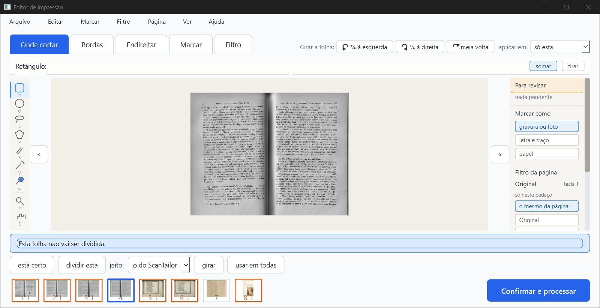
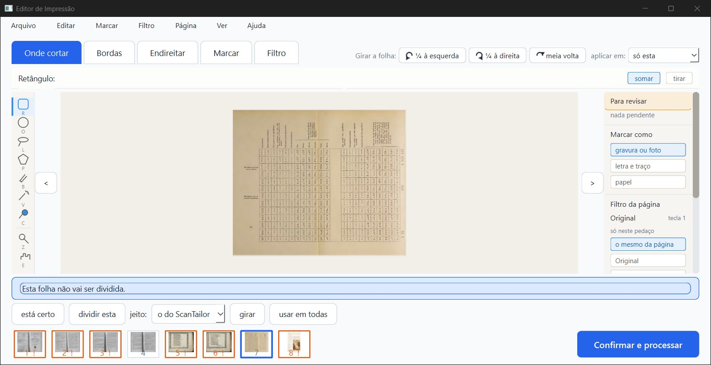
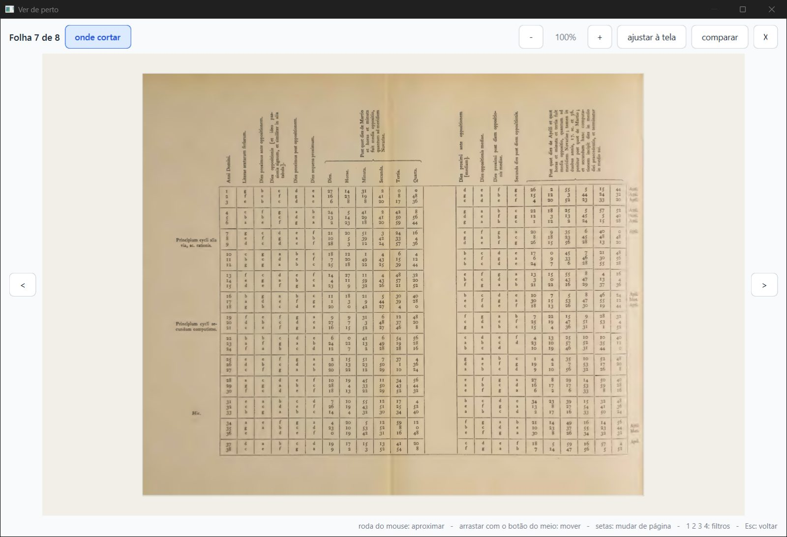
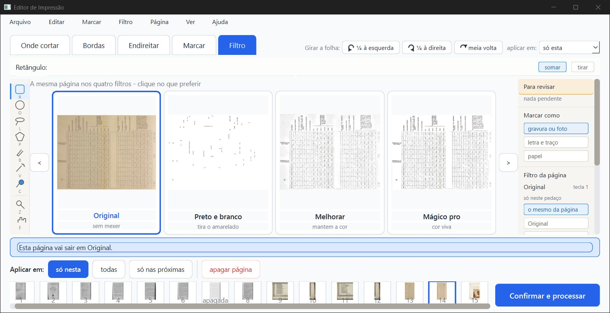
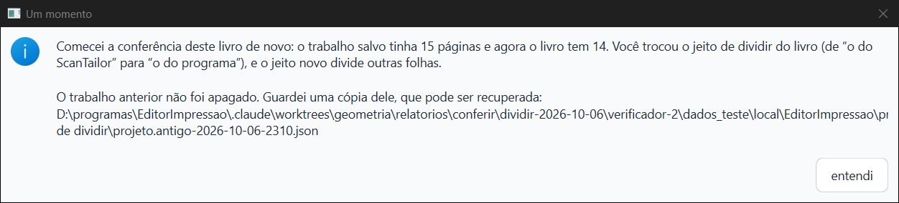
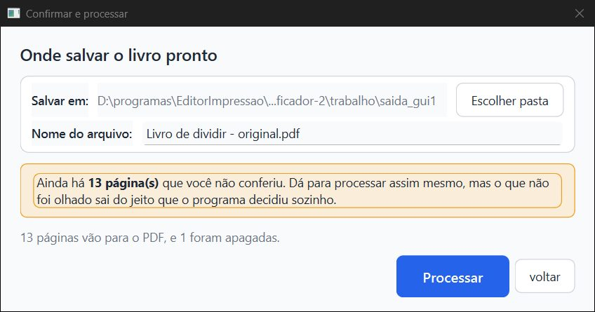
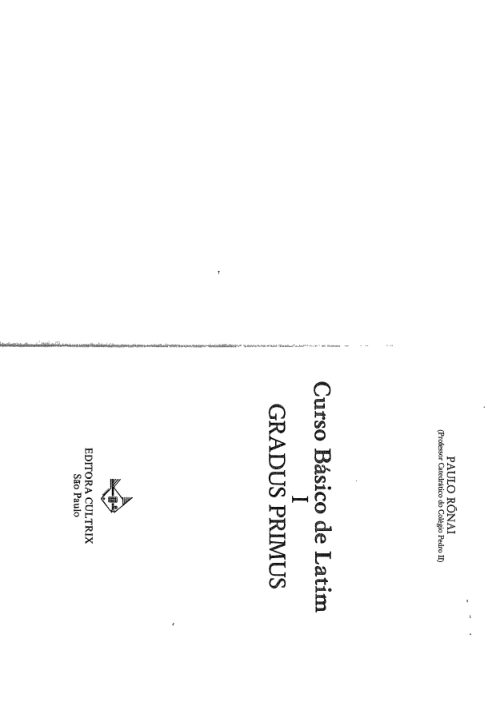

# Parecer do verificador, 2ª rodada: consertos do item 2.1 (dividir), 06/10/2026

**PRONTO PARA JUNTAR, com duas ressalvas pequenas de tela. Os cinco consertos fazem o que prometem.**

1. **Nenhuma folha some mais.** O Gradus Primus do Samuel (cópia) sai com **139 páginas, iguais ponto a ponto às do `fase-1`**, e a página de rosto voltou. No livro novo, quem apaga a página da esquerda e aperta "não dividir esta" fica com a folha inteira no PDF, uma vez só.
2. **O contador** da janela "Confirmar e processar" bate com o PDF.
3. **A dica e o aviso** dizem a coisa certa.
4. **A linha azul** some na folha não dividida, na tela normal e na ampliada.

**Não é "aprovado":** só o Samuel marca.

**O que foi conferido:** ramo `fase2-dividir`, commit `5b7ac75` (consertos `e93c085`, `b2fd46d`, `ad66613`, `2da12de`, `11c3f10`, `21724a4`, `5b7ac75`). Comparei com o `fase-1` (`a5ac122`), em cópias `git archive`.

**Pasta de dados:** todos os scripts e o programa pilotado rodaram com pasta de dados e TEMP próprios, em `verificador-2\dados_teste` e `verificador-2\trabalho\tmp`. O canal do piloto também ficou dentro do projeto. Conferi no fim:

- o `erros.log` do Samuel continua com 7989 linhas e a mesma soma do começo desta rodada;
- o `projeto.json` do Gradus dele continua com a data de 18/07.

Nada foi apagado fora do projeto.

## Item por item

| O que | Como | Resultado |
|---|---|---|
| Gradus Primus do Samuel (cópia), 139 páginas | máquina + janela | **Bom.** Sem janela: a divisão é a mesma, e as 139 prévias e as 139 páginas do PDF são iguais às do `fase-1`. Na janela: o programa abriu a cópia e processou 139 páginas. Elas são iguais, a 72 e a 150 DPI, às 139 do `fase-1` processado na janela na rodada anterior. A página 3 é a página de rosto, "Curso Básico de Latim, Gradus Primus" (c7). A janela de confirmar dizia "139 páginas vão para o PDF, e 1 foram apagadas" |
| Caso b3: livro novo, apagar a esquerda + "não dividir esta" | janela | **Bom.** Na folha 4 (Hugon 241), apaguei a página da esquerda na aba Filtro e apertei "não dividir esta". A página da direita **continua viva** e leva a folha inteira; as 8 folhas estão no PDF (c1). No PDF, a página 7 é a folha 4 inteira (0,07 a 1,0 da largura), uma vez só |
| "dividir esta" de volta | janela | **Bom.** Na mesma folha, volta a dividir. A esquerda continua apagada e sai a metade da direita. Ctrl+Z, Ctrl+Z e Ctrl+Y trocaram dividida e não dividida certo, sem mexer nas páginas apagadas |
| Restaurar a metade escondida não repete a folha | janela + PDF | **Bom no PDF, com ressalva na tela.** No Opus 256, "não dividir esta" apagou a metade da direita (esquerda viva). Depois, "restaurar página" na aba Filtro trouxe a da direita de volta. O PDF continuou com o Opus **uma vez só** (13 páginas). A ressalva está abaixo |
| Contador da janela Confirmar = PDF | janela | **Bom.** Livro de dividir: "13 páginas vão para o PDF, e 1 foram apagadas", e o PDF saiu com **13** (c6). Gradus: 139 e 139. Casei cada página do PDF com a folha de onde veio: nenhuma repetida, nenhuma faltando |
| Textos novos | janela | **Bom.** Dica do "dividir esta" na folha que entrou inteira: "Esta folha entrou como uma página só: o jeito de dividir do livro não achou duas páginas nela, e aqui não dá para dividi-la." Aviso ao trocar só o jeito: "…Você trocou o jeito de dividir do livro (de “o do ScanTailor” para “o do programa”), e o jeito novo divide outras folhas." (c5). Ao desmarcar a caixinha, continua "Isso acontece quando se muda a opção “Dividir folhas ao meio”" |
| Linha azul | janela | **Bom.** Na folha não dividida, nada de linha nem de "arraste", na aba Onde cortar (c1, c2) e na tela ampliada ("Ver de perto", c3). Na folha dividida, a linha aparece. Arrastei sobre o Opus não dividido e a posição do corte não mudou (0,4975 antes e depois) |
| Projetos antigos montados pelo `fase-1` (Hugon, Siebmacher) | máquina | **Bom.** A divisão é a mesma, e as 50 + 22 prévias e páginas do PDF são iguais às do `fase-1`. A única diferença é a de propósito: a folha com "não dividir esta" do programa de antes sai uma vez, e não duas |
| Testes | máquina | **pytest arquivo por arquivo (102 arquivos): 1830 passaram, 59 pularam, 0 falharam.** Destes, `test_dividir_na_tela` deu 8, `test_dividir_no_programa` 18, `test_dividir_scantailor` 13, `test_projetos` 24, `test_modelos` 4 e `test_visualizador` 70. **`teste_botoes.py`**, numa cópia `git archive` do `5b7ac75` com `saida_teste` própria: **166 ações, 0 falhas** |

## Ressalvas

1. **A metade restaurada aparece na tela, mas não no PDF.** Depois de "não dividir esta" e "restaurar página" na metade da direita, a tira de miniaturas mostra a folha **duas vezes** (páginas 13 e 14). A aba Filtro, nessa página, diz "Esta página vai sair em Original.", mas ela não vai para o PDF (c4). O PDF e o contador estão certos. Só a tela promete uma página a mais. É raro: a pessoa tem de restaurar de propósito a metade que o "não dividir" escondeu.
2. **"dividir esta" desfaz uma página apagada à mão.** Se a pessoa apagou a metade da direita **antes** de "não dividir esta", o "dividir esta" a traz de volta, porque devolve a da direita quando a esquerda está viva. Já estava assim na rodada anterior. O Ctrl+Z resolve.
3. **Não refiz nesta rodada** a "volta ao dividir esta" com a esquerda viva. Esse caso foi testado na rodada anterior (Opus: não dividir, Ctrl+Z e Ctrl+Y) e está nos testes novos do implementador. O conserto só acrescentou a condição "esquerda viva".
4. **Pergunta que o implementador deixou para o Samuel:** numa folha que deixou de ser dividida, com uma metade apagada, sai a folha **inteira**. É o que o `fase-1` fazia, e nada some. Concordo que é o mais seguro.
5. **Continua valendo, da rodada anterior, para a pergunta do jeito de fábrica:** no livro aberto (Hugon e Penido), "o do programa" corta letras em muitas folhas, e "o do ScanTailor" ficou na dobra. O "abrir" com o do ScanTailor fica uns 50% mais lento.

## Imagens

## Arquivos

- **Parecer:** `parecer-verificador-2-dividir.html` (`.md`, `.pdf`).
- **Dados** (`dados/`):
  - projetos antigos, `fase-1` × novo: `antigo/`;
  - pytest: `pytest_partes.log`;
  - fim do `teste_botoes.py`: `teste_botoes_fim.txt`;
  - de que folha veio cada página do PDF da janela: `pdf_gui1.json`.
- **Scripts:** `scripts/`. O `py.sh` roda tudo com a pasta de dados própria.
