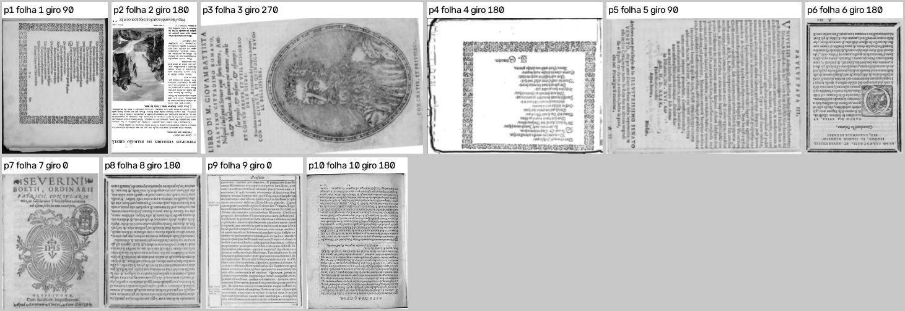
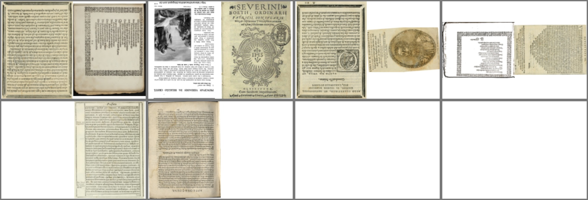
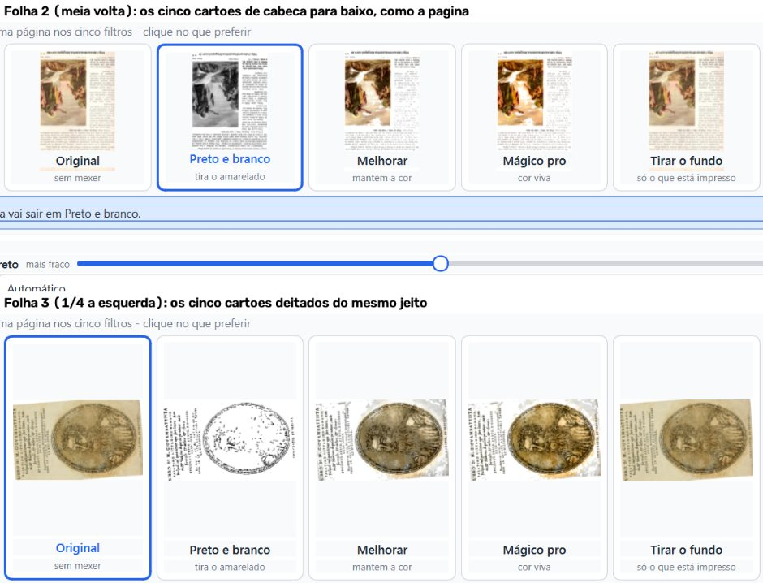
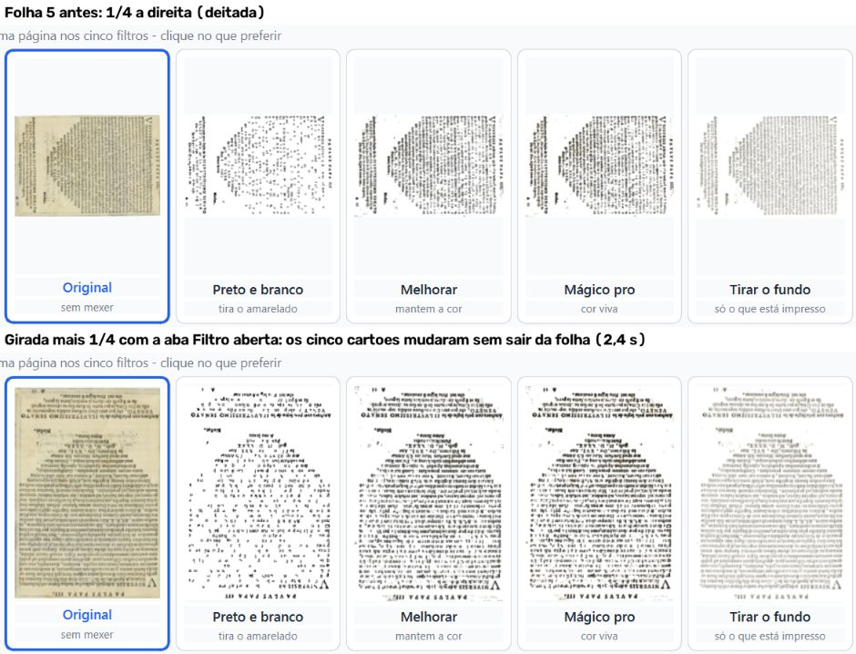
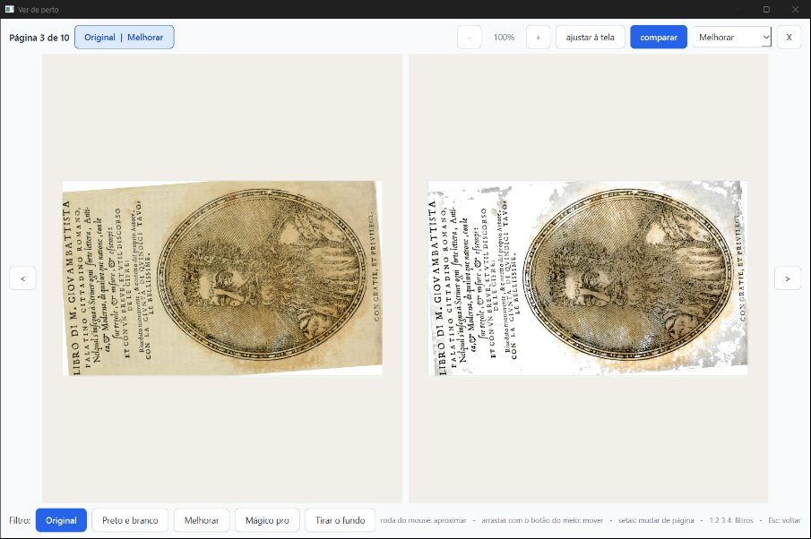
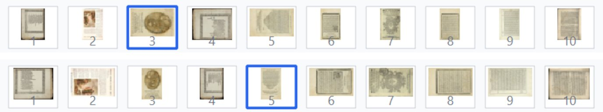
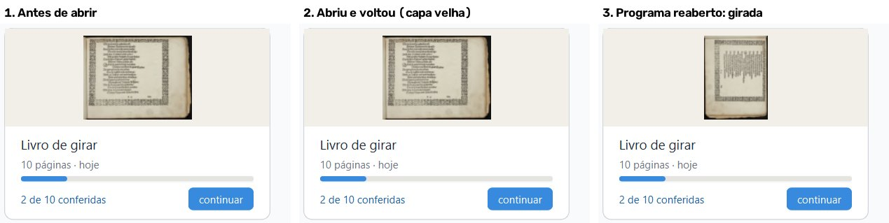
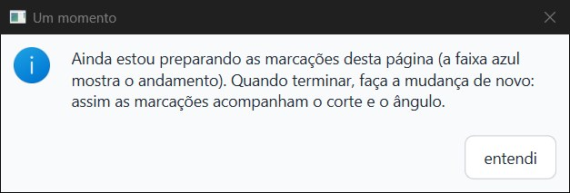

# Parecer do verificador-3: consertos do item 2.3 (girar a folha), 06/10/2026

**PRONTO PARA JUNTAR, com ressalvas. Os cinco consertos fazem o que prometem.**

Ficou uma falha pequena no conserto das miniaturas e da capa. A capa nova é gravada certa. Mas, se a pessoa volta para a tela inicial pelo botão "voltar" das opções, o cartão continua mostrando a capa velha até o programa ser aberto de novo.

Achei também dois defeitos que **não vêm destes consertos**: eles já existem no `fase-1`. Estão no fim, para a Lista de bugs.

**Não é "aprovado":** só o Samuel marca.

> **Defeito conhecido (decisão do Samuel, 28/09):** moldura dourada e iluminura continuam sendo defeito conhecido da Fase 1. Estes consertos não mexem na imagem das páginas. O PDF saiu **idêntico, pixel a pixel, ao do `fase-1`** nas 10 páginas do livro de teste, giradas ou não. Também saiu idêntico em cadernos e em Mágico pro.

**O que foi conferido:**

- ramo `fase2-geometria`, commit `89fae91`, com os consertos `ee84f80`, `695cc30`, `edd5db7`, `5b4598a` e `89fae91`;
- comparação com o `cc00d5c` (antes dos consertos) e com o `fase-1` (`14c4829`).

**Como foi conferido:**

- a janela real foi pilotada fora da tela, em 1600×821 px, só com mouse e teclado nativos (mensagens do Windows mandadas para a janela de teste);
- pasta de dados só de teste, com cópias do "Livro de girar" (10 páginas-gabarito) e do Boécio antigo (50 páginas, zonas no formato de antes de 05/10);
- o parecer parcial do verificador-2 (interrompido pela reinicialização) foi usado só como ponto de partida. Tudo abaixo foi refeito nesta sessão.

## Veredito por conserto

| Conserto | Como | Resultado |
|---|---|---|
| `ee84f80`: cartões da aba Filtro giram uma vez só | janela real + máquina + olho | **Bom.** Nas folhas 1 a 6 (giros de 90, 180 e 270), os 30 cartões ficaram no mesmo giro da página. Girar ¼ com a aba Filtro aberta refez os cinco cartões em 2,4 s, sem sair da folha. O "comparar" da tela ampliada ficou no giro certo nas 8 comparações (folha 1, giro 90; folha 3, giro 270) |
| `695cc30`: a folha da vez nunca mostra a imagem de outra folha | janela real + máquina | **Bom.** Foram 30 rodadas nas abas Bordas, Endireitar e Onde cortar, andando rápido e girando "todas" no meio, com 3.567 amostras da tela. Em nenhuma apareceu a imagem de outra folha, e as 30 terminaram na imagem certa. Depois de girar e desfazer, as 30 folhas (3 abas × 10) voltaram com a imagem do giro certo: nenhuma prévia velha voltou da memória |
| `edd5db7`: miniaturas e capa acompanham o giro | janela real + máquina + olho | **Bom, com uma falha pequena.** As 10 miniaturas ficaram no giro certo em 6 situações seguidas: ao abrir, girar uma folha, girar todas ¼ à esquerda, reabrir o livro, girar todas ¼ à direita e desfazer. A `capa.png` foi gravada com o giro da folha 1 nas 8 conferências, e não mudou quando outra folha girou. **A falha:** voltando pelo "voltar" das opções, o cartão da tela inicial continua com a capa velha. Ela só aparece girada quando o programa é aberto de novo (imagem 5) |
| `5b4598a`: mudar corte, borda ou ângulo espera as zonas antigas | janela real + máquina | **Bom.** No Boécio antigo, durante "Preparando as marcações…", três coisas foram barradas: o "usar em todas" da linha de corte, o "usar em todas" da borda e um Ctrl+Z de outra sessão. Nas três, apareceu o aviso "Um momento" e nada mudou. Depois da conversão, as três funcionaram. Nas cinco rodadas, as 698 zonas das 50 páginas ficaram no mesmo lugar do papel que na rodada sem mudança (diferença ≤ 0,002 da folha) |
| `89fae91`: PDF comprimido ao escrever cada página | janela real + máquina | **Bom.** No fim do "Processar", a janela parou 0,80 s e 0,61 s, contra 4,22 s e 4,16 s no código antigo (vigia de 25 ms dentro do programa). Os pixels do PDF são os mesmos do `fase-1`. Na janela, o processar inteiro ficou mais rápido: 11,2 s e 9,4 s, contra 14,7 s e 13,3 s. Sem janela, o tempo ficou igual (veja Velocidade) |

## Testes de máquina

- **pytest, arquivo por arquivo (86 arquivos): 1616 passaram, 59 pularam, 0 falharam.** Tempo somado: 733 s. Nenhum arquivo precisou ser repetido.
  - `test_girar.py`: 34 passaram;
  - `test_girar_cartoes_e_previas.py`: 22 passaram;
  - `test_girar_na_tela.py`: 16 passaram;
  - `test_gravar_pdf_sem_parar_a_janela.py`: 5 passaram.
- **`teste_botoes.py`: 159 ações, 0 falhas.** Rodou numa cópia `git archive` do `89fae91`, com `saida_teste` própria. Os botões de girar e o "Aplicar o giro em" estão no meio das ações.

## O PDF gerado

- **Ordem, páginas faltando e giro.** O PDF feito na janela tem as 10 páginas. Para cada página, procurei a folha do livro de entrada (em qualquer dos 4 giros) que tem aquele pedaço de papel. Nas 10, a página é a folha certa, na ordem certa e no giro pedido (90, 180, 270, 180, 90, 180, 0, 180, 0, 180). A folha certa ganhou sempre com folga: de 0,17 a 0,62 acima da segunda melhor.
- **Igual ao `fase-1`:**
  - o PDF da janela e o feito sem janela com o `fase-1` têm os mesmos pixels nas 10 páginas, giradas ou não, com o mesmo tamanho de página. O desenho a 100 DPI também é igual;
  - o mesmo vale para o livro todo em **cadernos** (8 folhas de impressão) e todo em **Mágico pro** (10 páginas);
  - as 10 prévias também são idênticas.
- **O leitor do Chrome (PDFium)** abre o PDF novo e o desenha exatamente igual ao PDF antigo.
- **Tamanho:**
  - livro de teste: 46,7 → 44,6 MB;
  - Mágico pro: 28,1 → 25,9 MB;
  - cadernos: 46,7 → 44,6 MB.

- **Olhando:** a página 1 está deitada para a direita, as páginas 2, 4, 6, 8 e 10 de cabeça para baixo, a 3 deitada para a esquerda, a 5 deitada para a direita, e a 7 e a 9 em pé. É o que foi pedido.

- **Cadernos:** a primeira folha tem as páginas 8 e 1, depois vêm 2 e 7, 6 e 3, 4 e 5. O segundo caderno tem as páginas 9 e 10, e o resto em branco. Cada página está no giro dela.

## O que se vê nas imagens

- **Folha 2 (meia volta) e folha 3 (¼ à esquerda):** os cinco cartões estão no mesmo giro, e é o giro do PDF. Antes do conserto, três deles apareciam em pé na folha 2.

- **Folha 5 girada mais ¼ com a aba Filtro aberta:** os cinco cartões mudaram juntos, em 2,4 s, sem sair da folha.

- **Comparar da tela ampliada:** os dois lados estão no mesmo giro. A folha aparece um pouco torta, uns 4°. É a observação D3, que já era conhecida e não é destes consertos.

- **Tira:** depois do "todas ¼ à esquerda", todas as dez miniaturas giraram.

- **Capa:**
  1. o livro foi girado antes do conserto, então a capa velha está sem o giro;
  2. depois de abrir o livro e voltar pelo "voltar" das opções, o cartão **ainda mostra a capa velha**, embora a `capa.png` no disco já esteja girada;
  3. com o programa aberto de novo, a capa aparece girada.

- **Aviso do conserto 5b4598a:** em português, com um botão só. No caso do Ctrl+Z, ele diz "desta página" e "faça a mudança de novo", mas a página atingida não era a que estava na tela.

## Velocidade

**O processar não ficou mais lento de um jeito que dê para medir, e gasta menos memória.**

| Medida | `89fae91` (novo) | `cc00d5c` (antes) |
|---|---|---|
| Teste oficial, Mágico pro, 10 páginas (de costume) | 1 min 9 s | 1 min 21 s |
| Teste oficial, Preto e branco, 10 páginas (de costume) | 30,7 s | 36,0 s |
| Teste oficial, memória máxima | 1.378 MB | 1.575 MB |
| Sem janela, intercalado, Mágico pro, 10 páginas (3 rodadas, mediana) | 21,8 s | 21,0 s (`fase-1`) |
| Sem janela, intercalado, Preto e branco, 10 páginas (3 rodadas, mediana) | 8,1 s | 8,2 s (`fase-1`) |
| Na janela, do clique em Processar até a tela final (2 rodadas) | 11,2 s e 9,4 s | 14,7 s e 13,3 s |
| Na janela, maior parada no fim do Processar | 0,80 s e 0,61 s | 4,22 s e 4,16 s |

**Ressalva da medida:** o PC estava sendo usado por outros agentes ao mesmo tempo, e o teste oficial variou muito de uma rodada para outra. No código antigo, a 3ª rodada de Mágico pro levou 59 s e a 2ª, 81 s. Por isso:

- a comparação que vale para o tempo é a intercalada, sem janela. Nela, o Mágico pro ficou 0,8 s mais lento em 10 páginas (4%), dentro da variação normal, e o Preto e branco ficou igual;
- a memória menor se repetiu nas 3 rodadas (1.349 a 1.378 MB, contra 1.541 a 1.575 MB). Ela bate com o que o implementador mediu (1574 → 1385 MB).

## Ressalvas

1. **Capa do cartão (conserto `edd5db7`, pequena):**
   - o "voltar" da tela de opções só troca de tela e não remonta os cartões. Por isso a capa (e também o andamento) do cartão fica como estava quando a tela inicial foi montada;
   - a `capa.png` é gravada certa, e o "fazer outro", o processar e reabrir o programa remontam o cartão;
   - um livro girado antes do conserto só tem a capa refeita quando é aberto.
2. **Logo depois de girar, a mesma página fica até 2,9 s no giro de antes, com "atualizando…".** É de propósito: a imagem anterior **da mesma página** fica na tela para não piscar. Nunca foi imagem de outra folha. Quando muitas prévias estão na fila, isso dura de 1,2 a 2,9 s.
3. **O aviso "Um momento" no Ctrl+Z diz "desta página"**, mas a página atingida pode não ser a da tela. Também diz "faça a mudança de novo", quando a pessoa precisa apertar Ctrl+Z de novo. É só o texto.
4. **O ângulo de uma página antiga mudado logo ao chegar nela** (página 46 do Boécio, 2 vezes) não mostrou o aviso. A página já tinha a geometria anotada no momento do clique, e as zonas ficaram no lugar. Não achei um caso em que a mudança passasse sem aviso numa página sem geometria.
5. **Uma vez, um clique de girar não valeu.** Foi no começo de uma sessão do Boécio, na aba Onde cortar. Não se repetiu em 8 cliques seguidos feitos para isso, nem nos mais de 60 giros do resto da sessão. Não sei a causa.
6. **Não testado:**
   - a roda do mouse (não funciona sem foco);
   - a escala real do notebook do Kaique;
   - a tira de miniaturas com folha dividida na janela: o Livro de girar não tem folha dividida, e o Boécio não divide. A divisão está coberta pelo teste de máquina `test_d2_a_tira_divide_a_folha_girada`.
7. **Teclas em inglês no menu** ("Ctrl+Left"): já está na Lista de bugs.

## Defeitos achados que NÃO são destes consertos (para a Lista de bugs)

- **06/10/2026, histórico depois de reabrir o livro (sério, já existe no `fase-1`).** Quando a pessoa desfaz uma ação, faz outra e reabre o livro, o Ctrl+Z passa a desfazer a ação errada. Ele desfaz a que já tinha sido desfeita, e a última ação vira "refazer".
  - Causa: `historico_acoes.registrar` limpa o "refazer" só na memória, e o arquivo `acoes.jsonl` continua com a ação desfeita no meio.
  - Reproduzido sem janela com o código do `fase-1`. Fiz A, fiz B, desfiz B e fiz C. Na memória ficou [A, C]. Depois de reabrir, ficou [A, B], com C no "refazer".
  - Na janela: depois de reabrir o Livro de girar, o Ctrl+Z não desfez o "girar todas" que eu tinha acabado de fazer.
- **06/10/2026, erro de memória ao fechar (já existe desde 05/10).** Em 2 das 11 vezes que fechei o programa, o Windows anotou "access violation" no fechamento. Foi depois de a janela fechar, sem aviso na tela, e o projeto já estava gravado. Nos arquivos dos verificadores desde 05/10, antes do girar, há 33 registros iguais.

## Onde está tudo

- Este parecer: `relatorios/conferir/girar-2026-10-06/verificador-3/parecer-verificador-3-consertos-girar.html` (também `.md` e `.pdf`).
- Imagens do parecer: `.../verificador-3/imagens/`. Prints inteiros (fora do git): `.../verificador-3/prints/`.
- Registro passo a passo: `.../verificador-3/trabalho/girar.log`.
- pytest: `trabalho/pytest_partes.log`. teste_botoes: `trabalho/teste_botoes.log`.
- Velocidade: `trabalho/velocidade_novo/`, `trabalho/velocidade_antigo/` e `trabalho/ab_tempos.txt`.
- Comparações de PDF: `trabalho/comparacao_*.json` e `trabalho/pdf_conferir_*.json`.
- Scripts: `.../verificador-3/scripts/`. Os principais:
  - `d1.py`: cartões;
  - `d2.py`: tira e capa;
  - `d4.py`: 40 referências por aba, as variantes e o desfazer;
  - `s5_boecio.py` e `comparar_zonas.py`: zonas antigas;
  - `pdf_conferir.py`: ordem e giro do PDF;
  - `vel.py`: velocidade.
- Ao terminar, todas as janelas de teste foram fechadas com WM_CLOSE. Nenhum processo Python meu ficou aberto (conferido na lista de processos do Windows).
