# Parecer do verificador: item 2.3 (girar a folha), 06/10/2026

**PRONTO PARA CONFERIR, com um defeito que vale consertar antes de levar ao Kaique: na aba Filtro, três cartões mostram a folha girada errado.**

O girar faz o que promete. Os três botões e o Ctrl+seta giram a folha certa e para o lado certo. As cinco opções do "aplicar em" pegaram exatamente as folhas esperadas. Desfazer e refazer devolvem o giro de cada folha, e o giro continua lá depois de fechar e abrir de novo. As zonas da aba Marcar ficam sobre o mesmo pedaço do papel. O PDF sai com as folhas giradas, igual à prévia. Num projeto antigo, o giro espera a conversão das marcações e avisa ("Um momento"). Depois disso funciona, com as zonas no lugar.

**O defeito (D1):** com uma folha girada, os cartões **Preto e branco, Melhorar e Mágico pro** da aba Filtro mostram a folha **girada duas vezes**: ¼ vira meia volta, e meia volta volta para a posição de antes. Se a pessoa gira com a aba Filtro aberta, os três cartões nem mudam: só mudam quando ela sai da folha e volta. O PDF sai certo. O código errado é antigo (de 18/07), mas só aparece agora que girar ficou fácil.

**Não é "aprovado":** só o Samuel marca.

> **Defeito conhecido (decisão do Samuel, 28/09):** a moldura dourada e a iluminura continuam sendo defeito conhecido da Fase 1. Este item não mexe em imagem: o PDF das folhas que ninguém girou saiu idêntico, pixel a pixel, ao do código de antes (`9d1b7c0`).

O que foi conferido: ramo `fase2-geometria`, commits `1a5745d`, `c54692c`, `9f8d4e5` e `0e59502` sobre `9d1b7c0`. A janela real foi pilotada fora da tela, em 1600×821 px (1280×657 pontos, a escala de 125% deste PC), só com mouse e teclado nativos (mensagens do Windows para a janela de teste). A pasta de dados era só de teste. Nenhum projeto real foi aberto.

## Veredito por item

| Item | Como foi conferido | Resultado |
|---|---|---|
| (a) Testes automáticos (pytest, arquivo por arquivo) | máquina | 84 arquivos: **1589 passaram, 59 pularam, 0 falhas**. Tempo somado: 619 s. Nenhum arquivo precisou ser repetido. `test_girar.py`: 34 passaram; `test_girar_na_tela.py`: 16 passaram |
| (a) `teste_botoes.py` (cópia `git archive`, `saida_teste` própria) | máquina | **159 ações, 0 falhas** (eram 132 em 02/10). Inclui os três botões da barrinha em todas as abas, o menu Página e as cinco opções do "Aplicar o giro em" |
| (b) Girar ¼ à esquerda, ¼ à direita e meia volta, pelos botões e por Ctrl+← / Ctrl+→ | janela real + olho | Certo. ¼ à direita é no sentido do relógio. O Ctrl+seta gira e **não troca de folha**. A folha gira de 0,17 a 0,19 s depois do clique |
| (b) "Aplicar em", folha por folha, num livro de 10 folhas | janela real + máquina | Certo nas cinco opções (tabela abaixo). O menu Página marca a mesma opção da barrinha, e o contrário também vale |
| (b) Desfazer / refazer | janela real | Certo. Um Ctrl+Z desfaz o giro inteiro, mesmo quando ele pegou 10 folhas, e devolve o giro que **cada** folha tinha. O Ctrl+Shift+Z refaz |
| (b) Fechar e abrir de novo | janela real + máquina | O giro ficou: `[90, 180, 270, 180, 0, 180, 0, 180, 0, 180]` antes e depois. As zonas da Escola e do Palatino continuaram no mesmo lugar do papel (diferença 0,0) |
| (b) Zonas da aba Marcar depois de girar (antes/depois) | janela real + máquina + olho | Ficam sobre o mesmo pedaço do papel. A diferença medida na folha original foi **0,0** em todos os giros: Escola 7 com 26 zonas e 5 giros seguidos; Palatino 5 com 16 zonas, uma delas desenhada à mão com o Retângulo e girada pelo "todas" estando em outra folha. Nos prints, as zonas seguem o texto e a gravura |
| (b) O PDF sai com as folhas giradas e igual à prévia | máquina + olho | As 10 páginas saíram no giro certo. Prévia e PDF têm a mesma proporção em todas, e lado a lado são a mesma página. O PDF da janela é **idêntico, pixel a pixel**, ao feito sem janela com o código novo e com o `9d1b7c0` |
| (b) A barrinha cabe em 1280×657 sem espremer as abas | janela real + olho | Cabe, com o nome nos botões, também com 5 abas (Boécio, com "Onde cortar"). As abas mantêm a largura de sempre: 130, 96, 114, 97 e 84 pontos em 1000, 1120 e 1280 pontos. Em janela estreita (1000 e 1120 pontos), a barrinha mostra só os ícones, e o nome e a tecla aparecem no balão |
| (b) A tecla R continua no Retângulo | janela real | Certo. Na aba Marcar e na aba Bordas, O troca para a Elipse e R volta para o Retângulo, sem girar nada |
| (c) Projeto antigo (cópia do Boécio, 50 folhas, zonas no formato antigo) | janela real + máquina | O giro "todas", 0,6 s depois da tela aparecer (faixa em "Preparando as marcações… 14 de 50"), **não girou nada e mostrou o aviso "Um momento"**. A conversão terminou uns 2 s depois. O Ctrl+→ girou as 50 folhas, e as zonas das páginas 1, 15, 26 e 50 ficaram no mesmo lugar do papel (diferença 0,0) |
| (d) Páginas que ninguém girou, iguais ao `9d1b7c0` | máquina | O mesmo projeto, sem giro, com o código novo e o antigo: **10 de 10 páginas do PDF idênticas e 10 de 10 prévias idênticas**. As folhas 7 e 9 do livro misto, que não foram giradas, também saíram idênticas |
| (e) A janela nunca fica mais de 1 s sem responder | máquina (vigia dentro do programa, de 25 em 25 ms) | **Girar nunca parou a janela** (nenhuma parada de 0,25 s ou mais em nenhum giro, nem no "todas" de 50 folhas). Houve paradas de mais de 1 s fora do girar, em código que estes commits não tocam (veja Ressalvas) |

### "Aplicar em", conferido folha por folha (livro de 10 folhas, estando na folha 4, botão ¼ à direita)

| Opção | Folhas que giraram | Frase no histórico |
|---|---|---|
| todas | 1 2 3 4 5 6 7 8 9 10 | Girar ¼ à direita: todas as 10 folhas |
| daqui em diante | 4 5 6 7 8 9 10 | Girar ¼ à direita: da folha 4 em diante (7 folhas) |
| só as pares | 2 4 6 8 10 | Girar ¼ à direita: as 5 folhas pares |
| só as ímpares | 1 3 5 7 9 | Girar ¼ à direita: as 5 folhas ímpares |
| só esta | 4 | Girar ¼ à direita: a folha 4 |

O livro de teste juntou 10 páginas-gabarito: Siebmacher 7 (deitada), Escola 7, Palatino 5, Siebmacher 9 (deitada), Palatino 7, 9 e 10, Boécio 3, Rhetorica 18 e Marial 7.

## O que se vê nas imagens

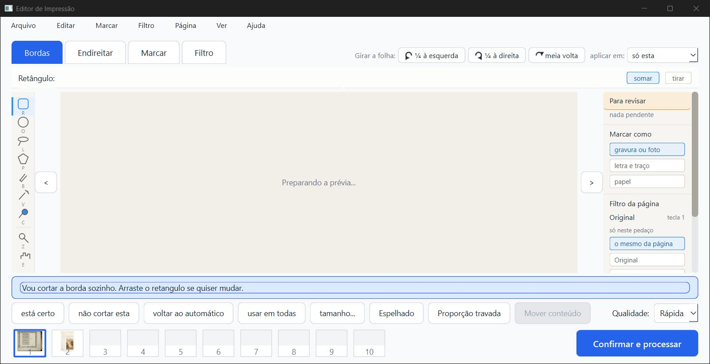

- **Barrinha em 1280×657:** cabe à direita das abas, com nome nos botões. A página não perdeu altura.

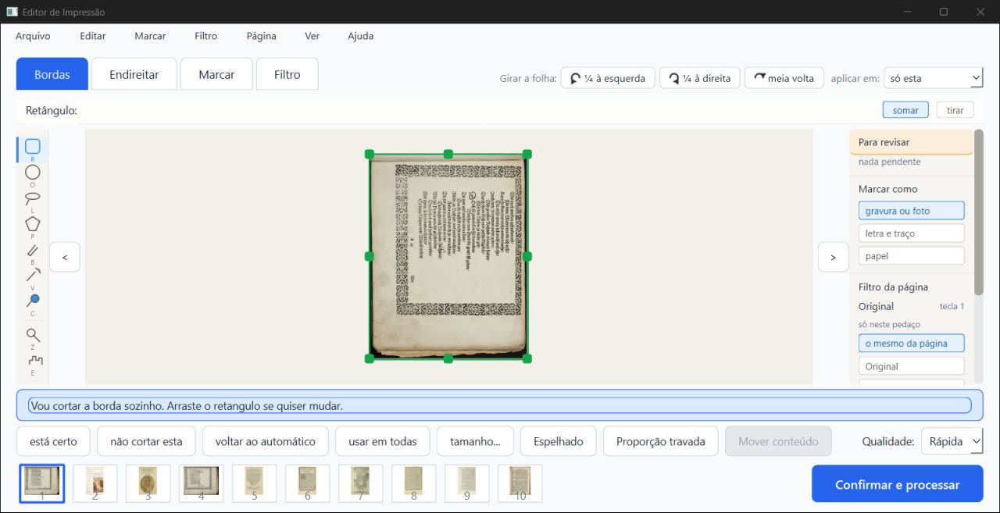

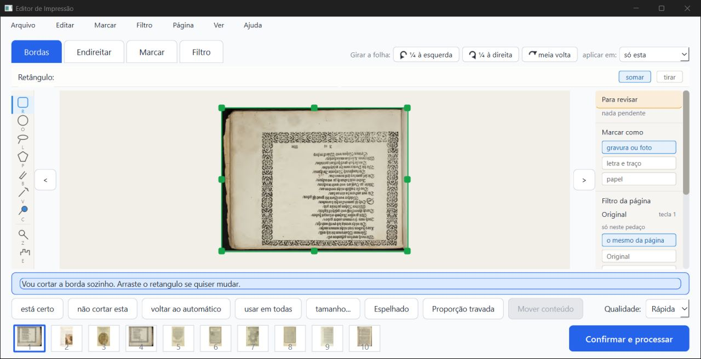

- **Siebmacher 7 (folha deitada):** ¼ à direita deixou o alto do texto virado para a direita, que é o sentido do relógio. A meia volta deixou a folha de cabeça para baixo. Nas duas, o corte se refez em volta da folha.

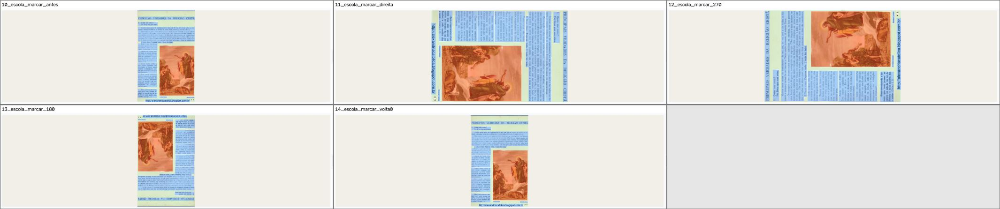

- **Escola 7, aba Marcar:** nos quatro giros, as zonas azuis continuam em cima dos blocos de texto, e a laranja em cima da gravura de Adão e Eva.

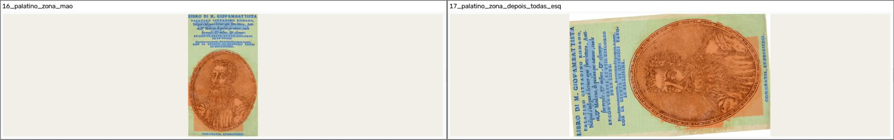

- **Palatino 5:** a zona desenhada à mão (faixa de baixo, laranja) foi para a direita da folha deitada, que é o lugar certo para ¼ à esquerda. O título agora se lê de baixo para cima, à esquerda. **A folha ficou torta, uns 4°:** veja a ressalva D3.

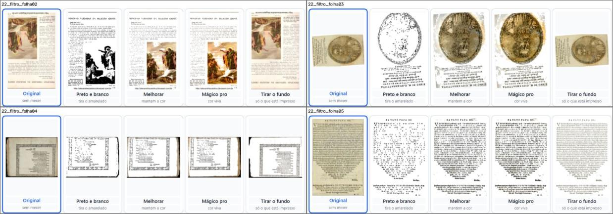

- **D1, aba Filtro:** "Original" e "Tirar o fundo" estão no giro certo, mas os três cartões do meio estão errados. Na folha 2 (meia volta) eles aparecem em pé. Na folha 3 (¼ à esquerda) aparecem de cabeça para baixo. Na folha 4 (meia volta), em pé.

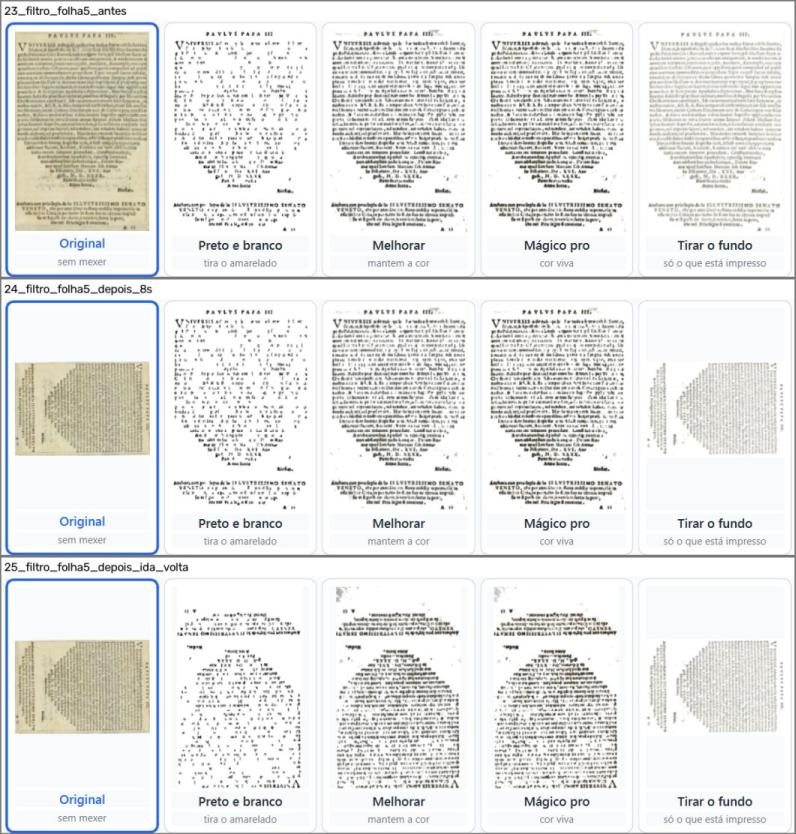

- **D1, girando com a aba Filtro aberta:** logo depois de girar, os três cartões do meio continuam em pé. Depois de ir para a folha seguinte e voltar, ficam de cabeça para baixo, enquanto a folha está só ¼ girada.

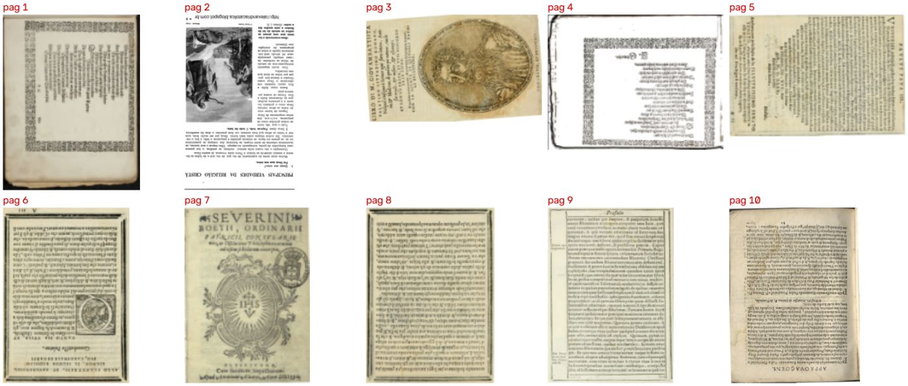

- **O PDF:** as 10 páginas saíram no giro escolhido (90, 180, 270, 180, 90, 180, 0, 180, 0, 180). A página 2 (meia volta, Preto e branco) e a 4 (meia volta, Melhorar) saíram no giro certo. **O PDF não tem o defeito D1.**

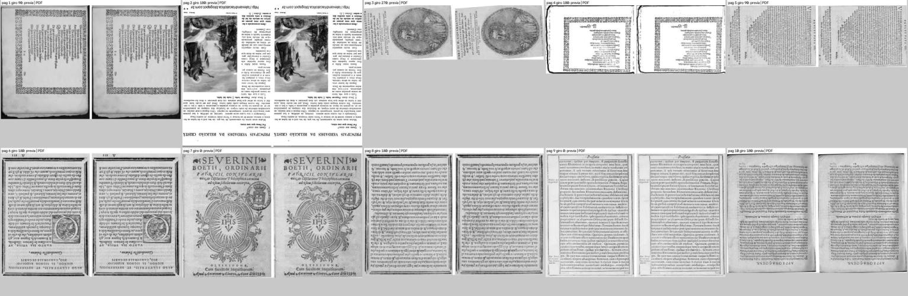

- **Prévia × PDF:** a mesma página, no mesmo giro, nas 10.

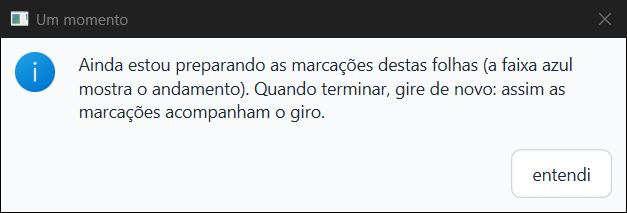

- **Projeto antigo:** o aviso aparece em português, com um botão só, "entendi".

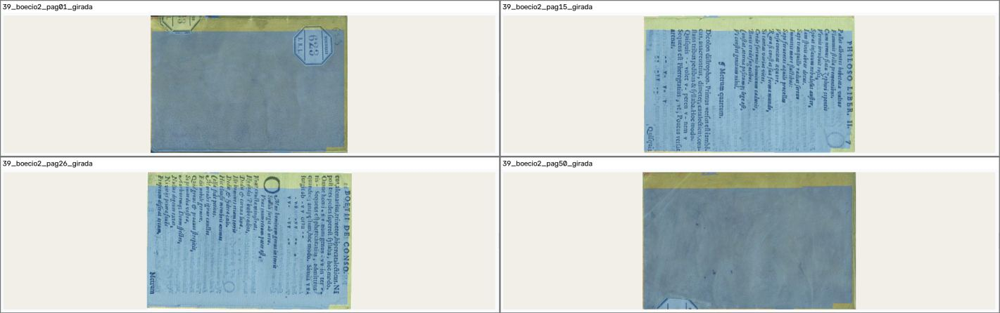

- **Boécio depois da conversão:** ¼ à direita nas 50 folhas, e as zonas por cima do texto e da capa.

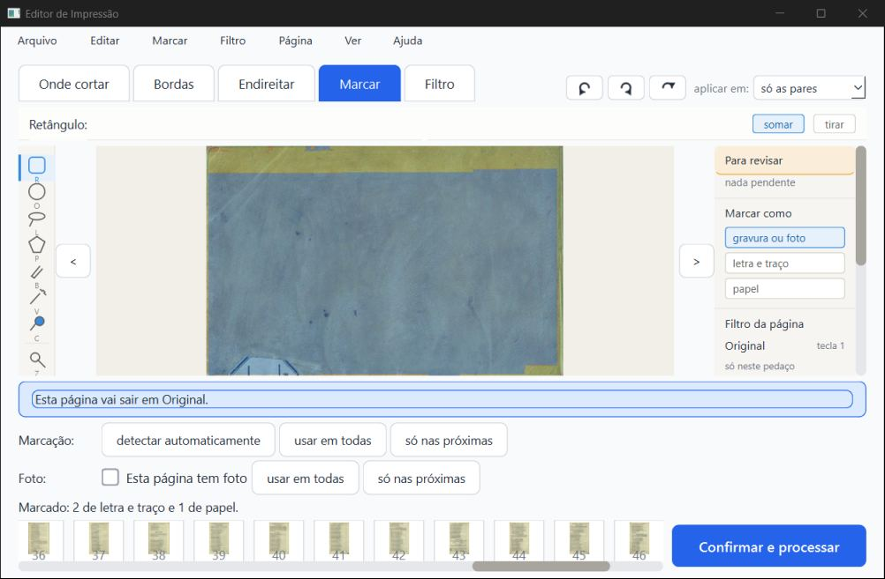

- **Janela mínima (1000 pontos):** a barrinha fica só com os ícones e as abas não encolhem.

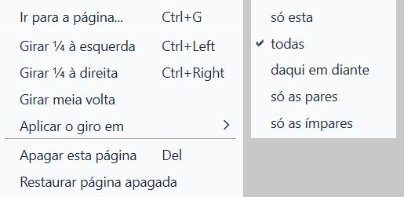

- **Menu Página:** tem os três giros, as teclas e o "Aplicar o giro em", com a opção da barrinha marcada.

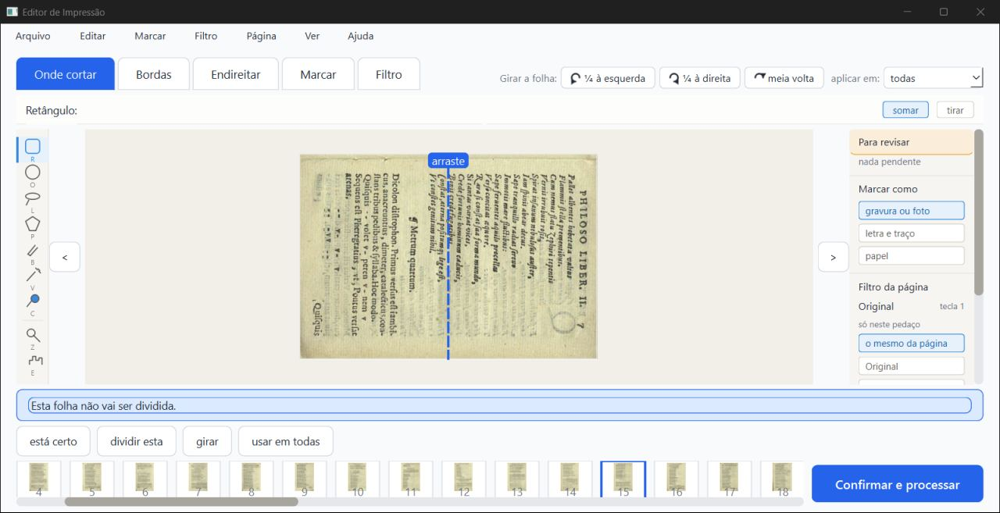

- **Cinco abas (Boécio):** a barrinha ainda cabe com nome nos botões. O botão "girar" antigo da aba Onde cortar continua lá e obedece o "aplicar em".

## Velocidade

O teste oficial de velocidade (`teste_velocidade.py`, uns 12 minutos com o PC parado) **não foi rodado**. Estes commits não mexem no preparo nem nos filtros: o `core/pipeline.py` não mudou, e os PDFs saíram idênticos. Medi o mesmo projeto de 10 folhas processado sem janela: **15,6 s com o código antigo e 16,0 s com o novo**, uma diferença dentro do normal de uma rodada para outra. Na janela, a folha gira de 0,17 a 0,19 s depois do clique.

## Ressalvas e defeitos

1. **D1, aba Filtro (o que vale consertar).** Numa folha girada, os cartões Preto e branco, Melhorar e Mágico pro mostram a folha girada duas vezes: 90° vira 180°, 180° volta a 0° e 270° vira 180°. Girando com a aba Filtro aberta, eles não mudam até a pessoa trocar de folha. Achei a causa provável no código, sem mexer nele:
   - `ui/tela_conferir._imagem_sem_filtro` usa `previas.pegar_folha(...)`, que já vem girada (`ui/tarefas._folha_crua`, linhas 339 e 340), e depois chama `pipeline.preparar_metade`, que gira de novo;
   - a chave do cache dos cartões (`_cartoes_cache_chave`) não leva a rotação.

   Esse código é de 18/07 (`d9fae8c`); antes, quase ninguém girava folha. O PDF e os cartões Original e Tirar o fundo estão certos. Não testei o cartão Preto e branco no modo Misto, que segue outro caminho no código (`_cartao_do_misto`).
2. **D2, miniaturas (menor; para o layout).** A tira de miniaturas embaixo e a capa do cartão na tela inicial mostram a folha como veio do scanner, sem o giro. Isso já era assim antes destes commits, mas agora aparece: depois do "todas", nenhuma miniatura muda.
3. **D3, endireitar depois de girar (observação).** O endireitar automático é medido de novo na folha girada. Numa folha que fica de lado, ele pode achar uma inclinação que não existe. Medido em todas as folhas do livro de teste:
   - Palatino 5: 0,4° em pé, **4,3°** deitada (90° e 270°). Na janela e no PDF ela sai torta (imagem do Palatino acima);
   - Rhetorica 18: de −0,1° para −0,7°;
   - Marial 7: de 1,2° para 0,5°;
   - as duas Siebmacher ficam em 0° em todos os giros.

   No uso normal (pôr em pé uma folha escaneada de lado), a medida é feita na posição final, que é a certa. O problema aparece quando a folha **termina** de lado.
4. **D4, visto uma vez e não repetido.** No primeiro "todas" da sessão, logo depois de andar da folha 1 até a 4 com ">", a tela mostrou a **imagem da Escola (folha 2)** no lugar da folha 4, com "atualizando…" (print abaixo). Tentei repetir quatro vezes, indo para folhas ainda não vistas no Boécio, e a página certa apareceu sempre. Pode ser uma prévia velha chegando atrasada. Vale ficar de olho.

   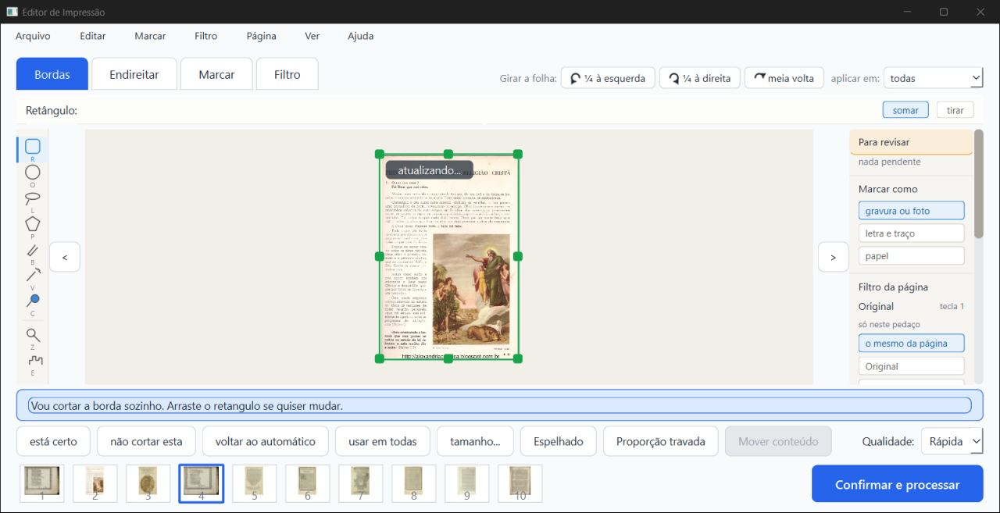
5. **Teclas em inglês no menu.** O menu Página mostra "Ctrl+Left" e "Ctrl+Right". O balão dos botões diz em português ("Ctrl+seta para a direita"). É o mesmo problema que já está na Lista de bugs ("teclas em inglês").
6. **"Aplicar em" gira cada folha a partir de onde ela está** (giro relativo; decisão do implementador, escrita no código). O ScanTailor faz diferente: copia o giro final da folha da vez. Uma folha já girada recebe mais ¼ por cima. Para o caso comum (nenhuma folha girada ainda), os dois dão o mesmo resultado. É coisa para o Samuel e o agente de layout decidirem, junto com o desenho final da barrinha (decisão G1: "por enquanto pode ser assim").
7. **Durante a conversão, o "todas" não gira nem as folhas já convertidas.** A ação inteira espera, e o aviso pede para girar de novo. Funciona e não estraga nada, mas a pessoa precisa clicar de novo.
8. **Paradas de mais de 1 s, todas fora do girar** (medidas pelo vigia dentro do programa):
   - 10 a 16 s montando a janela, ao abrir o programa, antes de ela aparecer;
   - 1,96 s logo depois de a janela aparecer, dentro do Qt;
   - 1,44 s ao clicar "continuar" no Livro de girar (a primeira página do folhear, pedida a outro processo);
   - **4,56 s no fim do "Processar"**, sem pilha anotada: a janela parou inteira, talvez enquanto o PDF era gravado.

   Também houve paradas de 0,5 a 0,75 s ao trocar de folha na aba Filtro. Nada disso está nos arquivos destes commits. Não comparei com o código antigo na janela.
9. **Não testado:**
   - roda do mouse (não funciona sem foco);
   - a escala real do notebook do Kaique;
   - o cartão do Misto (D1);
   - o teste oficial de velocidade.

   Um print do Boécio feito com a caixa "Um momento" aberta saiu com a tela inicial no lugar da de conferir. A sonda dizia que a tela de conferir estava à frente, então parece defeito do print com a janela fora da tela, e não do programa.

## Para a Lista de bugs

- 06/10/2026, **D1**: aba Filtro, cartões Preto e branco, Melhorar e Mágico pro com a folha girada duas vezes, e sem atualizar quando se gira com a aba aberta. Prints `imagens/p06` e `p07`.
- 06/10/2026, **D4**: uma vez, a prévia da folha 2 apareceu na folha 4 depois de girar "todas"; não repetido. Print `imagens/p14`.
- 06/10/2026, **D2** (menor): miniaturas e capa do cartão não acompanham o giro.
- 06/10/2026, observação **D3**: endireitar automático diferente com a folha deitada (Palatino 5: 0,4° → 4,3°).

## Onde está tudo

- Este parecer: `relatorios/conferir/girar-2026-10-06/verificador/parecer-verificador-girar-2-3.html` (também `.md` e `.pdf`).
- Imagens do parecer: `.../verificador/imagens/`. Prints inteiros (fora do git): `.../verificador/prints/`.
- Registro passo a passo: `.../verificador/trabalho/girar.log`. Paradas: `trabalho/paradas_*.log`. pytest: `trabalho/pytest_partes.log`. teste_botoes: `trabalho/teste_botoes.log`. PDF e comparações: `trabalho/saida_pdf/` e `trabalho/sem_giro/`. Ângulos por giro: `trabalho/angulos/angulos.json`.
- Scripts (piloto corrigido do verificador-3, copiado): `.../verificador/scripts/`.
- Ao terminar, todas as janelas de teste foram fechadas com WM_CLOSE. Nenhum processo Python ficou aberto (conferido na lista de processos do Windows).
