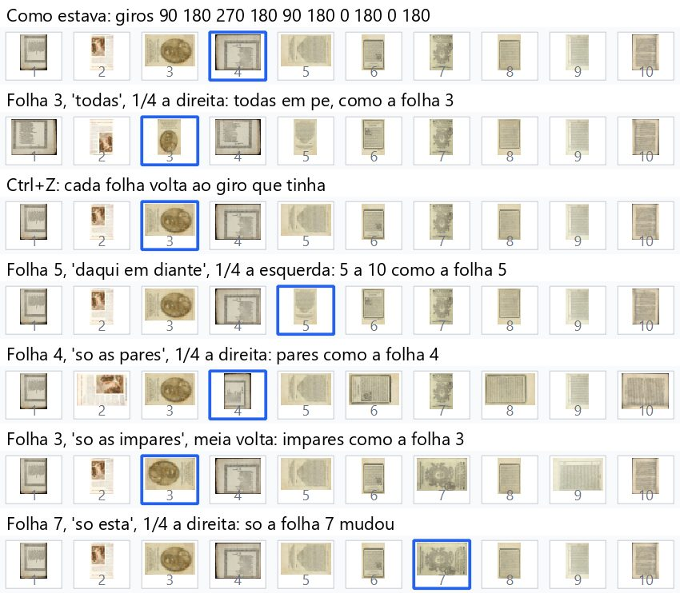
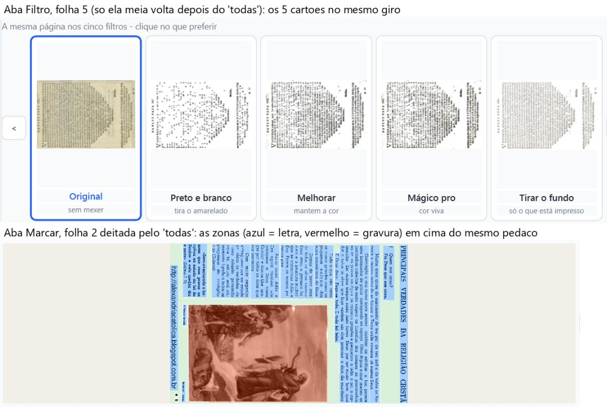
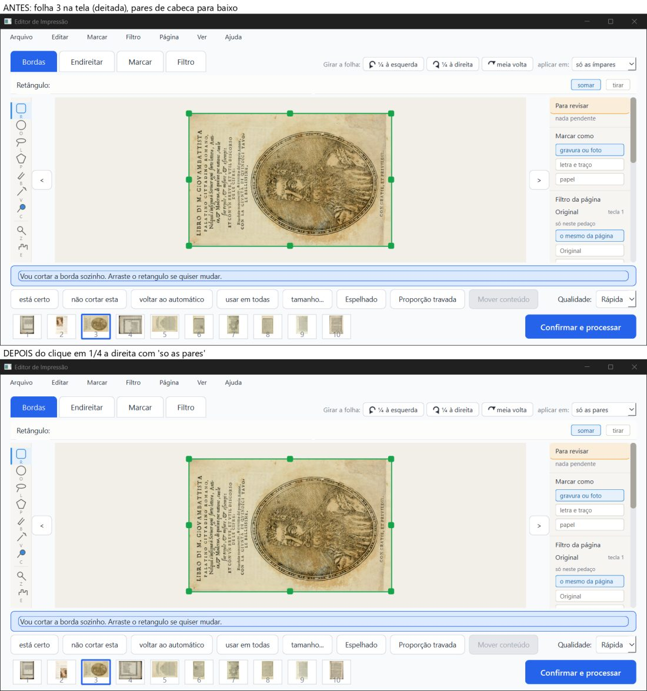
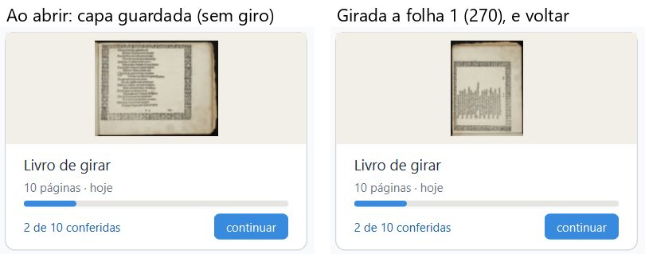
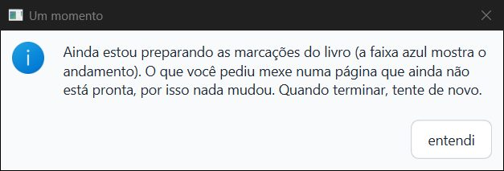
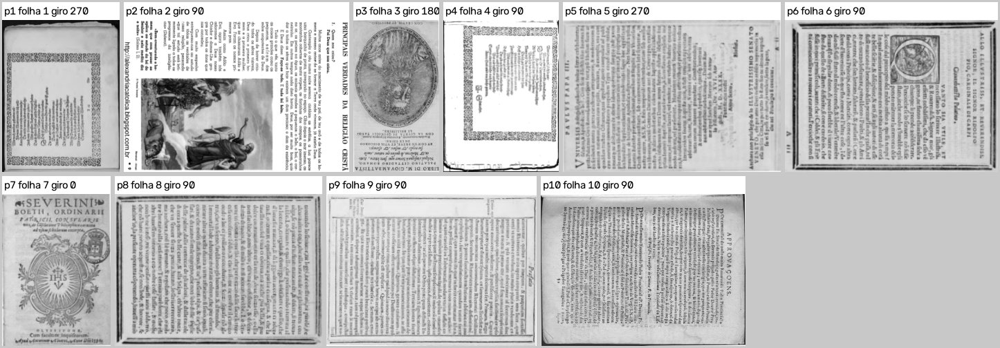

# Parecer do verificador: "aplicar em" copia o giro da folha da vez, 06/10/2026

**PRONTO PARA JUNTAR, com ressalvas.** Os quatro commits fazem o que prometem. Pilotei a janela real, e em todos os casos as folhas escolhidas ficaram viradas como a folha da vez. O Ctrl+Z devolveu cada folha ao giro que ela tinha. A capa do cartão agora aparece girada ao "voltar". O aviso "Um momento" tem o texto novo, em português certo. O PDF saiu idêntico ao do `fase-1`.

Fica **uma pergunta para o Samuel** sobre um caso de canto ("só as pares" com uma folha ímpar na tela). Ela vem com imagem, mais abaixo. E também uma frase do histórico que, nesse caso, fica enganosa.

**Não é "aprovado":** só o Samuel marca.

> **Defeito conhecido (decisão do Samuel, 28/09):** moldura dourada e iluminura continuam sendo defeito conhecido da Fase 1. Estes commits não mexem na imagem das páginas: o PDF saiu igual, pixel a pixel, ao do `fase-1`.

**O que foi conferido:**

- ramo `girar-aplicar-copia`, no commit `9cdc3da`;
- os commits `3046cc4`, `6e0866d`, `e971253` e `9cdc3da`;
- a comparação foi feita com o `fase-1` em `5eee3d8`. O `fase-1` de hoje (`5a90db5`) só mudou documentos depois disso.

**Como foi conferido:**

- a janela real foi aberta fora da tela, em 1600×821 px, numa cópia `git archive` do ramo;
- ela foi pilotada só com mouse e teclado nativos (mensagens do Windows mandadas para a janela de teste);
- a pasta de dados era só de teste, com cópias do "Livro de girar" (10 páginas-gabarito, já com giros diferentes: 90 180 270 180 90 180 0 180 0 180) e do Boécio antigo (zonas de antes de 05/10).

## Veredito por item

| Item | Como | Resultado |
|---|---|---|
| 1. "Aplicar em" copia o giro da folha da vez | janela real + máquina + olho | **Bom.** Testei 11 giros e 10 desfazer/refazer. Em todos, as folhas escolhidas terminaram no giro final da folha da vez, e as outras não mexeram. Também acompanharam o giro: o disco, as 10 miniaturas, a capa, as 124 zonas marcadas (mesmo pedaço do papel) e os cartões da aba Filtro. São 22 conferências, sem nenhum erro |
| 2. Capa do cartão ao "voltar" | janela real + máquina + olho | **Bom.** Girei a folha 1 e voltei pelo "voltar" das opções. O cartão mostrou a capa nova na hora. O "continuar" depois disso funcionou |
| 3. Texto novo do aviso "Um momento" | janela real + olho | **Bom.** O Desfazer, o Refazer e o clique no painel Histórico, feitos durante a conversão das zonas do Boécio, mostraram o texto novo. Nas três vezes, nada mudou no livro. Depois da conversão, o desfazer funcionou |
| 4. PDF | janela real + máquina + olho | **Bom.** As 10 páginas saíram na ordem certa e no giro pedido. O PDF ficou idêntico, pixel a pixel, ao do `fase-1` nas 10 páginas, giradas ou não, e as prévias também ficaram iguais |
| 5. Testes de máquina | máquina | **Bom.** 95 arquivos de teste, um por vez: 1705 passaram, 59 pularam e 0 falharam. O `teste_botoes.py` fez 159 ações, com 0 falhas |

## 1. "Aplicar em": o que foi feito na janela

Cada linha abaixo é um clique de verdade no botão da barra "Girar a folha", seguido da conferência completa:

- o giro de cada folha na memória e no `projeto.json` do disco;
- cada miniatura da tira, comparada com a folha do livro de entrada no giro esperado;
- a `capa.png`;
- as zonas de cada página, levadas para a folha original. Elas têm de cair no mesmo lugar do papel que no começo;
- o texto do "Desfazer" no menu.

| Na folha (giro dela) | Aplicar em | Botão | Giros depois (folhas 1 a 10) | Certo? |
|---|---|---|---|---|
| 3 (270) | todas | ¼ à direita | 0 0 0 0 0 0 0 0 0 0 | sim |
| 5 (90) | daqui em diante | ¼ à esquerda | 90 180 270 180 **0 0 0 0 0 0** | sim |
| 4 (180) | só as pares | ¼ à direita | 90 **270** 270 **270** 90 **270** 0 **270** 0 **270** | sim |
| 3 (270) | só as ímpares | meia volta | **90** 180 **90** 180 **90** 180 **90** 180 **90** 180 | sim |
| 7 (0) | só esta | ¼ à direita | 90 180 270 180 90 180 **90** 180 0 180 | sim |
| 3 (270) | só as pares (caso de canto) | ¼ à direita | 90 **0** 270 **0** 90 **0** 90 **0** 0 **0** | como o implementador descreveu, a perguntar |
| 2 (180) | todas | ¼ à esquerda | 90 em todas | sim |
| 5 (90) | só esta, depois do "todas" | meia volta | 90 90 90 90 **270** 90 90 90 90 90 | sim |
| 1 (90) | só esta | meia volta | **270** 90 … (capa.png refeita a 270) | sim |

**Resultado dos testes:**

- **Desfazer:** depois de cada um dos 6 primeiros giros, o Ctrl+Z devolveu as 10 folhas exatamente a 90 180 270 180 90 180 0 180 0 180, que era o giro de cada uma antes.
- **Dois giros seguidos:** fiz "todas" e depois "só esta". Dois Ctrl+Z voltaram a cada estado anterior, na ordem certa. Dois Ctrl+Y refizeram tudo, também na ordem.
- **Velocidade:** o giro mudou de 0,14 a 0,25 s depois do clique.
- **Zonas:** as 124 zonas marcadas ficaram sempre no mesmo pedaço do papel. A diferença foi 0,0 em todas as 22 conferências. Na aba Marcar, com a folha 2 deitada, as zonas azuis (letra) e a vermelha (gravura) estão em cima do texto e da gravura certos (imagem 3).
- **Capa:** a `capa.png` só mudou quando a folha 1 mudou de giro: no "todas" (a 0), no desfazer (de volta a 90) e no "só esta" da folha 1 (a 270). Quando outras folhas giraram, ela não mudou.
- **Menu e histórico:** as frases novas aparecem como deviam. Exemplos: "Girar ¼ à direita: todas as 10 folhas, viradas como a folha 3" e "Girar ¼ à esquerda: da folha 5 em diante (6 folhas), viradas como a folha 5".
- **Dica do "aplicar em":** "Em quais folhas o giro vale. Todas ficam viradas como esta folha."

**Olhando a tira, linha por linha:**

- no começo, as folhas estão em giros misturados;
- depois do "todas" na folha 3, as dez ficam em pé, como a 3;
- o Ctrl+Z devolve a tira exatamente ao que era;
- no "daqui em diante" na 5, só as folhas 5 a 10 mudam;
- no "pares" na 4, só as folhas 2, 4, 6, 8 e 10 mudam e ficam deitadas como a 4;
- no "ímpares" na 3, as folhas 1, 3, 5, 7 e 9 ficam deitadas como a 3;
- no "só esta" na 7, só a 7 muda.

**Cartões da aba Filtro:**

- nas folhas 2 e 4, os 5 cartões estão no giro da folha;
- na folha 5, a medida por número apontou 3 cartões "errados" (Preto e branco, Melhorar e Mágico pro). **Olhando a imagem, os cinco cartões estão no mesmo giro**, com o título "PAULUS PAPA III" do mesmo lado. O erro foi da medida: ela se confunde com as páginas já filtradas, que viram quase só pontos pretos. Não é defeito do programa.

### Pergunta para o Samuel: "só as pares" com uma folha ímpar na tela

**O que acontece hoje:**

- a pessoa está na folha 3, que está deitada, escolhe "só as pares" e clica "¼ à direita";
- **a folha 3, que está na tela, não se mexe.** A imagem grande continua igual;
- todas as pares (2, 4, 6, 8 e 10), que estavam de cabeça para baixo, **ficam em pé**. É o giro que a folha 3 teria se tivesse girado ¼ à direita;
- o único sinal na tela é a tira de miniaturas lá embaixo.

**Uma frase fica enganosa:** o histórico e o menu dizem "Girar ¼ à direita: as 5 folhas pares, viradas como a folha 3". Mas as pares **não** ficaram como a folha 3: ela continua deitada e elas ficaram em pé. A dica do "aplicar em" ("Todas ficam viradas como esta folha") também não vale neste caso.

**Pergunta sugerida ao Samuel:** "Se você está numa folha ímpar e escolhe 'só as pares', o que o botão de girar deve fazer?"

- **(a)** como está hoje: a folha da tela não mexe, e as pares ficam como ela ficaria;
- **(b)** a folha da tela também gira, junto com as pares;
- **(c)** as pares giram ¼ cada uma, a partir de onde estão;
- **(d)** o programa avisa: "você está numa folha ímpar; vá a uma folha par para girar as pares".

## 2. Capa do cartão ao "voltar"

**O caminho testado:**

1. entrei no livro;
2. girei a folha 1 meia volta (de 90 para 270);
3. saí pelo menu Arquivo, "Voltar para as opções";
4. cliquei no "voltar" das opções.

**O resultado:**

- a tela inicial apareceu em 0,03 s;
- a capa no cartão foi medida na própria janela e está no giro 270, igual à folha 1;
- antes, o cartão mostrava a capa guardada, sem giro. No código antigo, ele continuaria com essa capa até o programa ser aberto de novo;
- depois, o "continuar" abriu o livro normalmente, com os giros guardados.

## 3. Aviso "Um momento"

**O teste:** usei o Boécio antigo (50 páginas, zonas de antes de 05/10) com um histórico de "outra sessão": duas ações feitas e uma desfeita, todas no ângulo da página 46. Fiz três rodadas, cada uma com uma cópia nova do Boécio, e agi logo ao entrar, com 48 páginas ainda por converter:

| O que foi feito | Aviso | O livro mudou? |
|---|---|---|
| Editar → Desfazer | "Um momento", texto novo | não |
| Editar → Refazer | "Um momento", texto novo | não |
| clique no 1º item do painel Histórico | "Um momento", texto novo | não |
| Desfazer depois da conversão (cerca de 20 s) | nenhum | sim, desfez (ângulo 1,5 → 0) |

**O texto, conferido no print:** "Ainda estou preparando as marcações do livro (a faixa azul mostra o andamento). O que você pediu mexe numa página que ainda não está pronta, por isso nada mudou. Quando terminar, tente de novo."

- Os acentos estão certos e o português está certo.
- Não fala mais "desta página" nem "faça a mudança de novo".
- Tem um botão só, "entendi".

## 4. O PDF

**Como foi feito:** girei as folhas para 270 90 180 90 270 90 0 90 90 90 e processei pela janela (Confirmar e processar → "processar assim mesmo" → Processar). A tela final apareceu em 8,5 s. A maior parada da janela foi de 0,59 s.

**O que foi conferido:**

- **Páginas, ordem e giro:**
  - são 10 páginas;
  - procurei cada página do PDF entre as folhas do livro de entrada, nos 4 giros possíveis;
  - nas 10, ela é a folha certa, na ordem certa e no giro pedido;
  - a folha certa ganhou sempre com folga: de 0,15 a 0,58 acima da segunda melhor.
- **Igual ao `fase-1`:**
  - o mesmo projeto foi processado sem janela com o código do `fase-1` (`5eee3d8`);
  - o PDF da janela tem os mesmos pixels nas 10 páginas, com o mesmo tamanho de página e o mesmo tamanho de arquivo (43.676.887 bytes);
  - isso vale para a página 7, que não foi girada, e para as giradas;
  - o leitor do Chrome (PDFium) desenha os dois igual;
  - as 10 prévias também são idênticas.

- **Olhando:** cada página está em pé ou no giro pedido. A folha 7 (giro 0) está igual à original. A folha 3 (meia volta) está de cabeça para baixo, como foi pedido.

## Velocidade

**Não ficou mais lento.**

- Estes commits não mexem no processamento: `core/pipeline` e os filtros não usam `core/girar.py`. O PDF saiu idêntico.
- Processei o mesmo projeto sem janela, alternando os dois códigos, 5 vezes cada:
  - `fase-1`: mediana de 10,3 s;
  - este ramo: mediana de 10,2 s;
  - as rodadas variaram de 9,1 a 13,7 s nos dois, por causa de outros programas no PC.
- Não rodei o `teste_velocidade.py` oficial: com o processamento idêntico, ele mediria só a variação do PC.

## Testes de máquina

**pytest, um arquivo por vez (95 arquivos): 1705 passaram, 59 pularam, 0 falharam.**

- `test_girar.py`: 41 passaram;
- `test_girar_cartoes_e_previas.py`: 24 passaram;
- `test_girar_na_tela.py`: 20 passaram;
- `test_misto_na_tela.py`: rodou **6 vezes** (o arquivo em que o implementador viu a queda), com 14 passaram nas 6. Nenhum "access violation".

**`teste_botoes.py`: 159 ações, 0 falhas.**

- Rodou numa cópia `git archive` do `9cdc3da`, com `saida_teste` própria.
- Os 5 itens "Aplicar o giro em" do menu e os 3 giros estão entre as ações.

## "Access violation" ao fechar

| Onde | Vezes |
|---|---|
| pytest (100 rodadas de arquivo, contando as 6 do `test_misto_na_tela.py`) | **0** |
| `teste_botoes.py` | **0** |
| janela real (7 sessões abertas e fechadas) | **2** |

**As 2 vezes na janela real:**

- **1ª vez:** foi no fechamento da sessão do Boécio em que testei o Refazer. É a mesma sessão em que liguei e desliguei o painel Histórico.
- **2ª vez:** ficou anotada uns 12 s antes do fechamento de outra sessão do Boécio, com a janela parada. A janela continuou respondendo e fechou normalmente pelo WM_CLOSE. A falha foi anotada pelo registrador de falhas do Python, num momento em que nenhum código do programa estava rodando (só a linha de gravação do projeto, esperando).

**Nos dois casos:**

- nada apareceu na tela;
- o projeto estava gravado;
- o `erros.log` ficou vazio.

**Já existia antes:** é o mesmo problema que o verificador-3 registrou no `89fae91`: 2 em 11 fechamentos, e 33 registros desde 05/10. Não vi nada que ligue isto ao `lambda` do `9cdc3da`. As duas vezes foram no Boécio, e não no livro em que usei o "voltar" das opções.

## Ressalvas

1. **Caso de canto "só as pares" numa folha ímpar** (e "só as ímpares" numa folha par): precisa de decisão do Samuel (pergunta acima). Neste caso, a frase do histórico ("viradas como a folha 3") e a dica do "aplicar em" ficam enganosas.
2. **Access violation:** 2 em 7 sessões da janela, sem efeito visível. O defeito já existia antes destes commits (veja acima).
3. **A medida dos cartões da aba Filtro por número erra nas páginas filtradas** (quase só pontos pretos). Por isso conferi a folha 5 de olho.
4. **O histórico do Livro de girar (cópia do verificador-1) já vem com o defeito de reabrir** (`posicao.json` diz 21 ações feitas, mas o arquivo tem 30). É o defeito do `fase-1` já anotado pelo verificador-3. Ele não atrapalhou os testes, porque todo Ctrl+Z foi feito logo depois do meu próprio giro.
   - A primeira tentativa de Ctrl+Z da sessão não chegou ao programa: a lista do "aplicar em" tinha ficado aberta e pegou a tecla. Nada mudou no livro. Mesmo assim, recomecei do zero, só por cuidado.
5. **Não testado:**
   - a roda do mouse (não funciona sem foco);
   - a escala real do notebook do Kaique;
   - folha dividida (o Livro de girar não tem nenhuma);
   - o Refazer e o Histórico durante a conversão: cada um só uma vez.

## Onde está tudo

- **Este parecer:** `relatorios/conferir/girar-aplicar-copia-2026-10-06/parecer-girar-aplicar-copia.html` (também em `.md` e `.pdf`).
- **Imagens do parecer:** `imagens/`.
- **Prints inteiros da janela:** `prints/` (fora do git).
- **Registros passo a passo:**
  - janela: `trabalho/girar.log`;
  - pytest: `trabalho/pytest_girar.log` e `trabalho/pytest_resto.log`;
  - teste de botões: `trabalho/teste_botoes.log`;
  - velocidade: `trabalho/velocidade_intercalada.txt`.
- **Scripts** (em `scripts/`):
  - `cenario.py`: girar, desfazer e refazer, com a conferência completa;
  - `cartoes.py`: cartões e aba Marcar;
  - `boecio_aviso.py` e `boecio_um.py`: o aviso;
  - `pdf_conferir.py` e `comparar_pdfs.py`: o PDF;
  - `imagens_parecer.py`: as imagens do parecer.
- **Ao terminar:** todas as janelas de teste foram fechadas com WM_CLOSE, e nenhum processo meu ficou aberto.
