# Parecer do verificador: Misto, o desenho claro não some mais

**06/10/2026 · ramo `misto-desenho-apagado` (`5fde0a8`, `68d6c09`, `2404d26`, sobre `b6e0a0e`) · verificador independente.**

## Veredito

**PRONTO PARA JUNTAR, com ressalvas.** No PDF processado o conserto faz exatamente o que o implementador disse: refiz a medida do zero, por outro caminho, e cheguei aos **mesmos números, ponto por ponto**, nas 59 páginas. Nada que o Misto existe para tirar voltou nessas 59 (nenhuma mancha do verso, nenhum fundo cinza), e o Preto e branco sem "Só as letras" não mudou um ponto. Mas três coisas precisam ser ditas ao Samuel antes de juntar:

1. **A prévia na tela não mostra o conserto.** No PDF a capitular S do Palatino 76 sai inteira; na prévia (o "Ver de perto" e os cartões) ela sai quebrada, só com a moldura e pedaços. A prévia é feita em resolução menor (150 pontos por polegada, contra 300 do PDF) e, nela, o conserto quase não age. O Kaique vai ver a capitular comida na tela e ela vai sair boa no papel. O erro é "para o lado seguro" (o PDF sai melhor do que a tela promete), mas prévia e PDF **não são iguais**.
2. **No livro novo (Righetti), duas fotos ganharam de volta o grão cinza do fundo** da foto: troca de "fundo limpo com letras comidas" por "letras inteiras com fundo granulado". É o mesmo tipo de coisa que o Samuel apontou na beirada da folha do Siebmacher.
3. **O Misto ficou 3,4% mais lento** na minha medida (o implementador mediu 1,2%). Pouco (no máximo 0,4 s numa página), mas a regra 6 do plano diz que nenhum item pode deixar o programa mais lento.

E continuam valendo as duas queixas do Samuel ("Bom por enquanto"): no ljs47 p. 103 **as linhas vermelhas compridas do diagrama continuam picotadas**, e no Siebmacher p. 9 (direita) **voltaram linhas da beirada da folha**. Conferi as duas: são exatamente como ele descreveu.

> **Defeito conhecido (decisão do Samuel, 28/09):** moldura dourada e iluminura são defeito conhecido até o fim da Fase 1 (itens 1.2, 1.4 e 1.5). Nada aqui muda isso.

## O que conferi, e como

| Item | Como | Resultado |
|---|---|---|
| 1. As 59 páginas do estudo, Misto de hoje × ramo | **máquina + olho.** Cada página por processo separado, uma por vez, pelo caminho do programa inteiro (análise, detecção de gravura, leitor de texto, Misto): um processo com o `core/misto.py` de hoje e outro com o do ramo, cada um com sua pasta de dados (nada dividido entre os dois). Olhei as 17 que mudaram, inteiras e de perto. | **Igual ao implementador, ponto por ponto:** as mesmas 17 páginas mudam, com o mesmo número de pontos em cada uma; 42 idênticas. Nenhum ponto sumiu em nenhuma página; todo ponto que voltou também existe no Preto e branco puro. O aviso "Para revisar" e o "Tem cor" saíram iguais nas 59. |
| 2. Na janela real | **olho**, janela de verdade fora da tela, cliques por mensagem nativa do Windows, prints com `PrintWindow`. Livro de 2 páginas (Palatino 76 + Palatino 66); "Só as letras" ligado só na página 1, "Guardar a tinta forte"; processado até o PDF. | **PDF:** página 1 ponto a ponto igual à minha medida do ramo (capitular inteira); página 2 (sem "Só as letras") ponto a ponto igual ao Preto e branco puro. **Prévia: não mostra a capitular inteira** (ressalva 1). Nenhum erro no `erros.log`. |
| 3. Livro fora do estudo | **máquina + olho.** Righetti (10 folhas = 20 páginas, girado e dividido como na rodada 2) mais 10 páginas de desenho do Palatino e da Rhetorica que **não** estavam nas 59. | 30 páginas: 18 melhoraram, 2 trocaram fundo limpo por grão cinza (ressalva 2), 10 idênticas. |
| 4. Testes de máquina | **máquina**, arquivo por arquivo. | **1615 passaram, 0 falharam** (59 pulados, do OCR). `teste_botoes.py` numa cópia `git archive`: **132 ações, 0 falhas.** |
| 5. Tempo do Misto | **máquina**, as 59 páginas, antes e depois alternados no mesmo processo, mediana de 3 voltas. | 94,5 s → 97,6 s (**+3,4%**). Mediana +0,025 s por página. |

Uma página do Antiphon (a maior, 38 milhões de pontos) falhou por falta de memória na primeira volta, enquanto os testes rodavam junto; refeita sozinha, passou. Não é deste conserto (a falta de memória foi numa conta comum do Misto), mas registro.

## 1. As 59 páginas (hoje × ramo)

As palavras são minhas; os números batem com os do implementador em todas.

| Resultado | Páginas | O que vi |
|---|---|---|
| **Melhorou bem** (10) | Palatino 76, 67, 66, 9 e 113; Boécio 3; Opus majus 3; Rhetorica 129; Siebmacher 7 (esq.) e 9 (esq.) | A capitular S do Palatino 76 voltou inteira, com a paisagem; o fundo do M do 67 voltou; o "M." do rodapé do 66 voltou inteiro; o cavaleiro do Q (9) e o rolo de pergaminho (113) ganharam os traços claros; o escudo do carimbo e os raios do sol (Boécio 3), a hachura do selo (Opus 3), o pontilhado impresso do fundo (Rhetorica 129) e os arabescos do Siebmacher voltaram. Em todas, fica igual ao Preto e branco puro. |
| **Melhorou em parte** (1) | ljs47 103 | Os arcos do diagrama vermelho voltaram; **as linhas horizontais compridas continuam picotadas** (o que o Samuel viu). |
| **Melhorou pouco** (2) | Antiphon 88; Rhetorica 73 | Uma linha de pauta que faltava; a falha no fio da moldura fechou. |
| **Diferença mínima** (2) | Palatino 104; Rhetorica 160 | Poucos pontos num fio da tabela e no fio de baixo; na prática não se vê (se algo, é melhora). |
| **Piorou de leve** (2) | ljs47 26; Siebmacher 9 (dir.) | Pedaços da sombra da dobra (ljs47 26) e **linhas da beirada da folha** (Siebmacher 9 dir., o que o Samuel viu) voltaram, como no Preto e branco puro. |
| **Idêntica, ponto a ponto** (42) | as outras | - |

Procurei de propósito piora que o implementador não tivesse visto: mancha do verso, sujeira, papel cinza voltando. **Não achei nenhuma nas 59.** O "pontilhado" que volta na moldura do Palatino 66 e no fundo da Rhetorica 129 é impresso (está no original), não sujeira.

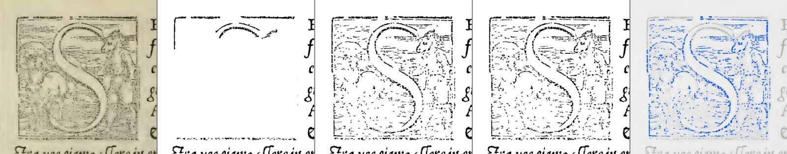

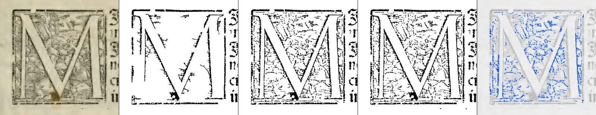

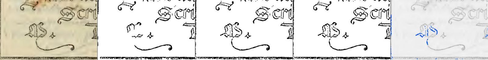

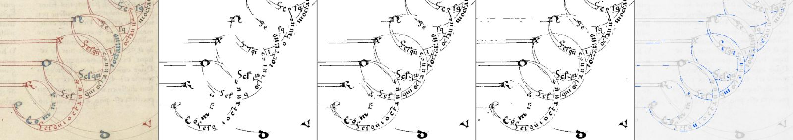

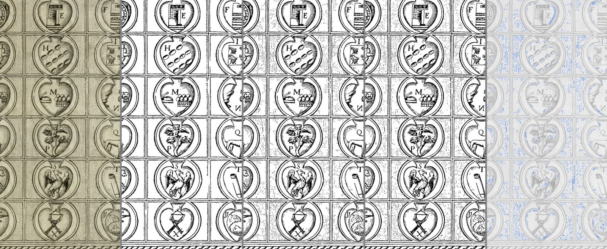

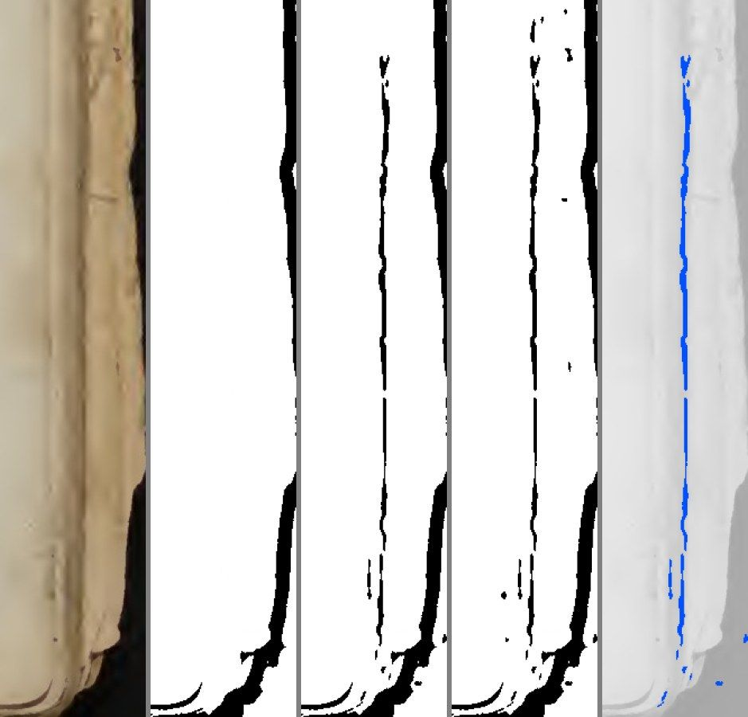

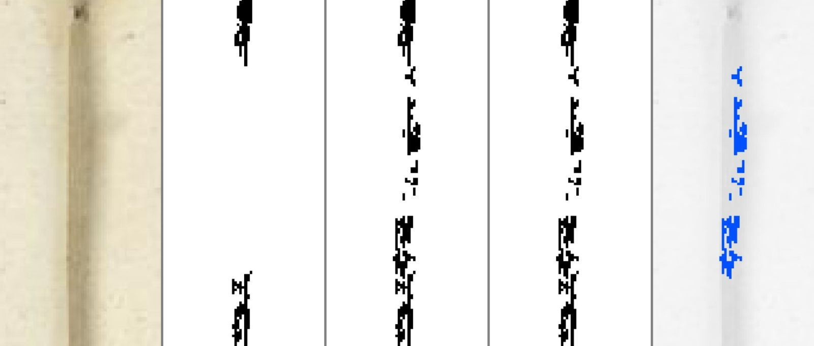

## 2. Na janela real

Abri uma instância nova do programa (a do ramo), fora da tela, sem tomar o mouse nem o teclado. Escolhi Preto e branco, entrei em Conferir, na aba Filtro liguei "Só as letras" **só na página 1** (Palatino 76), com "Guardar a tinta forte"; a página 2 (Palatino 66) ficou sem "Só as letras". Processei até o PDF. Fechei a janela no fim (`WM_CLOSE`); nenhum processo ficou aberto.

- **PDF, página 1:** ponto a ponto igual ao que medi para o ramo: a capitular S inteira.
- **PDF, página 2:** ponto a ponto igual ao Preto e branco puro. E o Preto e branco puro do ramo é ponto a ponto igual ao de hoje (conferido em 5 páginas: Palatino 76 e 66, Siebmacher 9 dos dois lados, Rhetorica 129). **A página sem "Só as letras" não mudou.**
- **Prévia:** o cartão "Preto e branco" e o "Ver de perto" mostram a capitular **quebrada**: a moldura, o alto do S e alguns traços.

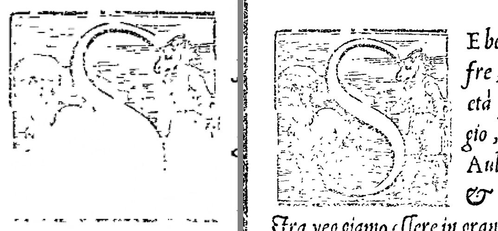

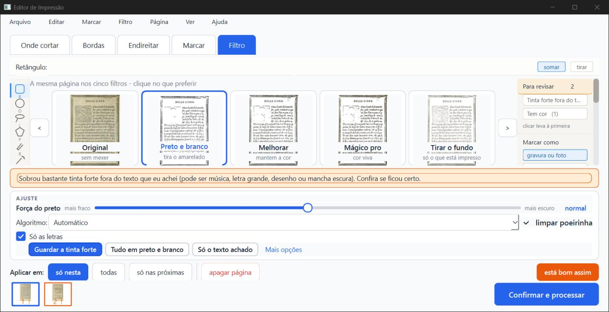

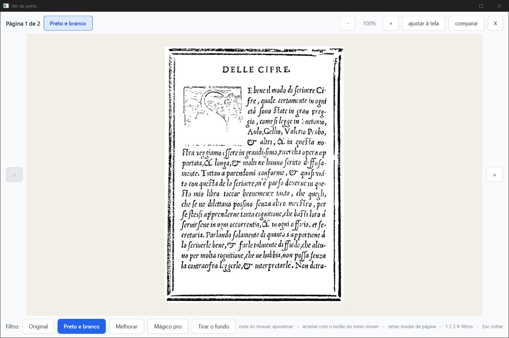

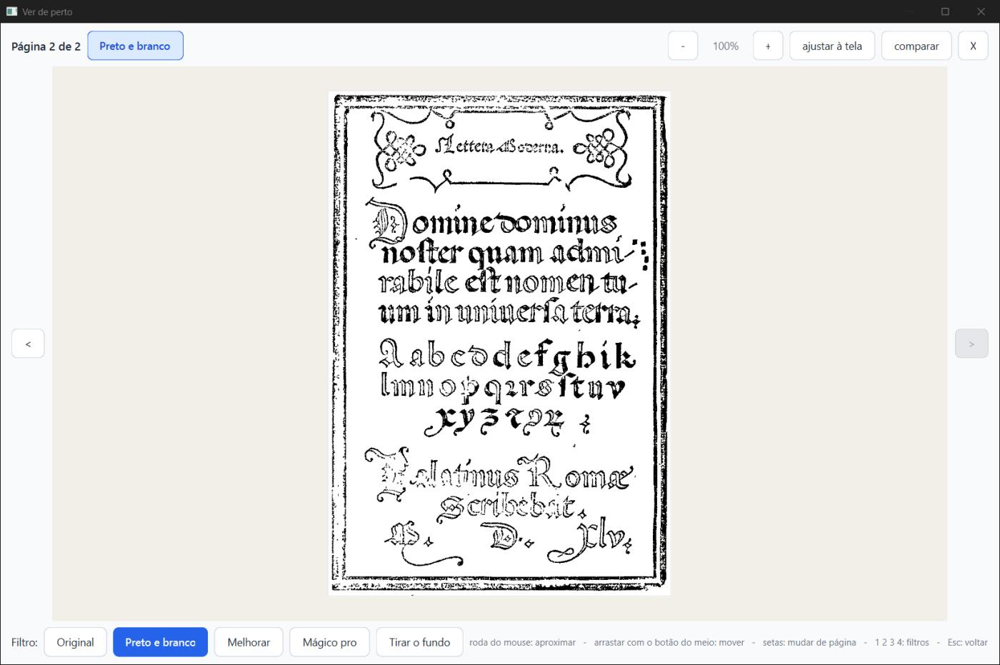

**Por que a prévia é diferente.** Refiz as 17 páginas que mudaram na resolução da prévia (150 pontos por polegada). Medi quanto da tinta que o Preto e branco puro tem a mais que o Misto de hoje o ramo devolve:

| Página | No PDF (300) | Na prévia (150) |
|---|---|---|
| Palatino 76 | 99% | 4% |
| Rhetorica 129 | 88% | 1% |
| Palatino 9 | 95% | 0% |
| Opus majus 3 | 98% | 5% |
| Palatino 66 | 96% | 23% |
| Boécio 3 | 90% | 28% |
| Palatino 67 | 81% | 37% |

Na prévia, o conserto quase não age. Parte disso já existia antes: na prévia, até o Preto e branco puro perde boa parte da hachura fina (a imagem tem a metade dos pontos). Mas, com o conserto, a diferença entre a tela e o papel ficou grande no Misto: o que o Kaique vê não é o que sai. No Palatino 76, a 150 pontos, só 2.450 pontos de tinta são "tinta de fora apagada" (o que a regra nova olha), contra uns 11 mil pontos de diferença para o Preto e branco puro: a maior parte do que falta na prévia nem chega à regra nova. **Sugestão para a Lista de bugs** (não é para este ramo): a prévia do Misto deveria mostrar o que o PDF vai mostrar.

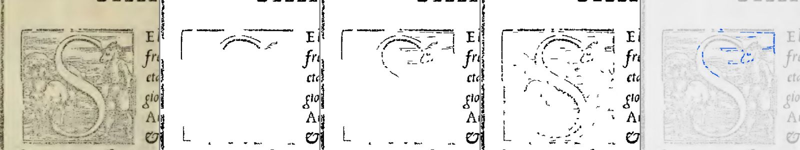

## 3. Páginas fora do estudo (os limites "decoraram" as 59?)

O Righetti (Historia de la Liturgia) é o único livro do acervo que não entrou no estudo. Peguei as 8 folhas com figura (6, 30, 50, 52, 54, 62, 64, 94) e 2 só de texto (27, 114): 20 páginas, giradas e divididas como na rodada 2. Como o Righetti tem fotos (meio-tom), e não gravura em madeira, peguei também 10 páginas de desenho do Palatino (31, 51, 59, 117, 126) e da Rhetorica (15, 38, 72, 112, 157) que não estavam nas 59. Olhei as 20 que mudaram.

| Resultado | Páginas | O que vi |
|---|---|---|
| **Melhorou bem** (10) | Palatino 31, 51, 59, 126; Rhetorica 15, 38, 72, 157; Righetti 50 e 52 (direita) | Capitulares gravadas inteiras (L, P, P, C, S, C), o céu e os raios da gravura da Rhetorica 38, a cártula do Palatino 31. **Os dois mosaicos do Righetti** (que a rodada 2 tinha dado como "errada": o meio do mosaico ralo, com buracos) **voltaram iguais ao Preto e branco puro.** |
| **Melhorou** (1) | Righetti 94 (direita) | O cálice ganhou traços; o pontilhado em volta continua indo para o branco. |
| **Melhorou pouco** (7) | Righetti 50 (esq.), 54 (os dois lados), 62 (os dois lados), 64 (dir.), 94 (esq.) | O fio fino debaixo do cabeçalho ficou inteiro. |
| **Trocou: mais inteiro, mas com grão** (2) | Righetti 6 (direita), 30 (esquerda) | Nas fotos de manuscrito, **o grão cinza do fundo da foto voltou** (como no Preto e branco puro). Em troca, no Righetti 6 voltaram pedaços de letras que o Misto de hoje comia. Eu chamaria de piora leve no 30 e de troca no 6. |
| **Idêntica** (10) | Palatino 117 e Rhetorica 112 (a gravura já é achada pelo detector), Righetti 6 (esq.), 27, 30 (dir.), 52 (esq.), 64 (esq.), 114 | - |

Conclusão: **não parece decorado** para o que o conserto quer pegar (capitular e gravura de traço: todas as dez páginas novas de desenho melhoraram, e a regra não errou nenhuma). Onde aparece o lado ruim é em **foto de meio-tom** (o grão da foto conta como "tinta clara colada na tinta forte"), um tipo de imagem que não estava nas 59.

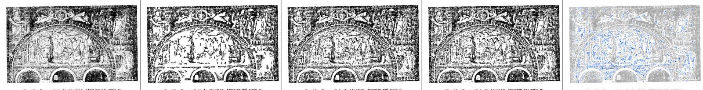

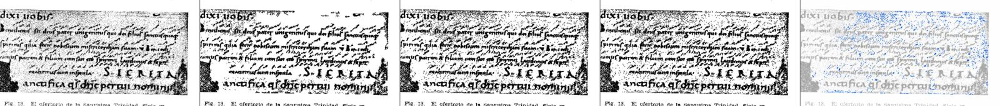

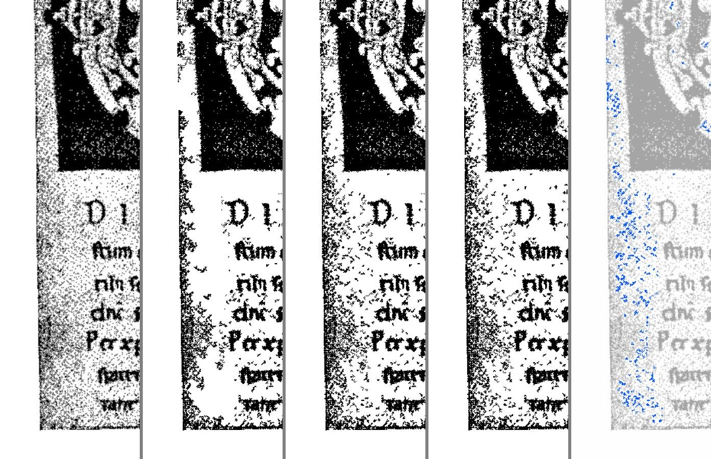

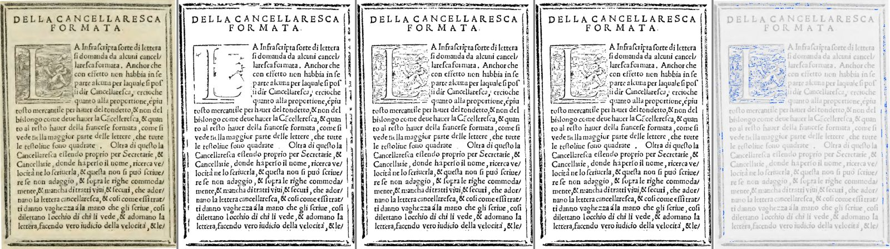

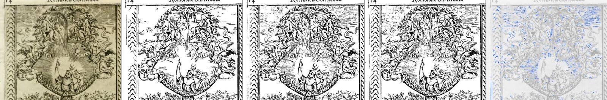

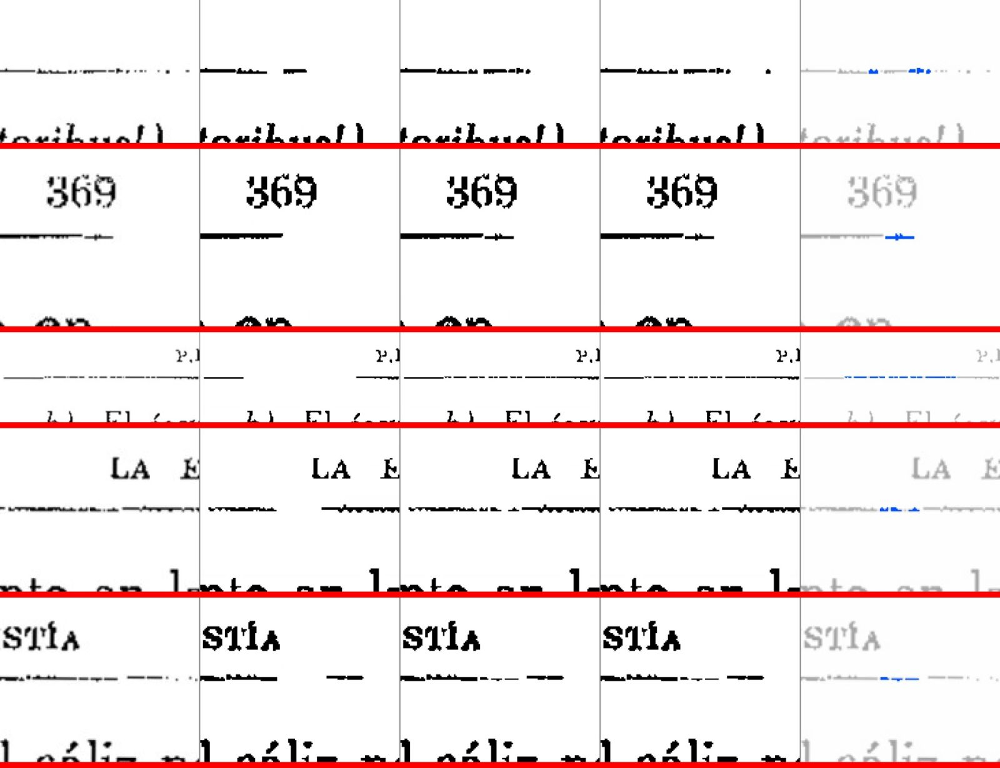

## 4. Testes de máquina

Arquivo por arquivo, no worktree do ramo (a máquina tem pouca memória; outro implementador trabalhava ao mesmo tempo).

- **Misto e Preto e branco** (12 arquivos: `test_misto.py` 31, `test_misto_desenho_claro.py` 10, `test_misto_consertos.py` 25, `test_misto_na_tela.py` 14, `test_misto_no_programa.py` 23, `test_misto_no_projeto.py` 12, `test_alerta_pb.py` 5, `test_preto_e_branco_regra_30_09.py` 15, `test_so_neste_pedaco_no_preto_e_branco.py` 8, `test_decoracao_no_preto_e_branco.py` 12, `test_filtros_algoritmos.py` 10, `test_filtro_com_selecao.py` 22): **187 passaram.**
- **O resto da pasta `tests/`** (78 arquivos): **1428 passaram**, 59 pulados (OCR sem o motor), nenhum falhou.
- **Total: 1615 passaram, 0 falharam.**
- **`teste_botoes.py`**, numa cópia `git archive` do ramo, com a própria `saida_teste`: **132 ações, 0 falhas.** (Sem a pasta `modelos/` na cópia: ele testa a fiação dos botões, não o detector.)
- O teste de velocidade do plano (`teste_velocidade.py`) **não** foi rodado: ele mede abrir o livro, trocar de página e processar em Mágico pro e Preto e branco **sem** "Só as letras", e nada disso passa pelo código mudado. O tempo do Misto foi medido à parte (abaixo).

## 5. Tempo do Misto

As 59 páginas, o Misto de fábrica com as mesmas entradas, hoje e ramo **alternados** no mesmo processo, mediana de 3 voltas, máquina sem outra medida rodando:

- **Total: 94,5 s antes, 97,6 s depois (+3,4%).** O implementador mediu +1,2%.
- Mediana: **+0,025 s por página.** As que mais subiram: Graduale 223 (2,52 → 2,93 s), Horas 14 (4,08 → 4,43 s), Graduale 221 (2,82 → 3,11 s), justamente páginas grandes **onde o conserto não muda nada** (a conta é feita e descartada).
- É pouco perto do resto da página (a análise e o leitor de texto levam de 5 a 20 s na primeira vez), mas é mais lento, e a regra 6 do plano não abre exceção. Fica para o Samuel decidir.

## Ressalvas

1. **Prévia ≠ PDF no Misto** (seção 2). O PDF sai certo; a tela mostra a capitular quebrada. Sugiro registrar na Lista de bugs.
2. **Foto de meio-tom ganha o grão do fundo** (Righetti 6 e 30). Não estava nas 59; os limites não foram pensados para foto.
3. **As queixas do Samuel continuam:** linhas vermelhas do ljs47 103 picotadas; beirada da folha no Siebmacher 9 (dir.) e sombra da dobra no ljs47 26.
4. **+3,4% de tempo no Misto** (regra 6).
5. **O que não testei:** a roda do mouse na prévia (não funciona por mensagem nativa sem foco; não foi preciso: usei o "Ver de perto" a 100%); outros livros de foto além do Righetti; "Tudo em preto e branco" e "Só o texto achado" página por página (o código deles não mudou; os testes de máquina cobrem).
6. O veredito de cada página é o meu olho, em imagens reduzidas e recortes ampliados; defeito muito pequeno pode ter escapado.

## Bugs para a Lista de bugs

- **06/10/2026 - Misto: a prévia não mostra o desenho claro que o PDF vai ter.** Palatino 76 com "Só as letras" e "Guardar a tinta forte": no PDF a capitular S sai inteira; no cartão e no "Ver de perto" sai só a moldura e pedaços (print: `imagens/previa-x-pdf-palatino76.jpg`). Causa provável: a prévia é feita a 150 pontos por polegada e o PDF a 300; na prévia a regra nova quase não age, e até o Preto e branco puro perde hachura fina.

## Onde está

- Este parecer: `relatorios/conferir/misto-desenho-apagado-2026-10-06/verificador/parecer-verificador.html` (e `.md`, `.pdf`), imagens em `verificador/imagens/`.
- Meus scripts e as imagens grandes ficaram fora do projeto, na pasta de rascunho desta sessão (não vão para o git).
- Não juntei ramos, não fiz push, não apaguei nada que não criei.
