# Parecer do verificador (2): os quatro consertos do Misto (06/10/2026)

Ramo `fase2-misto`, worktree `misto`, commits `3e68f58`, `14d721a`, `c9b5d9b` e `ccdbf87`, comparados com o `9b00960` (antes dos consertos). Isto não é aprovação: quem marca é o Samuel.

## Veredito em uma frase

**PRONTO PARA CONFERIR.** Os quatro consertos funcionam na janela real (1600 × 821 px, que é 1280 × 657 pontos, o tamanho do notebook do Kaique a 150%), e a janela nunca ficou parada mais de 0,12 s. Ficam três ressalvas pequenas, que já existiam antes destes commits e não são deles: um cartão que fica em "preparando..." para sempre, o aviso "Tinta forte fora do texto" que demora a sair das outras páginas, e os botões "Aplicar em" encostando na tira de miniaturas com o "Mais opções" aberto.

## Máquina ou olho, item por item

| Item | Como foi conferido | Resultado |
|---|---|---|
| (a) pytest | máquina, um arquivo por vez (75 arquivos), numa cópia `git archive` do `ccdbf87` | **1464 passaram, 59 pularam, 0 falhas.** O `test_camadas` pulou 26 testes na primeira passada (a cópia ainda não tinha as páginas do gabarito); repetido sozinho com elas: 90 de 90. Os outros pulados são dos leitores de texto (OCR), que se pulam sozinhos |
| (a) os 5 arquivos do Misto, de novo | máquina, por mim, numa cópia nova do `ccdbf87` | **105 de 105 passaram** |
| (a) `teste_botoes.py` | máquina, numa cópia `git archive` com `saida_teste` e pasta de dados próprias | **132 ações, 0 falhas** (ele não clica em nada do Misto) |
| (b1) alerta "Tem cor" some com "Só as letras" | olho, janela real, mouse nativo | **funciona**, e o "Para revisar" acompanha |
| (b2) cartão "Preto e branco" com o Misto | olho, janela real; tempo medido | **funciona**; o cartão chega em 1,6 a 2,1 s e a janela não trava |
| (b3) bloco AJUSTE inteiro em 1280 × 657 | olho e máquina (altura do bloco e da barra) | **funciona**; o defeito antigo foi reproduzido no `9b00960` e não acontece mais |
| (b4) "Só as letras" só com o Preto e branco, e a frase-resumo | olho, janela real | **funciona**, guardando a escolha; as três frases (A, B, C) conferem |
| (c) páginas sem "Só as letras" iguais ao `9b00960` | máquina (pixel a pixel) e olho | **10 de 10 páginas idênticas** (5 páginas × 2 projetos) |
| (d) a janela nunca fica mais de 1 s sem responder | máquina (mensagem nativa à janela a cada 100 ms, a sessão inteira) | **maior parada: 0,119 s** (na análise, depois de "Conferir"); nos quatro consertos, no máximo 0,096 s; nenhuma acima de 0,25 s |
| velocidade (`teste_velocidade.py`) | não rodei | ver Ressalvas |

## Defeitos conhecidos (lembrete obrigatório)

Moldura dourada e iluminura continuam como **defeito conhecido** até o Samuel fechar a Fase 1. Nada aqui muda isso.

## Como foi feito

- **Livro de teste** (`livro-misto2.pdf`, 5 folhas): Escola de Jesus 7, Opus Majus 20, Horas 11, Palatino 9 e Graduale 222, copiadas de `gabarito\paginas` (só lidas). "Dividir folhas ao meio" desligado, Preto e branco, "Só as letras" ligada no livro, botão "Guardar a tinta forte".
- **Antes:** cópia `git archive` do `9b00960`. **Depois:** cópia `git archive` do `ccdbf87` (conferi com `diff` que as cópias são iguais aos commits). Cada uma com a sua pasta de dados (`LOCALAPPDATA` e `USERPROFILE` no scratchpad), nunca a pasta real.
- **Janela real** fora da tela, sem tomar o foco do Samuel; cliques por mensagem nativa do Windows; prints com `PrintWindow`. Aproveitei o piloto do primeiro parecer e o do verificador anterior (que foi interrompido), já com o conserto do laço de espera (olha a resposta uma última vez antes de desistir). Nenhuma espera deu "sem resposta".
- O verificador anterior tinha deixado o pytest completo (no mesmo código) e prints do "depois" dos itens 1 e 4. Usei o resultado do pytest; os prints e as medidas, refiz todos.

## (b1) O alerta "Tem cor" some com "Só as letras" (commit `3e68f58`)

**Antes (`9b00960`):** com "Só as letras" ligada, a página 1 (Escola 7) mostrava a faixa laranja "Esta página tem cor - o preto e branco vai perder a ilustração", o botão "usar Mágico pro nesta" e o "Para revisar" contava 4 (Tem cor 3).

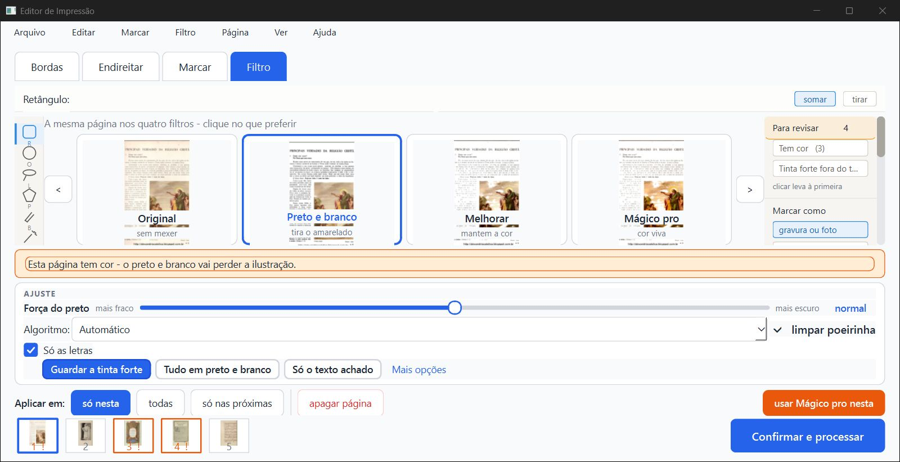

**Depois (`ccdbf87`):** com "Só as letras" ligada, a faixa diz "Esta página vai sair em Preto e branco", sem botão laranja; o "Para revisar" conta 1 (só a "Tinta forte fora do texto" da Palatino); as miniaturas 1 e 3 deixam de ficar laranja.

- **Desliguei "Só as letras" só nesta página:** a faixa laranja volta na hora, o "Para revisar" vai a 2 ("Tem cor (1)"), a miniatura 1 fica laranja, e o cartão "Preto e branco" passa a mostrar a gravura cinza.

- **Liguei de novo:** o alerta some, "Para revisar" volta a 1.

- **Desfazer e Refazer (menu Editar):** o alerta volta com o Desfazer (Para revisar 2) e some com o Refazer (Para revisar 1).

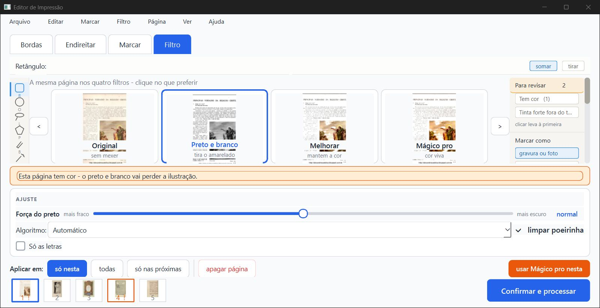

- **"todas" sem "Só as letras":** "Tem cor (3)", "Para revisar" 4, miniaturas 1, 3 e 4 laranja. **"todas" com "Só as letras":** "nada pendente".

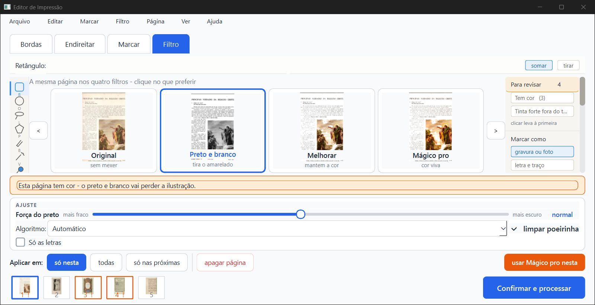

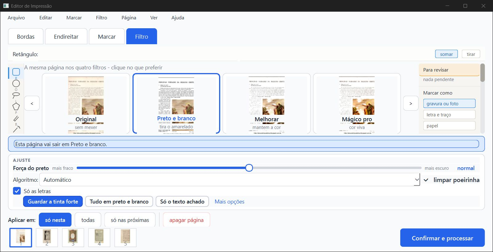

O que vi no print 07: "nada pendente", mas a Palatino (página 4) já tinha de volta, gravado na página, o aviso "Tinta forte fora do texto"; o painel só mostrou isso depois de eu trocar de página. É a ressalva 2, abaixo (não é o "Tem cor").

## (b2) O cartão "Preto e branco" mostra a página como vai sair (commit `14d721a`)

**Antes:** numa página posta em Original (Opus 20), o cartão "Preto e branco" ficou em **"preparando..."** e não saiu disso em 32 s. (No primeiro parecer, por outro caminho, ele mostrava a estátua estourada em preto e branco puro, sem o Misto.)

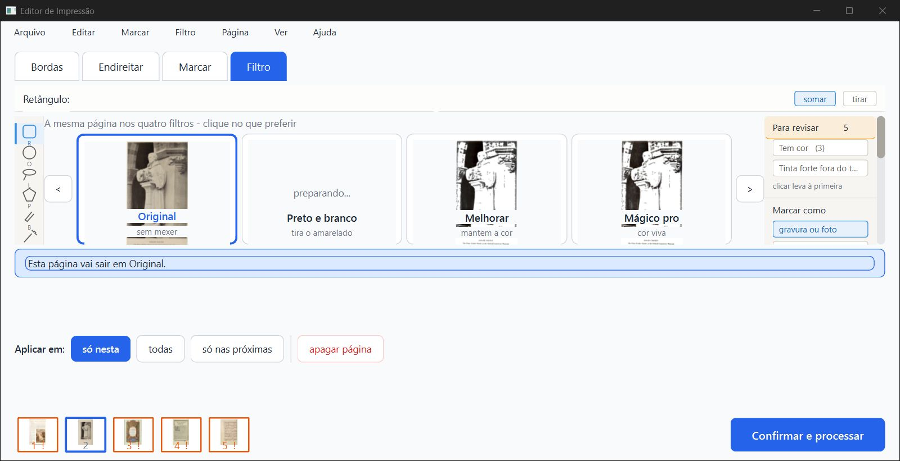

**Depois:** o cartão mostra a estátua **no tom do original** (cinza-sépia, como no cartão "Original") e a legenda de baixo em preto e branco: é o que sai escolhendo o Preto e branco com "Só as letras". Chegou em **2,1 s**; a janela respondeu o tempo todo (pior resposta nesse trecho: 0,096 s).

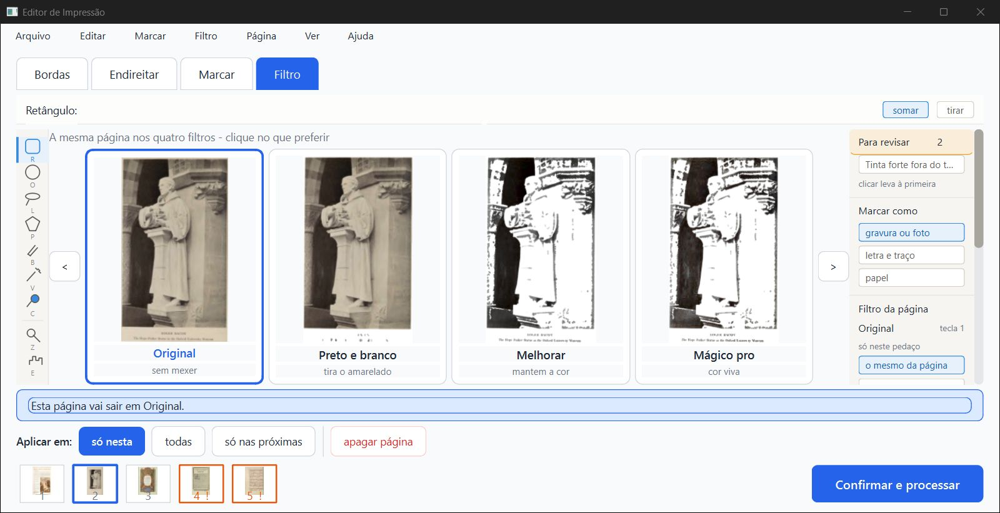

Fiz também o caso "frio" na Horas 11: troquei para o botão "Tudo em preto e branco" e, logo em seguida, cliquei em Original. O cartão "Preto e branco" chegou em **1,8 s** com a moldura iluminada em cor (a página inteira é gravura), e a janela não travou.

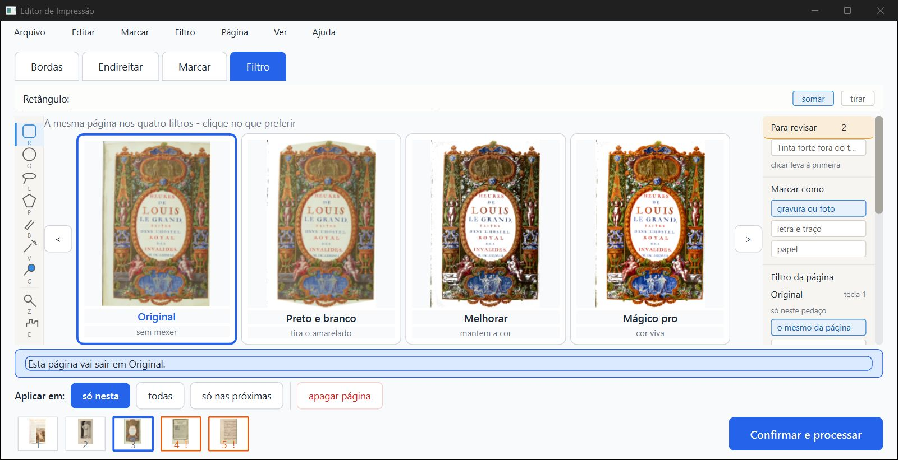

## (b3) O bloco AJUSTE não fica espremido (commit `c9b5d9b`)

O defeito só aparece num caminho certo: a página já está em Original **quando se entra na aba Filtro** (eu troquei para a aba Marcar e voltei), e aí se escolhe o cartão "Preto e branco".

**Antes:** o bloco AJUSTE virou uma faixa vazia de 17 px, sem "Força do preto", sem "Só as letras" e sem os três botões, e os botões "Aplicar em" ficaram sem texto.

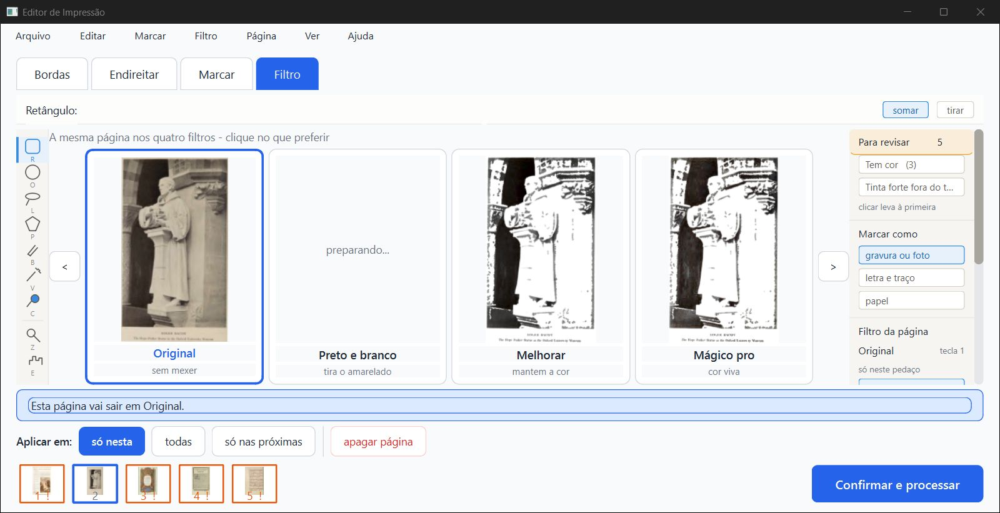

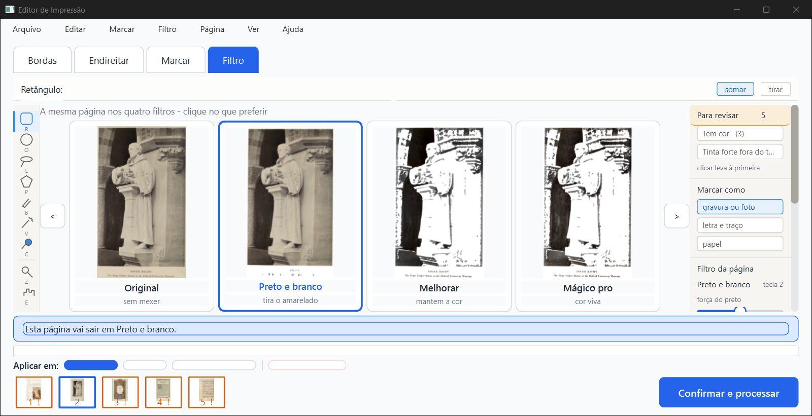

**Depois, no mesmo caminho:** o bloco aparece inteiro (146 px, a altura que ele pede): "Força do preto", "Algoritmo", "Só as letras" marcada, os três botões e o "Mais opções"; os "Aplicar em" com texto. Abrindo o "Mais opções", a barra cresce (195 px) e mostra "Papel de dentro das gravuras" e "Letras dentro de molduras e iluminuras". Voltando ao Original, a barra encolhe (39 px) e não deixa buraco.

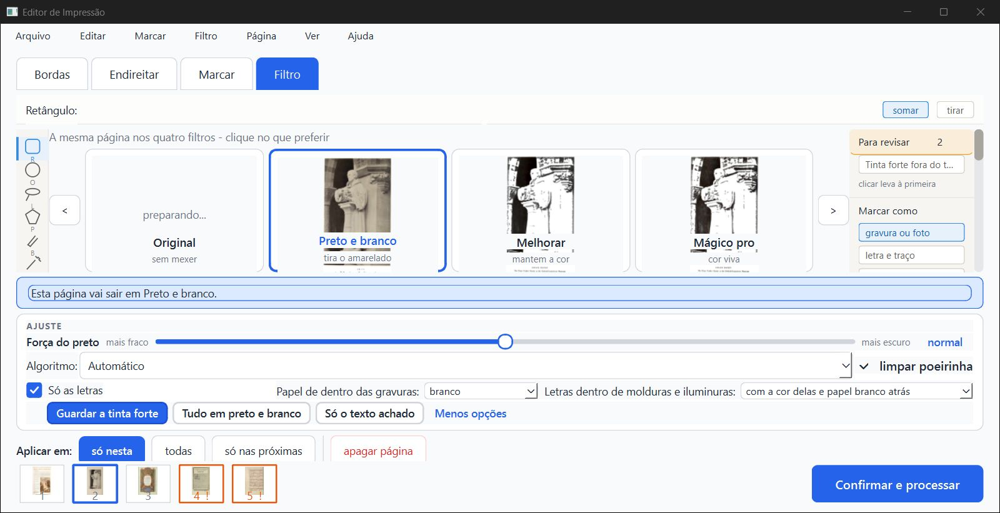

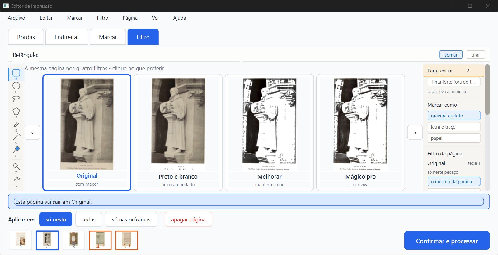

O que vi no print 14: com o "Mais opções" aberto, os botões "só nesta", "todas", "só nas próximas" e "apagar página" ficam com a borda de baixo encostada (um pouco coberta) na tira de miniaturas. Dá para clicar; é a ressalva 3.

## (b4) "Só as letras" só com o Preto e branco, e a frase-resumo (commit `ccdbf87`)

**Antes:** com o Original escolhido, "Só as letras" e os três botões continuavam à vista; e o resumo dizia "deixar tudo em preto e branco e separar as gravuras do texto" mesmo com "Só as letras" marcada.

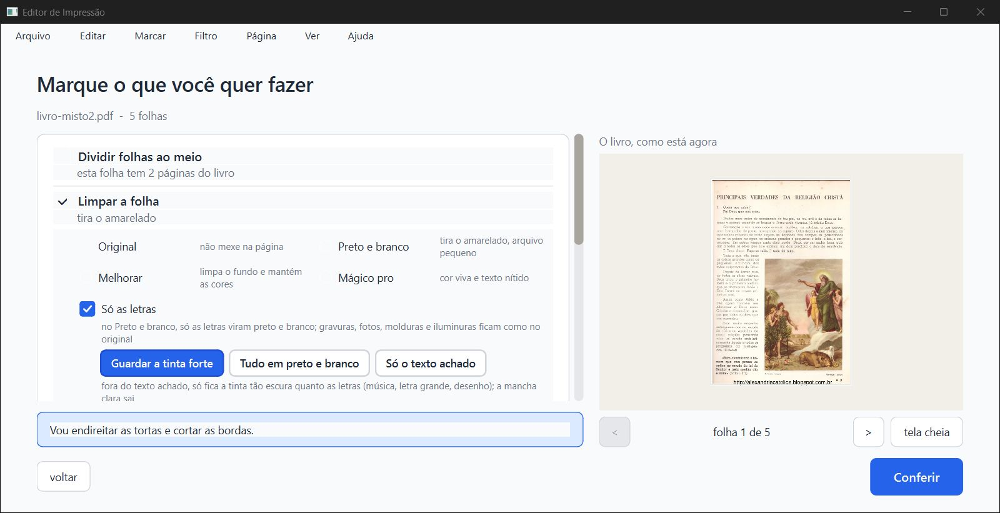

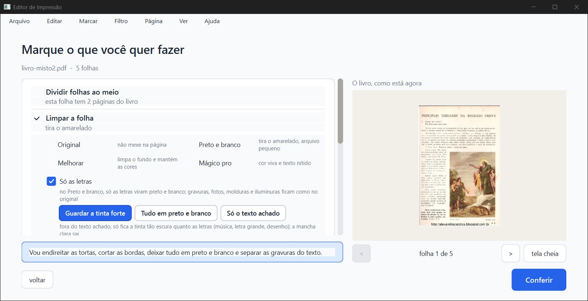

**Depois:**

- **Original:** "Só as letras" e os botões não aparecem; o resumo diz "Vou endireitar as tortas e cortar as bordas."

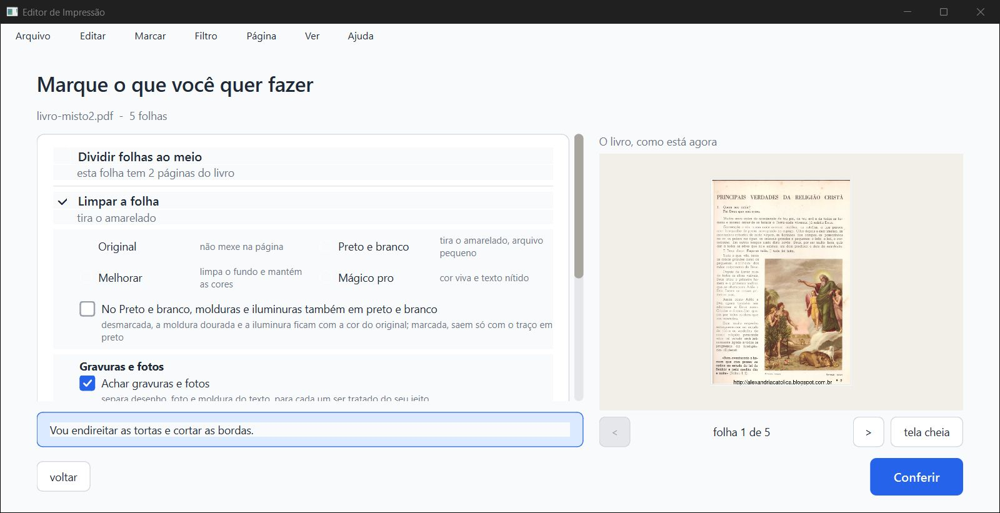

- **Preto e branco:** "Só as letras" aparece (desmarcada na primeira vez); a caixinha das molduras fica ativa enquanto "Só as letras" está desmarcada e cinza quando ela é marcada.

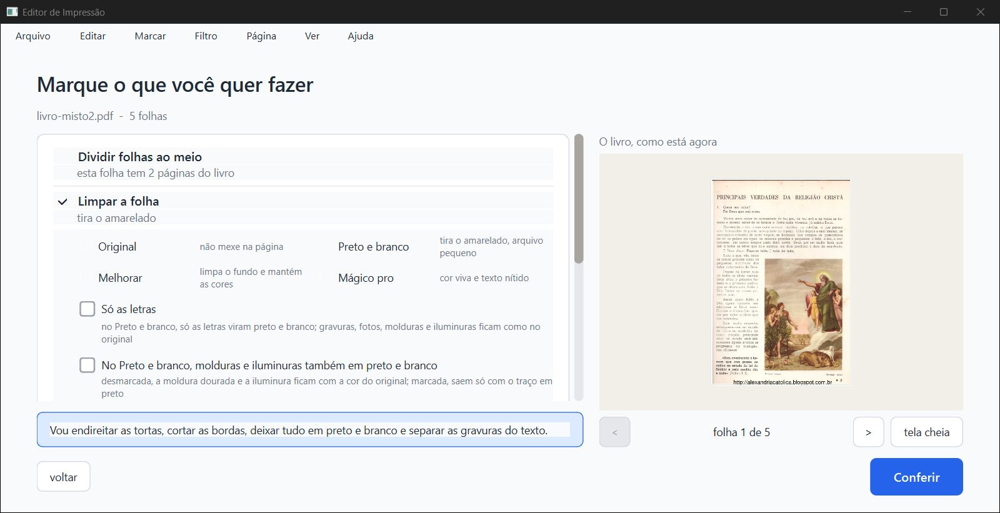

- **As três frases**, conforme o botão:
  - A, "Guardar a tinta forte": "...deixar só as letras em preto e branco (gravuras, fotos, molduras e iluminuras ficam como no original; fora do texto, só fica a tinta escura)."
  - B, "Tudo em preto e branco": "...deixar tudo em preto e branco menos gravuras, fotos, molduras e iluminuras (essas ficam como no original)."
  - C, "Só o texto achado": "...deixar só o texto que eu achar, em preto e branco (gravuras, fotos, molduras e iluminuras ficam como no original; o resto vai a branco)."

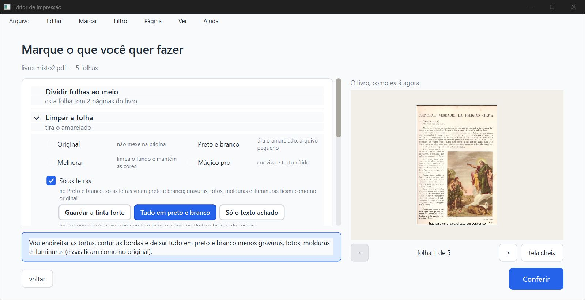

- **Guarda a escolha:** com C escolhido, troquei para o Original (sumiu tudo) e voltei para o Preto e branco: "Só as letras" continuou marcada, com C, e a frase de C.

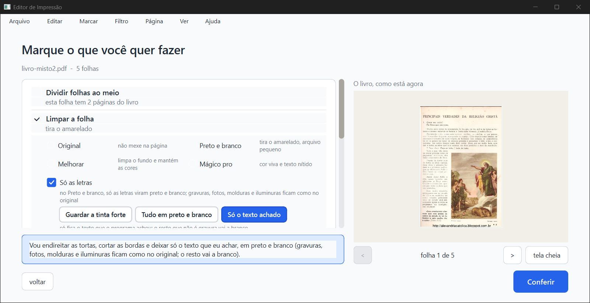

A frase com "Achar gravuras e fotos" desligado ("as gravuras que você marcar à mão") **não foi conferida na janela**: o clique na caixinha não a desmarcou (ela estava fora da parte visível da lista). Ela está coberta por um teste de máquina (`test_misto_consertos.py`).

## (c) Páginas sem "Só as letras" iguais ao `9b00960`

Gravei dois projetos pela janela e processei cada um com o código do `9b00960` e com o do `ccdbf87` (sem janela), comparando as imagens das páginas do PDF ponto por ponto:

- Projeto 1: Escola 7 em Preto e branco **sem** "Só as letras"; Opus 20 e Horas 11 em Original; Palatino 9 e Graduale 222 com "Só as letras" (A).
- Projeto 2: as cinco em Preto e branco, todas **sem** "Só as letras".

**Resultado: as 10 páginas são idênticas** (diferença zero em todos os pontos), inclusive as que passam pelo Misto. Olhei as 10 lado a lado:

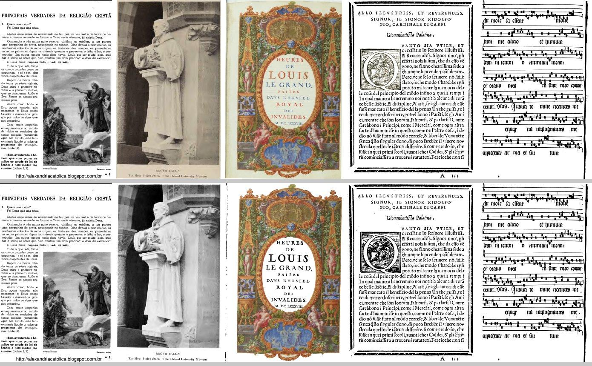

O que vi, página por página: Escola 7 com a gravura em cinza (sem "Só as letras"); Opus 20 em sépia no Original e em cinza no projeto 2; Horas 11 em cor nos dois projetos (a página inteira é gravura e moldura: defeito conhecido); Palatino 9 com o texto preto e a inicial ornada; Graduale 222 com as notas pretas e limpas.

## (d) A janela nunca ficou mais de 1 s sem responder

Um vigia mandou uma mensagem nativa (`WM_NULL`, com 30 s de limite) à janela a cada 100 ms, a sessão inteira (5754 medidas em 9,7 min no `ccdbf87`):

- **Maior parada: 0,119 s**, durante a análise logo depois de "Conferir".
- Nos quatro consertos: 0,096 s no cartão "Preto e branco" com o Misto; 0,041 s ao escolher o cartão "Preto e branco" (bloco AJUSTE); 0,037 s no "todas"; 0,030 s no Refazer.
- Nenhuma resposta acima de 0,25 s; nenhuma sem resposta.
- No `9b00960`, no mesmo roteiro, a maior foi 0,333 s (ao entrar na aba Filtro).

## Ressalvas

1. **Um cartão fica em "preparando..." para sempre** depois de trocar o filtro da página pelo cartão. No `ccdbf87`: a Opus 20 em Original e, ao escolher o cartão "Preto e branco", o cartão **Original** ficou em "preparando..." (esperei 33 s; voltou ao clicar de novo no Original). No `9b00960` acontecia o mesmo com o cartão "Preto e branco" (print 08). A causa provável é a lista de cartões guardada por página e força, que não muda quando só o filtro da página muda; com isso, o cartão do filtro que a página tinha nunca é calculado. **Já existia antes; o `14d721a` resolveu o caso do "Preto e branco" com o Misto, não este.** Para a Lista de bugs.

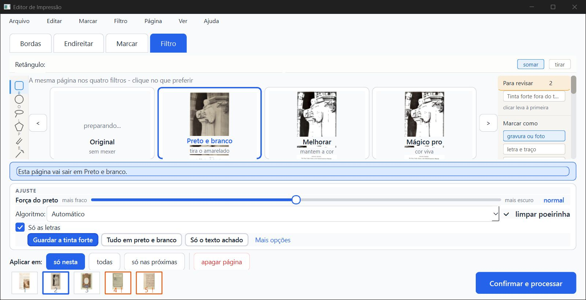

2. **O aviso "Tinta forte fora do texto" demora a acompanhar** nas outras páginas. Depois de "todas" sem "Só as letras", a Graduale (página 5) continuou com o aviso gravado até eu abrir a página; depois de "todas" com "Só as letras", o aviso da Palatino voltou na página, mas o painel disse "nada pendente" até eu trocar de página. Em outro momento, duas páginas tinham o aviso e o "Para revisar" contava 1. O "Tem cor" (que é o conserto `3e68f58`) acompanhou sempre na hora; a demora é só do aviso de tinta forte, que é de antes destes commits.

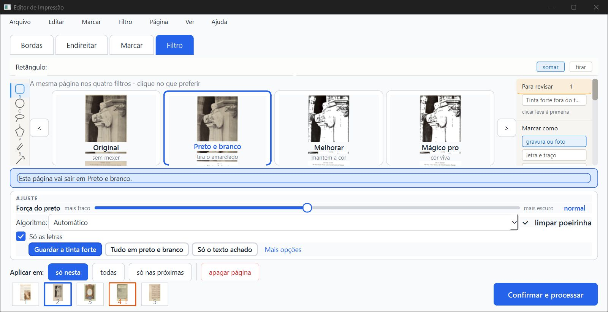

3. **Com o "Mais opções" aberto, em 1280 × 657,** os botões "Aplicar em" ficam com a borda de baixo encostada na tira de miniaturas (print 14). Pequeno.
4. **O ponto dos botões de escolha** (Original, Preto e branco...) não aparece em nenhum print, nem no `9b00960`: pode ser só a captura fora da tela. Vale olhar no PC de verdade.
5. **Velocidade:** não rodei o `teste_velocidade.py` (12 min, só com o PC parado). Os consertos mexem na tela e na contagem de alertas, e o PDF saiu idêntico, ponto por ponto, nos dois projetos; o tempo de processar foi parecido (11,5 s × 10,9 s; 13,0 s × 12,9 s), mas isso não substitui o teste oficial.
6. **pytest:** o resultado completo é do verificador anterior (interrompido), no mesmo código (conferido com `diff`); eu repeti os 5 arquivos do Misto.
7. Um print do "depois" (tela "O que fazer" logo ao abrir o livro) saiu com a tela anterior: o Windows ainda não tinha redesenhado a janela, que estava fora da tela. Joguei esse print fora; o estado Original está no print 19.
8. **Roda do mouse:** não usada (não funciona sem foco).

## Bugs para a Lista de bugs

- **06/10, cartão preso em "preparando...":** na aba Filtro, ao trocar o filtro de uma página clicando num cartão, o cartão do filtro antigo fica em "preparando..." para sempre (prints 08 e 16). Já existia no `9b00960`.
- **06/10, "Tinta forte fora do texto" atrasado nas outras páginas** depois de "todas" (print 25). Já existia.

## Arquivos

- Este parecer: `relatorios/conferir/misto-no-programa-2026-10-05/verificador-2/parecer-verificador-2-consertos-misto.html`
- Prints: `verificador-2/prints/` (26 arquivos, cerca de 150 KB cada)
- Scripts do piloto, logs do vigia, projetos e PDFs da comparação (fora do git): scratchpad da sessão, pasta `vm3`.
