# Parecer do verificador: página em Original com "só neste pedaço", o "(2)" e o "Ajustar o pedaço à figura" (05/10/2026)

**Em uma frase:** os itens 1 e 2 funcionam na janela de verdade e estão **PRONTOS PARA CONFERIR**. O item 3 **NÃO ESTÁ PRONTO**, por dois defeitos. Primeiro: quando a linha nova "Pedaço:" aparece, ela **espreme as linhas de botões da aba Marcar, em qualquer tamanho de janela**, e o texto de todos os botões fica cortado ao meio, inclusive o do botão novo. Segundo: num **pedaço de texto** (justamente o caso do item 1), o aviso diz "47%" e o botão **corta o título, a primeira pergunta, a última linha e metade de palavras nas beiradas**. Na pintura da Escola 7, o aviso e o botão fazem o que prometem.

> **Defeito conhecido (decisão do Samuel, 28/09):** moldura dourada e iluminura continuam sendo defeito conhecido até a Fase 1 ficar pronta (itens 1.2, 1.4 e 1.5). Nada disto mexe nelas.

Ramo `pedaco-e-salvo-2-2026-10-05` (worktree `consertos3`, último commit `17d705b`), comparado com `19c1ba7`. Eu não mudei código nenhum.

## Como conferi

- **Máquina:** `pytest` inteiro na worktree e `teste_botoes.py` numa cópia do `17d705b` (ver abaixo). Comparação ponto a ponto dos PDFs gerados na janela com o mesmo projeto processado pelo `19c1ba7`. Uma conferência própria de 6 páginas × 4 filtros contra o `19c1ba7`.
- **Olho, na janela real:** uma instância minha do programa, com o código da worktree, **fora da tela**, com **1600 × 821 pixels** (1280 × 657 pontos, o notebook do Kaique a 150%). Cliques, arrastos e teclas foram mensagens nativas do Windows, sem mexer no mouse nem no teclado do Samuel. As caixas "abrir PDF" e "escolher pasta" foram respondidas por arquivo. A pasta de dados foi minha (`LOCALAPPDATA` e a pasta do usuário trocadas), nunca a real. Os scripts do piloto vieram dos pareceres anteriores (só lidos lá) e estão em `scripts/`.
- **Livro de teste:** `livro-teste.pdf`, com 3 folhas copiadas do gabarito (Escola de Jesus 7, Boécio 3, Palatino 5), "Dividir folhas ao meio" desligado. Para o "(2)" num livro novo, um segundo livro, `livro-dois.pdf` (Boécio 3).
- No fim, fechei a minha janela com WM_CLOSE (fechou). O `erros.log` da pasta de dados de teste **nunca chegou a existir**.
- **O PC estava muito carregado:** outros agentes rodavam ao mesmo tempo (um `triagem.py` com 7 processos e mais dois `pytest`). A memória virtual livre chegou a 0,4 GB de 41 GB, e a primeira tentativa de abrir a janela falhou por "arquivo de paginação muito pequeno". Isso explica as falhas do `pytest` (abaixo) e torna os tempos medidos pouco confiáveis.

## Testes de máquina

| O quê | Resultado |
|---|---|
| `pytest tests` inteiro (65 min, PC carregado) | **1442 passaram, 7 falharam, 1 erro, 7 pularam** |
| As 7 falhas e o erro, rodados de novo sozinhos (`test_cartoes_e_previas`, `test_paginas_em_outro_processo`, `test_sem_janela_na_tela`, `test_teste_velocidade::test_enter_guardado_some_de_verdade`) | **22 de 22 passaram** (21 s). Eram tempo esgotado e servidor de páginas que caiu por falta de memória. Nenhum é destes itens |
| Os 4 arquivos de teste novos (`test_so_neste_pedaco_no_original`, `test_antigo_aberto_vira_pronto`, `test_ajustar_pedaco`, `test_ajustar_pedaco_na_aba_marcar`) | **38 de 38 passaram** |
| Os 7 que pularam | 6 do Kraken ("motor do Kraken não montado": o motor fica fora do git) e 1 que só roda com `OCR_22=1`. Iguais aos do implementador |
| `teste_botoes.py` | **132 ações, 0 falhas.** Rodei numa cópia do `17d705b` (`git archive`) na minha pasta temporária, com a pasta `saida_teste` própria e `modelos` só lido. O `saida_teste\botoes` de verdade não foi tocado (última mudança 16:25, antes desta conferência) |
| 6 páginas × 4 filtros, `19c1ba7` × `17d705b`, pelo caminho do "Confirmar e processar" | **24 de 24 idênticas, ponto a ponto** (ver item 4) |

## 1. Página em Original com um pedaço em Preto e branco: **funciona** (olho, na janela, e máquina)

Na aba Marcar, página 1 (Escola 7) **em Original**, cliquei "só neste pedaço: Preto e branco" e desenhei, com o mouse nativo, um retângulo em volta do **bloco de texto de cima**, do título até "E Deus disse: Faça-se tudo" (de 0,018 × 0,011 a 0,994 × 0,372 da página).

- **Prévia** (aba Filtro, cartão "Original"): o bloco de texto aparece em preto e branco, sobre papel branco, e o resto da página fica creme, como veio.

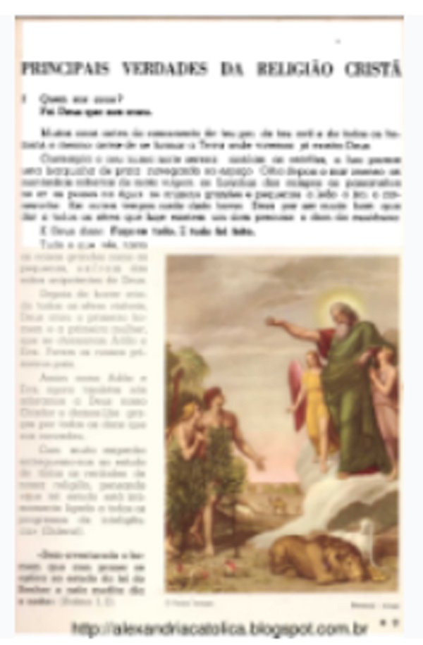

- **PDF gerado na janela**, comparado com o mesmo projeto processado pelo `19c1ba7`, que ignora o pedaço e por isso dá o Original puro:
  - **dentro do retângulo: só 2 tons** (preto e branco puros);
  - **fora do retângulo: 0 pontos diferentes do Original** (deixei de fora uma faixa de 3 pontos na beira, por causa do meu arredondamento da posição do retângulo);
  - **páginas 2 e 3: idênticas** ao `19c1ba7`, ponto a ponto;
  - a imagem da página 1 caiu de 6,6 para 5,2 MB (o branco comprime melhor que o creme), como o implementador disse.

À esquerda o Original (`19c1ba7`), à direita o PDF da janela:

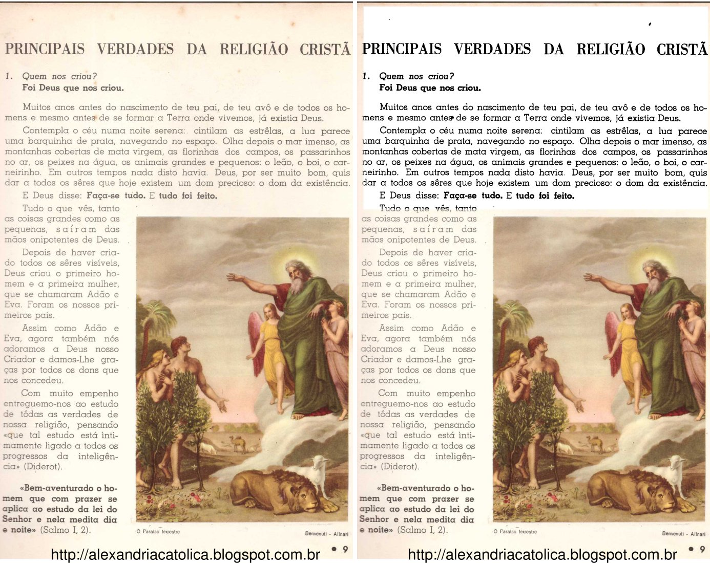

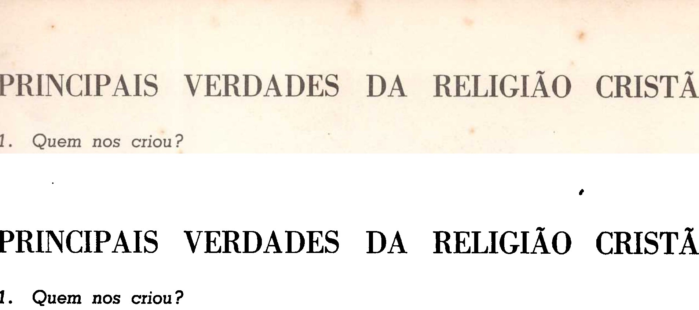

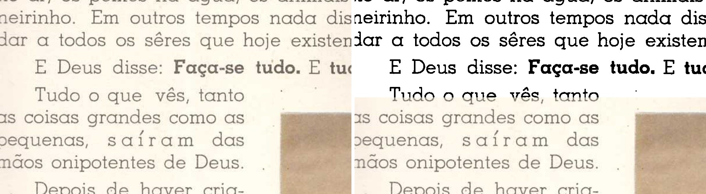

**O que eu vi:** o título, a pergunta e os dois parágrafos saem pretos e nítidos sobre papel branco. A pintura, a coluna da esquerda e a legenda ficam iguais ao Original. Na beirada de baixo, **o meu retângulo passou no meio da linha "Tudo o que vês, tanto"**: a metade de cima dela saiu em preto e branco, e a de baixo creme. Não é defeito do programa: a borda é a que eu desenhei, como o Samuel decidiu ("do mesmo jeito"). Mas mostra que, num texto, um retângulo desenhado à mão corta linha com facilidade.

## 2. PDF antigo aberto em outro programa: o "(2)" agora é "Ficou pronto!" (olho, na janela, e máquina)

Fiz duas vezes, com o arquivo antigo seguro de verdade por **outro processo** (um `open()` do Python, que no Windows impede trocar ou apagar o arquivo, como um leitor de PDF faria; não usei o leitor do Samuel). Antes de clicar, conferi que o arquivo estava mesmo preso ("O arquivo já está sendo usado por outro processo").

| Caso | O que aconteceu |
|---|---|
| **Livro que já tinha PDF** (`livro-teste`): "Confirmar e processar" > "Processar" > caixa "Já existe" > **"substituir o antigo"** | **"Ficou pronto!"** com o nome **"livro-teste - original (2).pdf"** e a frase *"O arquivo antigo, "livro-teste - original.pdf", estava aberto em outro programa (o leitor de PDF, por exemplo) e não pôde ser substituído. Ele ficou como estava, e o PDF novo foi salvo ao lado dele com o nome acima."* Nenhuma caixa de erro. O antigo ficou **intacto** (mesmo sha256 `66ae5eff…`, 17:38:11). O "(2)" tem 3 páginas e as **mesmas imagens** do PDF anterior |
| **Livro novo** (`livro-dois`, primeiro PDF dele; um arquivo com o nome padrão já existia e estava preso) | Igual: "Ficou pronto!", nome "(2)" e a frase. O cartão novo apareceu como **"pronto, PDF gerado"**. Este é o teste que importa para o cartão, porque o `livro-teste` já estava "PDF gerado" de antes |
| **Reabrir** o `livro-teste` pelo cartão > "Confirmar e processar" | O nome do arquivo veio **"livro-teste - original (2).pdf"**. O destino guardado no `projeto.json`, no `resumo.json` e no `historico.json` também é o "(2)" |
| **Processar de novo**, sem nada preso (substituindo o "(2)") | "Ficou pronto!" **sem a frase**: a do livro anterior não sobrou |
| `erros.log` da pasta de dados de teste | **Não existe** (nada foi gravado em nenhum momento) |

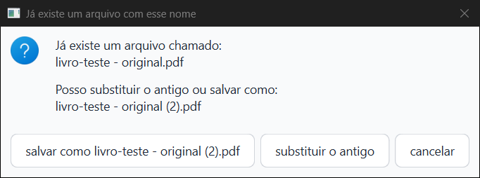

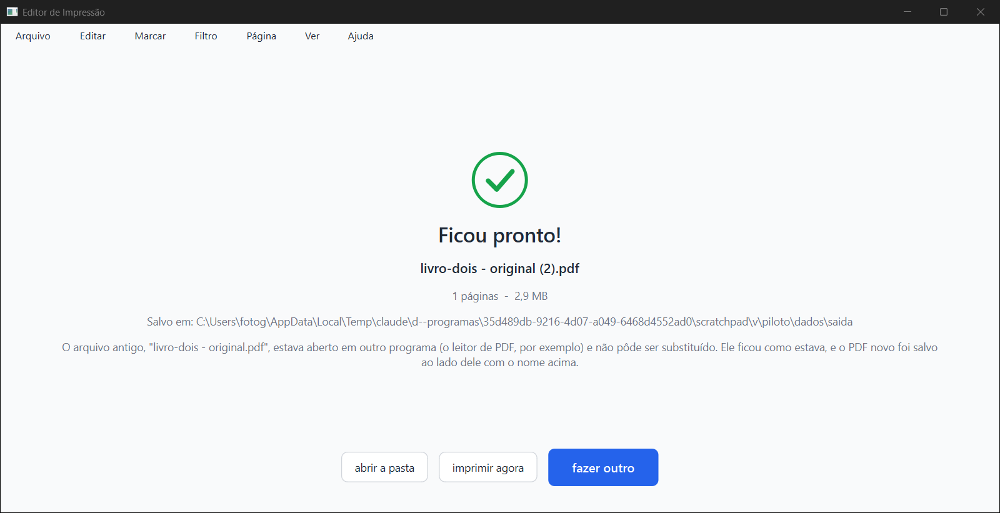

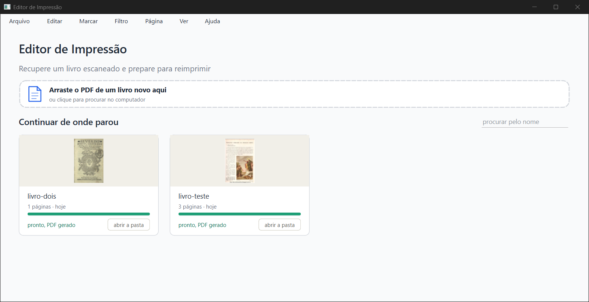

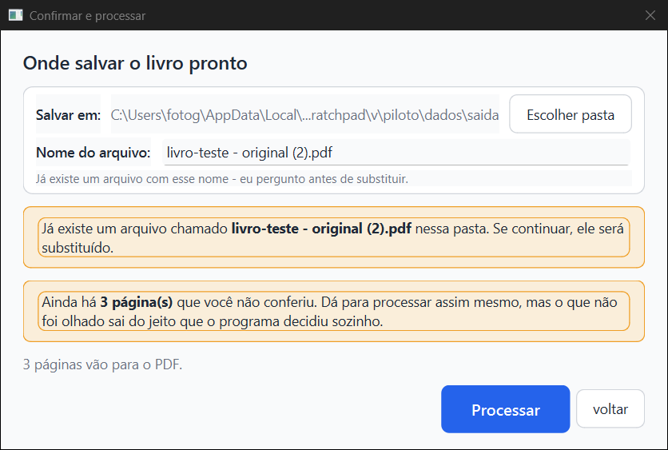

A frase é clara e está em português correto. Pequeno, antigo e fora deste item: no livro de uma página, a tela diz "1 páginas" (no "Ficou pronto!" e no cartão).

## 3. Aba Marcar: o aviso e o botão "Ajustar o pedaço à figura"

### 3a. Na pintura da Escola 7: **funciona** (olho, na janela, e máquina)

Página 1 em **Preto e branco**, "só neste pedaço: **Original**", e um retângulo com **bastante folga** em volta da pintura, pegando a linha de texto de cima, a beira da coluna da esquerda e as duas legendas (de 0,344 × 0,345 a 0,994 × 0,966).

- **O aviso aparece:** "Sobrou papel em volta da figura (17% do pedaço): pode sair uma faixa." A dica do mouse explica e diz que pode deixar como está.
- **"Ajustar o pedaço à figura":** o retângulo foi para **0,380 × 0,383 a 0,994 × 0,931**, justo na pintura, **sem a linha de texto e sem as legendas**. A frase passou a "O pedaço já está justo na figura." e o botão apagou. O Histórico ganhou "Página 1: pedaço aj…".
- **Desfazer (Ctrl+Z):** voltou exatamente ao retângulo com folga, e o aviso de 17% voltou. **Refazer (Ctrl+Shift+Z):** voltou ao justo.
- **Um retângulo justo desenhado à mão** (0,380 × 0,379 a 0,994 × 0,939): 2,1% de papel, **não avisa**. A linha "Pedaço:" fica com o botão aceso e sem frase nenhuma.
- **No PDF** (página em Preto e branco, pintura em Original depois do ajuste): **dentro do retângulo, a pintura é idêntica ao Original ponto a ponto** (0 diferentes em 2.027.592). Em volta dela, o papel sai branco. A faixa creme sumiu; sobra só a margenzinha de propósito (~0,3 mm), quase invisível embaixo da pintura.

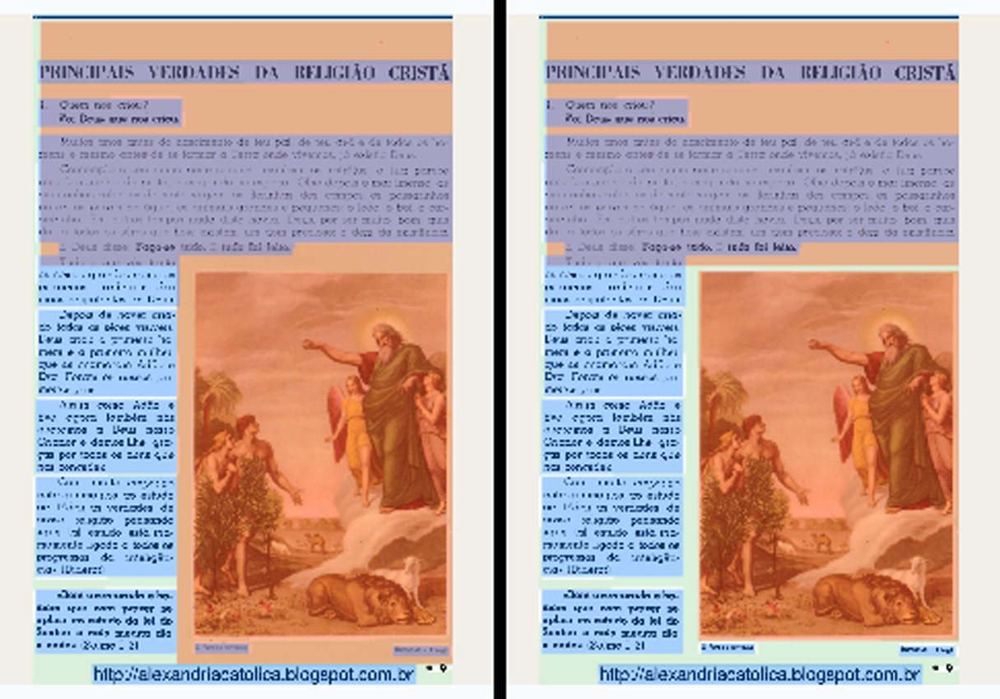

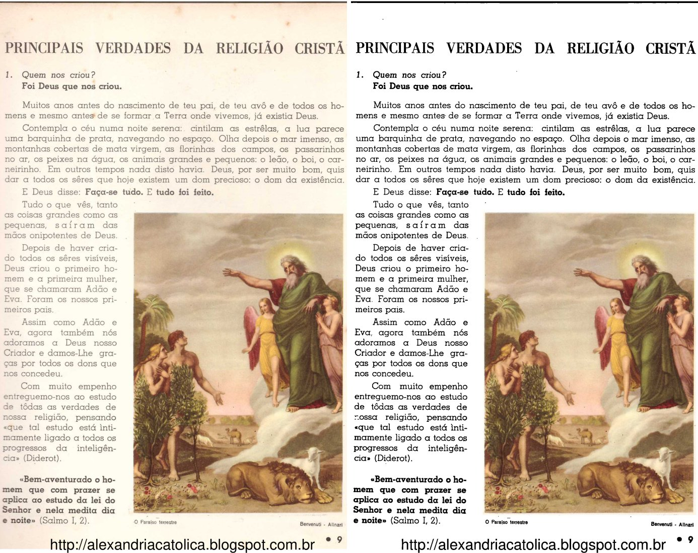

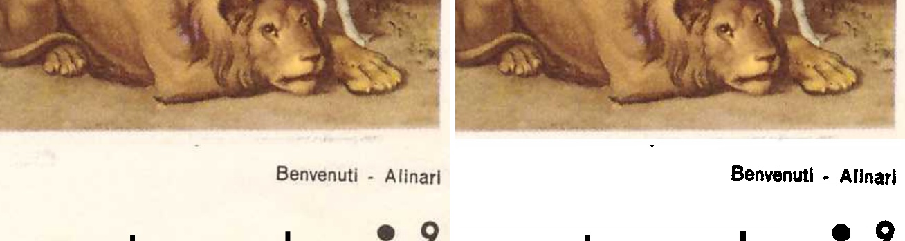

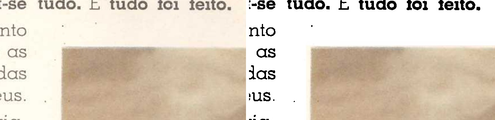

Prints da tela: `prints/18-marcar-folga-aviso.png` (aviso), `19-marcar-ajustado.png`, `20-marcar-desfeito.png`, `21-marcar-refeito.png`, `22-marcar-justo-a-mao.png`.

### 3b. **Defeito 1: a linha nova espreme os botões da aba Marcar** (olho, na janela)

Em 1280 × 657 pontos, **sem** a linha "Pedaço:", os botões de "Marcação:" e "Foto:" aparecem inteiros. **Quando a linha aparece, as três linhas de botões ficam achatadas e o texto de todos eles sai cortado ao meio**: "detectar automaticamente", "usar em todas", "só nas próximas" e o próprio **"Ajustar o pedaço à figura"**, que fica ilegível. O botão novo tem 24 pontos de altura, mas precisa de 39.

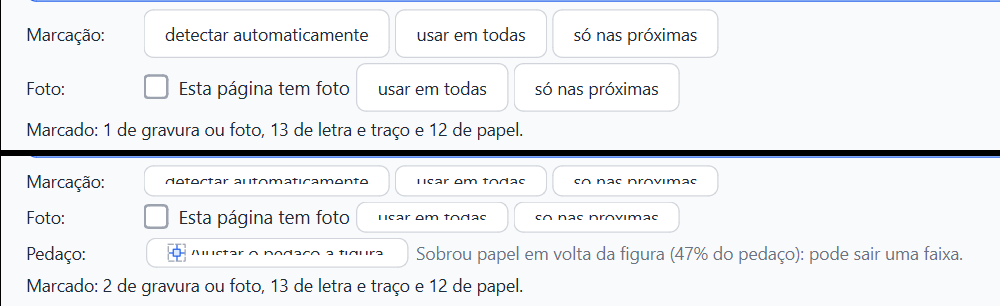

**Não é a janela baixa.** Abri a mesma tela em **1920 × 1040 pixels**: com a linha "Pedaço:" os botões continuam cortados, e a área da página cresce sozinha. Na página 2 (sem pedaço), no mesmo tamanho, os botões ficam inteiros. Então a culpa é da linha nova, que não ganha espaço próprio. O implementador viu o corte no print de 760 de altura e achou que fosse a janela baixa, mas o corte vem da linha.

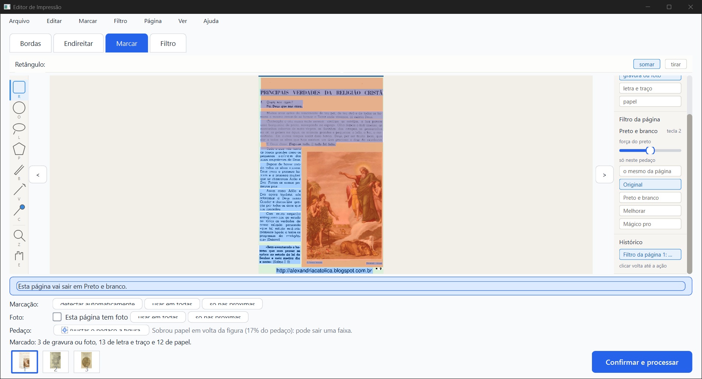

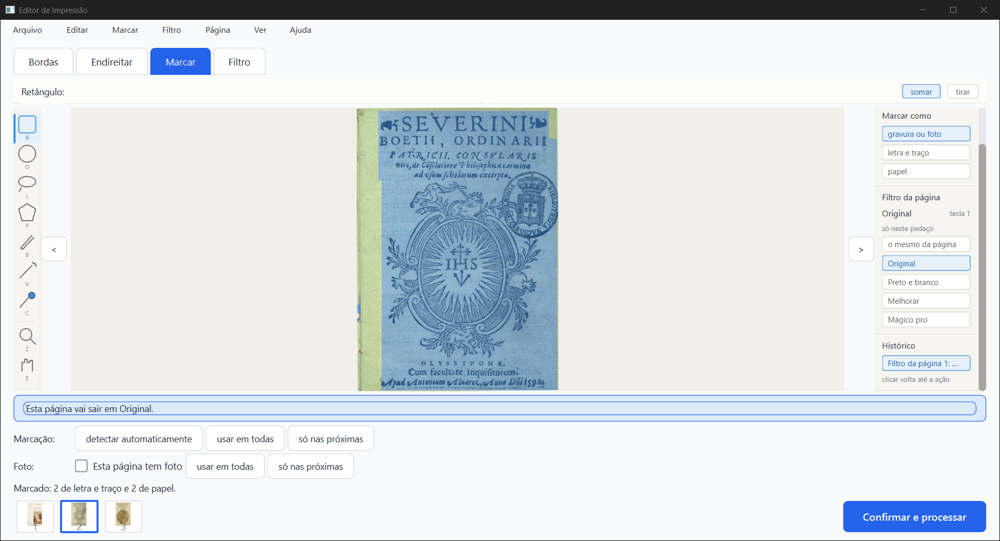

### 3c. **Defeito 2: num pedaço de texto, o aviso exagera e o botão corta o texto** (olho, na janela, e máquina)

É o caso do item 1: página em Original, bloco de texto de cima em "só neste pedaço: Preto e branco". O retângulo pegava o bloco inteiro, com pouca folga.

- **O aviso:** "Sobrou papel em volta da figura (**47%** do pedaço): pode sair uma faixa." Isso convida o Kaique a clicar.
- **Clicando "Ajustar o pedaço à figura"**, o retângulo foi de 0,018 × 0,011 – 0,994 × 0,372 para **0,061 × 0,127 – 0,951 × 0,335**. O programa achou que "a figura" é o maior grupo de tinta, os dois parágrafos, e deixou de fora como se fosse legenda:
  - o **título** "PRINCIPAIS VERDADES DA RELIGIÃO CRISTÃ";
  - a **primeira pergunta e a resposta** ("1. Quem nos criou? / Foi Deus que nos criou.");
  - a **última linha** ("E Deus disse: Faça-se tudo. E tudo foi feito.");
  - e **as beiradas das linhas**: o pedaço começa e termina no meio das palavras ("ho|mens", "par|ece", "passarin|hos").
- **No PDF** (processei esse projeto ajustado com o código do ramo), sai **meio texto em preto e branco e meio no creme original, com palavras partidas ao meio**:

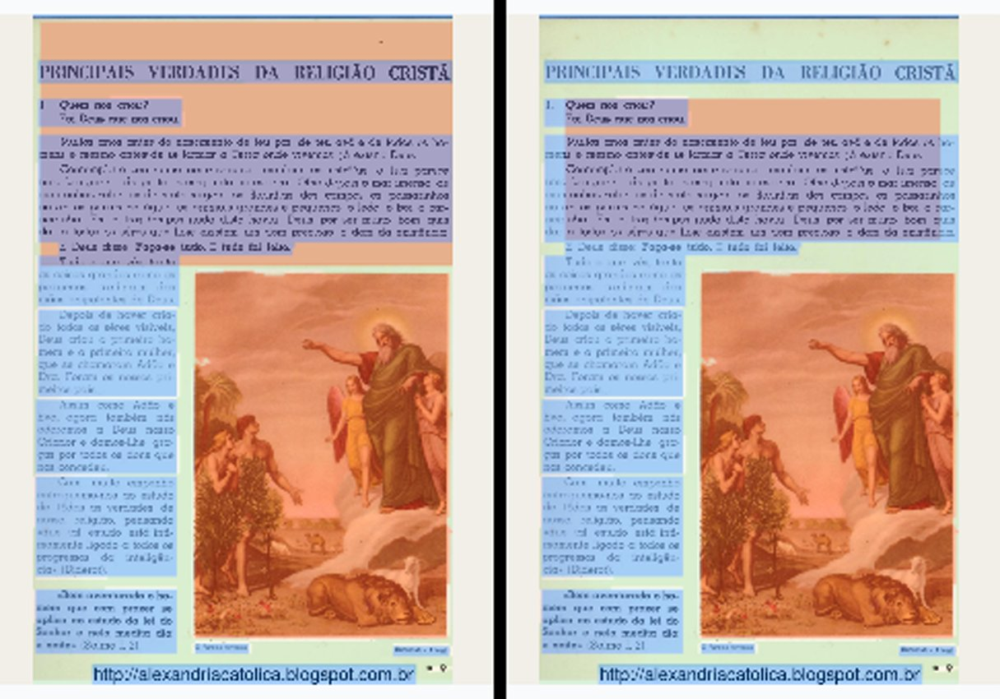

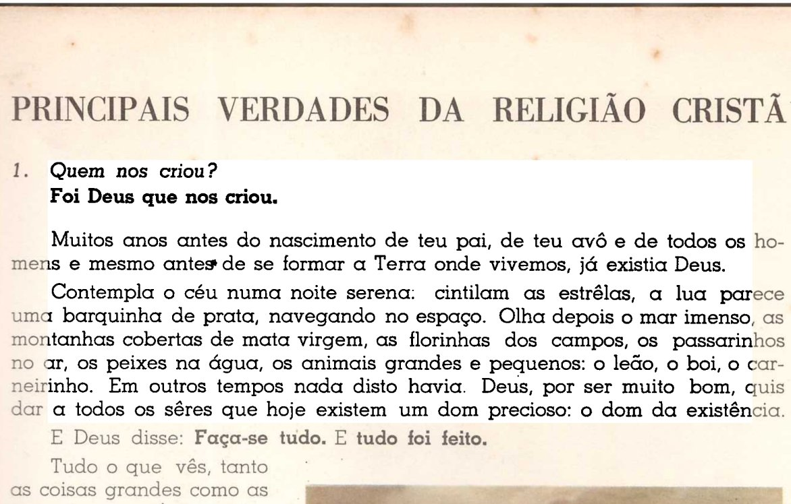

O relatório do implementador diz que, na faixa branca do item 1, "o botão também vale aí: ele encolhe até o bloco de texto". Na janela, não foi isso o que aconteceu. Ele corta o texto. Dá para desfazer (testei: Ctrl+Z devolveu o retângulo), mas o aviso de 47% faz o Kaique clicar. O resultado só se percebe olhando de perto.

Mais duas coisas que vi:

- O botão ajusta **todos** os pedaços com outro filtro da página de uma vez. Não dá para escolher só um. Numa página com um pedaço de texto e outro de pintura, ajustar a pintura estragaria o texto.
- O tipo marcado não importa: o aviso e o botão valem para qualquer retângulo com outro filtro. Desenhei o de texto com "gravura ou foto", que é o padrão, como o Kaique faria.

**O que fazer não é decisão minha.** Ideias para o Samuel escolher: mostrar a linha só para pedaço marcado como "gravura ou foto" e pedir "letra e traço" para texto; ou não sugerir nada quando a tinta forma muitos grupos parecidos (linhas de texto); ou ajustar só o pedaço selecionado.

## 4. As páginas sem pedaço não mudaram (máquina, e olho na folha de contato)

Usei o `comparacao-32-paginas.json` do implementador (128 de 128 idênticas) só como referência. Fiz a minha conferência, menor: **6 páginas-gabarito × 4 filtros** (Escola 7, Opus Majus 20, Horas 11, Palatino 57, Graduale 221, Siebmacher 7), pelo caminho do "Confirmar e processar" (o `rodar_32.py` do implementador, sem mudança). Uma cópia inteira do `19c1ba7` contra uma cópia do `17d705b`, uma de cada vez.

| Filtro | Idênticas | Tempo de processar as 6 (antes → agora) |
|---|---|---|
| Original | **6 de 6** | 47,0 → 27,7 s |
| Preto e branco | **6 de 6** | 46,4 → 33,2 s |
| Melhorar | **6 de 6** | 56,9 → 51,8 s |
| Mágico pro | **6 de 6** | 55,1 → 66,9 s |

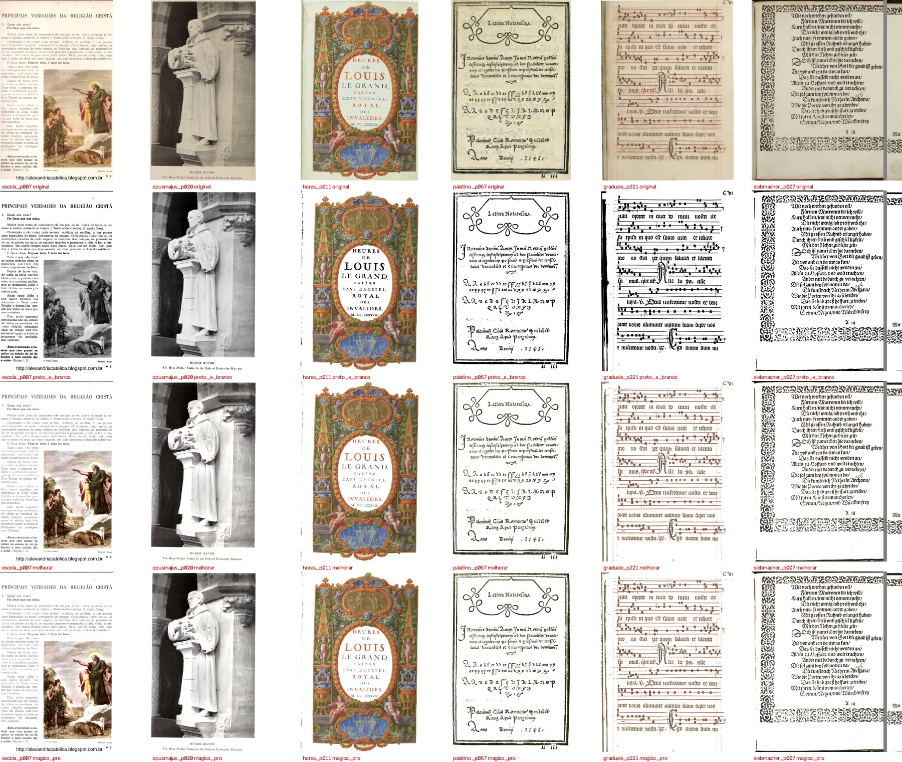

**O que eu vi nas 24:** todas saíram e estão como o filtro manda. Original igual ao scan, Preto e branco em preto puro, Melhorar e Mágico pro com papel branco e cor. A Horas 11 no Preto e branco mantém a iluminura colorida, que é o defeito conhecido e a opção desmarcada. **Os tempos não valem como medida:** o PC estava sem memória e com outros agentes. O Mágico pro "agora" saiu 21% mais lento, e os outros três mais rápidos, o que é ruído. As imagens são idênticas, então o caminho é o mesmo.

## 5. Velocidade

O teste oficial (`teste_velocidade.py`) **não foi rodado**: ele pede o PC parado, e o PC estava com outros agentes e sem memória. Indicação só: as 24 páginas acima são idênticas antes e depois. Na janela, um livro de 3 folhas foi processado em 5 a 14 s, conforme a carga do PC.

## Ressalvas

1. **Defeito 1 (3b)** e **defeito 2 (3c)**: ver acima. São os dois motivos do "não está pronto" do item 3.
2. **Antigo, visto de novo:** no painel "só neste pedaço", o botão aceso não muda ao clicar (print 18: o retângulo novo ficou com filtro Original, mas o botão aceso continuava "Preto e branco"). O Kaique pode achar que o clique não pegou.
3. **Antigo, fora deste ramo:** na aba **Filtro**, com a página em Preto e branco e a janela em 1280 × 657, o bloco "AJUSTE" (força do preto, algoritmo, limpar poeirinha) fica espremido numa faixa vazia, e os botões "Aplicar em" ficam sem texto (`prints/17-filtro-pb-ajuste-espremido.png`). O código da aba Filtro não mudou neste ramo.
4. **Clicar no cartão já escolhido da aba Filtro abre o "Ver de perto"** (janela modal). Na janela fora da tela, isso travou meus cliques até eu fechá-la. Só aconteceu no meu piloto: na tela de verdade, ela aparece.
5. **O "(2)" foi testado com um processo Python segurando o arquivo**, não com o Acrobat ou outro leitor de verdade. O efeito no Windows é o mesmo: troca recusada, "arquivo em uso".
6. **Roda do mouse:** não usei. Nada destes itens depende dela.
7. **Pytest:** as 7 falhas e o erro foram de ambiente (memória esgotada, tempo esgotado) e passaram rodados de novo. O PC estava carregado durante a rodada inteira.
8. Os PDFs gerados no teste ficaram fora do git, na minha pasta temporária (`scratchpad\v\piloto\dados\saida` e `piloto\comparar`).

## Bugs para a Lista de bugs (05/10/2026)

- **Aba Marcar: a linha "Pedaço:" espreme as linhas de botões** e corta o texto de todos eles, inclusive do botão novo, em qualquer tamanho de janela (prints `cmp-linhas-04-vs-05.png`, `23-…`, `24-…`).
- **"Ajustar o pedaço à figura" num pedaço de texto corta o texto:** tira o título, a primeira pergunta e a última linha, e parte palavras nas beiradas. O aviso diz 47% e convida a clicar (prints `cmp-texto-antes-depois-ajuste.jpg`, `item3b-texto-ajustado-no-pdf.jpg`).
- (Antigo) Botão aceso de "só neste pedaço" não acompanha o clique (print `18-marcar-folga-aviso.png`).
- (Antigo) Aba Filtro, Preto e branco, 1280 × 657: o bloco AJUSTE e "Aplicar em" espremidos (print `17-filtro-pb-ajuste-espremido.png`).
- (Antigo, pequeno) "1 páginas" no "Ficou pronto!" e no cartão.

## Onde está

- Este parecer: `relatorios/conferir/pedaco-em-original-2026-10-05/verificador/parecer-verificador-pedaco-em-original-e-salvo-2.html` (e `.md`, `.pdf`).
- Prints e imagens: `verificador/prints/`. Números: `verificador/comparacao-6x4.json` e `prints/comparacao-item1.json`. Scripts do piloto e das comparações: `verificador/scripts/`.
