# Parecer do verificador: "só neste pedaço" no Preto e branco e o cancelar que apagava o PDF antigo (05/10/2026)

**Em uma frase:** **PRONTO PARA CONFERIR, com ressalvas.** Os dois consertos fazem o que prometem, conferido na janela de verdade: cancelar depois de "substituir o antigo" **não apaga mais o PDF antigo** (nem com "Montar cadernos"), e a pintura marcada com "só neste pedaço: Original" **sai como o original** numa página em Preto e branco, enquanto as outras páginas saem **iguais ao `044a7c1`, ponto por ponto**. As ressalvas: quando o PDF antigo está aberto noutro programa, o PDF novo é salvo como "(2)", mas a tela trata isso como erro (sem "Ficou pronto!"; o cartão não fica "PDF gerado"). A faixa creme em volta da pintura aparece de verdade. E a página com o pedaço deixa o PDF bem maior (3,0 → 5,4 MB por uma página).

Ramo `consertos-cancelar-pedaco-2026-10-05` (commits `880bf70`, `60d8c58`, `d995208`, base `044a7c1`), worktree `consertos2`. **Não mexi em nenhum código.**

> **Defeito conhecido (aviso obrigatório até a Fase 1 ficar pronta):** moldura dourada e iluminura continuam sendo defeito conhecido (itens 1.4 e 1.5). Estes consertos não mexem nisso.

---

## 1. Como foi feito

- **Máquina:** `pytest` inteiro na worktree, `teste_botoes.py`, e comparação ponto a ponto das páginas dos PDFs gerados (janela × `044a7c1` × sem pedaço).
- **Olho, na janela real:** uma instância minha do programa (código da worktree), **fora da tela** (não apareceu para o Samuel), com **1600 × 821 pixels**. Cliques e teclas foram mensagens nativas do Windows, sem mexer no mouse nem no teclado dele, e as caixas "abrir PDF" e "escolher pasta" foram respondidas por arquivo. Usei uma **pasta de dados própria** (`LOCALAPPDATA` e a pasta do usuário trocadas), nunca a do Samuel. Os scripts do piloto vieram do parecer anterior (`verif-consertos-saida`, só lidos).
- **Livro de teste:** `livro-teste.pdf`, com 10 folhas copiadas das páginas-gabarito (Escola de Jesus 7, Boécio 3/7/8/22, Escola 35, Palatino 5/7/9/10). "Dividir folhas ao meio" desligado, filtro Preto e branco. Para "Montar cadernos", um segundo livro: `livro-cadernos2.pdf`, com as 9 primeiras folhas.
- **PDF antigo "aberto noutro programa":** um processo Python meu segurou o arquivo aberto (como faz um leitor de PDF; conferi antes que a troca ficava mesmo bloqueada, `PermissionError` 5). Não usei o leitor de PDF do Samuel.
- No fim, fechei a minha janela com WM_CLOSE (fechou).

---

## 2. Testes de máquina

| O quê | Resultado |
|---|---|
| `pytest tests -q` na worktree | **1410 passaram, 8 pularam, 0 falhas** (6 min 48 s, PC com outros agentes) |
| Os 3 arquivos de teste destes consertos (`test_substituir_e_cancelar`, `test_so_neste_pedaco_no_preto_e_branco`, `test_filtro_com_selecao`) com `-rs` | **51 passaram, nenhum pulou** (o teste com o PDF aberto de verdade no Windows rodou) |
| `teste_botoes.py` | **132 ações, 0 falhas** |
| Páginas 2 a 10 do PDF gerado na janela (com pedaço só na página 1) × o mesmo projeto processado pelo `044a7c1` | **9 de 9 idênticas, ponto a ponto** (e iguais ao PDF gerado antes de marcar o pedaço) |
| Página 1, dentro do pedaço × a página em Original | **100% dos pontos iguais** (diferença máxima 0) |
| Página 1, fora do pedaço × `044a7c1` | **0 pontos diferentes** (de 4 007 462) |
| PDF da janela × o mesmo projeto processado sem janela, pelo código da worktree | **10 de 10 páginas idênticas** |

Os números estão em `comparacao-pdfs.json`. Não listei o motivo dos 8 que pularam. Na rodada anterior, os que continuavam pulando eram os do Kraken (o motor fica fora do git) e um que só roda com `OCR_22=1`.

---

## 3. Item por item

### (b) Cancelar depois de "substituir o antigo": **funciona** (olho, na janela, e máquina por sha256)

Gerei o PDF uma vez (`livro-teste - preto e branco.pdf`, 10 páginas, 3,0 MB). Voltei pelo "fazer outro" e reabri o livro pelo cartão. Em "Confirmar e processar" > "Processar", apareceu a caixa "Já existe um arquivo com esse nome" (`10-subst-cancelar-a-caixa.png`). Um vigia lia a pasta a cada 50 ms e anotava todo arquivo que aparecesse.

| Caso | O que fiz | Resultado no disco |
|---|---|---|
| 1. Cancelar no meio | "substituir o antigo", "cancelar" na página 4 de 10 | Antigo **intacto**: mesmo sha256 (`02a997d8…`), mesma data (16:04:57). **Nenhum `~*.parcial`** apareceu nem sobrou. A tela voltou para Conferir, sem mensagem. |
| 2. Deixar terminar | "substituir o antigo" até o fim | O PDF novo **substituiu** o antigo (sha256 `b3e8b826…`, 16:07:01, 10 páginas). O `~livro-teste - preto e branco.pdf.parcial` apareceu por um instante e sumiu. "Ficou pronto!" |
| 3. Antigo aberto noutro programa | arquivo seguro por outro processo, "substituir o antigo" até o fim | Aviso **em português**, na caixa "Um momento": *"Não consegui substituir o arquivo antigo "livro-teste - preto e branco.pdf": ele parece estar aberto em outro programa (o leitor de PDF, por exemplo). O arquivo antigo ficou como estava, e o PDF novo foi gravado ao lado dele, na mesma pasta, com o nome "livro-teste - preto e branco (2).pdf"."* Antigo **intacto** (`b3e8b826…`, 16:07:01); **"(2).pdf" criado** com 10 páginas; nenhuma sobra. **Ver ressalva 1.** |
| 4. "Montar cadernos" ligado, cancelar no meio | livro `livro-cadernos2`, PDF de cadernos já gerado; "substituir o antigo", "cancelar" na página 5 de 9 | Antigo **intacto** (`6ad8eb2e…`, 16:16:26, folhas de 939 × 749 pt, já impostas); nenhuma sobra. |
| 4b. Cadernos, deixar terminar | idem, até o fim | Novo PDF de cadernos **substituiu** o antigo (`ce1e58d6…`, 16:17:26). |

Também não sobrou nenhum PDF temporário na pasta temporária do Windows depois do cancelar com cadernos.

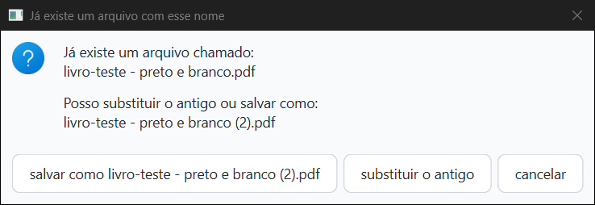

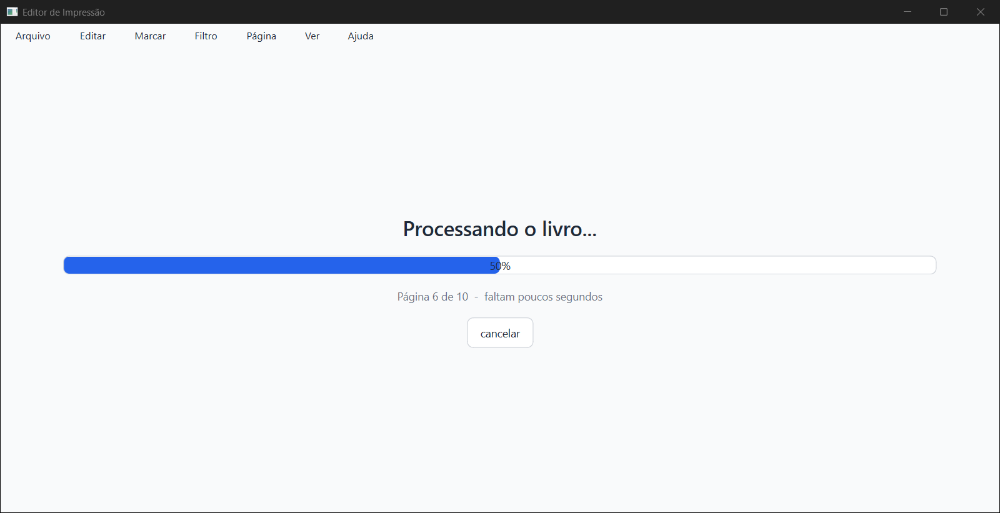

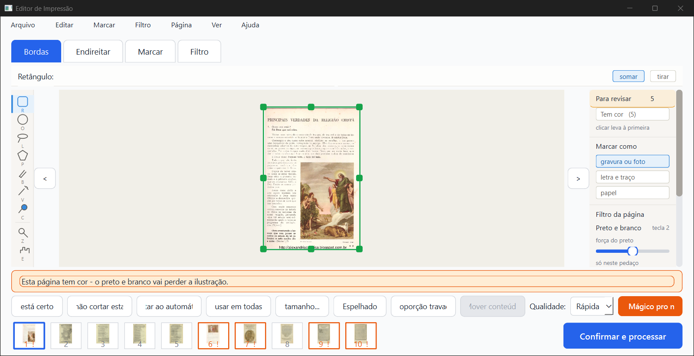

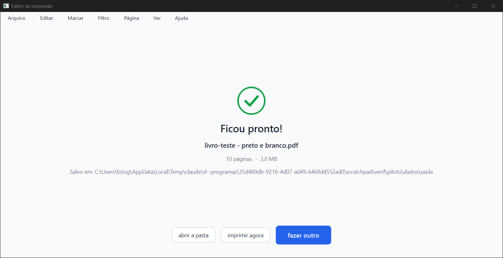

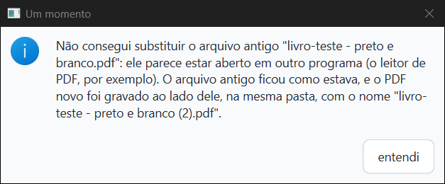


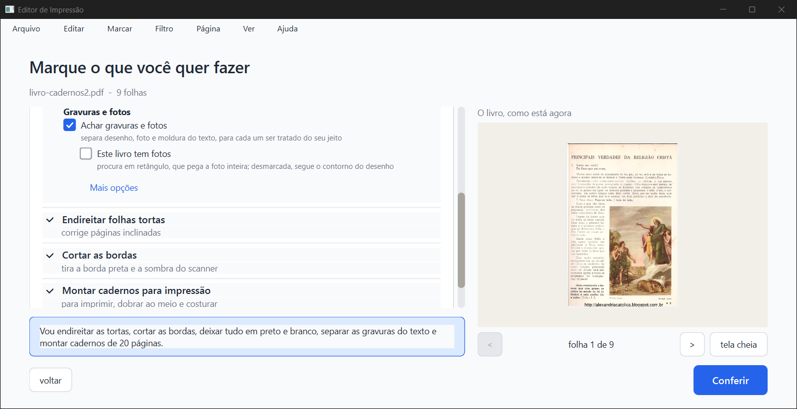

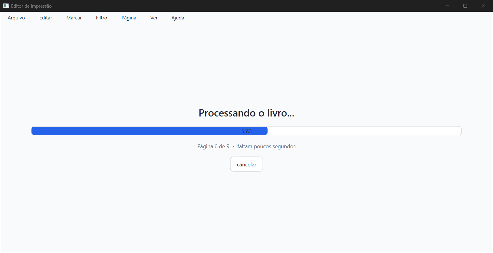

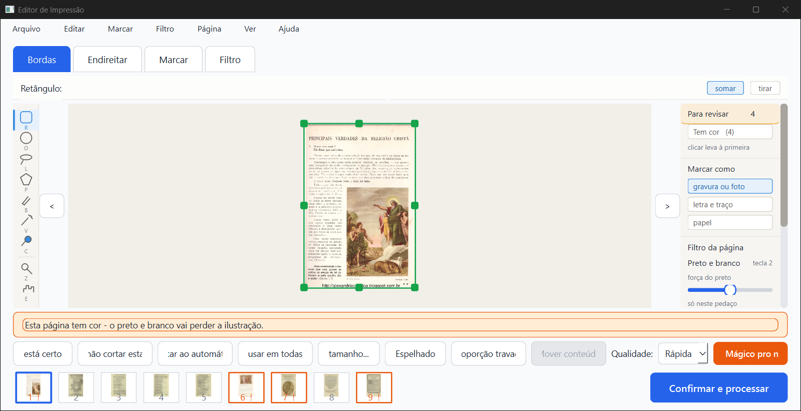

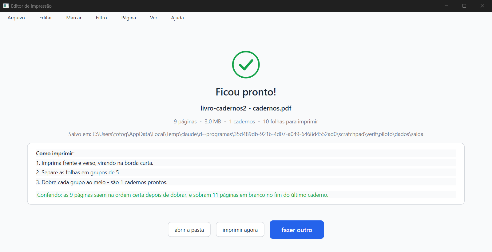

### (c) "Só neste pedaço: Original" numa página em Preto e branco: **funciona** (olho, na janela, e máquina ponto a ponto)

1. Na aba **Marcar**, página 1 (Escola de Jesus 7), com a página em Preto e branco, cliquei **"Original"** em "só neste pedaço". Depois desenhei um **retângulo em volta da pintura**, arrastando o mouse de verdade, por mensagens nativas. O retângulo foi gravado como `gravura / retângulo / mão / filtro original`, de (0,374; 0,379) a (0,994; 0,931), praticamente o mesmo do implementador.
2. **Prévia** (aba Filtro e "Ver de perto"): o texto sai em preto e branco e a **pintura sai colorida, como no original**. Ao redor dela, dá para ver a **faixa creme fina** do papel que ficou dentro do retângulo (em cima e à esquerda).
3. **PDF** (Confirmar e processar > substituir o antigo): pronto, 10 páginas, **5,4 MB** (antes 3,0 MB).
4. **Conferido no PDF, ponto a ponto:** dentro do pedaço, 100% igual ao Original. Fora dele, 0 pontos diferentes do `044a7c1`. As páginas 2 a 10, sem pedaço, são **idênticas ao `044a7c1`** (e ao PDF de antes de marcar).


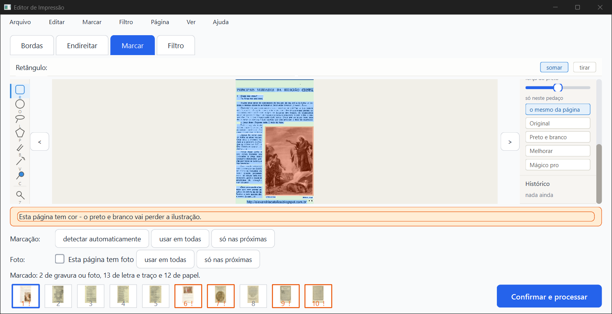

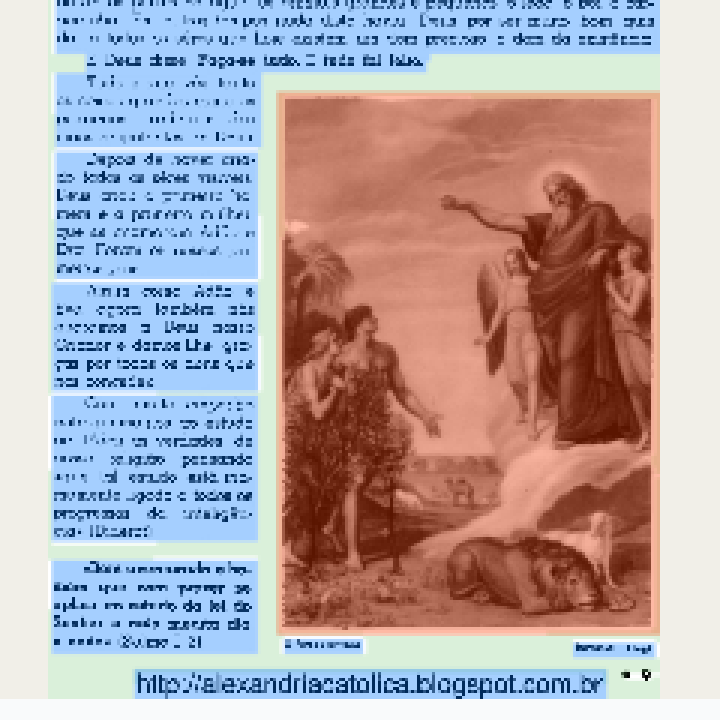

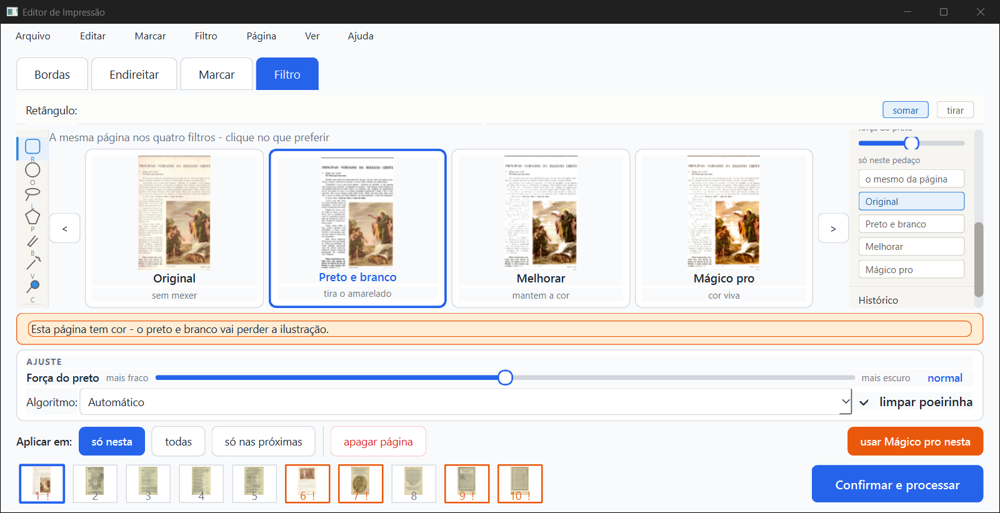

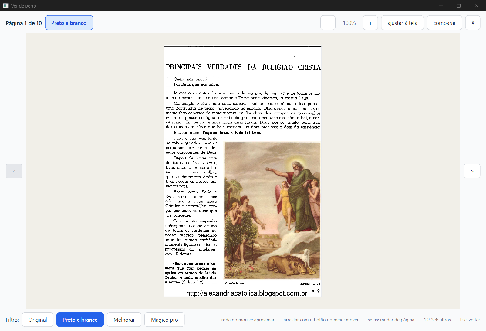

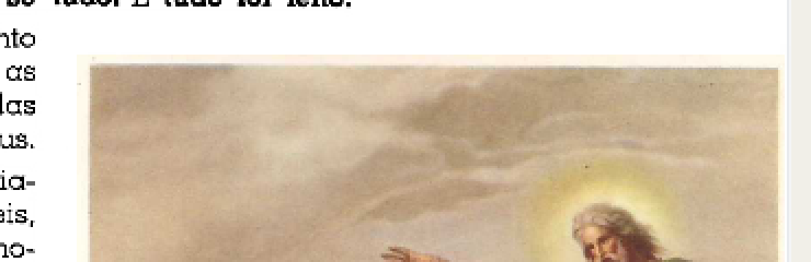


**A página 1 do PDF gerado na janela:** Original | `044a7c1` (o pedaço é ignorado, a pintura sai cinza) | este ramo (a pintura como no original):

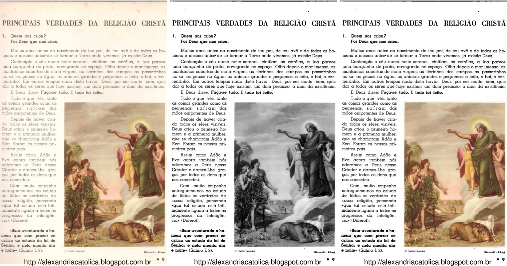

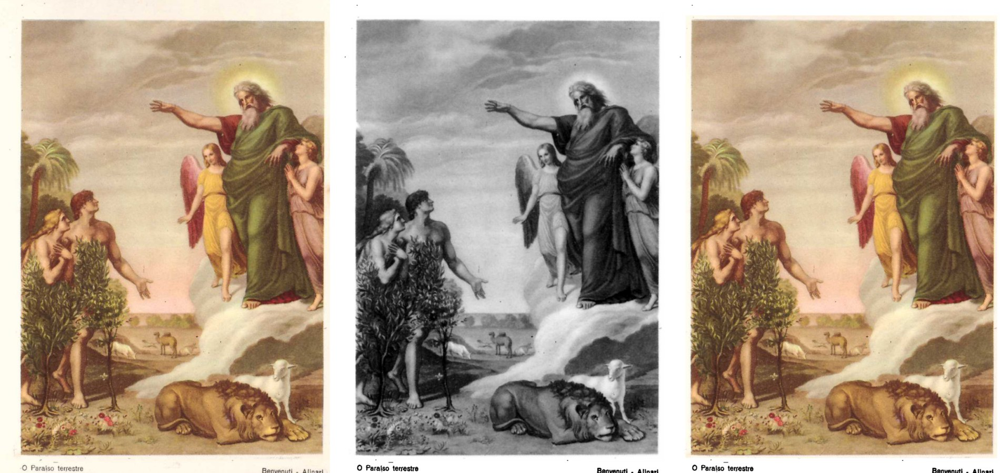

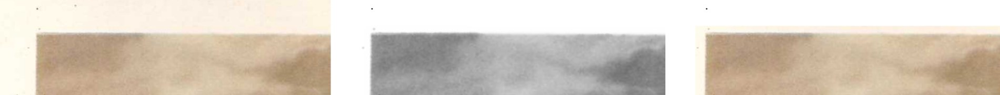

### (d) Bug achado pelo implementador: numa página em **Original**, o "só neste pedaço" é ignorado. **Confirmado, por leitura do código** (não testei na janela)

Em `core/filtros.py::aplicar_filtro_com_selecao` (linha 3504), o teste abaixo vem **antes** de qualquer olhar para o pedaço:

```
if filtro in (ORIGINAL, TIRAR_FUNDO):
    return img, False
```

Então, numa página em Original, um pedaço marcado como Preto e branco, Melhorar ou Mágico pro não vale. Sai a página como veio, sem aviso. O mesmo acontece no "Tirar o fundo" (que, pela decisão de 29/09, não aceita outro filtro). E também quando "Limpar a folha" está desmarcado: `core/pipeline.py`, linha 940, devolve a imagem antes de chamar o filtro. Vale para a lista de bugs, como o implementador disse. Não é efeito destes commits: o teste já estava no `044a7c1`.

---

## 4. As imagens do implementador (todas abertas)

| Imagem | O que vi |
|---|---|
| `escola7-pagina.jpg` | Original \| antes (pintura cinza) \| depois (pintura colorida, como no original; texto em preto e branco). Confere com o que eu vi na janela. |
| `escola7-pedaco.jpg` | A pintura de perto: o depois é igual ao original. Há uma borda creme fina em volta. |
| `escola7-detalhe1.jpg` | Céu e nuvens: antes cinza, com uma mancha branca recortada à esquerda; depois igual ao original, sem manchas. |
| `escola7-detalhe2.jpg` | Leão e pé da pintura: depois igual ao original. Embaixo aparece a faixa creme e, depois de uma linha reta, o branco da página. |
| `escola7-detalhe3.jpg` | **Faixa creme:** em cima e à direita da pintura, uma faixa creme (o papel dentro do retângulo), com o limite reto onde o retângulo termina. No original ela se confunde com a página creme; no Preto e branco, ao lado do branco, ela aparece. É pequena, mas se vê. |
| `opus20-pagina.jpg` | Foto de Roger Bacon: antes, manchas brancas recortadas na parede e no peito; depois igual ao original. |
| `opus20-pedaco.jpg` | Idem, de perto. |
| `opus20-detalhe1.jpg` | Rosto e peito: antes estourados de branco; depois como no original. |
| `opus20-detalhe2.jpg` | Parede clara e pé da foto: antes, branco recortado; depois como no original. A legenda "ROGER BACON" (fora do pedaço) sai em preto e branco. |
| `descartado/…-opus20-pagina.jpg` | A tentativa descartada: a parede vira manchas brancas recortadas. Descartar foi a escolha certa. |
| `descartado/…-escola7-pedaco.jpg` | A tentativa descartada na Escola 7: sem a faixa creme, e boa. |

Os meus prints (todos abertos, inclusive os que não entraram aqui) mostram o mesmo.

---

## 5. Velocidade

O teste oficial (`teste_velocidade.py`) **não foi rodado**, nem por mim nem pelo implementador: o PC tinha outros agentes. Só como indicação: na janela, o livro de 10 folhas foi processado em ~8 a 9 s antes e depois de marcar o pedaço. O mesmo projeto, sem janela: 13,9 s no `044a7c1` e 9,8 s neste ramo (os dois carregando os modelos, então é ruído). Nada indica lentidão nas páginas sem pedaço, que seguem o mesmo caminho e dão o mesmo resultado.

---

## 6. Ressalvas e defeitos achados

1. **PDF antigo aberto noutro programa: o PDF novo é salvo como "(2)", mas a tela trata isso como erro** (novo neste conserto; menor). O aviso é bom, mas depois dele o programa volta para **Conferir**, e não para "Ficou pronto!": não aparece "abrir a pasta" nem "imprimir agora". O cartão do livro **não fica "pronto, PDF gerado"** (`pdf_gerado` ficou falso), e o destino guardado continua o nome antigo, então a próxima vez propõe o nome antigo de novo. O caso também vai para o `erros.log` como erro, com o rastro inteiro. Para quem consertar: o `ErroPDFSalvoComOutroNome` (um `ErroPDF`) passa pelo caminho de falha da `TarefaProcessar`. Talvez ele devesse chegar como sucesso, com o caminho do "(2)", e o aviso por cima. O título da caixa ("Um momento") é o de erro.
2. **A faixa creme existe** (vista na janela e nas imagens). O tamanho dela depende da folga que o Kaique deixar ao desenhar. É consequência direta de "obedece inteira", decisão do Samuel.
3. **No painel "só neste pedaço", o botão aceso não muda ao clicar** (antigo, só de tela). Na aba Marcar, cliquei "Original": a escolha valeu (o retângulo foi gravado com filtro original), mas o botão aceso continuou "o mesmo da página" até eu trocar de aba (print 23). Pelo código, `PainelFiltroDaPagina._escolher_pedaco` guarda a escolha mas não redesenha os botões. O Kaique pode achar que o clique não pegou. O painel Histórico também continuou "nada ainda" depois de desenhar o retângulo.
4. **O PDF fica bem maior com o pedaço.** A página 1 passou de 1,3 MB (cinza) para 3,8 MB (cor), e o livro de 3,0 para 5,4 MB por uma página só. É o esperado (a página deixa de caber em tons de cinza), mas o Samuel deve saber: num livro com muitas pinturas marcadas, o arquivo cresce.
5. **Bug antigo que atrapalhou o teste de cadernos (registrado em 29/09, lembro aqui porque engana):** com um livro já conferido, fui em Arquivo > "Voltar para as opções", marquei "Montar cadernos para impressão" e cliquei "Conferir". A caixinha ficou marcada e o resumo dizia "e montar cadernos", **mas o PDF saiu sem cadernos**: o projeto salvo voltou por cima (`montar_cadernos` falso). O próprio código diz que isso é conhecido e ficou para depois. Por isso testei os cadernos com um livro novo. Em tempo: uma cópia **idêntica** do mesmo PDF noutra pasta é tratada como o mesmo livro (por decisão de 29/09).
6. **(d) confirmado só por leitura de código** (seção 3); não testei uma página em Original com pedaço na janela.
7. **Rodas do mouse e o tamanho de 1280 × 657 pontos a 150%:** não usei a roda. A janela "Ver de perto" abriu com 1600 × 1055 pixels, maior que a janela principal (este PC tem tela de 1080 de altura). Não conferi como ela fica no notebook do Kaique.
8. **"Ainda tem 12 páginas que eu não tive certeza"** num livro de 10 páginas (caixa "Antes de processar"). Parece contar avisos, e não páginas. Antigo, de texto.
9. O `teste_botoes.py` grava a pasta de trabalho dele em `saida_teste\botoes`, que nesta worktree é atalho para a pasta original. Ele só apaga e recria a própria pasta `botoes\dados`, como sempre faz. Não tocou em mais nada.

---

## 7. Para a Lista de bugs (05/10/2026)

- **Novo, menor:** "salvo como (2)" porque o antigo está aberto: depois do aviso, a tela vai para Conferir em vez de "Ficou pronto!", o cartão não fica "PDF gerado" e o caso vai para o `erros.log` como erro (ressalva 1, prints `12-subst-aberto-d-QMessageBox.png` e `12-subst-aberto-e-depois-do-aviso.png`).
- **Confirmado (do implementador):** numa página em Original (ou com "Limpar a folha" desmarcado), o "só neste pedaço" é ignorado (seção 3, item d).
- **Antigo, de tela:** o botão aceso do "só neste pedaço" não acompanha o clique na aba Marcar (ressalva 3, print `23-so-neste-pedaco-original.png`).

---

## 8. Onde está

- Este parecer: `relatorios/conferir/so-neste-pedaco-2026-10-05/verificador/parecer-verificador-so-neste-pedaco.html` (e `.md`, `.pdf`).
- Prints: `verificador/prints/`. Números: `verificador/comparacao-pdfs.json`. Scripts: `verificador/scripts/`.
- Os PDFs gerados no teste ficaram fora do git, na pasta temporária do verificador (`scratchpad\verif\piloto\dados\saida` e `piloto\comparar`).
