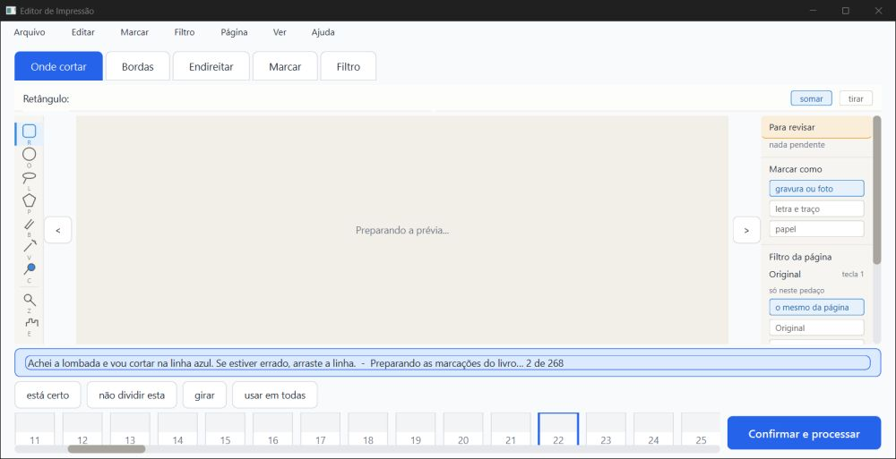
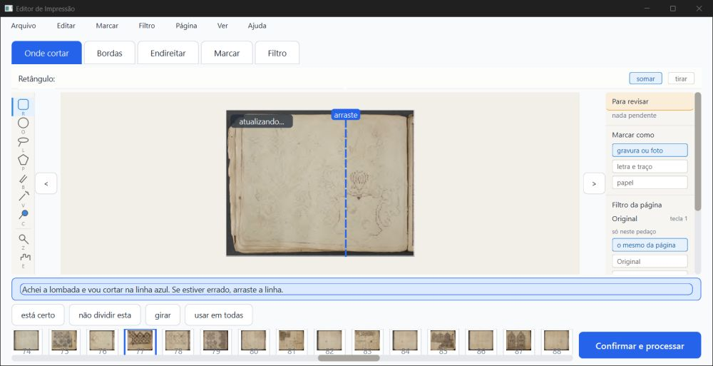
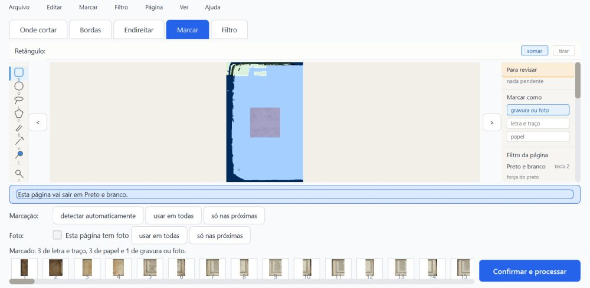
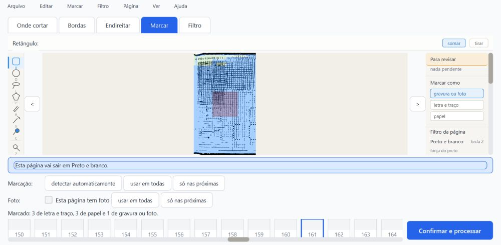
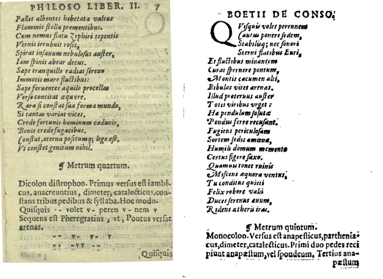
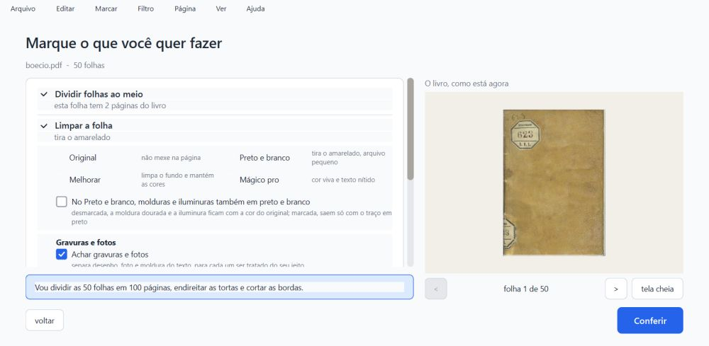

# Parecer do verificador: gravação por trás, cópia byte a byte e reticências (R1, R2, R5), 05 a 06/10/2026

**PRONTO PARA CONFERIR, com uma ressalva que vale a pena consertar antes de levar ao Kaique.**

A gravação por trás fez o que prometia:

- folheando sem parar durante a conversão inteira do Siebmacher, a janela respondeu a todos os 1413 cliques em no máximo 0,24 s;
- em 13 mortes do programa no meio da gravação, o `projeto.json` nunca ficou estragado nem pela metade;
- a cópia de segurança agora é o arquivo de antes, byte a byte.

**A ressalva (R-A):** trocar de livro pelo Ctrl+O menos de ~0,6 s depois de uma mudança **perde essa mudança**. Isso não é do conserto novo: o código de antes (`fee743b`) faz o mesmo. Mas a mensagem do commit `9a367de` diz que "trocar de livro continua gravando na hora", e isso não é verdade pelo Ctrl+O.

**Não é "aprovado":** só o Samuel marca.

O que foi conferido:

- o ramo `fase2-geometria` (worktree `geometria`) em `858f314`, com os commits `9a367de` (R1), `29f01ea` (R2) e `858f314` (R5);
- nenhum código do programa foi mudado;
- os projetos reais em `%LOCALAPPDATA%` não foram abertos.

Tudo rodou numa pasta de dados de teste própria (`verificador-2/dados/`), com cópias dos projetos e cópias do programa feitas por `git archive`:

- **novo:** `858f314`;
- **antes do conserto:** `fee743b`;
- **antigo:** `aab746f`.

Os dois projetos de teste vieram do verificador anterior e foram criados pelo programa antigo (`aab746f`):

- o Siebmacher, 268 páginas em 134 folhas divididas, `projeto.json` de 3.009.926 bytes;
- o Boécio, 50 páginas.

A janela de teste é uma instância minha de 1600×821 px (1280×657 pontos), fora da tela. Foi pilotada só com mensagens nativas e fechada com WM_CLOSE (ou morta de propósito com TerminateProcess, no item c2).

> **Defeito conhecido (decisão do Samuel, 28/09):** a moldura dourada e a iluminura continuam sendo defeito conhecido da Fase 1. Este item não mexe em imagem.

**Este parecer continua o trabalho de um verificador interrompido.** Aproveitei os scripts dele e as duas rodadas de folhear que ele completou (sieb1 e sieb2, mesmo código). Refiz os testes de máquina e duas rodadas de folhear (sieb3 e sieb4). Todos os testes de integridade são meus (`scripts/integridade3.py`, `scripts/processar_logo_v3.py`, `scripts/folhear_v3.py`).

**O laço de espera do piloto:** ele olha a resposta uma última vez depois do tempo-limite, e o tempo-limite passou para 60 s. Não houve nenhum "sem resposta". O clique também ganhou limite (30 s), e nenhum clique se perdeu.

## 1. Veredito por item

| Item | Como | Resultado |
|---|---|---|
| (a) pytest, um arquivo por vez | máquina | **1406 passaram, 59 pularam, 0 falhas** (73 arquivos, ~10,5 min somados). Os 59 pulados são de OCR (dados fora do git). `test_gravar_por_tras.py`: 8 de 8. Nada precisou ser repetido. |
| (a) `teste_botoes.py` | máquina | **132 ações, 0 falhas.** Rodou numa cópia `git archive` (`trabalho/novo`), com a `saida_teste` dela. |
| (a) o teste novo pega o defeito? | máquina | Rodei `test_gravar_por_tras.py` contra o código de antes (`fee743b`): 2 falham e 6 dão erro. Os erros são funções que ainda não existiam, então isso só mostra que o teste não passa sem o conserto. |
| (b) janela respondendo durante a conversão | máquina + olho | **Responde.** São 2 rodadas minhas no Siebmacher, folheando sem parar do "0 de 268" ao fim:  • sieb3: 702 cliques;  • sieb4: 711 cliques.  Cada clique foi atendido em no máximo **0,235 s** (mediana 0,13 s), e a página andou em todos. **Maior parada da janela durante a conversão: 0,74 s.** Foi uma vez só, no instante em que a tela de conferir aparece, antes do primeiro clique. Depois disso, nenhuma parada de 0,25 s ou mais até o fim. Detalhe na seção 2. |
| (c1) mudar zona, corte e filtro e fechar logo | máquina + olho | **Tudo lá.** Fiz 3 vezes, cada vez numa página diferente (p160, p170, p180), com o fechamento (WM_CLOSE) a 0,18 s, 0,65 s e 1,0 s da última mudança. Nas 3 vezes, o disco ficou igual à memória (filtro, corte e zonas). Ao reabrir, as 3 páginas estavam como antes de fechar. |
| (c2) matar o processo no meio da gravação | máquina + olho | **O `projeto.json` nunca estragou.** Foram 13 mortes, em momentos diferentes:  • antes de a gravação começar;  • com o `.novo` vazio;  • com o `.novo` inteiro mas ainda não trocado;  • logo depois da troca.  Nas 13, o arquivo é JSON inteiro, com 268 páginas e todas no formato novo. A mudança anterior estava sempre lá. A última mudança ficou em 3 e se perdeu em 10. Nenhuma outra página mudou. O `resumo.json` sempre legível, e não sobrou nenhum processo auxiliar. |
| (c2) matar durante a conversão de um projeto antigo | máquina | **Nada estragou.** Foram 6 mortes:  • 2 quando a cópia de segurança aparece;  • 2 folheando, no meio de uma gravação por trás;  • 2 em momentos quaisquer.  O `projeto.json` ficou sempre inteiro. No fim, depois de deixar terminar, ele é **byte a byte igual** ao de uma conversão sem interrupção (sha256 `28e46ed…`). |
| (c3) trocar de livro logo depois de mudar | máquina + olho | **Perde a mudança se a troca vier antes de ~0,6 s (ressalva R-A).** Com o Ctrl+O 0,05 s e 0,54 s depois, o filtro mudado não chegou ao disco, nem depois de fechar. Com 0,63 s, 1,23 s, 1,55 s e 1,78 s, chegou. O código de antes do conserto faz o mesmo (perdeu com 0,05 s e guardou com 0,75 s). |
| (c4) processar logo depois de mudar | máquina + olho | **O PDF sai com a mudança.** No Boécio p.16, mudei o corte para "não cortar esta", acrescentei uma zona de gravura e escolhi Preto e branco. Cliquei "Confirmar e processar" **0,12 s** depois. No PDF, a página 16 saiu em preto e branco (cor média 0,0, contra 37 a 39 nas vizinhas) e sem corte (251×369 pt, contra 228 a 234×348). O `projeto.json` ficou com as 3 mudanças. |
| (c5) o programa antigo abre o projeto convertido | máquina + olho | **Abre.** Testei o `aab746f` com o Siebmacher depois de todas as mudanças e mortes acima. As 268 páginas têm zonas, e a contagem de zonas e o filtro são iguais aos do disco em todas. Na p160, a zona de gravura feita no programa novo aparece no mesmo lugar, com o Preto e branco e sem corte. O `erros.log` ficou vazio. |
| (d) cópia de segurança = o `projeto.json` de antes | máquina | **Idêntica byte a byte.** O sha256 é `781f61b7…` nas 4 rodadas de folhear (sieb1 a sieb4) e nas 3 cópias do teste de mortes: igual ao arquivo antigo. |
| R5, reticências na faixa | máquina | O texto da faixa, lido direto da janela, é "Preparando as marcações do livro… 0 de 268", com o caractere "…". No print, a fonte desenha as reticências como três pontos. |
| Velocidade (`teste_velocidade.py`) | — | **Não rodado** (~12 min, só com o PC parado). Ver a observação O4 sobre o tempo da conversão. |

## 2. A janela durante a conversão (b): números

As 4 rodadas usam o mesmo código e o mesmo projeto antigo, e folheiam sem parar durante toda a conversão. O vigia anota toda vez que a janela fica 0,25 s ou mais sem atender (um relógio de 25 ms dentro do programa).

| Rodada | Conversão | Cliques | Clique mais lento | Paradas ≥ 0,25 s durante a conversão |
|---|---|---|---|---|
| sieb3 (minha) | 187 s | 702 | 0,235 s | 1: **0,57 s**, no início |
| sieb4 (minha) | 190 s | 711 | 0,232 s | 1: **0,74 s**, no início |
| sieb1 (verificador anterior) | 150 s | 581 | 0,229 s | 2: 1,11 s no início (a tira de miniaturas pintando) e 0,36 s |
| sieb2 (verificador anterior) | 159 s | 604 | 0,233 s | 1: 0,40 s |

**A travada de 6 s ou mais (R1) não voltou em nenhuma das 4 rodadas.**

A parada do início vem quando a análise termina e a tela de conferir se monta. É a mesma hora em que o programa grava o projeto e a cópia de segurança na hora, de propósito. É uma vez só, antes de a pessoa começar a folhear.

Fora da conversão, ao abrir:

- o programa fica 13,7 a 13,8 s sem responder ao iniciar (carregando o próprio programa);
- ao abrir o livro, fica 1,6 a 2,0 s sem responder (desenhando a primeira folha).

As duas coisas são de antes e não mudaram com estes commits.

*Siebmacher (sieb3), durante a conversão, folheando: "Preparando as marcações do livro… 2 de 268". A prévia e as miniaturas ainda não chegaram porque troco de página a cada 0,27 s.*

*Depois da conversão: a faixa volta ao texto normal, e as miniaturas e a prévia aparecem.*

## 3. O que vi nas imagens

Abri um por um todos os prints da pasta `prints/`, os meus e os do verificador anterior. Os meus somam 38 arquivos:

- 2 rodadas de folhear (8);
- os testes c1 a c5 (21, com a versão desenhada pelo Qt);
- as páginas do PDF processado (5);
- os prints de depuração (4).

**Achado sobre os prints:** o print pelo Windows (PrintWindow) da janela fora da tela devolveu, em quase todos os testes de integridade, **a tela inicial antiga**, e não o que a janela mostrava. Exemplos: `v3_c1_*`, `v3_c2_reaberto_marcar.png`, `v3_c3_*` e `v3_c5_antigo_marcar_p160.png`. A mesma coisa acontece com os `*_faixa_1.png`, que são todos o mesmo arquivo.

É atraso de pintura da janela fora da tela, não defeito do programa: o estado foi conferido lendo a janela, e não pelo print. Por isso, nos testes de integridade gravei também o desenho que o próprio Qt faz da janela (`*_qt.png`). São esses que estão abaixo.

*Siebmacher reaberto depois das 13 mortes (p.126, a última mudança que chegou ao disco): Preto e branco, e a zona de gravura (o quadrado roxo) no lugar.*

*O programa ANTIGO (`aab746f`) abrindo o projeto convertido e mexido pelo novo, p.160 (mudada no c1). A zona de gravura está no mesmo lugar em que foi desenhada no programa novo, com o Preto e branco e sem corte. "Marcado: 3 de letra e traço, 3 de papel e 1 de gravura ou foto."*

*O PDF processado 0,12 s depois da mudança. À esquerda, a p.15 (sem mudança, Original e cortada). À direita, a p.16 (mudada): preto e branco e sem corte (as marcas da borda aparecem). Não consegui medir a diferença da zona de gravura no PDF: a conta de meio-tom não separa uma da outra nesta resolução. A zona está gravada no projeto.*

*A troca de livro pelo Ctrl+O: a janela vai para o Boécio. O Siebmacher fica com o que estava no disco nessa hora.*

## 4. Ressalvas

### R-A: trocar de livro pelo Ctrl+O logo depois de mudar perde a última mudança (média, já existia)

**Medido:**

- o novo perdeu com o Ctrl+O 0,05 s e 0,54 s depois da mudança;
- no c3, rodada 1, a tecla saiu por volta de 0,6 s depois (estimativa): o corte e a zona chegaram ao disco, o filtro (a última mudança) não;
- com 0,63 s, 1,23 s, 1,55 s e 1,78 s, guardou. Perto de 0,6 s o resultado varia: é o relógio de salvar (600 ms);
- `fee743b` (antes do conserto): perdeu com 0,05 s e guardou com 0,75 s, 0,89 s e 1,24 s.

**Pelo código** (`ui/janela_principal.abrir_livro`): ao trocar de livro, o programa só grava o livro de antes se a conversão das zonas ainda estiver rodando (`_parar_a_conversao_das_zonas(gravar=True)`). Nos outros casos não grava. O relógio de salvar (600 ms) que estava para disparar dispara depois da troca, já para o livro novo. Então a mudança feita no livro de antes, nos últimos 0,6 s, não vai para o disco nunca.

O fechar e o processar gravam na hora; o Ctrl+O, não. A mensagem do `9a367de` diz "Fechar, trocar de livro e processar continuam gravando na hora", e isso não é verdade para o Ctrl+O.

**Sugestão:** gravar na hora (`_salvar_agora`) o livro aberto no começo de `abrir_livro`, antes de trocar `self.projeto`.

### O1: o `resumo.json` pela metade faz o projeto sumir da lista (baixa, já existia)

O `resumo.json` é escrito direto por cima (`write_text`), sem o arquivo ao lado e a troca que o `projeto.json` usa. Agora essa escrita é feita no fio de fundo (`_escrever_resumo`).

Num teste sem janela, cortei o `resumo.json` de uma cópia ao meio. O projeto **sumiu da lista** (`projetos.listar()` devolveu vazio), com o `projeto.json` intacto ao lado. Abrir o mesmo PDF também não o acharia, porque `achar_por_assinatura` usa a mesma lista.

Nas 13 mortes, o `resumo.json` nunca ficou pela metade, porque o arquivo é pequeno (~700 bytes) e a janela de risco é minúscula. Mesmo assim, o efeito é "o projeto do Kaique sumiu".

### O2: queda de energia não foi testada

TerminateProcess mata o programa, mas o Windows termina de gravar o que já recebeu. Uma queda de energia ou um disco USB puxado é outra coisa: o `projeto.json.novo` é trocado sem antes forçar a gravação no disco (`fsync`), e isso não dá para testar aqui. Já era assim antes destes commits.

### O3: cópias de segurança a mais quando o programa morre antes da primeira gravação (baixa)

Se o programa morre depois de fazer a cópia e antes de gravar o `projeto.json` no formato novo, a próxima abertura faz outra cópia. Com 6 mortes, ficaram 3 cópias, todas inteiras e iguais ao arquivo de antes. Nenhuma ficou pela metade, mesmo morrendo no instante em que a cópia aparece. Nada se perde; é só arquivo a mais.

### O4: a conversão do Siebmacher levou 187 a 190 s nas minhas rodadas

As rodadas do verificador anterior, com este mesmo código, levaram 150 a 159 s. No primeiro parecer, antes do conserto, ~112 s, também folheando.

Não sei se é o conserto, a carga do PC ou o folhear contínuo. Folheando a cada 0,27 s, o relógio de salvar quase não chega a disparar, então a gravação por trás não deve ser a causa. Isso só se resolve com o `teste_velocidade.py` com o PC parado, que não rodei.

### Outras observações

- **O5, fechar demorou mais de 5 s uma vez** (6,5 s, c1, rodada 3; o verificador anterior viu 6,3 s). Nas outras vezes levou 2 a 3 s. O que foi mexido estava no disco depois.
- **O6, o andamento da conversão só vai para o disco quando há uma gravação.** Morrer no meio de uma conversão sem mexer em nada perde a parte convertida desde a última gravação (no teste, 31 s de conversão). Não perde trabalho do Kaique: a conversão recomeça dali na próxima abertura.
- **Não testado:** a roda do mouse (não funciona sem foco); a escala real do notebook do Kaique; trocar de livro por outros caminhos (pela tela inicial a janela passa por `_sair_da_conferencia`, que grava na hora pelo código, mas não testei).

## 5. Para a Lista de bugs (proposta)

- **06/10, R-A:** trocar de livro pelo Ctrl+O menos de ~0,6 s depois de uma mudança perde essa mudança. Também acontece em `fee743b`. A mensagem do `9a367de` diz o contrário. Registro: `trabalho/c3b_v3.out`, `trabalho/c3b_antes_v3.out` e `trabalho/c3_v3.out`.
- **06/10, O1:** o `resumo.json` é escrito sem arquivo ao lado e troca. Se ficar pela metade, o projeto some da lista. Demonstrado numa cópia sem janela.

## 6. Arquivos

- Scripts: `scripts/integridade3.py` (c1, c2, c2conv, c3, c3b, c5), `scripts/processar_logo_v3.py` (c4), `scripts/folhear_v3.py` (b), `scripts/pytest_por_partes_v3.sh`. Ficam fora do git.
- Registros: `trabalho/pytest_partes_v3.log`, `trabalho/teste_botoes_v3.log`, `trabalho/folhear_sieb3.log`, `trabalho/folhear_sieb4.log`, `trabalho/c1_v3.out`, `trabalho/c2_v3.out`, `trabalho/c2conv_v3.out`, `trabalho/c3_v3.out`, `trabalho/c3b*_v3.out`, `trabalho/c4_v3.out`, `trabalho/c5_v3.out`, `trabalho/integridade_c2_v3.json`. Ficam fora do git.
- No git: este parecer (`.md` e `.html`) e as imagens pequenas em `imagens/`. O `.pdf` fica na pasta.
