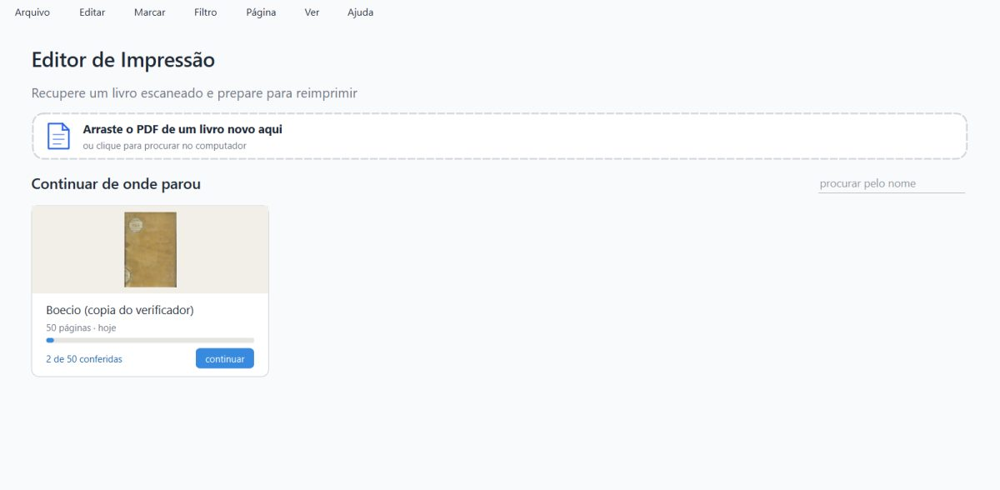
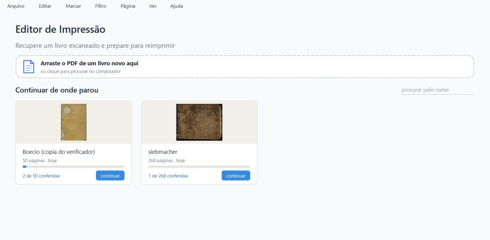
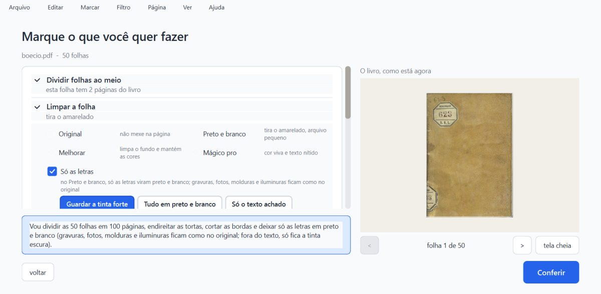
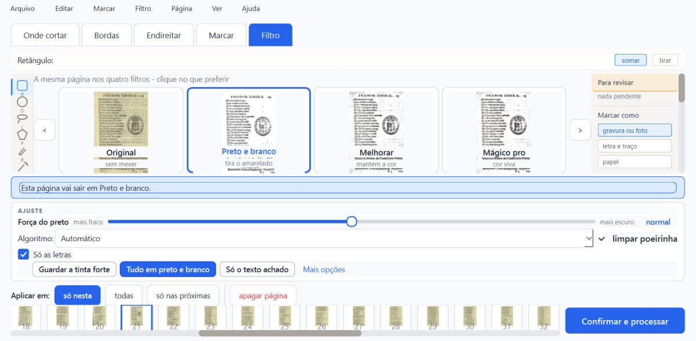
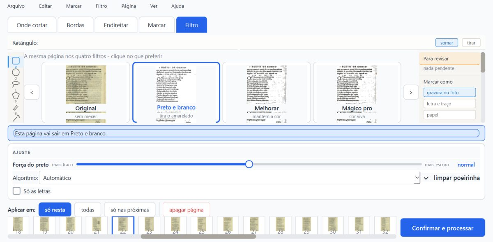
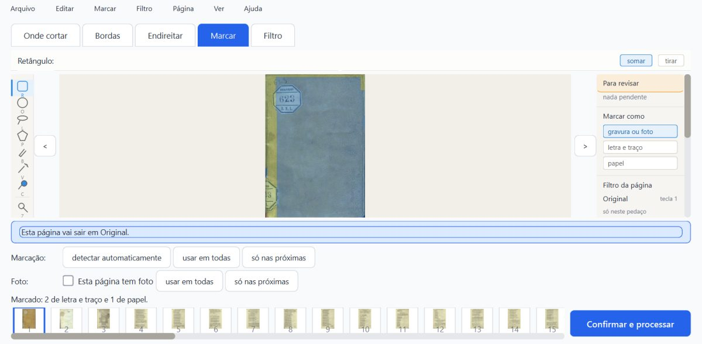
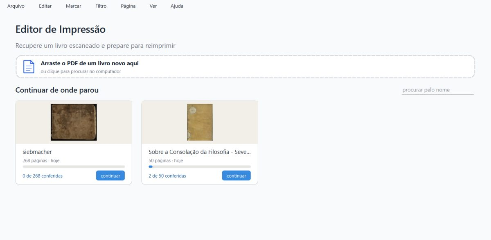
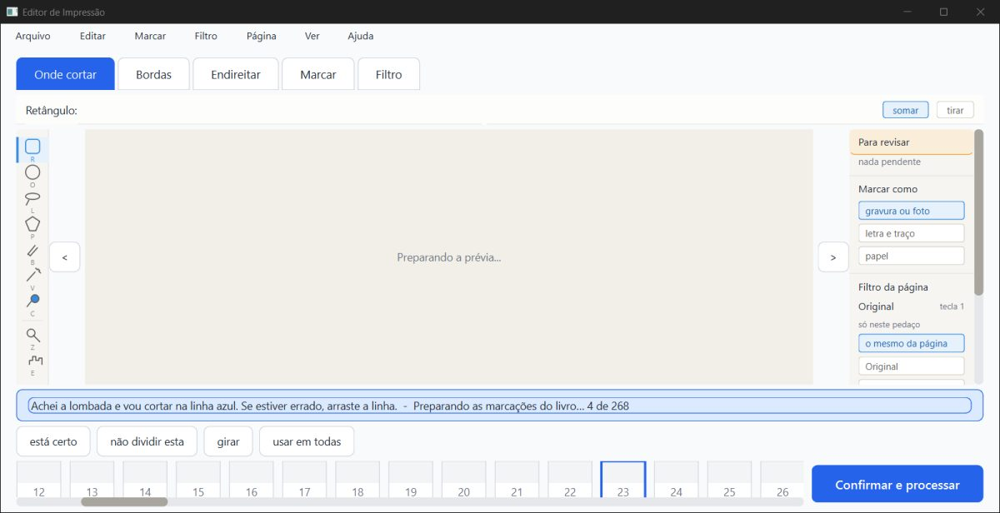

# Parecer do verificador (3): troca de livro, resumo seguro, Misto com gravação por trás, 06/10/2026

**PRONTO PARA CONFERIR, com uma ressalva nova (R-B) que vale consertar antes de levar ao Kaique.**

Os três consertos fizeram o que prometiam:

- **R-A:** trocar de livro logo depois de mudar não perde mais a mudança. Com o Ctrl+O 0,15 s depois, o código novo guardou as 3 mudanças; o código de antes do conserto perdeu as 3, no mesmo teste.
- **O1:** com o `resumo.json` vazio, pela metade ou com lixo, o livro continua na lista, com páginas e andamento, e abre.
- **O2 e as mortes:** em 3 mortes do programa no meio da gravação, o `projeto.json` e o `resumo.json` ficaram sempre inteiros.

O modo Misto e a gravação por trás convivem: as escolhas do Misto vão para o disco, voltam ao reabrir, e o programa antigo abre o mesmo projeto com as zonas no lugar.

**A ressalva (R-B):** "Tirar da lista" o livro que está aberto e depois **fechar o programa** recria a pasta, e o cartão volta para a lista. Com a conversão das zonas rodando, a pasta volta sozinha, sem fechar, quando a conversão termina. O caminho do fechar já acontecia no programa antigo (`aab746f`) e antes do conserto (`5f245d5`); o da conversão é desta frente.

**Não é "aprovado":** só o Samuel marca.

> **Defeito conhecido (decisão do Samuel, 28/09):** a moldura dourada e a iluminura continuam sendo defeito conhecido da Fase 1. Este item não mexe em imagem.

O que foi conferido:

- o ramo `fase2-geometria` (worktree `geometria`) em `7cb4234`, com `1abdcdd` (R-A), `9764983` (O1), `9d733a5` (O2) e o merge `7cb4234` (Misto);
- nenhum código do programa foi mudado;
- os projetos reais em `%LOCALAPPDATA%` não foram abertos. Tudo rodou numa pasta de dados de teste própria (`verificador-3/dados/`), com cópias dos projetos do verificador-2 (Siebmacher de 268 páginas e Boécio de 50, os dois no formato antigo, e o Siebmacher já convertido);
- cópias do programa por `git archive`: **novo** `7cb4234`, **antigo** `aab746f`, **antes do R-A** `5f245d5`;
- a janela de teste é uma instância minha de 1600×821 px (1280×657 pontos), fora da tela, pilotada só com mensagens nativas e fechada com WM_CLOSE (ou morta de propósito com TerminateProcess, no item e).

## 1. Veredito por item

| Item | Como | Resultado |
|---|---|---|
| (a) pytest, um arquivo por vez | máquina | **1529 passaram, 59 pularam, 0 falhas** (81 arquivos, ~8,5 min somados). Os 59 pulados são de OCR (dados fora do git). Os testes novos: `test_trocar_de_livro_grava` 6/6, `test_resumo_seguro` 7/7, `test_gravacao_aguenta_queda_de_energia` 5/5, os 5 do Misto 105/105. Nada precisou ser repetido. |
| (a) `teste_botoes.py` | máquina | **132 ações, 0 falhas.** Numa cópia `git archive` (`trabalho/botoes`), com a `saida_teste` dela. |
| (b) R-A pelo Ctrl+O, caixa Abrir **de verdade** | máquina + olho | **A mudança fica no disco nas 4 vezes** (filtro com Ctrl+O 0,09 / 0,32 / 0,63 s depois; zona com 0,12 s). Ressalva do teste: a caixa do Windows leva 0,5 a 1,9 s para aparecer. Só na 4ª vez o "Abrir" foi apertado antes de 0,6 s (0,56 s), e aí foi o conserto que gravou. Nas outras, o relógio de salvar pode ter gravado enquanto a caixa estava aberta. |
| (b) R-A pelo Ctrl+O, caixa instantânea (o caso mais apertado) | máquina | **Fica no disco nas 3 vezes** (filtro 0,15 s, zona 0,15 s, filtro 0,32 s), logo depois da troca e depois de fechar. **Controle:** o mesmo teste no código de antes do conserto (`5f245d5`) **perdeu as 3**. O teste separa o certo do errado. |
| (b) R-A pelo cartão da tela inicial | máquina + olho | **Fica no disco nas 4 vezes** (Voltar 0,11 / 0,30 / 0,60 s depois do filtro; 0,14 s depois da zona; o "continuar" do Boécio 1,5 a 2,4 s depois). Para chegar ao cartão é preciso passar pelo "Voltar para as opções", que já grava na hora. |
| (b) "começar de novo" logo depois de mudar | máquina + olho | **O trabalho jogado fora não volta.** Mudei o filtro e desenhei uma zona na p139 do Siebmacher, e 3,2 s depois "começar de novo" nele. O `projeto.json` antigo sumiu; a conferência nova veio do zero (p139 em Original, sem a zona desenhada), na memória e no disco depois de fechar. "Começar de novo" de **outro** livro (o Boécio) com o Siebmacher mudado: a mudança do Siebmacher ficou no disco. |
| (b) "Tirar da lista" e trocar de livro | máquina + olho | **Não recria a pasta** quando, depois de tirar, se abre outro livro pelo Ctrl+O (nem depois de fechar). |
| (b) "Tirar da lista" e **fechar** | máquina + olho | **Recria a pasta (R-B).** O cartão "siebmacher, 1 de 268 conferidas" volta na próxima abertura. Também em `5f245d5` e em `aab746f`. |
| (b) "Tirar da lista" com a **conversão rodando** | máquina | **Recria a pasta sozinha (R-B).** Siebmacher antigo: tirei da lista com a conversão no meio; a pasta ficou fora por 69,6 s e voltou quando a conversão terminou, sem fechar nada. O mesmo com o Boécio. |
| (c) O1: `resumo.json` estragado | máquina + olho | **O livro continua na lista** nos 4 casos (vazio, metade, lixo, e metade nos dois livros de uma vez): "50 páginas · hoje", "2 de 50 conferidas"; "268 páginas", "0 de 268". O `resumo.json` foi refeito e ficou legível. O "continuar" abre o livro certo, com as 2 conferidas. O Ctrl+O do mesmo PDF acha o projeto (não cria outro). Volta com o nome do projeto ("Sobre a Consolação da Filosofia…"), e não com o nome dado pelo "Renomear" ("Boecio (copia do verificador)"), como o commit avisa. |
| (d) Misto + gravação por trás | máquina + olho | **As escolhas ficam.** Boécio no formato antigo, com a conversão rodando:  • "Só as letras" no livro;  • p21: "Tudo em preto e branco" só nela;  • p22: "Só as letras" desligada só nela.  Depois folheei 10 páginas (10 gravações por trás vistas) e fechei. No disco: livro `misto_so_as_letras=true`; p21 `misto_fora_do_texto="tudo"`; p22 `misto_so_as_letras=false`; 50 páginas no formato novo, com as mesmas zonas de antes. Ao reabrir, a tela mostra exatamente isso (caixinha e botão marcados). |
| (d) o programa antigo (`aab746f`) abre esse projeto | máquina + olho | **Abre.** 50 páginas, a contagem de zonas e os filtros iguais aos do disco em todas, e as zonas aparecem na aba Marcar. O `erros.log` ficou vazio. Ao fechar, o antigo regrava o arquivo **sem** os campos do Misto e sem as zonas na folha (ver O-b). |
| (e) Siebmacher 268 folheando na conversão | máquina + olho | **Responde.** 637 cliques, mediana 0,13 s, o mais lento 0,23 s; a página andou em todos. **Maior parada da janela durante a conversão: 0,66 s**, uma vez, no instante em que a tela de conferir se monta ("0 de 268"), antes do primeiro clique. A conversão levou 164 s. A cópia de segurança é byte a byte igual ao arquivo de antes (sha256 `781f61b7…`). |
| (e) 3 mortes no meio da gravação | máquina | **`projeto.json` e `resumo.json` sempre inteiros.**  1. Filtro, morto 0,02 s depois de o `.novo` aparecer (0 bytes nele): o projeto ficou o de antes, inteiro.  2. Zona, morto 0,51 s depois da troca do `projeto.json`: inteiros.  3. Durante a conversão, folheando, morto 0,05 s depois de o `.novo` aparecer: inteiro, com 22 de 268 já convertidas e uma cópia de segurança.  Nenhum processo auxiliar ficou órfão, e o livro reabriu (268 páginas, `erros.log` vazio). |
| Velocidade (`teste_velocidade.py`) | — | **Não rodado** (~12 min, só com o PC parado). |

## 2. R-B: "Tirar da lista" o livro aberto, e ele volta

**O que acontece:**

1. O Siebmacher está aberto na conferência. A pessoa volta à tela inicial (Arquivo > Voltar para as opções > voltar).
2. Clique direito no cartão > "remover da lista" > "Tirar da lista". A pasta some e o cartão sai.
3. A pessoa fecha o programa. A pasta volta (`projeto.json` e `resumo.json`), e na próxima abertura o cartão está lá, com "1 de 268 conferidas".

**Pelo código:** o conserto do R-A (`_guardar_o_livro_aberto`) olha se a pasta ainda existe antes de gravar, mas só é chamado ao trocar de livro e no "começar de novo". O fechar (`closeEvent` → `_salvar_agora`) e o relógio de salvar (`_salvar_por_tras`, que a conversão chama ao terminar em `_conversao_terminou`) não olham. Como a janela continua com o livro tirado em `self.resumo`, a gravação faz `mkdir` e escreve tudo de novo.

**Efeito para o Kaique:** "tirei o livro da lista e ele voltou". Nada se perde; é o contrário. Mas o cartão que volta tem a conferência que a pergunta disse que ia se perder, e as cópias de segurança já foram para a pasta de cópias guardadas.

**Sugestão:** soltar o livro aberto (`self.resumo = None`, como o "começar de novo" do próprio livro já faz) quando ele é tirado da lista, ou pôr a mesma conferência da pasta em `_salvar_agora`.

*Depois do "Tirar da lista" do Siebmacher (que estava aberto): só o Boécio na tela inicial.*

*Fechei com WM_CLOSE e abri de novo: o cartão do Siebmacher voltou, com "1 de 268 conferidas".*

## 3. O que vi nas imagens

Abri todos os prints da pasta `prints/` (60 arquivos, 33 imagens diferentes) e os 10 JPG de `imagens/`. Como no parecer anterior, o print pelo Windows da janela fora da tela devolve muitas vezes uma pintura antiga: 11 deles são a mesma imagem da tela inicial. O estado foi conferido lendo a janela; por isso gravei também o desenho que o próprio Qt faz da janela (`*_qt.png`), que é o que vale abaixo.

- **R-A, Ctrl+O** (`ra_ctrlo_*_qt`): a tela "Marque o que você quer fazer" do **boecio.pdf** (o livro novo abriu).
- **R-A, cartão** (`ra_cartao_*_qt`): o Boécio na conferência, com a faixa "Preparando as marcações do livro… 37 a 42 de 50" (a conversão do Boécio rodando por trás).
- **"Começar de novo"** (`ra_recomecar_proprio_qt`): o Siebmacher na conferência nova, com "Achei a lombada e vou cortar na linha azul", miniaturas ainda chegando. Não é o trabalho antigo.
- **O1** (`o1_*_qt`): os dois cartões com páginas e andamento certos. O Boécio aparece com o nome "Sobre a Consolação da Filosofia - Seve…" em vez do nome dado pelo "Renomear".
- **Misto** (`d_*_qt`):  • a tela de opções com "Só as letras" marcada e "Guardar a tinta forte" em azul;  • a p21 com "Tudo em preto e branco" em azul, antes e depois de reabrir;  • a p22 com "Só as letras" desmarcada, antes e depois de reabrir.
- **Programa antigo** (`d_antigo_marcar_qt`): a p1 do Boécio na aba Marcar, com as zonas desenhadas ("Marcado: 2 de letra e traço e 1 de papel").
- **Siebmacher** (`sieb5_*`): a faixa "Preparando as marcações do livro… 2 de 268" e "4 de 268" durante a conversão. Depois dela, as miniaturas e a página 126 (bordado) com "atualizando…".

*Boécio, tela "Marque o que você quer fazer": Preto e branco e "Só as letras" no livro, com os três botões.*

*Depois de fechar e reabrir: a p21 continua em Preto e branco, com "Só as letras" e "Tudo em preto e branco" escolhido só nela.*

*A p22, com "Só as letras" desligada só nela, também voltou assim.*

*O programa ANTIGO (`aab746f`) abrindo o mesmo projeto: as zonas aparecem na aba Marcar.*

*O `resumo.json` do Boécio zerado: o cartão continua lá, com "50 páginas" e "2 de 50 conferidas", agora com o nome do projeto.*

*Siebmacher, folheando durante a conversão: "Preparando as marcações do livro… 4 de 268".*

## 4. A janela durante a conversão (e): comparação

| Rodada | Conversão | Cliques | Clique mais lento | Maior parada durante a conversão |
|---|---|---|---|---|
| sieb5 (esta, `7cb4234`) | 164 s | 637 | 0,228 s | **0,66 s**, no início (tela de conferir se montando) |
| sieb3 (verificador-2, `858f314`) | 187 s | 702 | 0,235 s | 0,57 s, no início |
| sieb4 (verificador-2, `858f314`) | 190 s | 711 | 0,232 s | 0,74 s, no início |

Fora da conversão: o programa fica 10,6 s sem responder ao iniciar (carregando o próprio programa) e 1,6 s ao abrir o livro. As duas coisas são de antes. O `fsync` do O2 não apareceu como parada: depois do início, nenhuma parada de 0,25 s ou mais até o fim da conversão.

## 5. Ressalvas e observações

### R-B: "Tirar da lista" o livro aberto, e ele volta (média)

Ver a seção 2. Pelo fechar, já existia (`aab746f`, `5f245d5`). Pelo fim da conversão, é desta frente.

### O-a: o filtro do livro mudado na tela de opções volta ao salvo (baixa, já registrado em 29/09)

Marquei "Preto e branco" e "Só as letras" no livro e cliquei Conferir. O Misto do livro ficou ligado, mas o filtro do livro voltou a "original": o projeto salvo volta por cima, e só o Misto (e as gravuras e a moldura) é copiado da tela. É o bug anotado no código ("As caixinhas continuam perdendo o que se muda na volta…", 29/09).

Com o Misto, isso dá uma situação estranha: o livro fica com "Só as letras" ligada e o filtro em Original. Na tela de opções, a caixinha só aparece no Preto e branco, então ela some, mas continua valendo nas páginas em Preto e branco.

### O-b: o programa antigo apaga as escolhas do Misto ao gravar (esperado, vale saber)

O `aab746f` abre o projeto e mostra as zonas, mas ao fechar regrava o `projeto.json` sem os campos do Misto e sem as zonas na folha. Se o Kaique abrir um livro no programa antigo, as escolhas do Misto daquele livro se perdem, e na próxima vez o programa novo converte as zonas de novo (com outra cópia de segurança).

### O-c: o `resumo.json` refeito perde o nome do "Renomear" e muda a ordem dos cartões (baixa, documentado no commit)

As datas viram a do `projeto.json`, então o cartão pode mudar de lugar. A página em que parou volta para a 1ª.

### O-d: os testes que não pegaram a janela exata

- **A morte durante a escrita do `resumo.json` não foi pega:** a morte 2 veio 0,51 s depois da troca do `projeto.json`, e o `resumo.json.novo` não foi visto nesse intervalo. O resumo estragado foi testado à parte (item c).
- **A queda de energia de verdade não dá para testar aqui.** O `fsync` está coberto só pelos 5 testes de máquina.

### Outras observações

- **"Começar de novo" num livro com camadas faz a pergunta "Fundo separado" de novo.** É a decisão de 29/09. O piloto ficou parado nela na primeira tentativa, porque não a respondia; a pergunta é modal e segura o fechar até ser respondida. Refiz respondendo "Não".
- **Não testado:** a roda do mouse (não funciona sem foco); trocar de livro por "Livros recentes" e por arrastar (passam pelo mesmo `abrir_livro`); a escala real do notebook do Kaique; o `teste_velocidade.py`.

## 6. Para a Lista de bugs (proposta)

- **06/10, R-B:** "Tirar da lista" o livro aberto e depois fechar o programa recria a pasta e o cartão volta. Com a conversão das zonas rodando, volta sozinho quando ela termina. Já acontecia em `aab746f` pelo fechar. Registro: `trabalho/ra_tirar_fechar.log`, `trabalho/ra_tirar_conversao_sieb.log`, `trabalho/ra_tirar_conversao.log`; prints `imagens/ra_tirar_fechar_*.jpg`.

## 7. Arquivos

- **Scripts** (fora do git): `scripts/ra.py` (b), `scripts/o1.py` (c), `scripts/misto.py` (d), `scripts/folhear_v3.py` e `scripts/mortes.py` (e), `scripts/pytest_por_partes_v4.sh`, `scripts/v3.py`. O piloto do verificador-2 foi copiado com duas mudanças:
  - o canal `canal3`;
  - a opção `VERIF_CAIXA_REAL=1`, para usar a caixa Abrir do Windows.
- **Registros** (fora do git): `trabalho/pytest_partes_v4.log`, `trabalho/teste_botoes_v4.log`, `trabalho/ra_*.log`, `trabalho/o1.log`, `trabalho/misto.log`, `trabalho/folhear_sieb5.log`, `trabalho/mortes.log`.
- **No git:** este parecer (`.md` e `.html`) e as imagens pequenas em `imagens/`. O `.pdf` fica na pasta.
