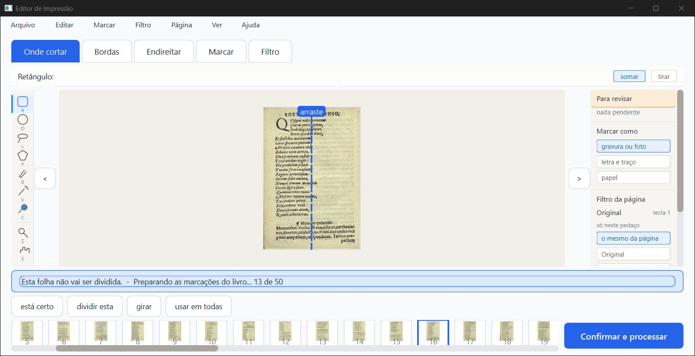
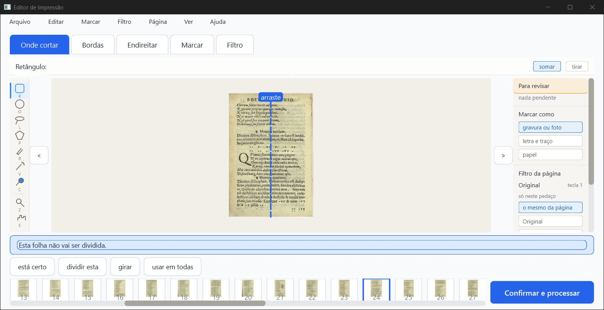
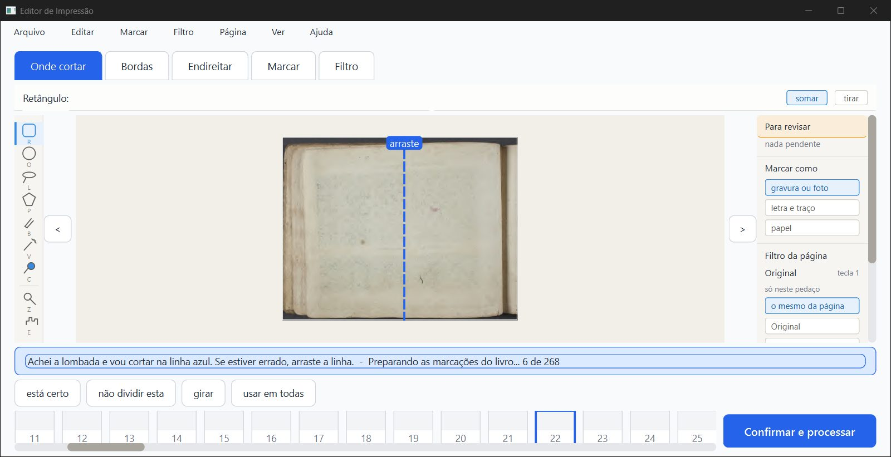
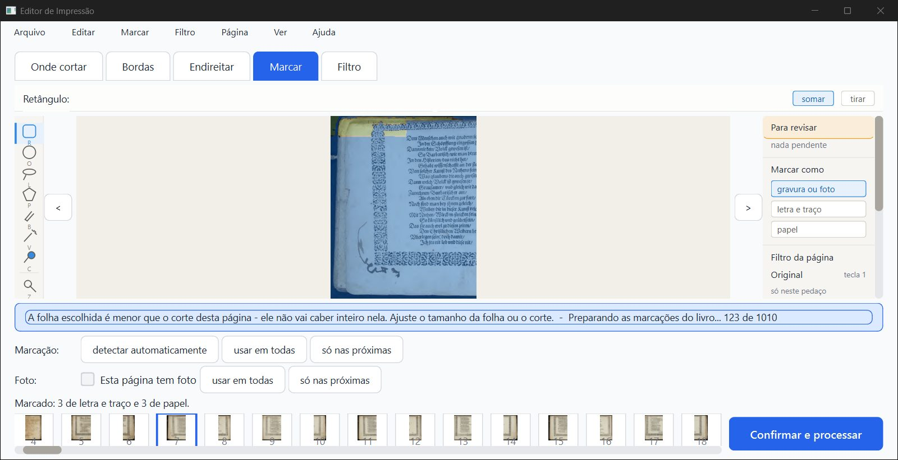
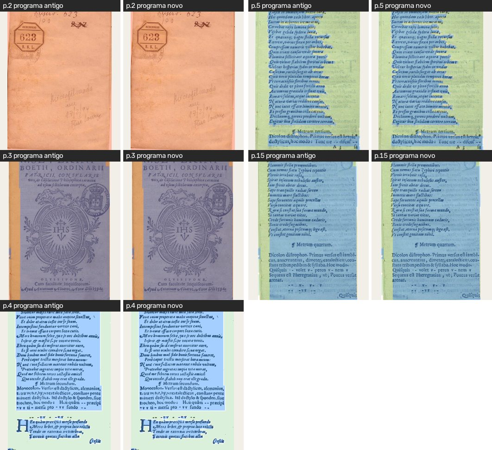
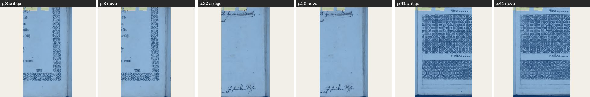
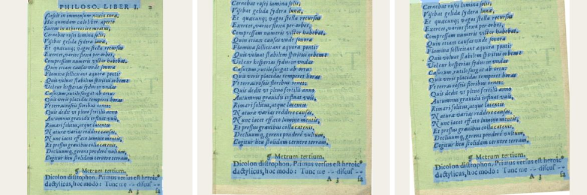
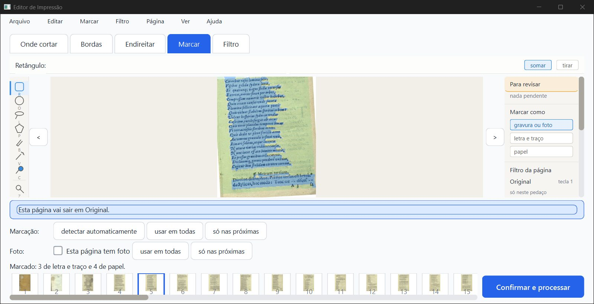

# Parecer do verificador: zonas presas à folha (D2) e conversão ao abrir (Z1 b), 05/10/2026

**PRONTO PARA CONFERIR.** As zonas de um projeto antigo aparecem no mesmo lugar, a conversão roda por trás com o andamento na faixa e some no fim, o PDF sai idêntico e o programa antigo continua vendo as zonas. **Não é "aprovado":** só o Samuel marca. Há três ressalvas: uma travada de 6 s na janela durante a conversão de um livro grande, a cópia de segurança que não é idêntica bit a bit, e uma cópia de segurança a mais quando se alterna com o programa antigo.

O que foi conferido: o ramo `fase2-geometria` (worktree `geometria`), `bdeb31c`, com o D2 (`7cb56c1`) e o Z1 (b) (`47b30f9`, `b0c4f0b`, `bdeb31c`), por cima do `fase-1` juntado em `87430dd`. Nenhum código foi mudado. Os projetos reais em `%LOCALAPPDATA%` não foram abertos. Tudo rodou numa pasta de dados de teste própria (`verificador/dados/`), com cópias feitas por `git archive`:

- **novo:** `bdeb31c`
- **antigo:** `aab746f`, o que a tarefa pediu
- **fase1:** `7e1ee21`, o fase-1 sem D2, que entra no `87430dd`

Para a janela, uma instância minha de 1600×821 px (1280×657 pontos), fora da tela, pilotada só com mensagens nativas e fechada com WM_CLOSE.

> **Defeito conhecido (decisão do Samuel, 28/09):** a moldura dourada e a iluminura continuam sendo defeito conhecido da Fase 1. Este item não mexe em imagem.

## 1. Veredito por item

| Item | Como | Resultado |
|---|---|---|
| pytest (por partes, um arquivo por vez) | máquina | **1396 passaram, 59 pularam, 0 falhas** (~22 min somados). Os 59 que pularam são de OCR e precisam de dados fora do git (`saida_teste/ocr-*`, motor do Kraken); não têm a ver com este item. Os testes novos `test_zonas_na_folha.py` + `test_converter_zonas_ao_abrir.py` deram 37 de 37. |
| `teste_botoes.py` (numa cópia `git archive`, com `saida_teste` própria) | máquina | **132 ações, 0 falhas** |
| Faixa "Preparando as marcações do livro... N de M" e ela sumir no fim | olho + máquina | **Funciona.** No Boécio (50 páginas) aparece "0 de 50 … 45 de 50" e some em ~9 s. No Siebmacher (268 páginas, folhas divididas) aparece "0 de 268 … 266 de 268" e some em ~112 s. |
| A janela responde durante a conversão (clique, troca de página) | máquina + olho | **Responde, com uma ressalva.** Cliquei ">" a cada leitura e a página andou sempre (Boécio: páginas 15 a 23; Siebmacher: folhas 21 a 134). Resposta típica de 0,1 a 0,5 s. **Mas** no Siebmacher a janela ficou **6 s ou mais sem responder uma vez**, e isso se repetiu nas duas rodadas (ver ressalva R1). |
| As zonas no mesmo lugar (antigo × novo) | olho + máquina | **Sim.** As zonas lidas pelo código novo são **idênticas (diferença 0,0)** às do projeto antigo, nas 50 páginas do Boécio e nas 268 do Siebmacher. Nos prints, as bordas das zonas coincidem. A única diferença nos prints é o desenho das letras, que vem dos consertos da fase-1 (a p.4 é Mágico pro), e não das zonas. |
| Cópia de segurança `projeto.antigo-zonas-na-folha-*.json` feita uma vez | máquina | **Uma vez por conversão.** O Boécio ganhou 1 cópia e, depois de fechar no meio e reabrir, **não** ganhou outra. Ganha mais uma se o programa antigo regravar o projeto entre uma abertura e outra (ver ressalva R3). |
| A cópia é idêntica ao antigo | máquina | **Idêntica no conteúdo, não bit a bit** (ressalva R2). As zonas, os cortes e os filtros são iguais. A única diferença é a linha `"geometria_das_zonas": null` acrescentada em cada página. |
| PDF gerado idêntico ao do código antigo | máquina | **Idêntico.** Boécio: as imagens das 50 páginas são iguais byte a byte entre o antigo (`aab746f`), o fase1 (`7e1ee21`), o novo a partir do projeto antigo e o novo a partir do projeto convertido. Siebmacher: 268 de 268 iguais (fase1 × novo convertido). O md5 do arquivo inteiro muda por causa da data gravada no PDF. |
| Fechar no meio da conversão e reabrir: continua e termina | máquina | **Sim.** Mandei WM_CLOSE com a faixa em "18 de 50" e o programa fechou em ~2 s. No disco ficaram 30 páginas convertidas e 20 por converter. Ao reabrir apareceu "0 de **20**", depois "10 de 20", e terminou com 50 de 50. Nenhuma cópia de segurança nova. |
| Mudar corte e ângulo de uma página com zona | olho | **A zona continua sobre o mesmo pedaço da folha.** No Boécio p.5, puxei a borda de cima para baixo (aba Bordas) e depois girei +3,2° (aba Endireitar). As zonas azuis continuam nas mesmas linhas de verso, inclinadas junto com o texto (imagem abaixo). |
| Desfazer / refazer | máquina + olho | **Funciona.** Com 4× Ctrl+Z a página volta ao corte e ângulo automáticos, e as zonas voltam ao lugar de antes (diferença de 8 milionésimos da página, ~0,02 ponto a 300 DPI). Com 4× Ctrl+Y tudo volta exato. |
| Abrir o projeto convertido no programa antigo (`aab746f`, Z2) | olho + máquina | **As zonas aparecem**, inclusive na p.5 com corte e +3,2° feitos no programa novo: as zonas estão nas linhas certas. Quando o antigo grava, volta ao formato antigo com as mesmas zonas (diferença 0,0). |
| Faixa azul em 1280×657 | olho | **Cabe em uma linha.** O texto mais longo de verdade, "Achei a lombada e vou cortar na linha azul. Se estiver errado, arraste a linha.  -  Preparando as marcações do livro... 6 de 268", ocupa ~2/3 da faixa e não empurra nada. Também testei o maior aviso que existe (122 letras) mais o andamento "123 de 1010", colocado por mim na faixa só para ver o tamanho: coube em uma linha e chegou a ~90% da largura. |

## 2. O que vi nas imagens

*Boécio, a faixa durante a conversão: "Esta folha não vai ser dividida.  -  Preparando as marcações do livro... 13 de 50".*

*Depois da conversão: a faixa volta ao texto normal.*

*Siebmacher em 1280×657: o texto mais longo de verdade, em uma linha só.*

*O maior aviso que existe mais o andamento, colocado por mim na faixa: ainda em uma linha.*

*Boécio, aba Marcar, programa antigo × programa novo (p.2, 3, 4, 5, 15): as zonas no mesmo lugar em todas.*

*Siebmacher (folhas divididas), p.8, 20 e 41: as zonas no mesmo lugar. Diferença de pixels na p.8: 0. Na p.20 e na p.41 só há diferenças fracas (até 20 níveis) dentro da textura, nenhuma na borda das zonas.*

*Boécio p.5, da esquerda para a direita: antes, com o corte mudado, e com corte mais 3,2°. As zonas azuis continuam nas mesmas linhas de verso. A faixa de baixo que entrou com o corte novo fica fora da zona, como deve, porque não fazia parte dela.*

*O programa ANTIGO abrindo o projeto convertido, p.5 com corte e ângulo feitos no novo: as zonas estão nas linhas certas.*

Abri um por um os 60 prints da pasta `prints/`, alguns em folhas-resumo de 6. Sete prints saíram com a tela inicial em vez da conferência, todos tirados logo depois de trocar de tela (`boecio1_faixa_1`, `fechar_no_meio_faixa_1`, `reabrir_continua_faixa_1`, `sieb1/2_faixa_1`, `antigo_01_aberto`, `sieb_sem_conversao_miniaturas`). É um atraso de pintura da janela fora da tela, não defeito do programa. Nesses casos o andamento foi conferido pelo texto da faixa, lido direto da janela (`trabalho/vigia_*.log`).

## 3. Ressalvas

- **R1 — travada de 6 s ou mais durante a conversão de um livro grande (média, não explicada).** No Siebmacher (268 páginas), nas **duas** rodadas, a janela ficou 6 s ou mais sem responder uma vez:
  - rodada 1: entre "94 de 268" e "114 de 268";
  - rodada 2: entre "78" e "100".

  A conversão continuou no ritmo normal durante a travada (20 a 22 páginas em ~6,5 s), então quem parou foi a janela, não a conversão.

  O que **não** explica a travada:
  - folheando as mesmas folhas com o livro já convertido (sem conversão), a resposta nunca passou de 0,6 s;
  - rodando a conversão sem janela, nenhuma página passou de 1,2 s e o fio vigia nunca ficou preso mais de 0,01 s (sem GIL preso);
  - a primeira gravação com a cópia de segurança leva 0,29 s e foi feita antes (aos ~55 s);
  - a gravação na janela leva 0,27 s.

  A causa não foi achada. O PC estava com pouca memória (0,8 a 1,7 GB livres, com outros 2 agentes rodando). Pode ser só isso, mas se repetiu no mesmo ponto. No Boécio (50 páginas) não houve travada. **Sugestão:** o implementador medir onde a janela para nessa hora, de preferência com o PC livre.

- **R2 — a cópia de segurança não é bit a bit o arquivo antigo (baixa).** Antes de converter, o programa novo já grava uma vez no formato antigo (em `_analise_pronta`), e essa gravação acrescenta `"geometria_das_zonas": null` em cada página. É esse arquivo regravado que vira a cópia. O conteúdo é o mesmo e o programa antigo abre a cópia sem problema, porque ignora o campo. Mas os bytes do arquivo original do Kaique não ficam guardados. Se o pedido "com cópia de segurança dos projetos" for entendido como guardar o arquivo exatamente como era, a cópia teria de ser feita antes dessa primeira gravação.

- **R3 — uma cópia de segurança a mais a cada volta pelo programa antigo (baixa, esperado).** Se o programa antigo abre e grava o projeto, ele volta ao formato antigo. Na próxima abertura no programa novo, a conversão roda de novo e faz **outra** cópia (o Boécio ficou com 2: `...-1904.json` e `...-1916.json`). Nada se perde. É só um arquivo a mais por volta enquanto os dois computadores tiverem versões diferentes, que é o caso Z2.

- **R4 — cache de "já está no formato novo" vale pela sessão (baixa, só caso de laboratório).** Troquei o `projeto.json` por um antigo com o programa aberto. Na gravação seguinte o programa gravou por cima **sem** cópia, porque `_JA_NO_FORMATO_NOVO` lembrava a pasta. Na vida real, isso só aconteceria se alguém trocasse o arquivo com o programa aberto.

- **R5 — texto da faixa com "..." (três pontos) em vez de "…"** (o pedido escrevia "…"). É só a forma, e não há letra sem acento.

- **Não testado:** a roda do mouse (não funciona sem foco); a escala real do notebook do Kaique (continua desconhecida).
- **Não conferido de propósito:** a conversão de projeto com página dividida e girada em 90° na janela (os testes de máquina cobrem esse caso). O Siebmacher cobriu as folhas divididas.
- **Observação não confirmada:** no Siebmacher, as miniaturas da tira ficaram em branco nos primeiros segundos da conversão e apareceram depois. Não consegui um print limpo sem a conversão para comparar (atraso de pintura da janela fora da tela).
- **Velocidade:** não rodei `teste_velocidade.py` (PC ocupado). Abrir e gravar mais lento já foi aceito pelo Samuel (V). Para referência:
  - converter 50 páginas na janela: ~9 s;
  - converter 268 páginas: ~112 s na janela e ~75 s sem janela;
  - gravar o Siebmacher convertido (6 MB): 0,27 s.

## 4. Para a Lista de bugs (proposta)

- **05/10, R1:** a janela fica ≥6 s sem responder uma vez durante a conversão das zonas de um livro de 268 páginas (Siebmacher), reproduzido 2×. A causa não foi achada. Registros em `trabalho/vigia_sieb1.log` e `trabalho/vigia_sieb2.log` (fora do git).
- **05/10, R2:** a cópia `projeto.antigo-zonas-na-folha-*.json` é feita depois de uma gravação do programa novo, e não do arquivo original (o conteúdo é igual).

## 5. Arquivos

- Scripts do piloto e das contas: `scripts/` (fora do git, ficam na pasta).
- Projetos, PDFs, prints grandes e registros: `trabalho/`, `dados/`, `prints/` (fora do git).
- No git: este parecer (`.md`, `.html`) e as imagens pequenas em `imagens/`. O `.pdf` fica na pasta, fora do git (regra do `.gitignore`).
