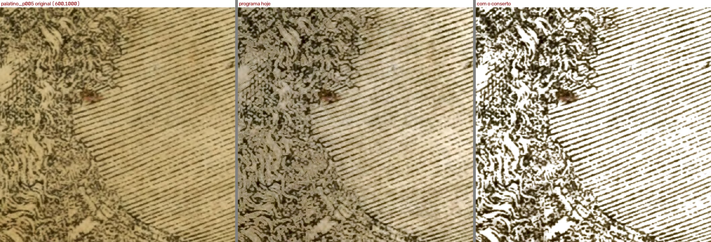
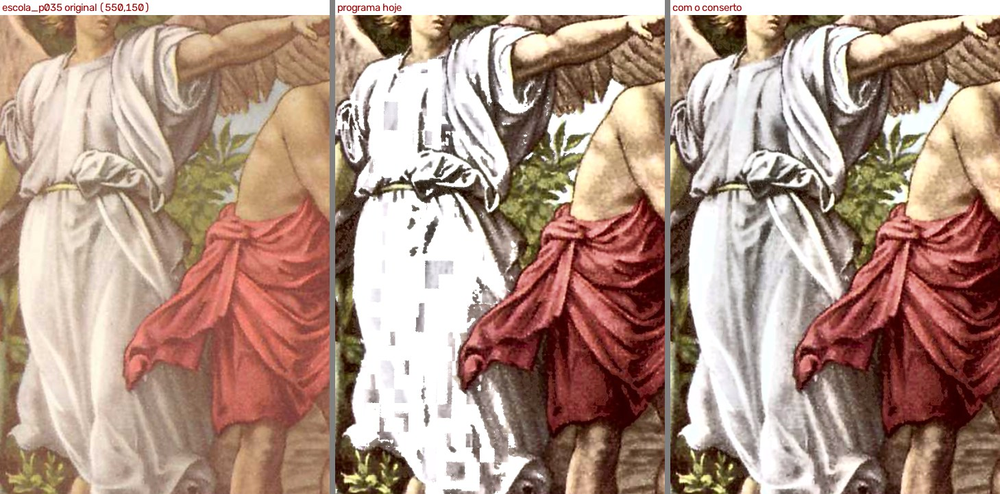
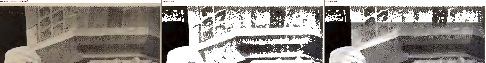

# Conserto dos quadradinhos na roupa do anjo (28/09/2026)

Feito pelo agente implementador. **Nada foi commitado.** É teste de **olho**: quem decide é o Samuel. Bug da Lista de bugs do plano (28/09), com a regra do resultado da Fase 1 do mesmo dia.

## Em uma frase

Dentro da gravura, o filtro agora só leva a branco o **papel das gravuras de traço** (xilogravura, tabela, página de texto marcada como gravura) e deixa a **pintura e a foto** como estão. A roupa do anjo, o céu e a foto da estátua voltam; o fundo do retrato do Palatino 5 fica branco; não há mais quadradinhos. Vale para os três filtros atingidos (Mágico pro, Melhorar e a gravura do Preto e branco).

## A causa (da investigação de 28/09)

A limpeza do papel feita para página de texto ("o que não é letra e tem cor de papel vira branco") rodava também no recorte de cada gravura. O pano quase branco do anjo passava por papel, e como a cor do JPEG vem em quadrados de 16×16 pontos, uns quadrados passavam e outros não. A mesma limpeza lavava a foto do Opus Majus 20.

## O que mudou

- `core/filtros.py`: dentro da gravura, a limpeza final do papel passa a perguntar outra coisa (função nova `_so_o_papel_da_gravura` e as auxiliares dela). Fora da gravura, nada mudou. Todas as funções novas têm comentário do que fazem e do que é arriscado mexer.
- `tests/test_papel_dentro_da_gravura.py`: 12 testes novos (3 casos × 3 filtros + 1 caso × 3 filtros).
- `relatorios/melhorias.md`: tentativa 20, com o que deu certo e o que não deu.
- `relatorios/conferir/_antes-conserto-anjo-2026-09-28/`: o "antes" do Melhorar e do Preto e branco, para a coluna "Rodada anterior" (ver o LEIA-ME de lá).

## Como separa papel de pintura, e com que prova

**Pela cor não dá.** Medido: o pano do anjo (luz 222 a 233, pouca cor) é *mais* parecido com o papel da página (250) do que o papel de dentro do retrato do Palatino 5 é parecido com a margem dele (183 contra 213, e bem mais amarelado). A estátua do Opus 20 tem a cor exata do papel, só 14 tons mais escura.

**Pela estrutura dá.** Xilogravura, tabela e texto são traço fino e escuro sobre papel liso; pintura e foto são tom contínuo. O traço fino é achado pelo "top-hat preto" (fechamento menos a imagem), operação consagrada de morfologia para separar letra e traço de um fundo irregular.

| Gravura | densidade de traço | fração da gravura com traço |
|---|---|---|
| Pintura do anjo (Escola 35) e Escola 7 | 0,000 | 0% |
| Foto do Opus 20 | 0,001 (pico só no livro da mão) | 0,9% |
| Retrato do Palatino 5 | 0,09 a 0,13 | 79% |
| Tabela do Opus 256 | 0,06 | 76% |
| Rhetorica 73 (texto marcado como gravura) | 0,10 | 88% |
| Tabelas das Horas 13 e 14 | | 24% a 52% |

Com isso, dentro da gravura, quatro perguntas (uma por pista pedida):

1. **Textura:** a gravura é de traço? Com menos de 5% de traço (pintura, foto), nada vai a branco por aqui.
2. **Nível do papel:** o ponto está no nível do fundo em volta dele? O traço, até o fraco da hachura, fica abaixo e não é tocado.
3. **Cor igual à do papel:** do papel *da própria gravura*, medido entre os traços, com a cor alisada e em rampa (é o que impede a grade do JPEG). A moldura dourada das Horas 13 fica a 25 de distância; o papel dela, até 7.
4. **Tamanho e ligação:** o ponto está ligado ao papel entre os traços? Assim o rosto liso do retrato vai junto.

Tudo decidido ponto a ponto, em rampa, nunca por bloco.

**Tentado e descartado** (detalhe em `relatorios/melhorias.md`, tentativa 20):

- não limpar dentro da gravura (o conserto simulado da investigação): o papel do retrato fica creme e o da tabela cinza (`provas/p17`, `provas/p18`);
- usar a pergunta da página de texto ("longe da letra") com a cor relativa: **partia a hachura fraca do retrato**;
- vetar pelo "sombreado" a manchinha do livro na mão da estátua: não funcionou (`provas/p16`); ficou a fração mínima de traço.

## Página por página (abri todas as imagens)

As 32 páginas do gabarito, Mágico pro, pelo caminho do programa: **24 saem idênticas ponto a ponto** à rodada de referência; **8 mudam**.

- **Palatino 5 — melhor.** O fundo do retrato fica branco com a hachura inteira; o rosto, que é papel, também; a margem e o texto, brancos. A barba fica mais contrastada que no original (o papel entre os fios vai a branco). A manchinha vermelha perto do olho continua (é cor, não papel; é do R4). `provas/p01`, `provas/p02`.

- **Escola 35 — melhor.** A roupa do anjo volta inteira, com as dobras, sem quadradinhos; o céu também. A roupa sai num branco mais neutro, levemente frio, que o creme quente do original: é o balanço de branco do Melhorar dentro da gravura, que já existia (igual no conserto simulado da investigação). `provas/p03`.

- **Escola 7 — melhor.** O céu e as nuvens perdem as manchas brancas quadradas. `provas/p04`.
- **Opus Majus 20 — bem melhor, com uma ressalva.** A foto volta com os cinzas e o sombreado da estátua, em vez de lavada. Duas coisas: a estátua sai mais clara que no original (a parte mais clara dela vai a branco, porque o Melhorar da gravura se ancora no tom mais claro da própria foto — já era assim, não é deste conserto); e **aparece um degrau no alto da foto**: a caixa da gravura do detector começa 67 pontos abaixo do topo da foto, e essa faixa continua lavada pela limpeza da página. Antes não se via porque a foto inteira estava lavada. `provas/p05`, `p06`, `p07`.

- **Opus Majus 256 — melhor.** O papel da tabela fica branco, e os números da última coluna que o programa de hoje come (o "16", o "36") ficam inteiros. `provas/p08`.
- **Rhetorica 73 — melhor (não estava entre as 5).** Página de texto que o detector marcou inteira como gravura: hoje sai amarelada; agora papel branco, letras e ornamentos inteiros, sem contorno creme em volta das letras. `provas/p09`, `p10`.
- **Horas 13 e 14 — igual a olho.** Muda só a beirinha vermelha da moldura (0,06% dos pontos, na maioria um pouco *menos* branqueada). O dourado fica como estava. `provas/p11`, `p12`.

**O que o Samuel pediu para vigiar:** papel que deixou de ficar branco — nenhum; mancha do Palatino 66 (R4) — a página saiu idêntica; cor saturada — nenhuma (o caminho da gravura não mexe na saturação); pontos brancos no azul — sumiram os do céu da Escola; Horas 13, 14, 26, 27 e 11 iguais ou idênticas.

**Melhorar e Preto e branco**, nas 5 páginas: as mesmas melhoras, nas mesmas proporções (a gravura passa pelo mesmo caminho nos três). `provas/p13`, `p14`. **Prévia da tela** (110 DPI): as mesmas decisões do PDF (300 DPI). `provas/p15`.

## Conferências (`conferencia.py`)

| O quê | Pasta |
|---|---|
| Completa, 32 páginas, Mágico pro, contra a referência 16:44 | `relatorios/conferir/fase1-2026-09-28-1844` |
| As 5 em destaque, Mágico pro, contra a referência 16:44 | `relatorios/conferir/fase1-2026-09-28-1853` |
| As 5, Melhorar, contra o filtro de antes | `relatorios/conferir/fase1-2026-09-28-1854` |
| As 5, Preto e branco, contra o filtro de antes | `relatorios/conferir/fase1-2026-09-28-1855` |

Sem a opinião do verificador (não é papel do implementador). Em todas, o resultado do programa é idêntico, ponto a ponto, ao que medi fora dele.

## Testes

- Os 12 novos **reprovam o código antigo** (os 12) e passam no novo. Números: pano 99% → 0,2% de branco chapado; salto na grade de 16 pontos 22,7 → 8,0 tons (o original tem 6,6); papel do retrato 0% → 100% branco, rosto incluído, hachura intacta.
- Bateria completa: **765 passaram, nenhum falhou** (os 699 de hoje de manhã, os 12 meus e os de outros agentes).

## Tempo só do filtro (Mágico pro, 300 DPI)

Medido com antes e depois intercalados no mesmo processo (o PC tinha outros agentes rodando, e a mesma página variava até 0,7 s entre voltas):

| Página | antes | depois |
|---|---|---|
| Palatino 5 | 1,96 s | 1,96 s |
| Escola 35 (12 voltas) | 4,35 s | 4,33 s |
| Escola 7 | 4,77 s | 4,71 s |
| Opus 20 | 2,38 s | 2,27 s |
| Opus 256 | 3,50 s | 3,48 s |
| Rhetorica 73 | 2,79 s | 2,81 s |
| Horas 13 | 19,50 s | 19,62 s (mínimo 19,39 contra 19,49) |

Diferença dentro do ruído. A primeira versão deixava a Horas 13 um segundo mais lenta; foi refeita em 8 bits e com os mapas lisos numa cópia reduzida. O teste de velocidade não foi rodado (combinado).

## Ressalvas

- **Opus 20, faixa do alto:** o degrau descrito acima. É do detector (caixa curta), não do filtro, mas agora aparece.
- **A estátua do Opus 20** sai mais clara que no original (ver acima). Se o Samuel achar que "intacta" pede o cinza claro de lá, é outra mudança: a âncora do Melhorar dentro de foto.
- **Mancha do verso dentro de gravura de traço:** o critério novo tira só o que está no nível do papel; uma mancha do verso mais escura que isso fica mais fraca, mas pode não sumir. Nas páginas do gabarito não vi nenhuma.
- **Gravura de traço com foto clara colada no papel:** uma área cinza-clara da cor do papel, ligada ao papel de uma gravura de traço, iria a branco. Não há caso no gabarito.
- **A decisão por gravura** (menos de 5% de traço = pintura) é por gravura inteira: uma gravura grande de pintura com um pedaço pequeno de traço fica toda como pintura (o lado seguro).
- A barba e o retrato do Palatino 5 ficam **mais contrastados** que no original, porque o papel entre os fios vai a branco. É o que a regra pede; vale o Samuel olhar.
- Só 8 páginas do gabarito passam por este caminho. O acervo inteiro não foi rodado.

## Bugs para a Lista de bugs

| Data | Bug | Onde | Print |
|---|---|---|---|
| 28/09 | Opus Majus 20: a caixa da gravura começa 67 pontos abaixo do topo da foto; a faixa de cima fica fora da gravura, é lavada pela limpeza da página e agora aparece como um degrau. | detector (`core/detectar_regioes.py`) | `relatorios/conserto-anjo-2026-09-28/provas/p07-opus20-faixa-do-alto-fora-da-gravura.jpg` |
| 28/09 | Na foto do Opus 20, o Melhorar da gravura desenha contornos claros finos nas áreas lisas (parede, fundo). Já existia (igual no conserto simulado da investigação), escondido pela foto lavada. | `core/filtros.py` (Melhorar no recorte) | `provas/p07` (lado direito) |

## Ideias para a Lista de espera

- Dentro de foto, ancorar o Melhorar no papel da página (e não no tom mais claro da foto), para a estátua do Opus 20 manter o cinza claro do original.
- Guardar na seleção se a caixa do detector é "traço" ou "meio-tom" (ele já decide isso, em `_e_meio_tom`), para o filtro não ter de medir de novo.
