# Item 1.2: conferência do verificador (seletor de gravura do ScanTailor)

28/09/2026 · verificador · commit `776c6c4` no ramo `fase-1` · relatório do implementador: `../gravura-scantailor.html`

> **AVISO (decisão do Samuel, 28/09): moldura dourada e iluminura são DEFEITO CONHECIDO até a Fase 1 ficar pronta.** Elas vão ser resolvidas nos itens 1.2, 1.4 e 1.5. Nada nesta conferência muda isso: o item 1.2 sozinho não entrega o resultado final (papel branco, letra com a cor original, gravura intacta).

## 1. Veredito

**PRONTO PARA CONFERIR, como núcleo.** O detector é o código original do ScanTailor e dá a mesma máscara que o ScanTailor deu em 24/09. Mas:

- ele **ainda não está ligado ao programa**: abrindo o programa pelo atalho "(desenvolvimento)" não há nada novo para ver. A conferência deste item é pelas imagens abaixo;
- sozinho, ele **não cumpre as regras da Fase 1 em 3 das 7 páginas obrigatórias** (Horas 11, Horas 26 e Opus Majus 20).

Nunca "aprovado": só o Samuel marca.

## 2. O que foi conferido, e como

| O que | Como | Resultado |
|---|---|---|
| Testes do programa (`pytest tests -q`) | máquina | **790 passaram**, nenhum falhou |
| Testes do item (`tests/test_gravura_scantailor.py`) | máquina | **12 de 12 passaram** |
| O código de terceiros é o original? | máquina | **Sim.** Detalhe na seção 3 |
| A "ligação" esconde mudança de lógica? | leitura do código, comparada com o original | **Não achei nenhuma.** As 5 diferenças estão todas escritas no `LEIA-ME` (seção 3) |
| A DLL do projeto é mesmo compilada desse código? | máquina (recompilei numa pasta temporária) | **Sim.** Só 4 bytes diferentes (duas datas), máscaras idênticas em 14 páginas |
| A DLL usa o Qt do PySide6? | máquina | **Sim.** Com a janela aberta, só um Qt fica na memória, o do PySide6 |
| Régua contra as máscaras de 24/09 | máquina + olho | **Confere.** Refiz tudo com a DLL do commit: números idênticos aos do implementador. Abri as 8 imagens |
| Páginas obrigatórias da Fase 1 | olho (o Samuel decide) | Abri as 7 imagens, as 7 de opções e 6 ampliações. Seção 5 |
| DLL ausente ou quebrada | máquina | **Não derruba nada** (seção 6). Mas achei um jeito de derrubar o programa com um DPI absurdo (bug novo 1) |
| Teste de velocidade (`teste_velocidade.py`) | não rodei | O commit só **acrescenta** arquivos (110 novos, nenhum alterado), e nada do programa chama o detector. A velocidade do programa não mudou. O tempo do detector sozinho está na seção 7 |

## 3. O código de terceiros confere

- **É a versão v1.2.1 de verdade.** O commit citado no `LEIA-ME` (`5eaac1884cdc...`) é o da etiqueta v1.2.1 no GitHub (conferido pela API do GitHub).
- **Os 72 arquivos, a cópia de referência `OutputGenerator.cpp` e a `LICENSE` são idênticos ao original, byte a byte, no que está guardado no git** (74 de 74, pela soma do git).
- **Cuidado ao repetir a conferência:** na pasta do PC os arquivos estão com fim de linha do Windows (o git converte ao tirar os arquivos: `core.autocrlf=true`). Um `cmp` direto na pasta dá "diferente" nos 72. Tirando só o fim de linha, são iguais. Nenhuma letra mudou.
- **Os 7 blocos copiados em `ligacao/st_gravura.cpp` são iguais ao original.** O teste confere contra a cópia de referência, e eu conferi que a referência é igual à do GitHub.
- **A parte que não é cópia faz o mesmo que o ScanTailor.** Comparei com o original, linhas 1253 a 1400 e 2540 a 2569: a mesma ordem das etapas, a mesma imagem de entrada, a mesma máscara. As diferenças são 5, e as 5 estão escritas no `LEIA-ME`:
    1. a página é sempre tratada como "preto no branco" (o ScanTailor às vezes decide inverter);
    2. a área analisada é a imagem inteira (o ScanTailor analisa só a caixa do conteúdo mais 20 pontos a 300 DPI);
    3. o filtro de Wiener fica de fora. No padrão do ScanTailor ele não faz nada: o código original só age com coeficiente maior que 0, e o padrão é 0;
    4. um atalho pula a "cor do fundo de fora da página" quando nada cai fora da página: sem efeito;
    5. na forma "retangular", os retângulos são pintados direto na máscara. O ScanTailor guarda os retângulos como zonas e pinta depois, com a mesma função: dá o mesmo resultado.
- **A DLL do projeto sai exatamente desse código.** Recompilei numa pasta temporária, com o mesmo kit: mesmo tamanho (166.912 bytes) e só 4 bytes diferentes (a data gravada no cabeçalho). As máscaras são idênticas nas 14 páginas (7 da régua + 7 obrigatórias), nas 3 formas (livre, retangular, mais sensível).
- **A DLL usa o Qt do PySide6.** Ela só chama o `Qt6Core.dll` e o `Qt6Gui.dll`, e o runtime do Visual C++, que o PySide6 também traz. Com uma janela Qt aberta (e também abrindo a DLL antes da janela), só um Qt fica na memória, o da pasta do PySide6. A DLL também funciona chamada de 4 linhas de execução ao mesmo tempo, com o mesmo resultado.

## 4. A régua (DLL contra as máscaras que o ScanTailor gravou em 24/09)

Refiz a régua numa pasta temporária, com a DLL do commit: os números saíram **idênticos** aos do relatório do implementador (só os tempos mudam). O relatório dele foi gerado minutos antes da última compilação da DLL (23:04 a 23:07; DLL às 23:07:55). Por isso refiz, e deu o mesmo.

Abri as 8 imagens da régua (cinza = os dois marcam; vermelho = só a DLL; azul = só o ScanTailor):

| Página | O que eu vi | IoU |
|---|---|---|
| Escola 7 | A gravura retangular marcada igual. Diferença só na linha da borda. | 0,999 |
| Horas 13 | A faixa fina da moldura, igual nos dois. Diferença em pontinhos na beira. | 0,986 |
| Horas 47 | Quase a página inteira, igual. Diferença num ornamento do canto de baixo. | 0,998 |
| Palatino 5 | O retrato oval, igual. Diferença só na borda do oval. | 0,995 |
| Palatino 9 | As duas vazias. A capitular **não** é achada, igual a 24/09. | (vazias) |
| Rhetorica 18 | As duas vazias. | (vazias) |
| **Horas 11** | **Não bate.** A DLL marca o centro claro do oval, com o título; o ScanTailor não marcou. O ScanTailor marcou a margem de papel à direita e embaixo; a DLL não. | **0,39** |
| Horas 11, página invertida | O desenho geral passa a bater: centro do oval fora, margem dentro. Sobra um contorno azul em volta de quase tudo (a máscara do ScanTailor é um pouco maior). | 0,81 |

- **"6 de 7 batem" é verdade, mas 2 das 6 são "as duas vazias".** A comparação de verdade, com gravura, é em 4 páginas. As 2 vazias mostram que a DLL não inventa gravura em página de texto.
- **Horas 11, a explicação da "página invertida": convincente pela imagem, mas não provada.**
    - A favor: o print de 24/09 (abaixo) mostra a margem de papel guardada colorida e a iluminura virando preto, exatamente o que uma análise invertida faz. E a concordância sobe de 0,39 para 0,81.
    - Contra: refiz a conta que o ScanTailor usa para decidir. A página inteira tem 48,5% de pontos escuros, abaixo da linha de 50%, e aí o ScanTailor diria "preto no branco", sem inverter. Para ele inverter, teria de ter olhado uma área menor que a imagem. O projeto do ScanTailor de 24/09 não foi salvo, então não dá para confirmar.
    - E mesmo invertida fica em 0,81, não em 0,99. A diferença que sobra não está explicada.

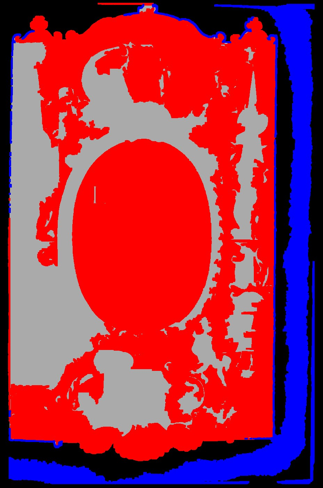

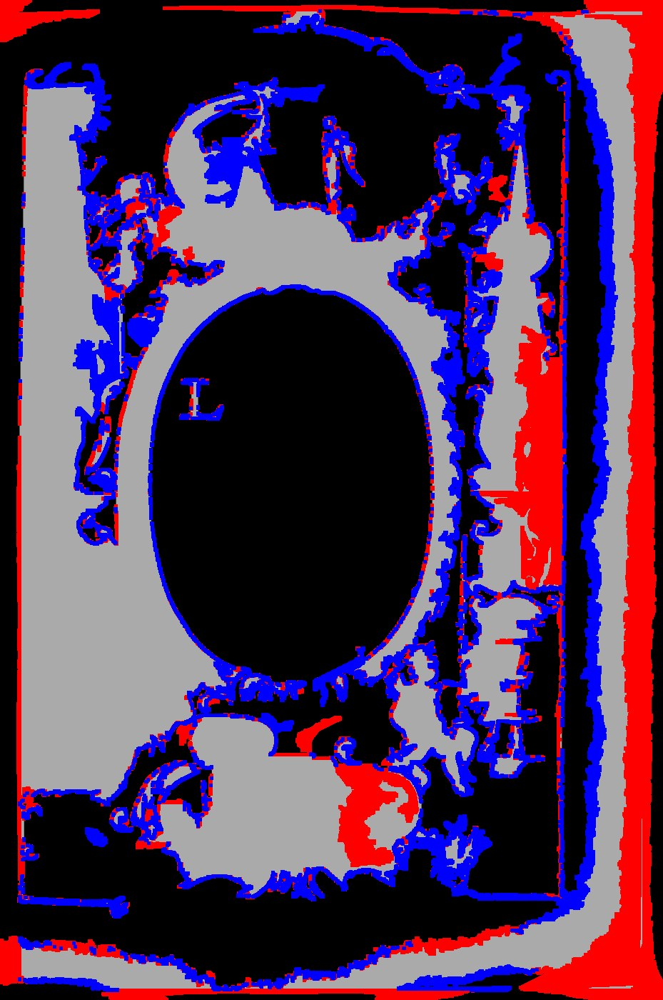

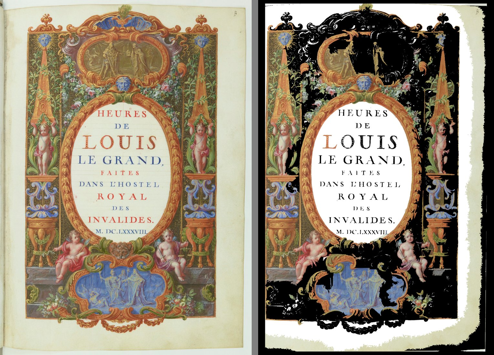

## 5. As páginas obrigatórias, página por página (teste de olho: o Samuel decide)

Em cada imagem: original | **DLL (vermelho)** | **detector de hoje (azul)**. Abri as 7, as 7 de opções ("retangular" e "mais sensível") e ampliações onde tive dúvida. A primeira frase de cada linha diz o que tem na página.

| Página | A DLL (forma livre, o padrão) | O detector de hoje | Quem acerta |
|---|---|---|---|
| **Palatino 5**: título em texto, retrato oval em xilogravura | Marca **só o oval** (38%). O texto fica fora. **Certo.** O papel dentro do oval entra junto: branqueá-lo é do 1.5. | Marca a **página inteira** (100%), texto junto. **Errado.** | **DLL** |
| **Escola 35**: pintura colorida em cima, texto embaixo | Marca **o retângulo da pintura**. **Certo.** | Marca o retângulo da pintura. **Certo.** | Os dois |
| **Horas 11**: iluminura de página inteira, centro claro com o título | Marca **a iluminura inteira**, inclusive a cena azul e os ornamentos de baixo. **Certo.** Mas marca também **o centro claro com o título** (a regra pede o centro branco) e uma faixa na dobra à esquerda. **Errado nisso.** | Marca um retângulo nos 80% de cima (centro incluído) e **perde a parte de baixo** da iluminura. **Errado.** | **DLL**, os dois erram o centro |
| **Horas 13**: texto dentro de moldura dourada | Marca **a moldura dos 4 lados** (ampliação abaixo). **Certo.** Erros pequenos: um triângulo sobre "pag. 54" no canto de baixo e faixas finas na beira do papel. | Marca a moldura dos 4 lados. **Certo.** | Os dois (o de hoje, um pouco mais limpo) |
| **Horas 26**: calendário de novembro dentro de moldura dourada | Marca **a moldura e o calendário inteiro por dentro** (52%), texto junto. **Errado**: o texto não seria limpo e o papel de dentro ficaria amarelado. | Marca **nada** (0%). **Errado**: a moldura some. | Nenhum |
| **Horas 27**: calendário de dezembro dentro de moldura dourada | Marca **a moldura dos 4 lados** (4%), texto fora. **Certo.** Erros pequenos: o fim da linha 17 ("Brabant", que encosta na moldura) e faixas finas na beira do papel. | Marca **nada** (0%). **Errado.** | **DLL** |
| **Opus Majus 20**: foto da estátua | Marca só pedaços da foto (52% dela): **a estátua, o pedestal e o nicho escuro ficam fora.** **Errado.** Onde marca, chega ao alto da foto, sem degrau. | Marca **a foto inteira**. **Certo** (nesta chamada). | **Hoje** |

**Placar:** a DLL acerta mais que o detector de hoje em 3 páginas (Palatino 5, Horas 11, Horas 27), empata em 2 (Escola 35, Horas 13), perde em 1 (Opus Majus 20). Na Horas 26 os dois erram, de jeitos diferentes.

**Contra as regras do Samuel (28/09):**

- **Moldura dourada detectada como gravura:** sim na Horas 13 e na 27. Na 26 a moldura entra, mas leva o calendário junto.
- **Iluminura intacta com o centro branco:** a iluminura entra inteira, mas o centro claro com o título entra junto.
- **Papel branco dentro da gravura** (fundo do retrato do Palatino 5): não é trabalho do detector. Ele marca o oval inteiro, e o branqueamento de dentro fica para o 1.5.

**As opções "retangular" e "mais sensível":**

- Conferem com o que o implementador escreveu: no Opus Majus 20 as duas cobrem a foto inteira, certinho; no Livro de Horas marcam de 56% a 96% da página.
- **Achado:** a "retangular" **nunca vai servir para página com moldura.** Achei que a causa fossem as faixas na beira do papel. Testei cortando a página logo fora da moldura, e a "retangular" continuou marcando 93%. O motivo é outro: a moldura é oca, e o retângulo que a contém leva todo o texto de dentro.
- A "mais sensível" também piora o Palatino 5 (pega a mancha em volta do oval e a linha de baixo) e a Escola 35 (pega as margens e pedaços do texto).

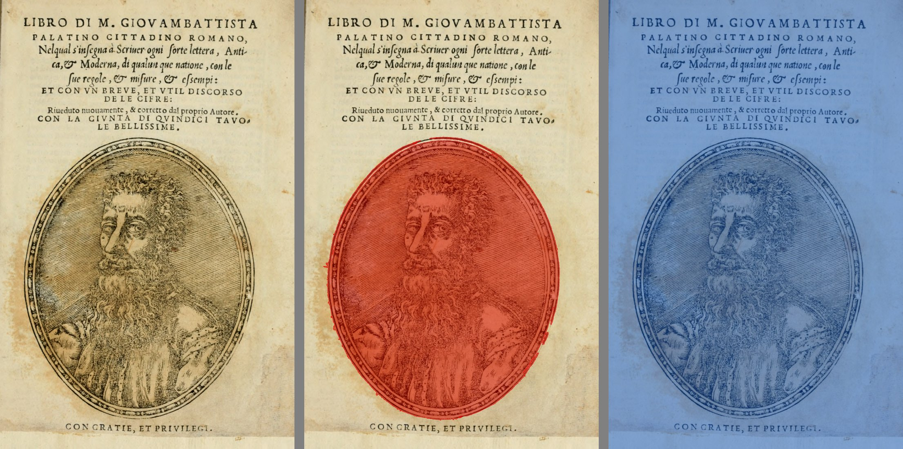

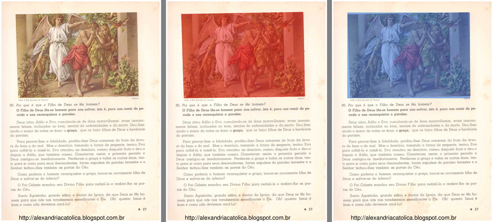

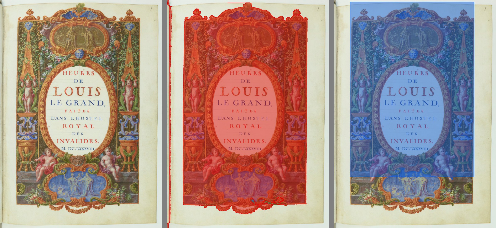

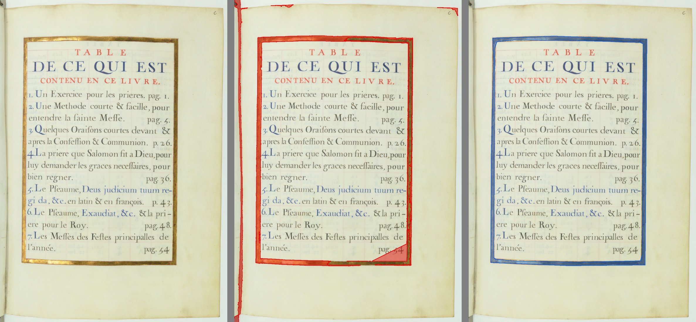

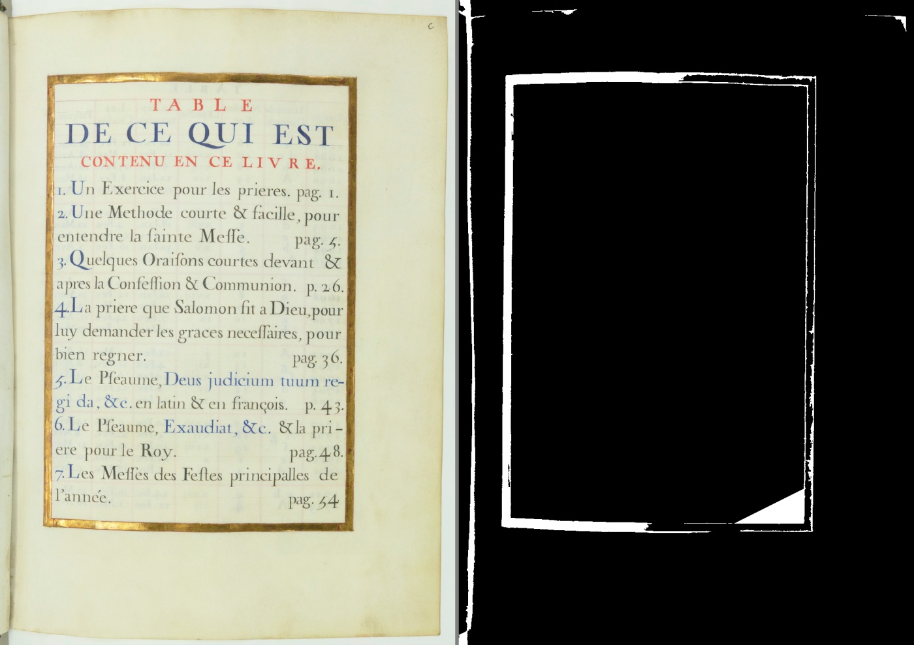

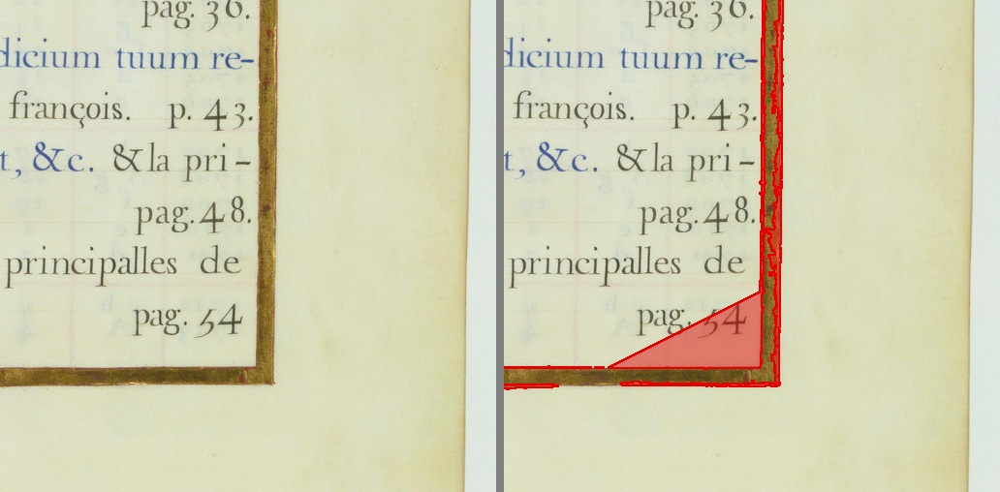

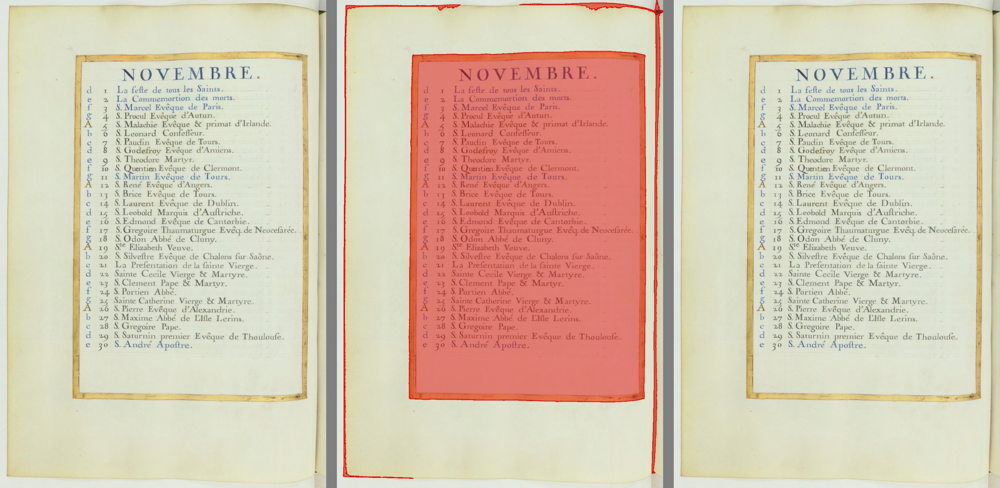

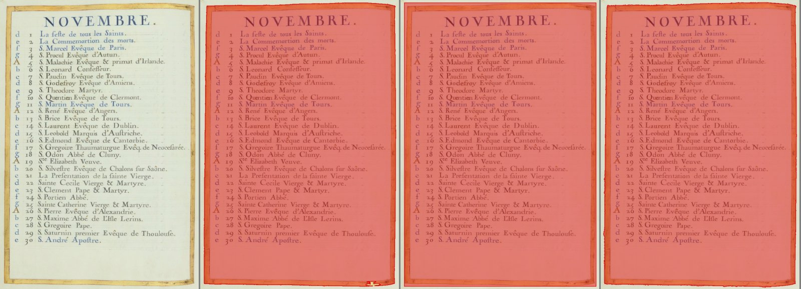

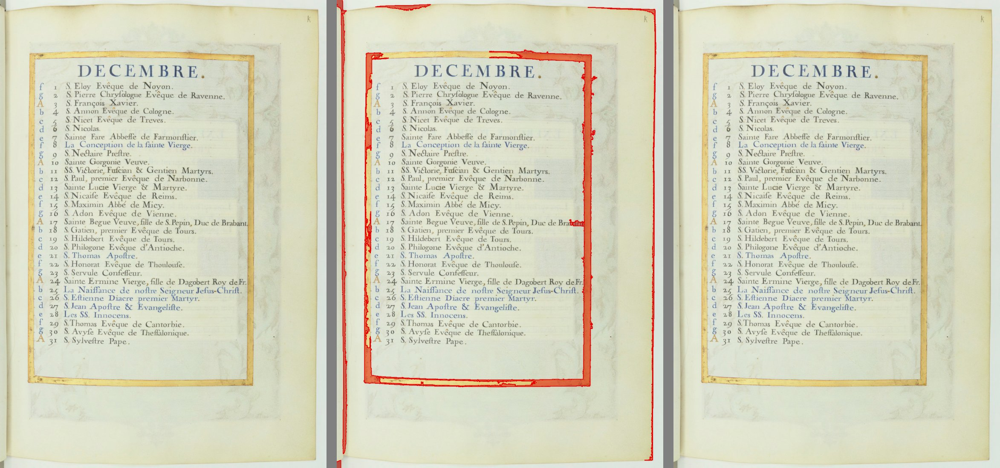

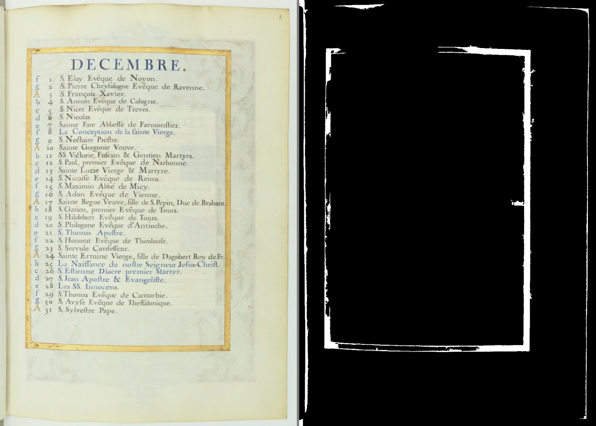

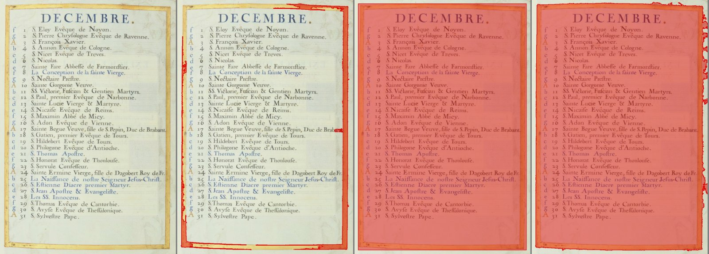

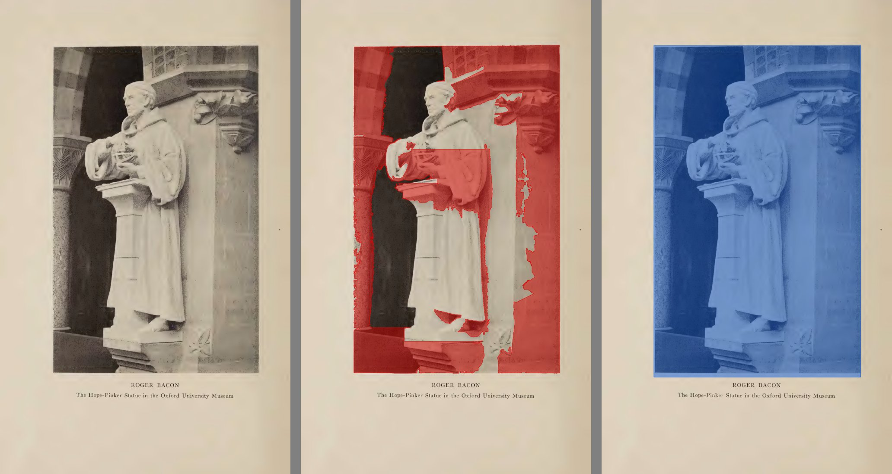

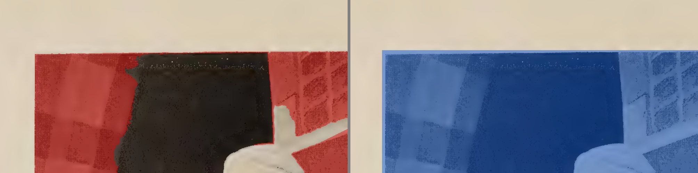

## 6. A DLL ausente ou quebrada

- **Os 3 testes automáticos disso passam.**
- **Conferi também com cópias,** numa pasta temporária, sem tocar na DLL do projeto (a soma SHA-256 dela é a mesma antes e depois: `833d03db...`):
    - DLL que não existe: volta "O detector de gravura do ScanTailor não foi encontrado", sem erro;
    - DLL cortada ao meio: volta "O detector de gravura do ScanTailor não abriu", com o detalhe técnico para o `erros.log`;
    - cópia boa, noutra pasta: funciona.
- **Sem a DLL, o adaptador das camadas** (`figuras_pelo_scantailor`) cai na reserva, se ela for passada, ou devolve "nenhuma figura".
- **Casos-limite que não derrubam nada:** página de 1×1 ponto e de 2×2; tira de 1×3000 (volta mensagem de erro); imagem fatiada da memória; imagem com 4 canais; página toda branca; página toda preta; sensibilidade fora de 0 a 100.
- **O caso que derruba** está no bug novo 1.

## 7. Tempo do detector (ainda não conta para a regra 6, porque não está ligado)

Por página, no DPI da página. Primeiro o tempo do implementador, depois o meu (medi com o PC mais ocupado).

| Página | DLL | Detector de hoje |
|---|---|---|
| Palatino 5 | 0,9 a 1,2 s | 2,9 a 5,0 s |
| Escola 35 | 1,1 a 1,2 s | 2,5 a 3,5 s |
| Opus Majus 20 | 0,9 a 1,7 s | 1,9 a 2,9 s |
| Horas 11, 13, 26 e 27 | **1,9 a 3,9 s** | **0,9 a 2,0 s** |

- **No Livro de Horas a DLL é cerca de 2 vezes mais lenta que o detector de hoje** (de 1,5 a 2,7 vezes, conforme a página e a medição). O PDF diz que a página tem 51 cm de altura, e a DLL amplia a página de 1024×1446 pontos para cerca de 4300×6000, para trabalhar a 300 DPI.
- **Quando for ligada, isso tem de passar pelo teste de velocidade (regra 6).**

## 8. Ressalvas

1. **Não está ligado ao programa**: não tem o botão de ligar e desligar (regra 8), não está no instalador, e o Samuel não tem o que ver no programa. O item 1.2 do plano diz "compilado **e ligado** ao programa". Isto é a primeira metade.
2. **Horas 11: a "página invertida" é a melhor explicação, mas não está provada** (seção 4). E mesmo invertida a concordância fica em 0,81.
3. **Opus Majus 20: esta conferência não mostra "o degrau sumindo".** Chamado sozinho, na página inteira, o detector de hoje também não tem degrau: começa no alto da foto. O degrau do bug de 28/09 aparece no programa, depois do corte. O que dá para dizer é que a máscara da DLL chega ao alto da foto onde marca. Mas ela deixa a estátua de fora, o que é pior que o degrau.
4. **A frase da Lista de bugs "preenche o miolo de moldura fechada" é larga demais.** A Horas 13 e a 27 também têm moldura fechada, e o miolo **não** foi preenchido. Só a 26 foi (e o oval da Horas 11). Não sei dizer por que a 26 é diferente.
5. **Faixas finas na beira do papel** (sombra da dobra à esquerda, beiras de cima e da direita) aparecem na Horas 11, 13, 26 e 27. No ScanTailor elas não aparecem, porque ele só olha a caixa do conteúdo. No programa, dependem de o detector rodar depois do corte de bordas (já está na Lista de espera, 28/09).
6. **Moldura fina é frágil à resolução:** na Horas 13 e na 27, rodar a 150 DPI ou no DPI da página muda a máscara em cerca de 30% (IoU 0,68 a 0,70). Olhei só no DPI da página.
7. **O teste da "cópia fiel" confere a ligação contra a cópia de referência que está no próprio projeto.** Se alguém mudar as duas juntas, o teste não pega. Sugestão para o implementador: gravar no teste a soma SHA-256 da referência (a do GitHub).
8. **Não pilotei a janela:** o item não mexe em tela.

## 9. Bugs novos (para a Lista de bugs)

1. **28/09: um DPI absurdo faz a DLL corromper a memória e o programa fecha sem aviso.**
   - Como acontece: quando a página, reduzida a 300 DPI, vira 1×1 ponto. Por exemplo, uma página de 600×450 pontos declarada com 300.000 DPI; ou uma de 2000×1500 com 700.000 DPI.
   - O que acontece: "access violation writing" dentro do código do ScanTailor. Às vezes o Python devolve um erro, às vezes o processo morre com código `0xC0000374` (memória corrompida). Reproduzi 3 de 3 vezes. Com um espaço de saída 4 vezes maior, continua: a falha não é na ligação.
   - Risco: em uso normal não acontece (precisa de DPI acima de uns 200.000). Mas contraria "nenhuma exceção fecha a janela".
   - Conserto sugerido, antes de ligar: `gravura_scantailor.py` recusar DPI fora de uma faixa razoável (por exemplo 30 a 2400) e página que fique com menos de uns 8 pontos a 300 DPI.
   - Onde: `core/gravura_scantailor.py` (a trava) e o código do ScanTailor (a causa). Print: não se aplica, é o processo que morre.
2. **28/09: Horas 13, triângulo marcado como gravura sobre "pag. 54"**, no canto de baixo à direita, dentro da moldura (ampliação na seção 5). Pequeno. Onde: detector do ScanTailor (forma livre). Print: `paineis/zoom_horas_p013_canto.jpg`.
3. **28/09 (documentação): o `LEIA-ME` diz "conferido com `cmp`"**, mas na pasta do PC um `cmp` dá diferente nos 72 arquivos, por causa do fim de linha. Sugestão: dizer que a conferência é no git, ou marcar `terceiros/` para o git não converter o fim de linha. Mudar a configuração do git é decisão da gerente.

## 10. Para o Samuel conferir em 10 minutos

Abra as imagens da seção 5 (ou as do relatório do implementador, que são as mesmas: `../obrigatoria_<página>.jpg`).

1. **Palatino 5**: o vermelho está só no retrato, e o azul (hoje) na página toda? *(1 min)*
2. **Horas 27 e Horas 13**: a moldura dourada está marcada nos 4 lados, com o texto fora? O triângulo sobre "pag. 54" incomoda? *(2 min)*
3. **Horas 26**: o calendário inteiro está marcado. Aceita isso como defeito conhecido, a resolver no 1.4 e 1.5? *(1 min)*
4. **Horas 11**: a iluminura inteira está marcada (bom), mas o centro claro com o título também. Aceita como defeito conhecido? *(1 min)*
5. **Opus Majus 20**: a estátua fica fora na forma livre. A gerente propõe usar a "retangular" nos livros com foto. Concorda? Lembrete: a "retangular" não serve para página com moldura. *(2 min)*
6. **Horas 11, a régua**: compare `regua_horas_p011.jpg`, `regua_horas_p011_invertida.jpg` e o print de 24/09. A explicação da página invertida convence? *(2 min)*
7. **Decida** se aceita o 1.2 em duas etapas: agora o detector, depois a ligação ao programa com o botão de ligar e desligar. *(1 min)*

---

Arquivos desta conferência: `paineis/` (as imagens acima). Os scripts de conferência ficaram na pasta temporária da sessão (régua refeita, cópias da DLL, recompilação), fora do projeto. Nenhum código foi alterado, nenhuma DLL do projeto foi tocada, nenhum commit foi feito.
