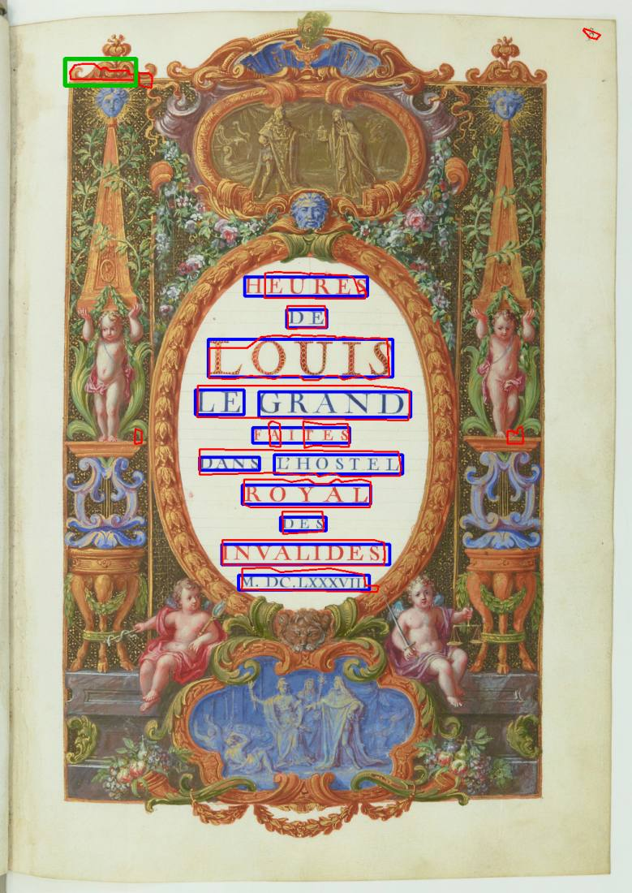
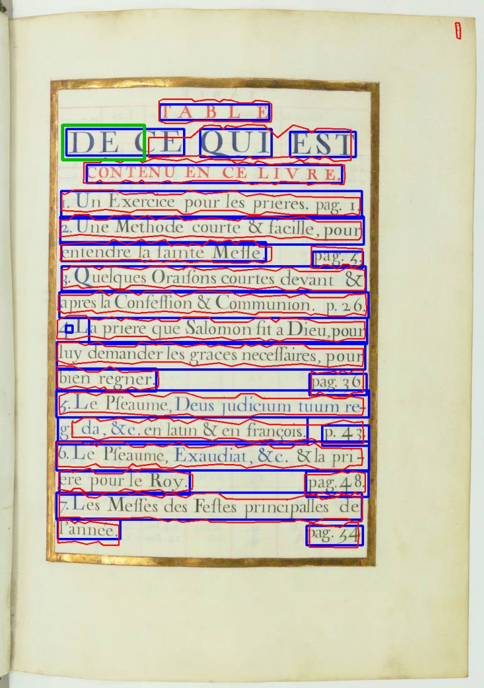
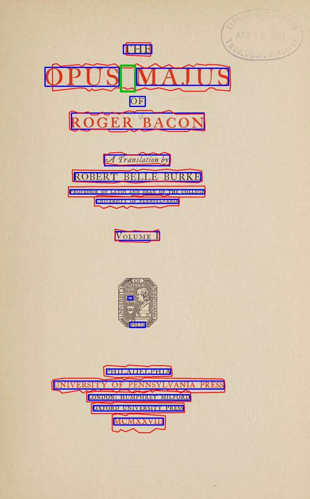
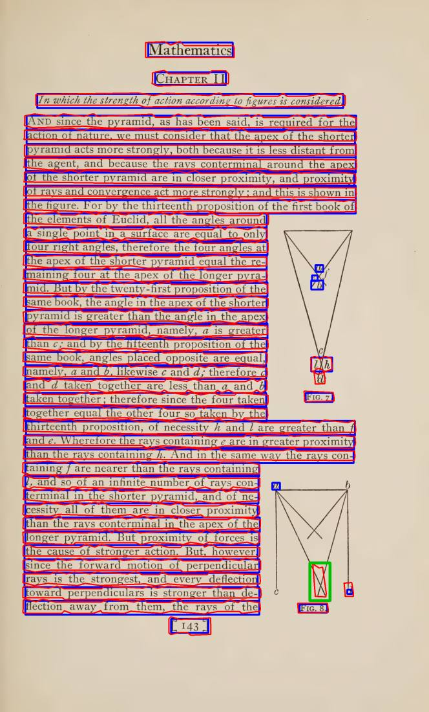
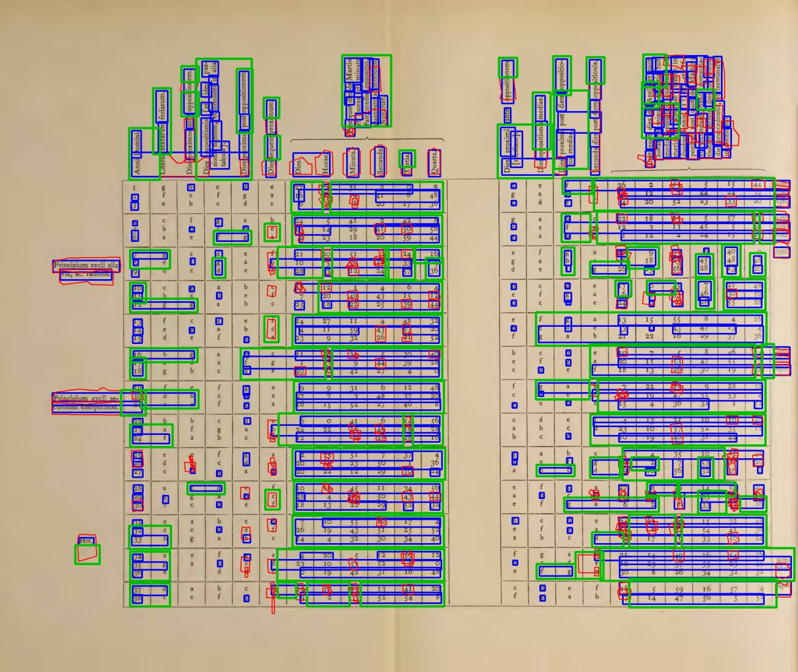
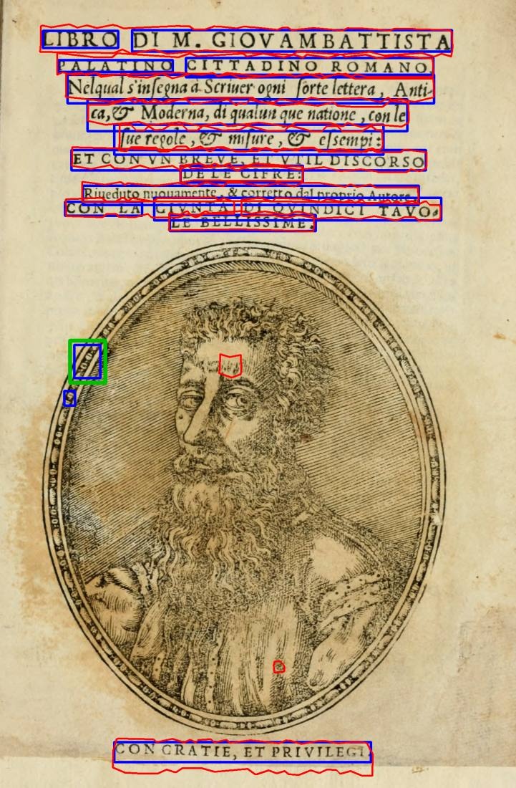
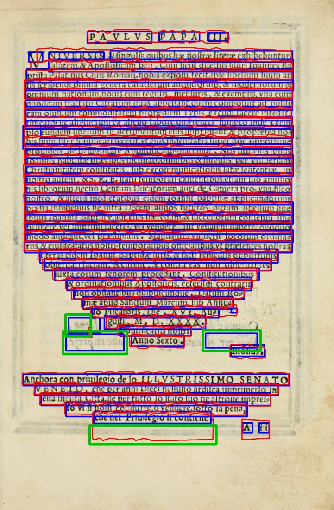
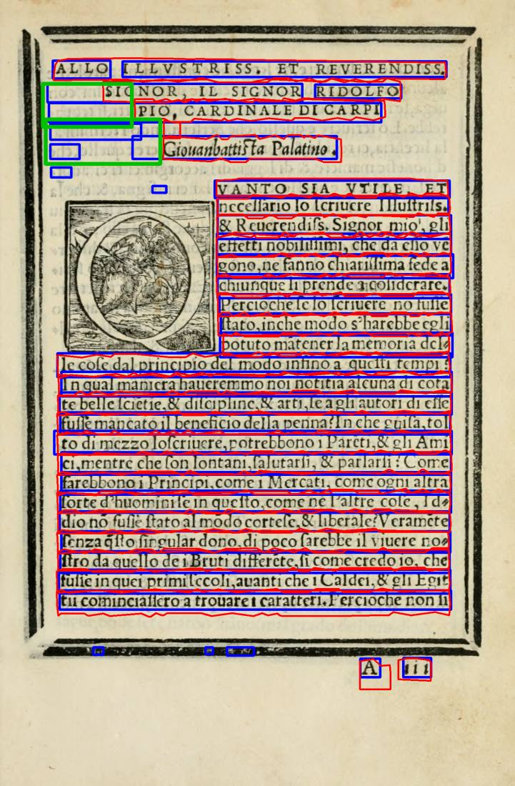
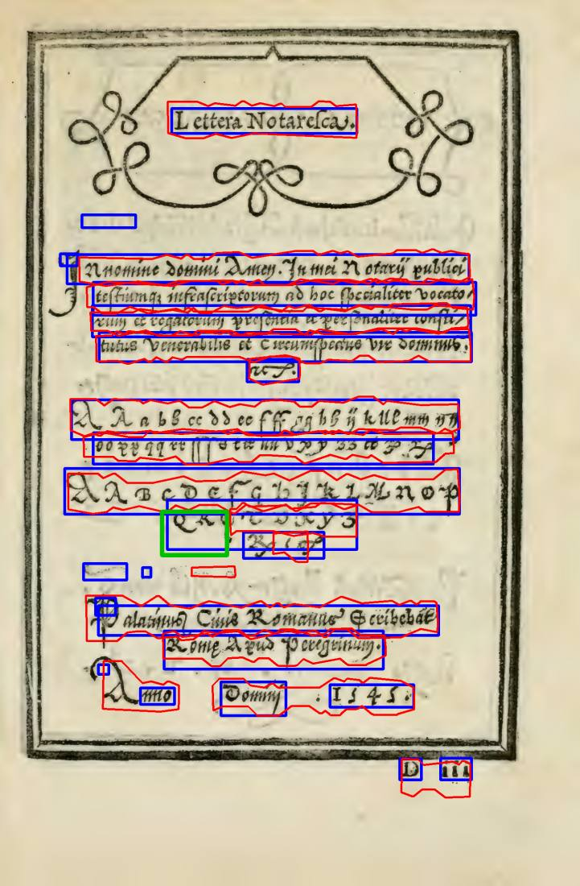
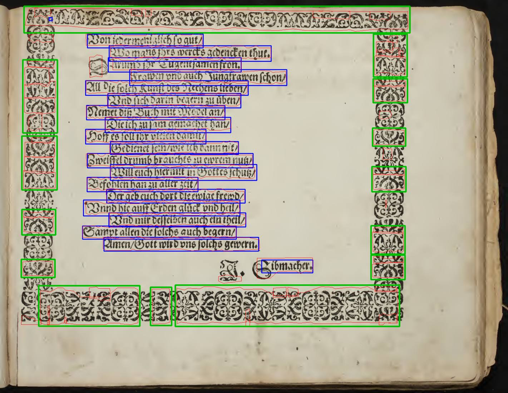

# Item 1.3: comparação automática entre os OCRs

**29/09/2026 · implementador · teste de máquina (calibração). Nada foi ligado ao programa.**

> **Atenção, Samuel:** isto ainda não aparece no programa. O programa ainda não roda os OCRs nem tem o "Para revisar" deles. A calibração usou o que já se sabia das 22 páginas da comparação de 28/09, e a folga entre página boa e página com erro é pequena (seção 4).

## 1. Em poucas palavras

1. Com o par de fábrica (docTR + Kraken), **10 das 22 páginas vão para "Para revisar"**, e cada uma delas tem um erro já conhecido. **Nenhuma página boa foi para revisar à toa.**
2. **Uma página com erro passa sem aviso: o Graduale 223.** Ali os dois OCRs perdem **o mesmo** pedaço de texto. Comparando um com o outro, não há como ver isso.
3. Em 9 das 10 páginas, o lugar marcado é o erro de verdade: caixa do docTR na borda do retrato ou na mancha do verso, "linha" do Kraken na moldura ou no diagrama, palavra que um viu e o outro não. No **Opus Majus 3**, a página foi para revisar pelo motivo errado. O lugar marcado é o vão entre "OPUS" e "MAJUS": o Kraken desenha uma linha só, o docTR desenha duas.
4. **O texto que vai para o item 1.4 é decidido por voto, linha por linha.** Uma linha entra quando os dois OCRs a veem. O que só um viu fica de fora, e a página vai para revisar.
5. **Com o Tesseract ligado, quase todas as páginas vão para revisar** (20 ou 21 de 22). As "linhas" dele pegam blocos inteiros e não batem com as dos outros. Isso reforça a decisão de deixá-lo desligado.

## 2. O que é "discordar"

| Conta? | O quê | Por quê |
|---|---|---|
| **sim** | Um pedaço de página que um OCR marca como texto e o outro não, do tamanho de uma palavra ou maior (1,4 "quadrados de altura de linha"; uma letra grande dá cerca de 1). | É o erro que importa: caixa em gravura ou na mancha do verso, ou palavra perdida. |
| **sim** | O próprio OCR avisa que perdeu linhas (o Kraken, na tabela do Opus Majus 256: 8 linhas). | Texto sumido em silêncio. |
| **sim** | Um OCR ligado não conseguiu ler a página. | Não houve comparação. |
| não | Uma letra solta a mais ou a menos. | Aparece em quase toda página (as letrinhas da coluna do calendário das Horas 26). |
| não | Borda da caixa diferente. | O docTR desenha retângulos e o Kraken desenha contornos colados na letra; a comparação dá uma folga de 0,35 altura de linha. |
| não | Número de linhas muito diferente, ou uma linha partida em duas. | Varia demais em página boa: na Horas 27 o docTR acha 38 linhas e o Kraken 74, porque o Kraken separa as colunas do calendário. Esses números ficam guardados nas medidas, mas não decidem. |

## 3. Página a página (docTR + Kraken)

A "maior zona" é o maior pedaço de desacordo, em quadrados de altura de linha. O limite é 1,4.

| Página | Decisão | Maior zona | Motivo que o programa daria | O que já se sabia |
|---|---|---|---|---|
| Palatino 5 | **revisar** | 2,16 | O docTR achou texto nesta área e o Kraken não | docTR: caixinhas na borda do retrato **(é isso que foi marcado)** |
| Palatino 7 | **revisar** | 9,35 | O docTR achou texto em 3 lugares e o Kraken não; o Kraken achou texto nesta área e o docTR não | docTR: caixas em letras fantasmas da mancha do verso; Kraken: contorno grande no papel embaixo |
| Palatino 9 | **revisar** | 4,02 | O docTR achou texto em 2 lugares e o Kraken não | docTR: caixas nos fantasmas da mancha do verso **(marcado)** |
| Palatino 10 | concorda | 0,60 | - | boa |
| Escola 7 | concorda | 0,72 | - | boa |
| Horas 11 | **revisar** | 1,92 | O Kraken achou texto nesta área e o docTR não | Kraken: contorno na iluminura **(marcado)** e perde parte do título |
| Horas 13 | **revisar** | 3,05 | O docTR achou texto nesta área e o Kraken não | Kraken perde o "DE" grande **(marcado)**; docTR encosta na moldura |
| Horas 47 | concorda | 0,00 | - | boa |
| Opus Majus 11 | concorda | 1,13 | - | boa |
| Opus Majus 3 | **revisar** | 1,64 | O Kraken achou texto nesta área e o docTR não | docTR no emblema e Kraken perde o "OF". **O que foi marcado é outra coisa:** o vão entre OPUS e MAJUS |
| Opus Majus 20 | concorda | 0,00 | - | boa |
| Opus Majus 165 | **revisar** | 1,65 | O Kraken achou texto nesta área e o docTR não | Kraken: linha num traço do diagrama **(marcado)** |
| Opus Majus 256 | **revisar** | 73,57 | O Kraken avisou que não conseguiu desenhar 8 linhas; o docTR achou texto em 93 lugares e o Kraken não; o Kraken achou texto em 5 lugares e o docTR não | Kraken perde a tabela |
| Horas 26 | concorda | 1,11 | - | boa |
| Horas 27 | concorda | 0,47 | - | boa |
| Escola 35 | concorda | 0,70 | - | boa |
| Rhetorica 18 | concorda | 0,86 | - | boa |
| Siebmacher 9 | **revisar** | 42,39 | O Kraken achou texto em 14 lugares e o docTR não | Kraken: toma a moldura ornamental por texto **(marcado)** |
| Palatino 57 | **revisar** | 1,65 | O docTR achou texto nesta área e o Kraken não | os dois perdem parte do título; o Kraken perde o "QR" **(marcado)** |
| Graduale 221 | concorda | 0,94 | - | boa |
| Graduale 222 | concorda | 0,00 | - | boa |
| Graduale 223 | concorda | 0,00 | - | **erro não pego:** os dois perdem o mesmo texto |

Cada frase de motivo termina com "confira se há texto ou mancha." Na tela, cada lugar marcado virá com a caixa dele (as imagens da pasta `zonas\` mostram o docTR em azul, o Kraken em vermelho e o lugar marcado em verde).

**Resultado: a decisão bate com o que se sabia em 21 de 22 páginas. Nenhuma página foi para revisar à toa, e um erro conhecido não foi pego (Graduale 223).**

### Com o Tesseract ligado (fica desligado de fábrica)

| OCRs ligados | Vão para revisar | Concordam |
|---|---|---|
| docTR + Tesseract | 21 de 22 | só o Opus 20 |
| Kraken + Tesseract | 19 de 22 | Palatino 10, Opus 20, Horas 26 |
| os três | 21 de 22 | só o Opus 20 |

O Tesseract desenha "linhas" que cobrem blocos inteiros, incluindo o espaço entre colunas e a gravura (Siebmacher, Escola 7, Opus 3). Ele também não acha nada na Horas 11 nem no Graduale 222. Ligado, ele manda quase tudo para revisar.

## 4. Como foi calibrado, e a folga

- Os limites foram escolhidos varrendo a folga (0,15 a 0,5 altura de linha), a espessura mínima (0,2 a 0,9) e o tamanho mínimo, até separar as páginas com erro das boas.
- O que ficou: **folga 0,35, espessura mínima 0,4, tamanho mínimo 1,4.**
- A maior zona numa página boa foi **1,13** (Opus 11). A menor numa página com erro foi **1,64** (Opus 3). A folga entre as duas é de cerca de 20% de cada lado do limite. **É pouca.** Um livro diferente dos 22 pode cair do lado errado, e o risco maior é página boa indo para revisar.
- Comparar custa **39 ms por página** (mediana; a mais lenta, a tabela do Opus 256, levou 210 a 390 ms).

## 5. O texto que vai para o item 1.4: voto por linha

Medido com a régua da comparação de 28/09: zonas do gabarito, tinta pela Sauvola, caixas alargadas 15%.

| Como juntar | Texto achado (média, 19 páginas) | Sem o Opus 256 | Páginas com mais de 1% de figura tomada |
|---|---|---|---|
| União (qualquer um dos dois) | 99,1% | 99,8% | **7** (Palatino 5 e 9, Horas 13 e 47, Opus 3 e 165, Siebmacher 9) |
| Interseção (ponto a ponto, os dois) | 95,0% | 98,5% | 0 |
| **Voto por linha (escolhido)** | 96,1% | **99,4%** | **2** (Horas 13: 8,5%; Horas 47: 1,07%) |

- **Por que o voto:** ele tira as caixas que só um OCR viu, que quase sempre caem em figura. Ao mesmo tempo guarda a linha inteira quando os dois a veem. A interseção ponto a ponto corta a letra onde um contorno é mais justo que o outro: o título da Horas 11 cai para 96,9%, o Palatino 57 para 94%, o Graduale 221 para 96,9%.
- **As duas páginas acima de 1%** vêm do alargamento de 15%. Os dois OCRs veem a linha colada na moldura dourada, e a caixa alargada encosta nela. É o problema já anotado no relatório de 28/09, para o item 1.5. A Horas 13 vai para revisar de qualquer jeito; a Horas 47 (1,07%) não vai.
- A máscara entregue ao 1.4 **não** leva o alargamento de 15%. Quanto alargar é decisão do 1.4.

## 6. O que deu errado no caminho

1. **A primeira ideia, comparar linha por linha** ("esta linha do docTR está coberta pelo Kraken?"), não separava as páginas. Uma linha do Tesseract que cobre meio parágrafo fica "meio coberta". Troquei por comparar **áreas**: o que um cobre e o outro não, sem as lascas de borda.
2. **Número de linhas e linha partida** foram medidos e descartados como critério (seção 2).
3. **No Opus Majus 3, a decisão certa sai pelo motivo errado.** O erro real (caixa pequena no emblema, "OF" perdido) é menor que o limite.

## 7. Ressalvas

- **Calibrado nas mesmas 22 páginas em que foi medido.** Não há páginas separadas para confirmar. A folga é pequena (seção 4).
- O "erro conhecido" de cada página vem do relatório de 28/09, com as zonas ainda **não conferidas** pelo Samuel. O do Palatino 7 eu vi na folha de contato nesta tarefa.
- O Graduale 223 mostra o limite do método: quando os dois erram igual, a comparação não vê.
- Uma letra solta que só um OCR viu não manda para revisar, e também fica fora do texto combinado. Se a letra existe de verdade, o 1.4 pode tratá-la como não-texto.
- Os resultados das pontes foram guardados em `saida_teste\ocr-comparar\` (fora do git). Com `OCR_22=1`, o teste roda as pontes de verdade e confere a mesma decisão.

## 8. Arquivos

- `core\ocr_comparar.py`: a comparação (`comparar()`), com o que é seguro e arriscado mudar.
- `tests\test_ocr_comparar.py`: testes sintéticos e as 22 páginas.
- `scripts\rodar_pontes.py`: roda as três pontes nas 22 páginas e guarda o resultado.
- `scripts\calibrar.py`: refaz as seções 3 e 5 e grava `resultados.json`.
- `zonas\`: as 10 páginas que vão para revisar (docTR azul, Kraken vermelho, lugar marcado verde).

## 9. As 10 páginas que vão para revisar

docTR em azul, Kraken em vermelho, lugar marcado em verde.

<h4 style="page-break-before: always">horas_p011</h4>

<h4 style="page-break-before: always">horas_p013</h4>

<h4 style="page-break-before: always">opusmajus_p003</h4>

<h4 style="page-break-before: always">opusmajus_p165</h4>

<h4 style="page-break-before: always">opusmajus_p256</h4>

<h4 style="page-break-before: always">palatino_p005</h4>

<h4 style="page-break-before: always">palatino_p007</h4>

<h4 style="page-break-before: always">palatino_p009</h4>

<h4 style="page-break-before: always">palatino_p057</h4>

<h4 style="page-break-before: always">siebmacher_p009</h4>

