# Investigação dos 3 bugs de imagem da conferência 6.7 (28/09/2026)

Feita pelo agente implementador, **sem consertar nada**: nenhum arquivo do programa foi alterado. Os consertos que aparecem aqui foram só **simulados na memória**, para medir o tamanho e o risco de cada um. Quem decide o que fazer é o Samuel.

Os três bugs foram achados pelo Samuel na conferência do item 6.7 (filtro Mágico pro): `relatorios/conferir/6.7-2026-09-25-1720/`, prints em `docs/plano/bugs/2026-09-28-*.jpg`.

## Resumo em uma página

Onde fica cada coisa no código está no começo de cada seção.

| Bug | A causa, em uma frase | Conserto pequeno? | Item do plano que substitui | Recomendação |
|---|---|---|---|---|
| 1. Corte de bordas | O corte procura **a tinta, não a folha**: põe uma caixa justa em volta da tinta, joga fora a tinta mais de fora e depois gira a página sem aumentar a folha. Por isso come letra, número de página e nota de música, e nas Horas a margem de papel some de um lado e sobra do outro. Acontece em qualquer filtro. | Sim para "não comer conteúdo" (30 a 40 linhas; simulado: 77 peças partidas viram 9). **Não** para "seguir a beirada do papel": isso é o ScanTailor. | 2.13, 2.5, 2.14 (e 2.4, 2.2), na **Fase 2** | Consertar agora só o "não comer conteúdo" |
| 2. Quadradinhos na roupa do anjo | Dentro da gravura roda uma limpeza que devia valer só para o papel, e ela achou que o pano branco era papel. Como decide pela cor de cada ponto, e o JPEG original guarda a cor em quadrados de 16×16 pontos, uns quadrados passaram e outros não. A mesma limpeza lava a branco a **foto do Opus Majus 20**. | Sim, 5 a 10 linhas. Simulado: muda 6 das 33 páginas, 4 para melhor e 2 com papel um pouco menos branco dentro da gravura | 1.4/1.5 só se o Mágico pro for refeito sobre a montagem nova (o plano não diz) | Consertar agora |
| 3. Moldura dourada com furinhos | O programa achou que a moldura era **parte do bloco de texto**. Dentro de um bloco de texto, tudo que não é traço vira papel branco, e a faixa dourada é lisa por dentro. O mesmo **apaga a iluminura da Horas 11** (gabarito da Fase 1). | **Não.** O conserto simples devolve a moldura, mas traz de volta a mancha vermelha do Palatino 66 (R4) e a beirada da folha em outras páginas | 1.2, 1.4 e 1.5, na **Fase 1 (a atual)** | Deixar para 1.2/1.4/1.5 |

**Os quadradinhos e os furinhos têm causas diferentes.** Prova: desligando só a limpeza do papel, a roupa do anjo volta e a moldura continua furada; desligando só o "papel do bloco de texto", a moldura volta e a roupa continua com quadradinhos (seções 3 e 4).

**Não é o detector de gravura (`doclayout.onnx`) que erra no anjo:** ele marcou a gravura inteira certo. Nas Horas, sim, a classificação de região está no começo do problema (seção 4).

## 1. Como reproduzi

- Mesmo caminho da conferência: `conferencia.processar_pelo_programa`, que chama `TarefaAnalise.run` (análise automática) e `TarefaProcessar.run` (o botão "Confirmar e processar"), a partir dos PDFs de uma página em `gabarito/paginas/`.
- **As 3 páginas saíram idênticas, ponto por ponto, às da conferência de 25/09** (diferença máxima 0). O código de `core/` não mudou desde 25/09 às 14h51 (`git log`), antes da conferência (17h20).
- Depois refiz cada etapa à mão, com as mesmas funções do programa, e conferi que o passo a passo dá o mesmo resultado que o programa (diferença 0), antes de olhar as etapas do meio.
- Rodei também no filtro **Original**: a folha sai **do mesmo tamanho**, com o mesmo corte. Ou seja, o corte não depende do filtro.

Abri todas as imagens que gerei (cerca de 60, as de prova estão na pasta `provas/`).

## 2. Bug 1: corte de bordas errado

### A causa, em português comum

O corte automático **não procura a beirada do papel. Ele procura onde tem tinta** e desenha uma caixa justa em volta dela. Três coisas nessa conta fazem ele comer conteúdo:

1. **Ele joga fora a tinta mais de fora.** Para não se prender em sujeira da margem, descarta os 0,2% da tinta mais perto de cada beirada. Só que, numa página de texto, esses 0,2% muitas vezes **são** o conteúdo: o começo e o fim das linhas justificadas, o número da página, a marca de caderno ("A iii"), a primeira nota de cada pauta.
2. **Deixa só meio por cento de folga** (na Escola 35, uns 8 pontos a 300 DPI, menos de 1 mm), menos do que ele descartou (de 16 a 24 pontos de cada lado).
3. **Endireita depois de cortar, sem aumentar a folha.** A página é girada dentro do mesmo retângulo, e os cantos do conteúdo saem para fora.

Nas Horas acontece o contrário do que se espera de uma página com margem: **quem decide até onde o corte vai é a sujeira da margem.** Onde a margem está limpa, o corte vai justo até a moldura e a margem de papel some. Onde há um risco (a beirada da folha vizinha, a sombra da lombada), o corte fica preso nele e leva a margem inteira, com a faixa cinza junto.

### A prova

**Escola p. 35.** O retângulo vermelho é o que o programa escolheu, desenhado sobre a página inteira (antes do corte):

<a href="provas/b1-01-escola35-retangulo-do-corte.jpg" target="_blank">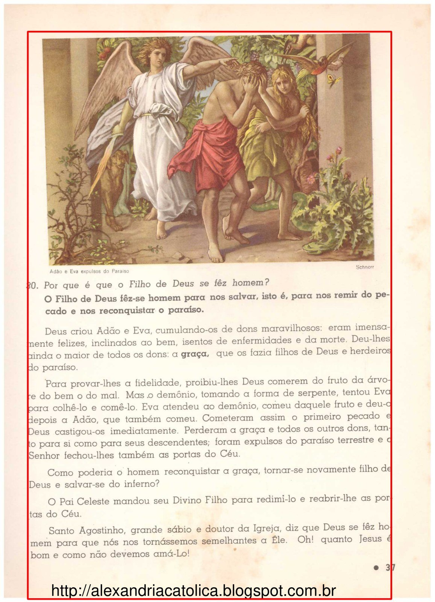</a>

*Escola 35: o corte (vermelho) passa rente ao começo das linhas à esquerda e em cima do "7" do "37"* (`provas/b1-01-escola35-retangulo-do-corte.jpg`)

O "37" é partido **pelo próprio corte**, antes de endireitar. O quadro mostra: original com a linha do corte, só o corte, corte + endireitar (o que o programa faz) e endireitar sem cortar:

<a href="provas/b1-02-escola35-numero-37.jpg" target="_blank">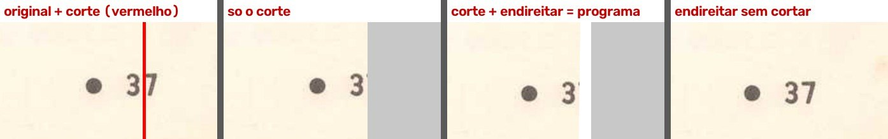</a>

*"37": a linha do corte passa no meio do 7* (`provas/b1-02-escola35-numero-37.jpg`)

No começo das linhas, o corte encosta na primeira letra e o endireitar (−0,8°) empurra para fora o começo das linhas de baixo, até 21 pontos (1,8 mm). "para" vira "oara", "to para" vira "o para". Endireitando **sem cortar** (último quadro), nada se perde:

<a href="provas/b1-03-escola35-comeco-das-linhas.jpg" target="_blank">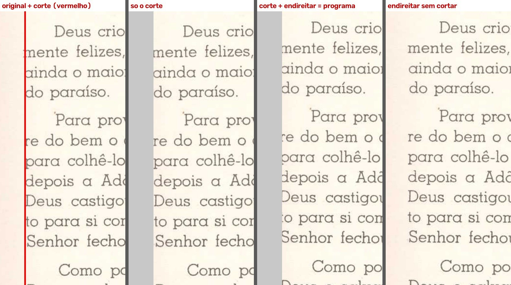</a>

*Começo das linhas: com o corte só, as letras ainda estão lá; com corte + endireitar, somem* (`provas/b1-03-escola35-comeco-das-linhas.jpg`)

**O alto da gravura: não consegui confirmar que foi cortado.** No resultado há 22 pontos (1,9 mm) de papel acima da gravura, e a borda de cima dela está inteira no filtro Original. O que parece corte no Mágico pro é o céu azul-claro que virou branco (é o bug 2) e emendou com a margem:

<a href="provas/b1-04-escola35-alto-da-gravura.jpg" target="_blank">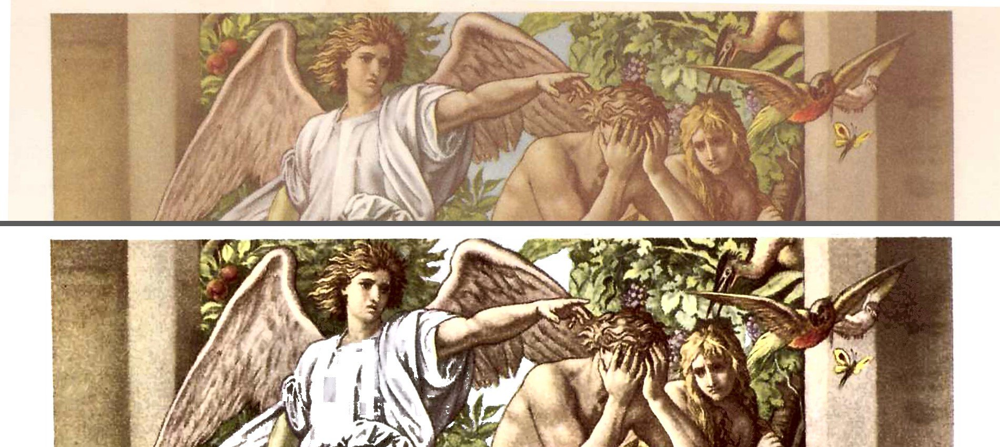</a>

*Em cima: Original (a gravura está inteira). Embaixo: Mágico pro (o céu virou branco e a borda de cima some nesse trecho)* (`provas/b1-04-escola35-alto-da-gravura.jpg`)

**Horas p. 26 (NOVEMBRE).** O corte vai justo até a moldura na esquerda (tira 22% da largura, toda a margem de papel) e, na direita, vai até a beirada da folha vizinha:

<a href="provas/b1-05-horas26-retangulo-do-corte.jpg" target="_blank">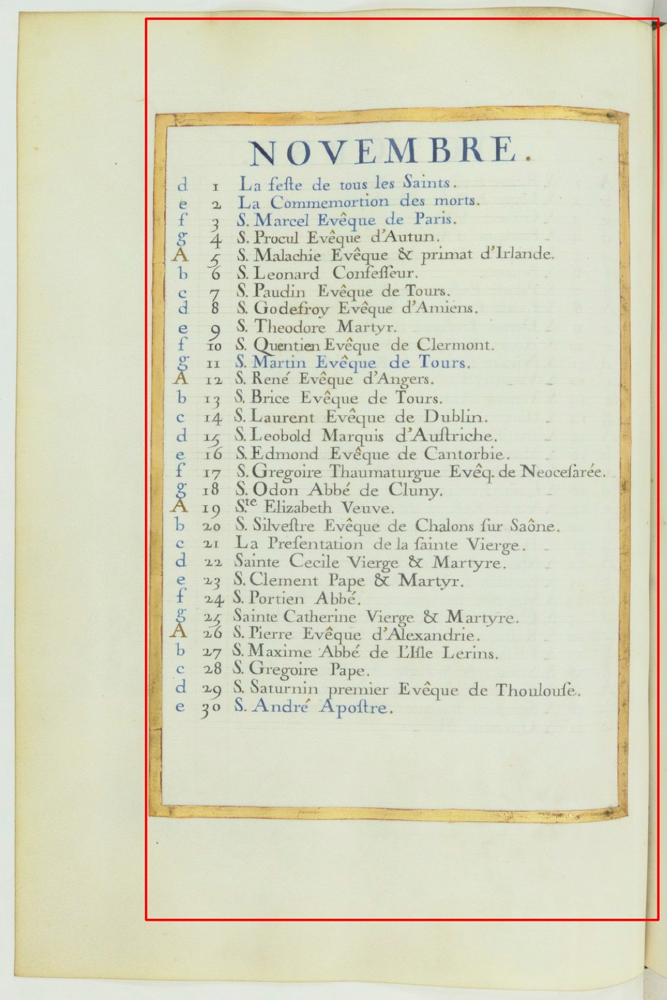</a>

*Horas 26: corte justo na esquerda, frouxo na direita (leva a beirada da folha vizinha)* (`provas/b1-05-horas26-retangulo-do-corte.jpg`)

Isto é a tinta que o corte enxerga (preto). O risco da beirada da folha vizinha, à direita, é levemente torto: espalha-se por várias colunas, cada uma cobrindo só 20% a 25% da altura. A regra que apaga "risca de dobra" pede 70% numa coluna só, então ele não é apagado, pesa 933 pontos de "tinta" (o limite de descarte é 73) e segura o corte. A margem da esquerda, com poucos pontinhos, não segura nada:

<a href="provas/b1-06-horas26-tinta-que-o-corte-enxerga.jpg" target="_blank">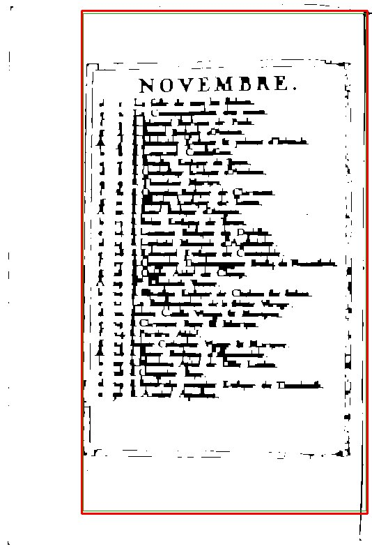</a>

*A "tinta" que o corte usa. Vermelho: o corte. Verde: onde está a massa da tinta* (`provas/b1-06-horas26-tinta-que-o-corte-enxerga.jpg`)

**Horas p. 27 (DECEMBRE)**, o espelho: a sombra da lombada na esquerda segura o corte na beirada, e a direita vai justa até a moldura (sobram 0,4 a 2 mm depois da faixa dourada):

<a href="provas/b1-07-horas27-retangulo-do-corte.jpg" target="_blank">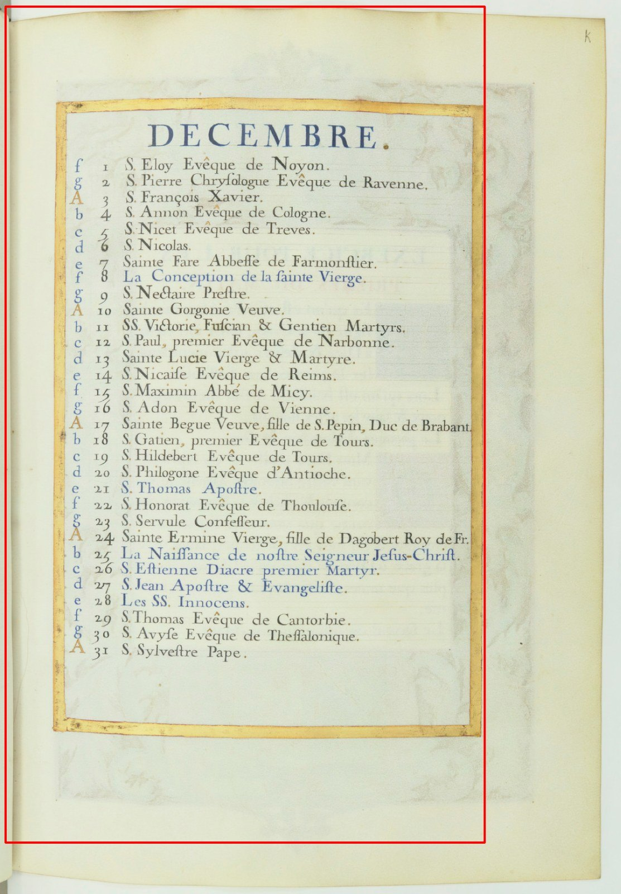</a>

*Horas 27: frouxo na esquerda, justo na direita* (`provas/b1-07-horas27-retangulo-do-corte.jpg`)

**A moldura não foi cortada por dentro**: no filtro Original a faixa dourada está inteira dos dois lados. Na Horas 26 sobram de 13 a 53 pontos (1 a 4,5 mm) entre a beirada da imagem e o dourado. O que dá a impressão de corte por dentro no Mágico pro é a faixa ficar branca por dentro (bug 3) e colada na beirada:

<a href="provas/b1-08-horas26-moldura-inteira-no-original.jpg" target="_blank">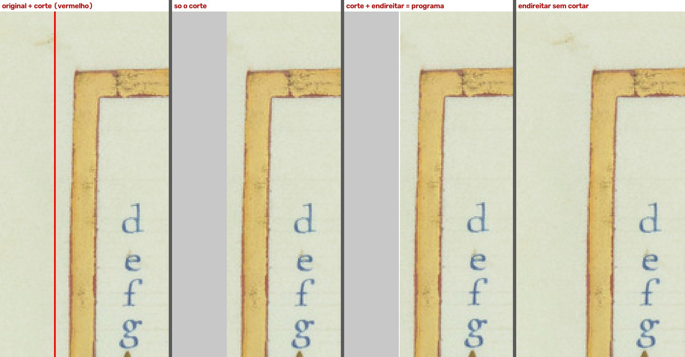</a>

*Horas 26, lado esquerdo: a faixa dourada inteira, com folga, depois do corte* (`provas/b1-08-horas26-moldura-inteira-no-original.jpg`)

<a href="provas/b1-09-horas27-original-x-magico-mesmo-corte.jpg" target="_blank">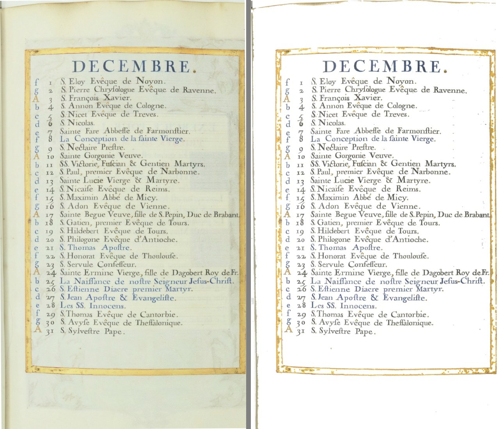</a>

*Horas 27: Original (esquerda) e Mágico pro (direita) com o mesmo corte; a diferença na moldura é do filtro* (`provas/b1-09-horas27-original-x-magico-mesmo-corte.jpg`)

### Respostas às perguntas da gerente

- **Acontece com qualquer filtro?** Sim. No Original a folha sai do mesmo tamanho, com o mesmo corte.
- **Vem da análise automática (bordas, lombada, ângulo) ou do recorte?** Vem do **recorte**, feito na hora de gravar: `preparar_metade` recalcula o corte a 300 DPI, porque a página não tem corte manual. A análise a 150 DPI só gera os avisos; o corte dela nem é usado (e às vezes dá outro: na Horas 26, a 150 DPI a caixa começa em 2% da largura, a 300 DPI em 22%). A lombada não interfere: nenhuma das 3 foi dividida. O **ângulo** entra como agravante: é medido depois do corte e aplicado sem aumentar a folha.

### Não são só estas 3 páginas

Medi as 33 páginas do gabarito. Em **13 delas o corte parte duas ou mais peças de tinta num mesmo lado** (em 19, pelo menos uma; 77 peças ao todo). Olhei cada uma, e não é sujeira: são letras no fim ou no começo da linha (Boécio 7 e 22, Escola 7 e 35), as primeiras notas e claves das pautas (Graduale 222), as iniciais grandes (Graduale 221), o número da página cortado na horizontal (Opus Majus 11 e 165), a marca de caderno (Palatino 9), a decoração dourada (Horas 47) e os rótulos da tabela (Opus Majus 256). Cada quadro abaixo é uma peça partida, com a linha do corte em vermelho:

<a href="provas/b1-10-gabarito-pecas-partidas.jpg" target="_blank">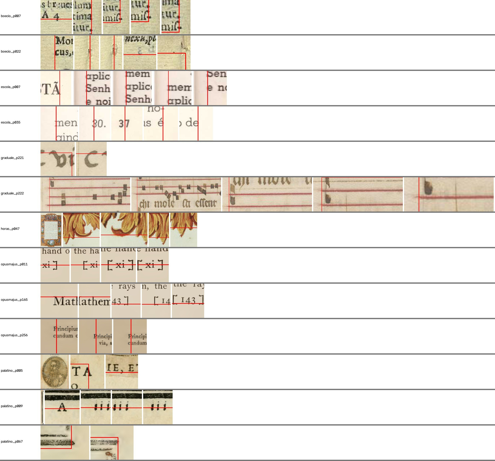</a>

*As peças de tinta que o corte parte ao meio, nas páginas do gabarito com 2 ou mais* (`provas/b1-10-gabarito-pecas-partidas.jpg`)

### Tamanho do conserto e risco

- **"Não comer conteúdo"** é pequeno: em `detectar_bordas`, quando a borda do corte atravessa uma peça de tinta, levar a borda até o fim da peça (menos as que encostam na beirada da imagem, que são scanner ou folha vizinha). E em `preparar_metade`, medir o ângulo **antes** de cortar e alargar a caixa o quanto a rotação vai deslocar os cantos. A ordem "cortar → endireitar" do `CLAUDE.md` continua a mesma. Simulei isso nas 33 páginas: as peças partidas caem de 77 (em 19 páginas) para 9 (em 5), e a folha final cresce de 0,2% a 3,4% na largura e até 4,8% na altura (vermelho: hoje; verde: simulado):

<a href="provas/b1-12-simulacao-conserto-pequeno.jpg" target="_blank">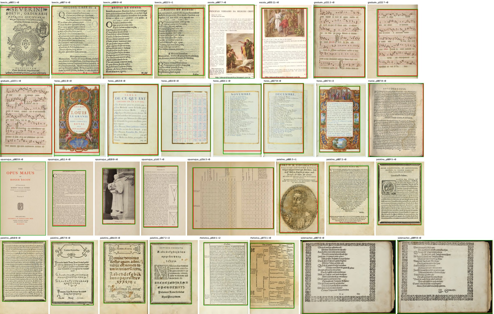</a>

*Simulação do conserto pequeno nas 33 páginas. No título: peças partidas hoje → simulado* (`provas/b1-12-simulacao-conserto-pequeno.jpg`)

- **Risco:** o corte mexe em **toda página de todo livro**. O descarte dos 0,2% existe por causa da sujeira da margem do Graduale 536 (a queixa "sobrou muito espaço do lado esquerdo"). A simulação não traz aquela sujeira de volta porque só estica a borda até o fim da peça que ela já atravessa, mas as margens ficam um pouco maiores, e a queixa antiga de "sobra papel em branco" (5 de 16 páginas) pode voltar um pouco. É **medível por máquina**: contar as peças partidas, que devia dar zero.
- **"Seguir a beirada do papel"**, que é o que o Samuel espera nas Horas, **não é conserto pequeno**. O corte atual não sabe onde está o papel, só onde está a tinta. Isso é a caixa da página do ScanTailor: itens **2.13** (achar a página dentro da borda do scanner), **2.5** (caixa da página), **2.14** (preencher com branco), junto com **2.4** (margens iguais) e **2.2** (endireitar). Tudo na Fase 2.

### Opções

1. **Consertar agora só o "não comer conteúdo"** (as duas mudanças acima, em torno de 30 a 40 linhas, com teste de máquina "nenhuma peça partida").
   - A favor: acaba com a perda de letra, número e nota já, inclusive nas conferências da Fase 1, que passam todas pelo corte. É pequeno e conferível por máquina.
   - Contra: é código que a Fase 2 vai substituir. As margens ficam um pouco maiores. As Horas continuam sem seguir a beirada do papel.
2. **Não mexer no programa agora; nas conferências da Fase 1, rodar com "cortar bordas" desligado** (mudança no `conferencia.py`, que é script de apoio, dizendo isso na página).
   - A favor: nenhum risco para o programa, e o Samuel julga o filtro sem o defeito do corte no meio.
   - Contra: o programa continua comendo conteúdo até a Fase 2, para quem processar um livro. A conferência deixa de ser exatamente o caminho do programa.
3. **Deixar tudo para 2.13/2.5/2.14.**
   - A favor: nenhum retrabalho.
   - Contra: até a Fase 2, toda conferência e todo livro processado perde conteúdo na beirada, e o Samuel vai ver o mesmo defeito em cada conferência.

**Minha recomendação: a opção 1.** Perder letra e número de página é o pior tipo de defeito para reimpressão ("o desenho também saia perfeito"), atinge 13 das 33 páginas do gabarito, e o conserto é pequeno. "Seguir a beirada do papel" fica para 2.13/2.5. Se o Samuel preferir não mexer no corte antes da Fase 2, então a opção 2, pelo menos, para as conferências não ficarem contaminadas.

## 3. Bug 2: quadradinhos brancos na roupa do anjo

### A causa, em português comum

O detector marcou certo a gravura inteira. Para a gravura, o programa usa um tratamento suave ("papel a branco pela curva, tom preservado"). Só que esse tratamento roda o filtro **Melhorar** em cada gravura, e o Melhorar termina com uma **limpeza que devia valer só para o papel**: "o que não é tinta vira papel branco". Ela decide o que é papel por três perguntas: longe de traço, não escuro e **com cor de papel**. "Cor de papel" é pouca cor **ou** tom âmbar (o amarelado de papel velho) com pouca saturação.

O pano do anjo é quase branco e levemente creme. Longe das dobras, não tem traço, então **passa por papel e vira branco chapado**.

E por que em **quadradinhos**? A imagem dentro do PDF é um JPEG que guarda a cor em blocos de 16×16 pontos (24×24 depois de ampliar para 300 DPI). O creme do pano fica **exatamente na fronteira** do "tom âmbar". Cada bloco do JPEG tem uma cor só, então o bloco inteiro cai de um lado ou do outro: uns quadrados viram branco, os vizinhos não.

A documentação da própria função diz "Não entra em capa, nem em gravura". Mas a única trava para gravura é "tinta demais" (mais de 22%), pensada para xilogravura de hachura. Esta gravura colorida tem 16%, então passa.

### A prova

A seleção do detector: gravura (vermelho) marcada inteira e certa:

<a href="provas/b2-01-escola35-selecao.jpg" target="_blank">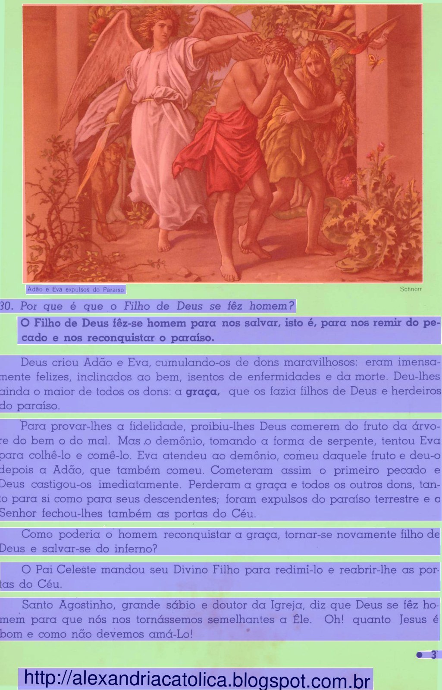</a>

*Escola 35: vermelho = gravura, azul = texto, verde = papel* (`provas/b2-01-escola35-selecao.jpg`)

Quem pintou de branco cada ponto que não era branco no original. **Rosa = a limpeza do papel rodando dentro da gravura**, e os quadradinhos aparecem ali, na roupa e no céu:

<a href="provas/b2-02-escola35-quem-pintou-de-branco.jpg" target="_blank">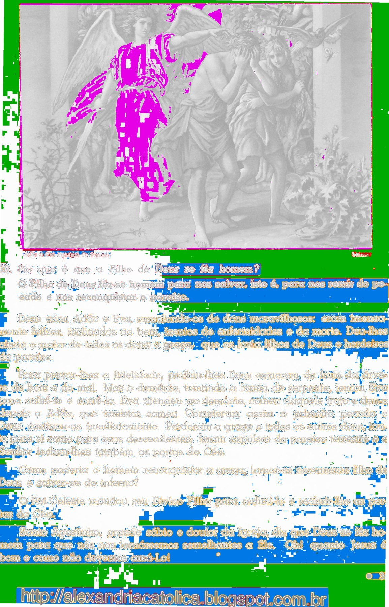</a>

*Rosa: limpeza do papel dentro da gravura. Vermelho: limpeza da página. Laranja: empurrão de branco. Azul: papel do bloco de texto. Verde: região papel* (`provas/b2-02-escola35-quem-pintou-de-branco.jpg`)

As máscaras da limpeza na roupa, com a grade dos blocos do JPEG desenhada por cima (azul-claro). A máscara "tom âmbar" é feita de quadrados **exatamente na grade do JPEG**, e ela manda no que vai a branco:

<a href="provas/b2-03-roupa-mascaras-e-grade-jpeg.jpg" target="_blank">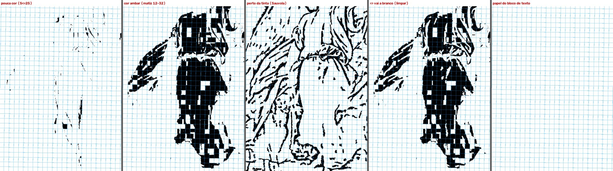</a>

*Máscaras da limpeza do papel na roupa, com a grade dos blocos do JPEG* (`provas/b2-03-roupa-mascaras-e-grade-jpeg.jpg`)

Desligando uma coisa de cada vez (só na memória, para teste): **sem a limpeza do papel (V1), a roupa volta inteira**. Sem o papel do bloco de texto (V2), nada muda. A parte branca chapada do recorte da roupa cai de 27% para 7%, e o que sobra de branco são os pontos mais claros do pano, sem quadrados:

<a href="provas/b2-04-roupa-desligando-uma-coisa-por-vez.jpg" target="_blank">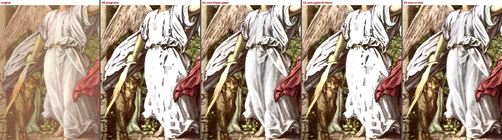</a>

*Original, programa, V1 sem limpeza do papel, V2 sem papel do bloco, V3 sem os dois* (`provas/b2-04-roupa-desligando-uma-coisa-por-vez.jpg`)

O céu azul-claro sofre o mesmo:

<a href="provas/b2-05-ceu.jpg" target="_blank">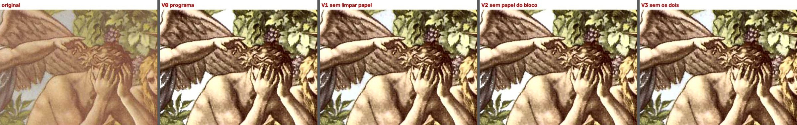</a>

*Céu: manchas brancas no programa, céu inteiro em V1* (`provas/b2-05-ceu.jpg`)

**Não é só o Mágico pro.** Os três filtros de cor usam o mesmo tratamento de gravura, e os quadradinhos aparecem no Melhorar e também na gravura do Preto e branco:

<a href="provas/b2-06-roupa-nos-tres-filtros.jpg" target="_blank">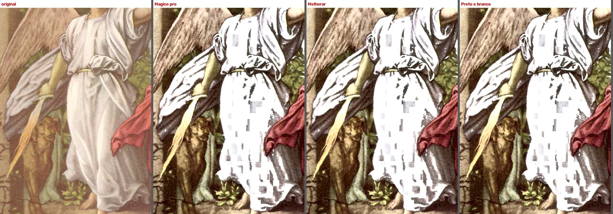</a>

*Original, Mágico pro, Melhorar, Preto e branco: quadradinhos nos três* (`provas/b2-06-roupa-nos-tres-filtros.jpg`)

### Tamanho do conserto e risco

- **Arquivo e função:** `core/filtros.py`, `_limpar_o_papel_de_verdade`, chamada no fim de `filtro_melhorar`, que `_limpar_cada_gravura` roda em cada gravura. `_limpar_cada_gravura` é chamada por `aplicar_filtro_com_selecao` no Mágico pro, no Melhorar e no Preto e branco.
- **Conserto pequeno (5 a 10 linhas):** não rodar essa limpeza dentro de `_limpar_cada_gravura`, que é o que a documentação da função já promete. Não mexe em nada do que o `CLAUDE.md` (seção 9) manda não desfazer: a divisão pelo fundo relativo ao papel, o peso pelo "parece papel" e a curva de ombro continuam.
- **Risco medido nas 33 páginas** (simulado na memória, Mágico pro, 300 DPI). O conserto muda só 6 páginas, e olhei as 6:
  - **Melhora**: Escola 35 (roupa e céu), Escola 7 (o céu da gravura deixa de ter manchas brancas quadradas) e, a maior, **Opus Majus 20**: o programa de hoje lava a branco boa parte da **foto da estátua** (31% da página muda), e com o conserto a foto volta com os tons de cinza.
  - **Misto**: Palatino 5 (o fundo do retrato perde as manchas brancas irregulares, mas fica creme-claro uniforme em vez de branco) e Opus Majus 256 (a tabela conta como gravura: o "36" deixa de ser comido, mas o papel fica levemente cinza perto da beirada).
  - **Quase nada**: Retórica 73 (0,1%, na beirada; não ampliei).
  - Nenhuma das 27 outras muda.

<a href="provas/b2-07-risco-do-conserto-nas-33.jpg" target="_blank">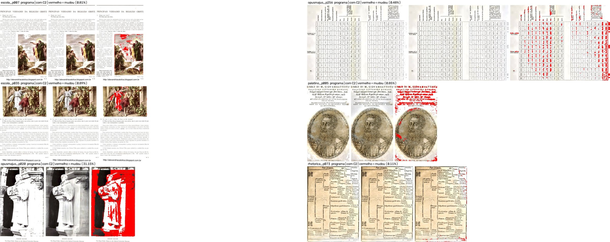</a>

*As 6 páginas que o conserto muda: programa, com o conserto, e em vermelho onde mudou* (`provas/b2-07-risco-do-conserto-nas-33.jpg`)

<a href="provas/b2-08-risco-ampliado.jpg" target="_blank">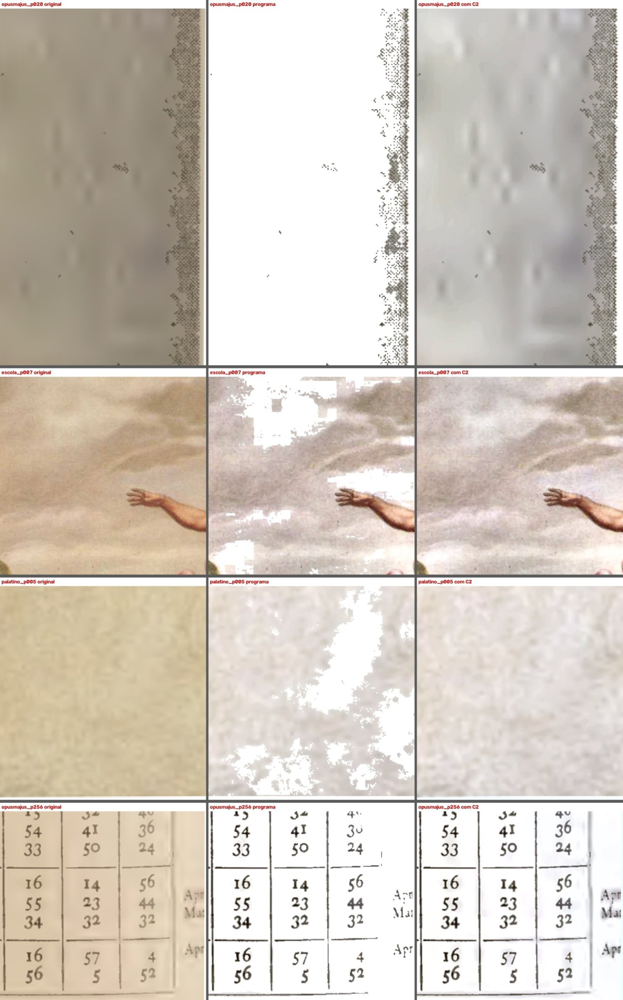</a>

*Ampliado: Opus Majus 20 (foto), Escola 7 (céu), Palatino 5 (fundo do retrato), Opus Majus 256 (tabela). Original, programa, com o conserto* (`provas/b2-08-risco-ampliado.jpg`)

- **Item do plano:** o seletor de gravura do ScanTailor (1.2) troca **quem acha** a gravura, não o **tratamento** dentro dela, então não resolve isto. A montagem nova da página (1.4/1.5, "gravura intacta") substituiria este tratamento, **se** o Mágico pro for refeito sobre ela. O plano não diz se vai ser.

### Opções

1. **Consertar agora:** não rodar a limpeza do papel dentro da gravura.
   - A favor: pequeno, isolado, conserta a roupa e o céu nos três filtros de uma vez, devolve a foto do Opus Majus 20, e faz o código cumprir a própria documentação.
   - Contra: o papel **dentro** de uma gravura ou tabela fica um pouco menos branco, creme-claro ou cinza-claro em vez de branco puro (Palatino 5, Opus Majus 256). A curva de ombro continua agindo.
2. **Tornar o teste "cor de papel" imune aos blocos do JPEG** (alisar a cor antes de testar).
   - A favor: acaba com a forma quadrada.
   - Contra: **não conserta**. A roupa continuaria indo a branco, só que sem quadrados. Não recomendo.
3. **Deixar para 1.4/1.5.**
   - A favor: nenhum retrabalho, se o Mágico pro for mesmo refeito lá.
   - Contra: não é certo que será. Até lá, toda gravura colorida com partes claras (roupa, céu, nuvem) sai manchada nos três filtros.

**Minha recomendação: a opção 1**, conferindo de olho as 6 páginas que mudam (Palatino 5 e Opus Majus 256 são o preço).

## 4. Bug 3: moldura dourada com furinhos

### A causa, em português comum

Três passos, um puxando o outro:

1. **O detector não reconhece a moldura dourada como desenho.** O detector de layout (`doclayout.onnx`) não marca moldura. O sinal de cor só pega cor muito forte (saturação acima de 130), e o dourado destas páginas fica em 114 a 117 (mediana). Só pedaços passam: na Horas 27 nenhum chega a virar gravura; na Horas 26 sobra um pedaço de 0,9% da página, no lado esquerdo.
2. **Os fios escuros que contornam a faixa dourada contam como "tinta".** A etapa que junta a tinta solta em blocos de texto (`blocos_de_tinta`) une esses fios. Na Horas 26 ela ainda **preenche o buraco** do retângulo fechado, e **a moldura inteira, com o que tem dentro, vira um grande "bloco de texto"**. Na Horas 27, a própria faixa da moldura vira bloco de texto.
3. **Dentro de um bloco de texto, tudo que não é traço vira papel branco** (`refinar_para_tinta` → "papel do bloco"). O dourado é liso por dentro, sem traço nenhum, então vai a branco. Ficam os fios escuros da borda e as manchinhas escuras do ouro, que parecem traço: é o "só o contorno e pontinhos".

### A prova

As caixas do detector (azul: texto) e os blocos de tinta (verde). Na Horas 26 o verde cobre a moldura inteira; na Horas 27, a faixa da moldura:

<a href="provas/b3-01-horas26-caixas-do-detector.jpg" target="_blank">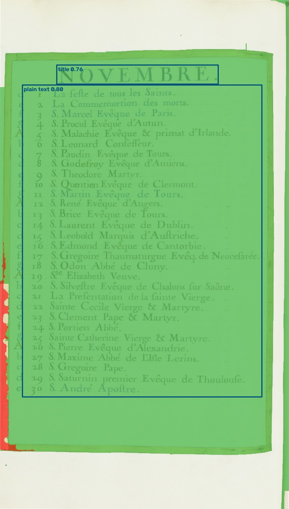</a>

*Horas 26: caixas do detector e blocos de tinta (verde); a moldura inteira virou bloco* (`provas/b3-01-horas26-caixas-do-detector.jpg`)

<a href="provas/b3-02-horas27-caixas-do-detector.jpg" target="_blank">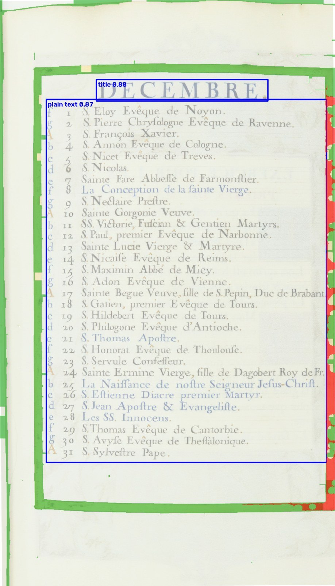</a>

*Horas 27: a faixa da moldura virou bloco de texto (verde); o vermelho é o pouco dourado forte o bastante para o sinal de cor* (`provas/b3-02-horas27-caixas-do-detector.jpg`)

A seleção final da Horas 27: a moldura está dentro do texto (azul), e não há gravura:

<a href="provas/b3-03-horas27-selecao.jpg" target="_blank">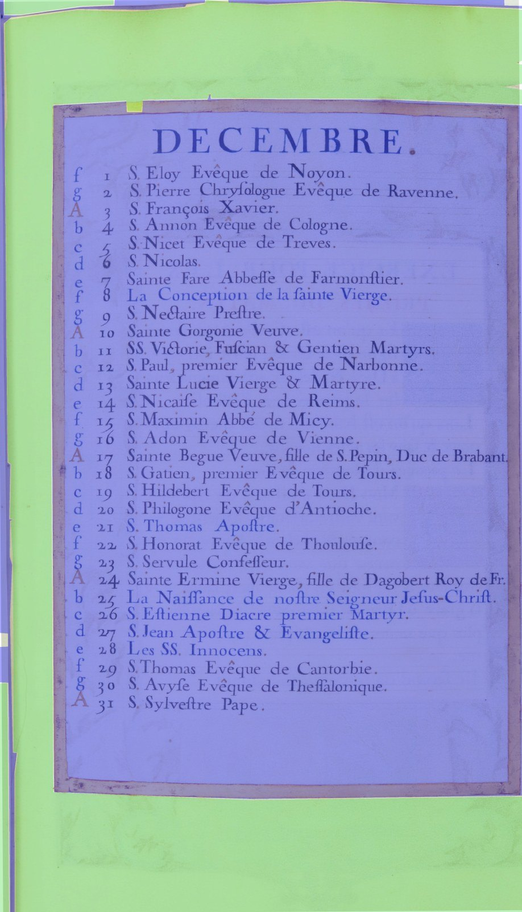</a>

*Horas 27: azul = texto, verde = papel. Nenhuma gravura* (`provas/b3-03-horas27-selecao.jpg`)

As máscaras no canto de baixo da moldura. A limpeza do papel **não** toca o dourado (ele tem cor forte demais para "cor de papel"). Quem pinta a faixa de branco é o **papel do bloco de texto** (último quadro, preto = vai a branco):

<a href="provas/b3-04-horas27-mascaras.jpg" target="_blank">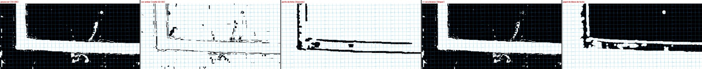</a>

*Canto da moldura: só o "papel do bloco de texto" cobre a faixa dourada* (`provas/b3-04-horas27-mascaras.jpg`)

Desligando uma coisa de cada vez: **sem o papel do bloco (V2), a moldura volta inteira**. Sem a limpeza do papel (V1), ela continua furada:

<a href="provas/b3-05-horas27-desligando-uma-coisa-por-vez.jpg" target="_blank">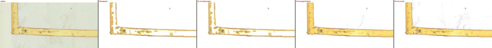</a>

*Horas 27: original, programa, V1, V2, V3* (`provas/b3-05-horas27-desligando-uma-coisa-por-vez.jpg`)

<a href="provas/b3-06-horas26-desligando-uma-coisa-por-vez.jpg" target="_blank">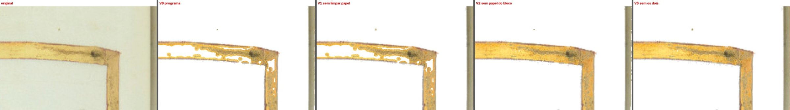</a>

*Horas 26, canto de cima à direita: o mesmo* (`provas/b3-06-horas26-desligando-uma-coisa-por-vez.jpg`)

Mas desligar o papel do bloco inteiro não serve: em V2 e V3 aparecem pontinhos cinzas no papel entre as linhas, que é justamente o que esse passo limpa. O conserto tem de ser mirado.

O Melhorar tem o mesmo defeito. No Preto e branco a moldura vira traço preto, o que é de esperar nesse filtro:

<a href="provas/b3-07-moldura-nos-tres-filtros.jpg" target="_blank">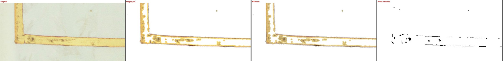</a>

*Original, Mágico pro, Melhorar, Preto e branco* (`provas/b3-07-moldura-nos-tres-filtros.jpg`)

### O mesmo mecanismo apaga a iluminura inteira da Horas 11

Procurando o risco do conserto, achei algo mais grave que a moldura. A **Horas 11** é página de gabarito da Fase 1, do resultado R6 ("letras nas cores originais no meio da iluminura, gravura intacta"). **No Mágico pro de hoje, a iluminura dela sai quase toda branca**, só com contornos e pontinhos. Esta página não estava na conferência 6.7, mas está no gabarito da Fase 1:

<a href="provas/b3-08-horas11-pagina-original-x-magico.jpg" target="_blank">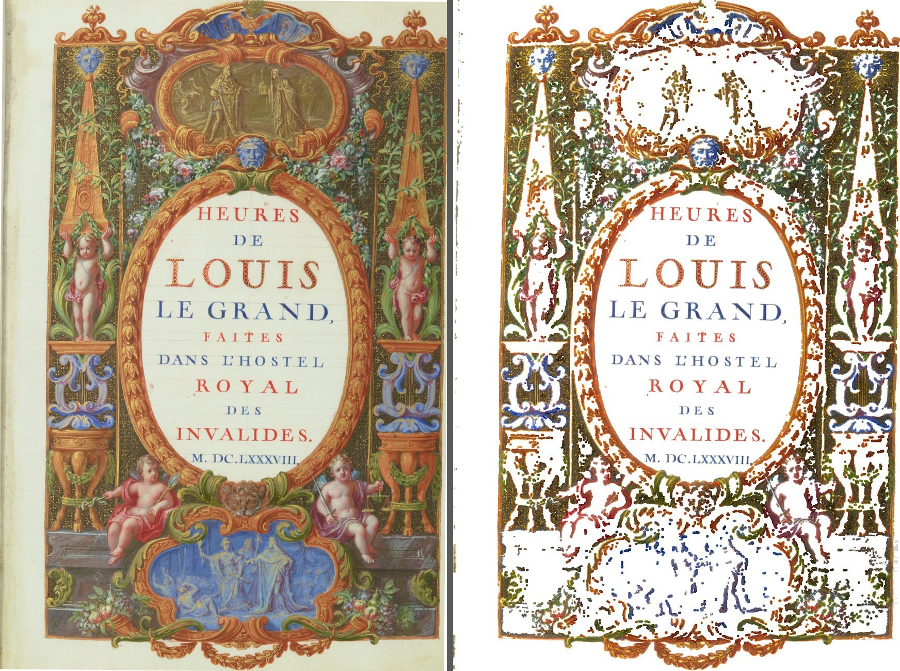</a>

*Horas 11: original (esquerda) e Mágico pro de hoje (direita)* (`provas/b3-08-horas11-pagina-original-x-magico.jpg`)

O caminho é o mesmo da moldura, com um passo a mais no começo:

- O detector de layout não achou nada nesta página.
- O sinal de cor pegou a iluminura inteira, uma peça só de 43% da página.
- Mas a regra que descarta "mancha de papel velho por cima de texto" (`_sem_as_manchas_por_cima_da_escrita`) olhou a tinta dentro dela e achou 83% em pedaços do tamanho de letra: são as hachuras e os detalhes da pintura. O limite é 30%, então a regra concluiu que aquilo é escrita e jogou a iluminura fora como mancha.
- Resultado: **0% de gravura e 84% da página marcada como texto**. No texto, tudo que não é traço vai a branco.

<a href="provas/b3-09-horas11-selecao.jpg" target="_blank">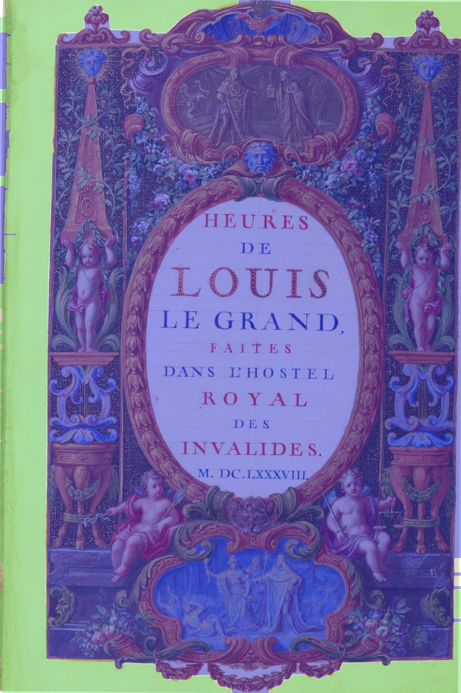</a>

*Horas 11: a seleção do programa. Azul = texto (a iluminura inteira), verde = papel, e nenhuma gravura* (`provas/b3-09-horas11-selecao.jpg`)

<a href="provas/b3-10-horas11-iluminura.jpg" target="_blank">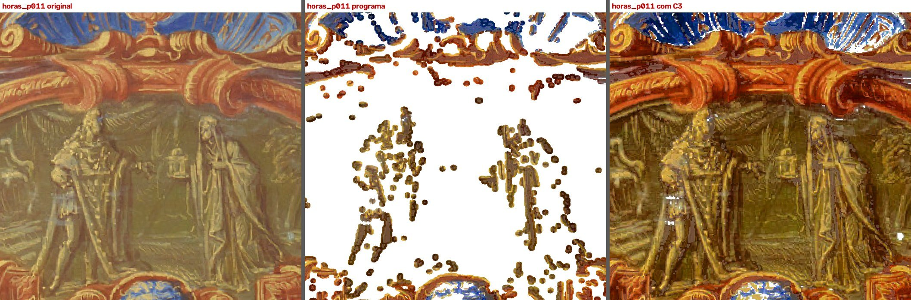</a>

*Horas 11, cena de cima, ampliada: original, programa, e com o conserto simples C3 (volta)* (`provas/b3-10-horas11-iluminura.jpg`)

### Tamanho do conserto e risco

- **Arquivos e funções:** a origem está em `core/detectar_regioes.py` (`detectar`, com `mascara_de_cor`, `_sem_as_manchas_por_cima_da_escrita` e `blocos_de_tinta`). Quem pinta de branco é `refinar_para_tinta` + a mistura do "papel do bloco" em `core/filtros.py`, `aplicar_filtro_com_selecao`.
- **O conserto simples no filtro não serve.** Testei (simulado na memória, Mágico pro, 300 DPI, 33 páginas) a ideia de 3 a 5 linhas: no "papel do bloco de texto", não pintar de branco o que tem **cor de verdade** (saturação acima de 60, o mesmo corte `SATURACAO_DE_RUBRICA` que o resto de `filtros.py` usa). Ela devolve a moldura das Horas 26 e 27 e a iluminura da Horas 11. Mas o "papel do bloco" também é o que **tira as manchas coloridas** do papel, e elas voltam:
  - a mancha marrom-avermelhada do **Palatino 66**, justamente a página do R4 ("tirar as manchas vermelhas sem mexer no título");
  - a beirada marrom da folha no **Siebmacher 9** (5,5% da página) e no Graduale 221;
  - o grão amarelado do papel em volta da gravura do **Boécio 3**.
  - Muda 19 das 33 páginas.

<a href="provas/b3-11-risco-do-conserto-simples-nas-33.jpg" target="_blank">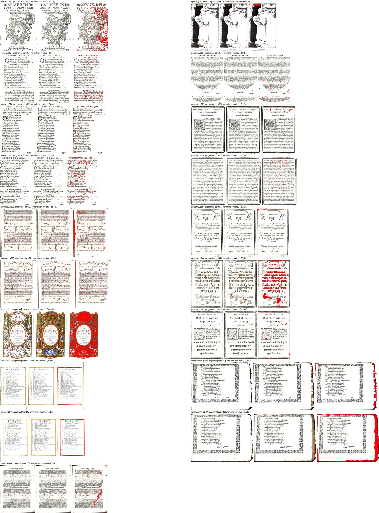</a>

*As páginas que o conserto simples muda: programa, com o conserto, e em vermelho onde mudou* (`provas/b3-11-risco-do-conserto-simples-nas-33.jpg`)

<a href="provas/b3-12-pioras-do-conserto-simples.jpg" target="_blank">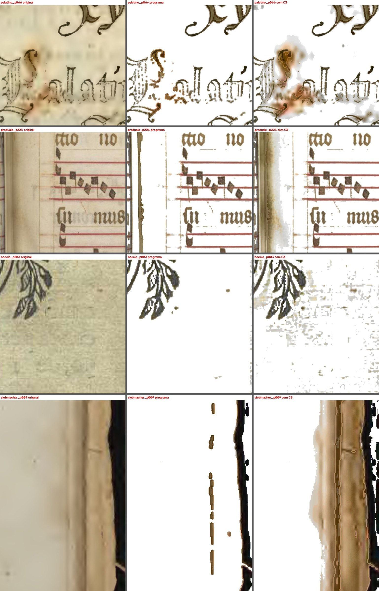</a>

*Ampliado, onde o conserto simples piora: Palatino 66 (a mancha volta), Graduale 221 e Siebmacher 9 (a beirada da folha volta), Boécio 3 (o grão volta)* (`provas/b3-12-pioras-do-conserto-simples.jpg`)

- **Por que não há conserto pequeno:** no "papel do bloco", o dourado da moldura, a pintura da iluminura e a mancha vermelha são a mesma coisa para o programa: área lisa, colorida e sem traço. Separar "enfeite que fica" de "mancha que sai" é decidir **o que é desenho**, e isso é trabalho do detector.
- **Conserto no detector** (não deixar que um anel de fios ou os buracos de uma iluminura virem "bloco de texto"; ou aceitar dourado com saturação mais baixa como desenho): não simulei. Mexe na marcação de todas as páginas. É médio e de risco maior.
- **Itens do plano:** o **1.2** (seletor de gravura do ScanTailor, código original) é quem deve marcar moldura e iluminura como desenho. O **1.4** (achar a tinta **só dentro das linhas de texto**, guardando a cor original) e o **1.5** (juntar os detectores e montar a página) substituem justamente esse "tudo no bloco que não é traço vira branco". Os três são da **Fase 1, a atual**.

### Opções

1. **Conserto simples no filtro agora** (não branquear cor de verdade no papel do bloco).
   - A favor: pequeno; devolve a moldura e a iluminura.
   - Contra: traz de volta as manchas vermelhas (Palatino 66, R4), a beirada da folha e o grão em outras páginas. Troca um defeito por outro. Não recomendo.
2. **Consertar no detector agora**: não deixar `blocos_de_tinta` transformar um anel de fios (a moldura) em bloco de texto, e não deixar `_sem_as_manchas_por_cima_da_escrita` descartar uma iluminura grande como mancha.
   - A favor: ataca a origem, nas duas páginas.
   - Contra: maior, não simulado, muda a marcação de outras páginas (a regra das manchas existe por causa da Rhetorica 223, e os blocos de tinta, para pegar o texto que o detector de layout deixa passar, como no catecismo e no Boécio), e é exatamente o que o 1.2 vai trocar daqui a pouco.
3. **Deixar para 1.2/1.4/1.5**, na Fase 1, e pôr Horas 11, 26 e 27 como páginas obrigatórias da conferência desses itens.
   - A favor: é a fase atual, o código vai ser trocado ali, e não se mexe duas vezes no mesmo lugar.
   - Contra: até lá, toda moldura, faixa dourada ou pintura menos saturada que cair num "bloco de texto" sai furada no Mágico pro e no Melhorar. Isso inclui a iluminura inteira da Horas 11, e as conferências da Fase 1 vão mostrar isso.

**Minha recomendação: a opção 3.** O conserto pequeno troca um defeito por outro, e o conserto certo é o próprio assunto da fase atual. Vale avisar nas páginas de conferência da Fase 1 que a iluminura da Horas 11 e as molduras das Horas 26 e 27 têm este defeito conhecido, para o Samuel não precisar reportar de novo. Se o 1.2 demorar, a opção 2 vira a alternativa, com a mesma medição nas 33 páginas antes de entregar.

## 5. O que eu não consegui confirmar

- **"O alto da gravura" cortado (Escola 35):** medi 22 pontos de papel acima da gravura e a borda inteira no Original. Acho que a impressão vem do céu que virou branco (bug 2), mas não é certeza.
- **"Cortou por dentro da moldura" (Horas 26/27):** no Original a faixa dourada está inteira. Pelo que medi, a impressão vem da faixa branca por dentro (bug 3) e colada na beirada.
- **Os consertos foram só simulados na memória**, trocando a função dentro do meu script, nas 33 páginas do gabarito e só no Mágico pro. Não rodei os testes automáticos nem o teste de velocidade com eles.
- **A explicação dos quadrados pelo JPEG** está provada pela coincidência das bordas da máscara com a grade dos blocos (imagem `b2-03`). Não refiz o teste regravando a imagem sem JPEG.
- **A Horas 11 no Melhorar:** o caminho é o mesmo, mas só conferi no Mágico pro. A moldura das Horas 26/27 eu conferi nos dois.
- **A tela não foi testada.** Os dois achados sobre a prévia, abaixo, vêm do código e da função medida, não da janela.
- **Se 1.4/1.5 vão substituir o Mágico pro** ou vir ao lado dele: o plano não diz. **Se o seletor do ScanTailor (1.2) marca a moldura dourada como desenho:** não testei.

## 6. Bugs para a Lista de bugs (achados no caminho, não consertados)

| Data | Bug | Onde | Prova |
|---|---|---|---|
| 28/09 | O corte automático parte tinta ao meio em 13 das 33 páginas do gabarito: letras, notas, número de página e marca de caderno (ampliação do bug 1). | `core/recortar.py` | `provas/b1-10-gabarito-pecas-partidas.jpg` |
| 28/09 | Opus Majus 20: a foto da estátua sai lavada a branco em boa parte no Mágico pro (mesma causa do bug 2: a limpeza do papel dentro da gravura). | `core/filtros.py` | `provas/b2-08-risco-ampliado.jpg` (primeira linha) |
| 28/09 | Horas 11 (gabarito da Fase 1, R6): a iluminura sai quase toda branca no Mágico pro. A regra `_sem_as_manchas_por_cima_da_escrita` toma a iluminura inteira por mancha sobre escrita, a página vira 84% "texto" e o papel do bloco pinta a pintura de branco (mesmo mecanismo do bug 3). | `core/detectar_regioes.py`, `core/filtros.py` | `provas/b3-08-horas11-pagina-original-x-magico.jpg` |
| 28/09 | A prévia da tela ("rápida", 110 DPI) e o PDF final (300 DPI) calculam o corte automático em resoluções diferentes, e às vezes dão cortes diferentes: Palatino 5 (8% da largura), Escola 7 (7% da altura), Siebmacher 7 (4,8%), Horas 14 (4,6%). O que a tela mostra pode não ser o que sai. Medido na função; não testado na tela. | `core/pipeline.py` (`preparar_metade`), `ui/tela_conferir.py` | `provas/b1-11-gabarito-cortes-110-x-300dpi.jpg` (azul: 110 DPI; vermelho: 300 DPI) |
| 28/09 | Na aba Bordas, com o corte automático, o retângulo mostrado é a folha inteira (`pagina.recorte` vazio vira (0, 0, 1, 1)), com o texto "Vou cortar a borda sozinho". A pessoa não vê onde o corte vai passar. Deduzido do código (`ui/tela_conferir.py`, linha 1382); não testado na tela. | `ui/tela_conferir.py` | — |

## 7. Ideia para a Lista de espera

- **Teste de máquina do corte: "nenhuma peça de tinta partida"**, rodado nas 33 páginas do gabarito. É objetivo e teria pegado o bug 1 antes da conferência (sugestão do agente implementador, 28/09).

## Onde está o trabalho

- Scripts e imagens intermediárias: `C:\Users\fotog\AppData\Local\Temp\claude\d--programas\e4642c9c-e61b-4a83-8212-99957ed37365\scratchpad\investigacao-6-7\` (pasta temporária, de `p1_reproduzir.py` a `p10_corte_simulado.py`).
- Imagens de prova deste relatório: `provas/`, ao lado deste arquivo.
- Nenhum arquivo do programa (`core/`, `ui/`, scripts, testes, `gabarito/`, `docs/`) foi alterado. Nada foi commitado.
