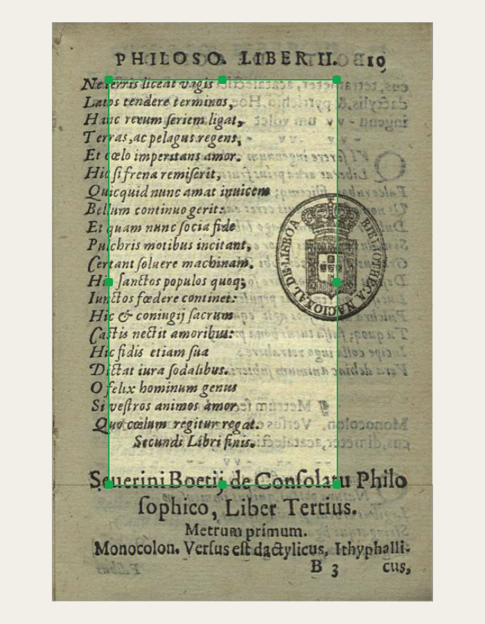
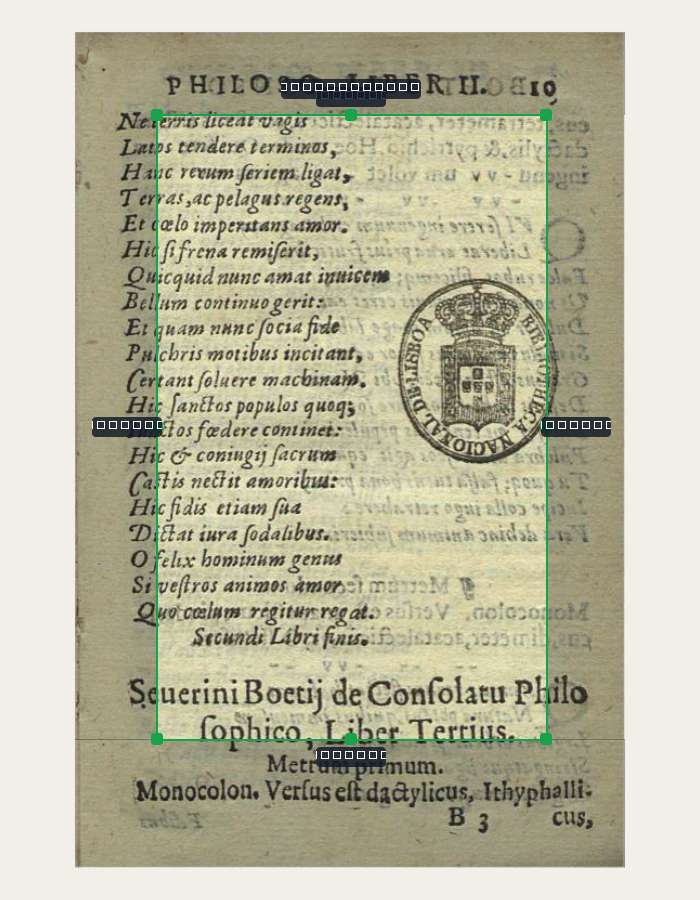
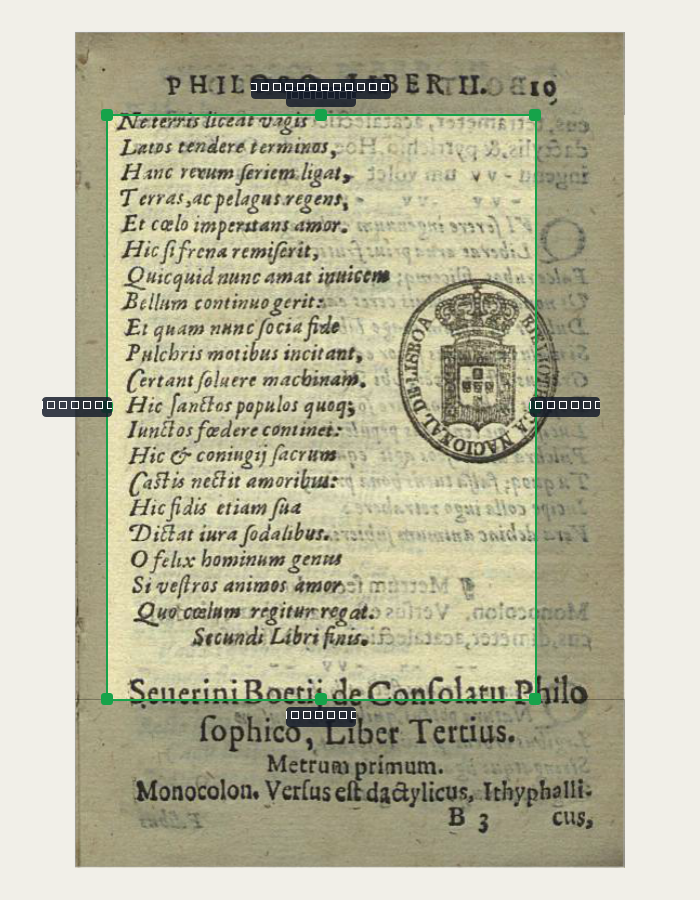
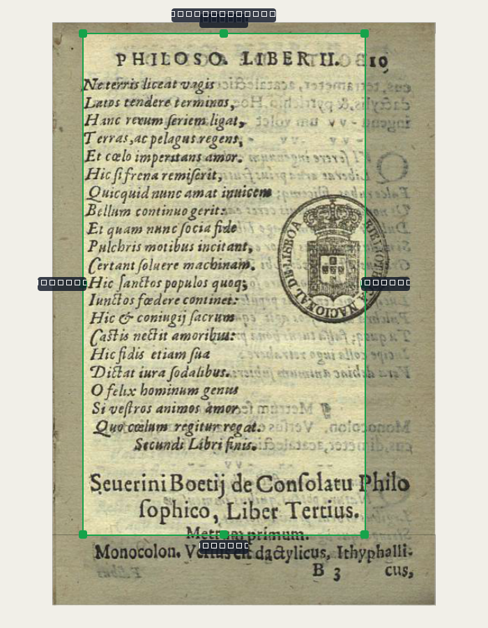
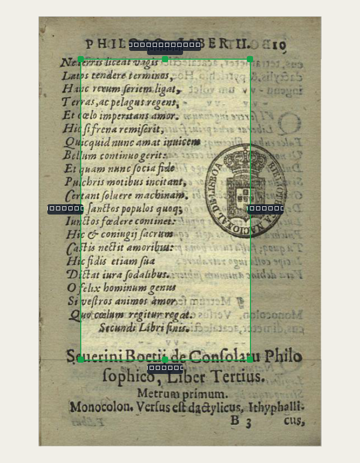
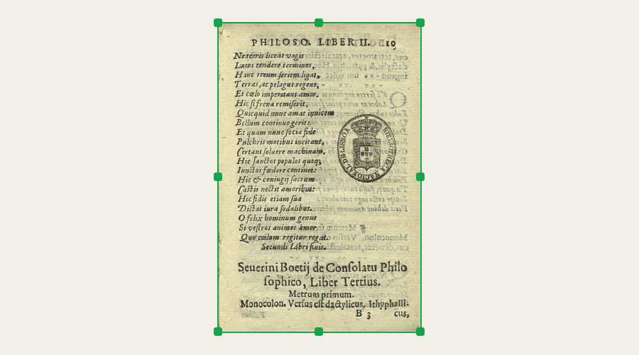
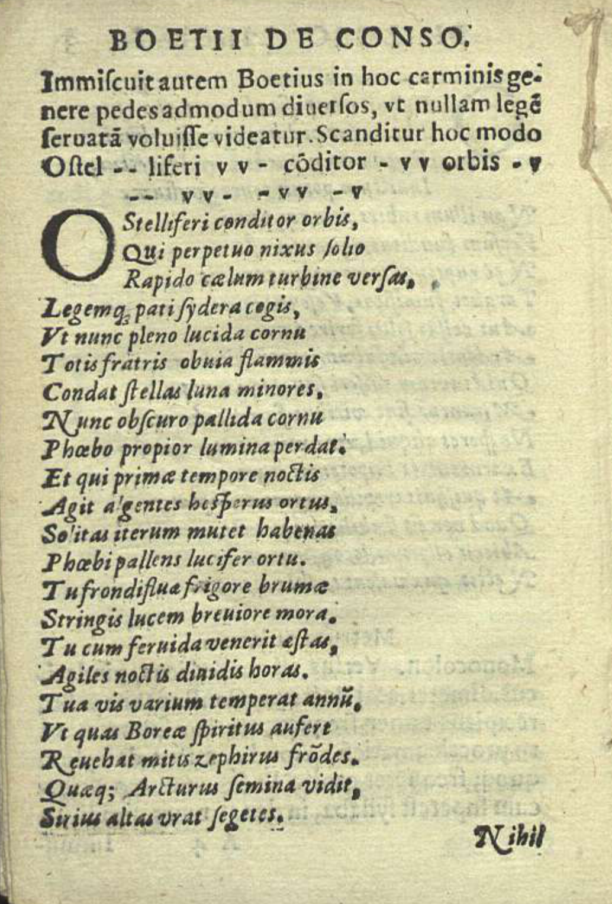
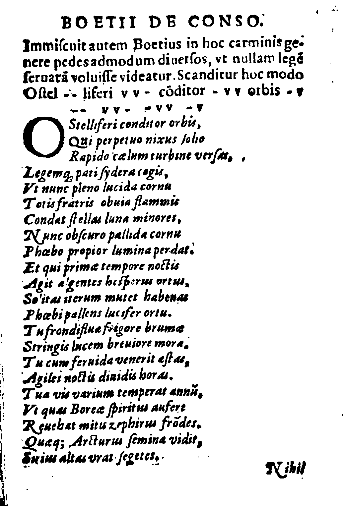
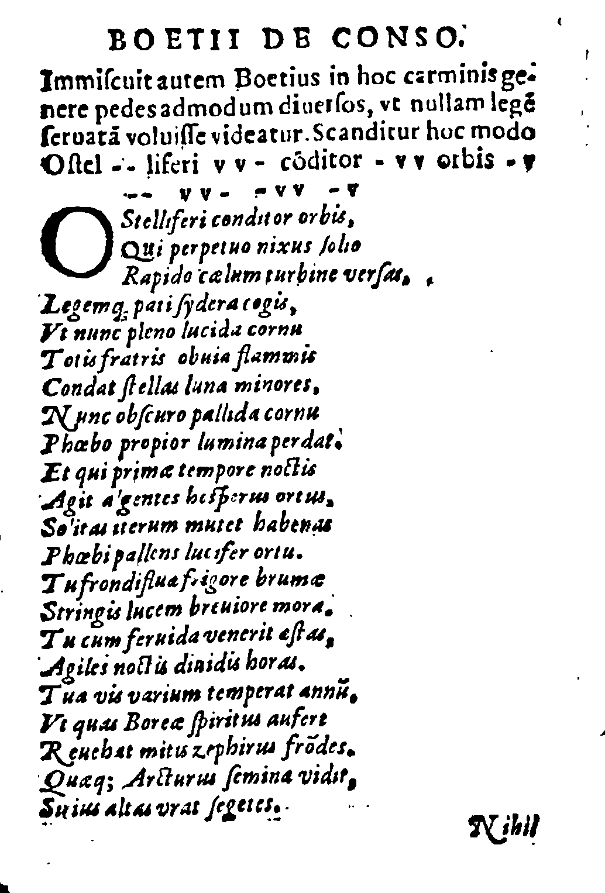

# Mudanças desta sessão, prontas pra você conferir

Tudo listado no plano aprovado foi implementado e testado (349 testes automáticos +
124 cliques reais nas telas, tudo passando). **Nada foi commitado ainda** — por
protocolo, falta você abrir o programa pelo atalho e testar ao vivo antes do commit.

**Aviso sobre as imagens abaixo:** os textinhos em cm (e outras dicas de tela) aparecem
como quadradinhos pretos nos prints — isso é só porque gerei os prints num modo do
programa que roda "sem tela" (pra automação), e esse modo não tem nenhuma fonte de
letra instalada. Confirmei isso com um teste à parte: **qualquer texto**, mesmo de
telas antigas que eu não toquei, sai como quadradinho nesse modo. No programa de
verdade, aberto normalmente, o texto aparece normal. Só quis deixar claro antes de
você olhar, pra não achar que quebrei alguma coisa.

## Problema 3 — margem direita + espelhado + proporção travada

Antes do conserto, arrastar os cantos direitos do retângulo verde não mexia na
largura. Comparando a imagem 1 (retângulo antes) com a 2 (depois de arrastar o
canto de baixo-direita): a largura aumentou de verdade — o bug está corrigido.




**Espelhado** — arrastei só o lado direito, e os dois lados (esquerdo e direito)
se moveram juntos, mantendo o meio no lugar:



**Proporção travada** — arrastei o canto de baixo-direita, e o retângulo cresceu
nos 4 lados mantendo a mesma forma (a razão largura/altura de antes):



Os botões "Espelhado" e "Proporção travada" e as teclas T/M ficam na barra de
botões da aba Bordas — ainda não testados com clique de mouse de verdade nem com
tecla de verdade (só a lógica interna, que estes prints mostram). Vale você
testar isso especificamente.

## Problema 1.1 — números em cm

Aparecem (como quadradinhos no print, texto de verdade no programa) enquanto
você arrasta o retângulo — um de cada lado cortado, e o tamanho final no topo:



## Problema 1.2 — escolher o tamanho da folha digitando

O botão "tamanho..." (ao lado de "usar em todas") abre um diálogo com campos de
largura/altura em cm e atalhos A4/A5/Carta. Testado no clique automático (o robô
escolheu "A5" e confirmou, sem travar) — ainda não testado visualmente por você.

## Problema 4 — moldura ao redor da página

Antes a página colava nas bordas da tela. Agora sobra uma faixa cinza-bege
visível ao redor, mesmo em "ajustar à tela" (aqui o widget está bem mais largo
que a página, de propósito, pra faixa aparecer clara nos dois lados):



## Problema 5 — três algoritmos do Preto e branco, na página 8 (a itálica que você reclamou)

Original, pra comparar:



Sauvola (o de sempre), Otsu e Wolf, lado a lado:





**Minha leitura, olhando as três:** nesta página específica as três saíram bem
parecidas e legíveis — a letra itálica não quebrou em nenhuma. O Otsu pegou um
pouco mais de poeira na margem esquerda; o Wolf, um pouco na direita. Não vi a
perda de qualidade dramática que você tinha reportado antes — pode ser que ela
apareça mais forte noutra página do Boécio, ou que o scan de baixa resolução
(já documentado como limite conhecido do acervo) seja o fator principal, não o
algoritmo. Vale você comparar estas três com o que via antes e me dizer se
alguma ficou visivelmente melhor.

**Limpar poeirinha (despeckle) ligado vs desligado**, mesma página, mesmo
algoritmo (Sauvola) — dá pra ver mais pontinhos soltos na versão desligada:




O seletor de algoritmo e a caixa de despeckle ficam na aba Filtro, dentro do
bloco "AJUSTE", só quando Preto e branco está escolhido.

## Problema 2 — página nasce em Original

Conferido direto no código (não é mais preciso adivinhar):

```
ConfigPagina.filtro por padrão agora:      original   (era preto_e_branco)
Projeto.filtro_padrao por padrão agora:    original   (era preto_e_branco)
```

A detecção de gravura/letra/papel não roda mais sozinha ao abrir a aba Marcar —
agora tem um botão "detectar automaticamente" nessa aba (e o mesmo pelo menu
Marcar → "Procurar de novo"). O "usar em todas" do Filtro já existia — confirmei
que continua funcionando, e agora também leva junto o algoritmo do Preto e
branco e o despeckle escolhidos.

## Problema 5.4 — alerta de página que pode ter processado mal

Nova conta que compara o resultado do Preto e branco com o original e aponta
sozinha se sobrou tinta demais (`escura_demais`) ou se o texto quase sumiu
(`apagada_demais`) — aparece no mesmo painel "Para revisar" de sempre. Testei
nos três algoritmos da página 8: nenhum disparou o alerta (bate com a leitura
acima, de que as três saíram razoáveis nesta página).

## O que ficou de fora desta rodada, e por quê

- **Problema 1.3/1.4 (tamanho e posição do conteúdo dentro da folha, com
  linhas-guia e ímã):** a lógica das guias/ímã está pronta e testada (9 testes
  automáticos), e os campos novos já existem no arquivo de projeto
  (`conteudo_escala`, `conteudo_deslocamento`) — mas a parte de arrastar o
  conteúdo na tela ainda não foi ligada na interface. Escolhi priorizar
  terminar os outros 7 itens do plano primeiro; posso voltar nisso na próxima
  rodada.
- **Problema 5.5 (reforçar o marcador com espessura do traço + Tesseract):**
  não comecei — é uma frente própria, com dependência nova (Tesseract) e
  merece a régua de medição (`avaliar_selecao.py`) rodada com calma antes de
  mexer, em vez de entrar apressada no fim de uma sessão já grande.

## Como conferir de verdade

```
cd D:\programas\EditorImpressao
.venv\Scripts\python.exe -m pytest tests -q      # 349 casos
.venv\Scripts\pythonw.exe main.py                 # abrir de verdade e testar
```

Nada commitado. Quando você testar e aprovar (ou pedir ajuste), sigo pro commit.
