# Quando uma página deve ir para "Para revisar" no Misto

**06/10/2026 · estudo pedido pelo Samuel · feito pelo agente pesquisador/verificador.**
Nada do programa foi mudado. Tudo o que está aqui foi rodado pelo mesmo caminho do programa e **olhado
página por página** (máquina para medir, olho para dizer se a página saiu certa).

A sua pergunta (06/10): *"gostaria de saber qual é o critério para uma página entrar em revisão, por exemplo
tu mostrou aí páginas que selecionam pequenos pedaços de figuras, capitulares e bordas como texto, isso é uma
razão para ir para revisão?"*

## Em poucas palavras

1. **Hoje a regra é uma só:** se sobra muita "tinta forte" (tão escura quanto as letras) fora das linhas que o
   leitor de texto achou e fora das gravuras, a página vai para "Para revisar". O limite é 10% da tinta da página.
2. **No jeito de fábrica ("Guardar a tinta forte") essa regra manda páginas demais.** Das 59 páginas que testei,
   35 iriam para revisar, e só 7 estavam erradas de verdade; 20 estavam certas e 8 tinham só o mesmo defeito
   que o Preto e branco de hoje já tem. Ela pegou as 7 erradas, mas quase por acaso: página com desenho tem
   muita tinta fora do texto, esteja certa ou não.
3. **Pedaço de figura, capitular ou borda pego como texto, sozinho, não é razão para revisar.** No jeito de
   fábrica isso não estragou nenhuma página (a tinta forte fica de qualquer jeito). No "Tudo em preto e branco"
   o leitor de texto nem é usado. Só no "Só o texto achado" sobra um pedacinho solto, e ali a página já está
   errada por outro motivo.
4. **O que estraga de verdade no jeito de fábrica é outra coisa:** o programa apaga a parte clara de um desenho
   que o detector de gravura não reconheceu (capitular gravada, letra ornamental, diagrama de traço fino), ou
   reconhece como gravura uma mancha ou um remendo, que sai impresso em marrom.
5. **"Só o texto achado" errou em 43 das 59 páginas:** apaga capitular, moldura, música, tabela,
   números. Nesse jeito, toda página que tem qualquer coisa além de texto corrido precisa ser olhada.
6. **Minha recomendação (opção 1):** medir o que foi apagado em vez de medir o que sobrou. No jeito de fábrica,
   18 páginas em vez de 35, e as 7 erradas continuam lá. No "Só o texto achado", revisar toda página em que
   sumiu um pedaço forte do tamanho de uma letra e meia.

---

## 1. Como funciona hoje

O Misto ("Só as letras", dentro do Preto e branco) faz assim: o leitor de texto marca as linhas de texto; o
detector de gravura marca as figuras (essas ficam como no original). O que sobra **fora das duas** é tratado por
um dos três jeitos:

| Jeito | O que faz com a tinta fora do texto e fora das gravuras |
|---|---|
| **Guardar a tinta forte** (de fábrica) | guarda, em preto, o que é tão escuro quanto as letras; o que é mais claro vai para o branco |
| **Tudo em preto e branco** | passa tudo para preto e branco (não usa o leitor de texto) |
| **Só o texto achado** | apaga tudo (só as linhas achadas ficam) |

O aviso de hoje conta a tinta forte que ficou fora do texto e das gravuras. Passou de 10% da tinta da página,
a página vai para "Para revisar" com a frase "Sobrou bastante tinta forte fora do texto que eu achei".

**Exemplo de página que vai para revisar à toa.** Graduale, p. 222: a música inteira está fora das linhas de
texto, então conta como "tinta forte fora do texto" (76% da tinta). Mas no jeito de fábrica a música é
guardada: a página saiu certa. Olhe o quadro do meio: as notas e as pautas estão todas lá.

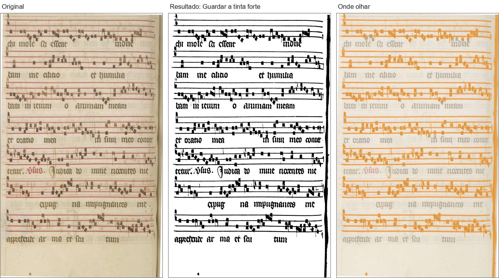

O mesmo com a moldura do Palatino, p. 10 (31%): a moldura é guardada em preto, igual ao Preto e branco de hoje.

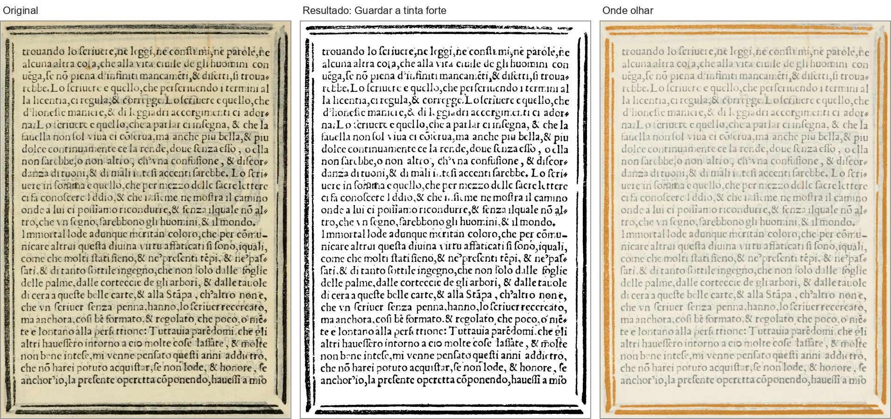

**Exemplo de página que vai para revisar com razão.** Palatino, p. 76: a capitular "S" gravada em madeira não foi
reconhecida como gravura. O desenho dela é cinza claro, mais claro que as letras, e o jeito de fábrica o mandou
para o branco. **Olhe o quadro do meio, no alto à esquerda: da letra S só sobrou a moldura e um arco.** No
terceiro quadro, em vermelho, tudo o que sumiu. Ela foi para revisar hoje, mas porque a página tem moldura
(37% de tinta forte), não por causa da letra.

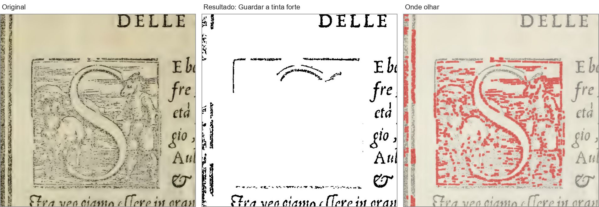

---

## 2. Os jeitos de a página sair errada

| # | O que acontece | Em qual jeito | O que sai na folha impressa | Grave? |
|---|---|---|---|---|
| 1 | O detector de gravura **não acha um desenho de traço claro** (capitular gravada, letra ornamental, diagrama fino) | Guardar a tinta forte | **a parte clara some**; o desenho sai comido | **grave** |
| | | Tudo em preto e branco | o desenho sai em preto e branco, como hoje | leve |
| | | Só o texto achado | o desenho some inteiro | **grave** |
| 2 | O detector não acha um desenho **escuro** (moldura, xilogravura, capitular escura) | Guardar a tinta forte e Tudo em preto e branco | sai em preto e branco, igual ao Preto e branco de hoje | leve |
| | | Só o texto achado | some | **grave** |
| 3 | O detector **acha gravura onde não tem** (mancha, remendo de papel) ou pega demais (pautas ao lado da iluminura) | os três | a mancha sai impressa em marrom; a música dentro da zona sai marrom em vez de preta | **grave** |
| 4 | O leitor de texto **pega um pedaço de figura, capitular ou borda como se fosse texto** (a sua pergunta) | Guardar a tinta forte | nada que se veja (testado) | nenhum |
| | | Tudo em preto e branco | nada (o leitor não é usado) | nenhum |
| | | Só o texto achado | sobra um pedaço solto no meio do branco | a página já está errada pelo #1, #2 ou #5 |
| 5 | Fora das linhas há **música, tabela, moldura, capitular, número, letra colorida** | Só o texto achado | **some** | **grave** |
| 6 | O leitor **não acha uma linha de texto** | Guardar a tinta forte | fica, se as letras são escuras; some, se são mais claras que as outras letras da página | grave (não aconteceu nas 59 páginas) |
| | | Só o texto achado | some | **grave** |
| 7 | Papel escuro ou beirada preta do scanner | os três (e o Preto e branco de hoje) | tarja ou faixa preta | é assunto do corte e do Preto e branco, não do Misto - mas hoje faz a página ir para revisar pelo aviso do Misto |

### 2.1 Desenho de traço claro comido (o erro grave do jeito de fábrica)

Palatino, p. 67: a capitular "M" não foi reconhecida como gravura. **Olhe dentro do quadrado da letra, no quadro do
meio:** o fundo desenhado (folhas, figuras) sumiu quase todo; o Preto e branco de hoje o guarda.

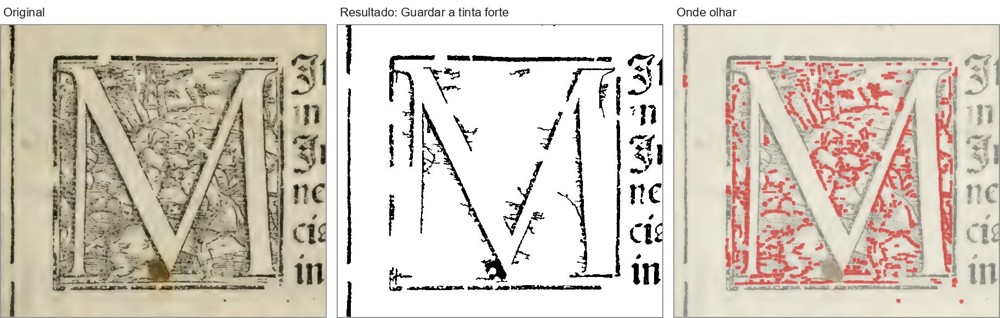

Palatino, p. 66, rodapé: as letras ornamentais "M." e "D." são de contorno claro. **Olhe o "M" à esquerda, no
quadro do meio:** ficou pela metade.

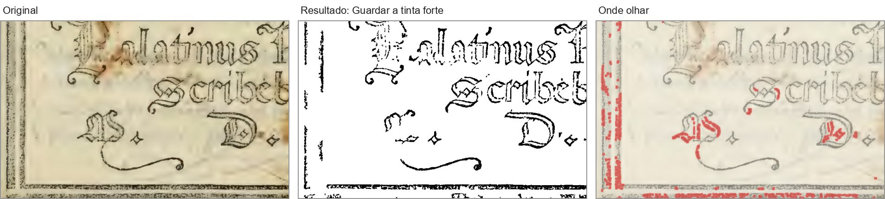

Manuscrito ljs47, p. 103: o diagrama de traço vermelho fino não foi reconhecido como gravura. **Olhe as linhas
horizontais e os arcos, no quadro do meio:** ficaram picotados (no vermelho, o que o Preto e branco guardaria).
Aqui o próprio Preto e branco de hoje também perde muito, porque o traço é muito claro.

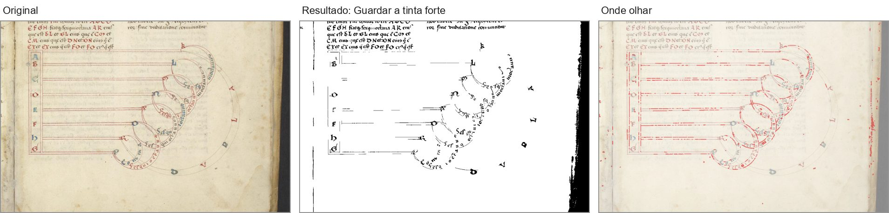

### 2.2 Gravura achada onde não tem

Marial, p. 454: um remendo de papel à esquerda e a mancha do verso à direita foram marcados como gravura
(em verde, no terceiro quadro). **No quadro do meio, as duas manchas marrons saem impressas.** Isso não tem
nada a ver com o leitor de texto: é o detector de gravura. O aviso de hoje pegou a página por outro motivo (a
beirada escura).

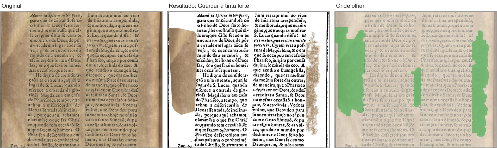

Antiphon, p. 260: a zona de gravura da iluminura se estende pelas pautas ao lado (verde). **No quadro do meio, as
notas dentro dessa zona saem marrons, como no original, e as de fora saem pretas.**

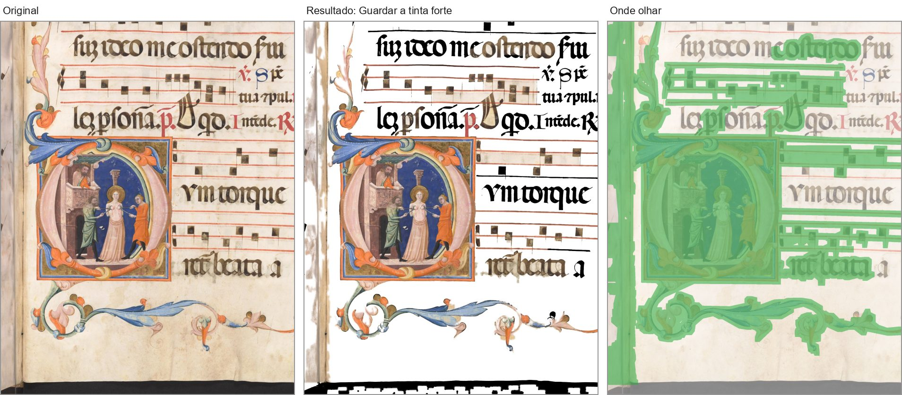

### 2.3 A sua pergunta: pedaço de figura pego como texto

Boécio, p. 3 (folha de rosto): o leitor de texto achou o "IHS" no meio da gravura como se fosse uma linha de
texto (azul, no terceiro quadro). **No jeito de fábrica, nada de errado aparece** (quadro do meio): a gravura
inteira sai em preto e branco, igual ao Preto e branco de hoje.

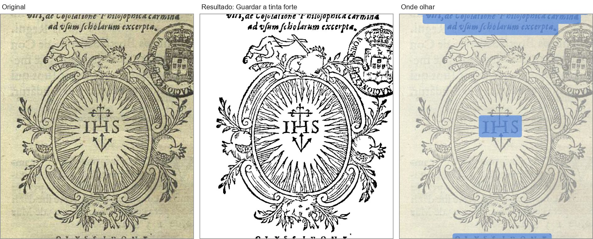

No "Só o texto achado", a mesma página: a gravura some inteira (vermelho) e **o "IHS" fica boiando sozinho**
no meio da folha. O erro aqui é a gravura sumir; o "IHS" solto é só a parte mais visível dele.

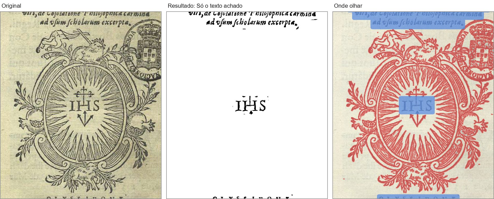

Palatino, p. 57: o leitor pegou um pedaço do floreio como texto (azul). No "Só o texto achado" **sobra esse
pedaço ("+P") solto no alto, à esquerda**, e todo o resto da moldura some.

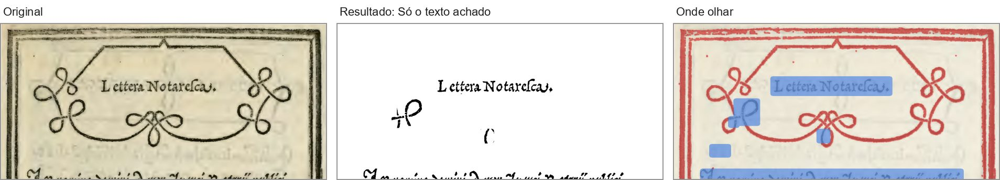

**Conclusão sobre a sua pergunta:** medi isso nas 59 páginas (linhas do leitor que um traço comprido de
desenho atravessa). No jeito de fábrica, esse sinal mandaria 35 páginas para revisar, e 23 delas estavam certas.
Não vale como critério sozinho.

### 2.4 O que o "Só o texto achado" apaga

Boécio, p. 7: **a capitular "Q" e os sinais de métrica ("- - v v") do alto somem.** (O vermelho na margem
direita é a mancha do verso, que sumir é bom.)

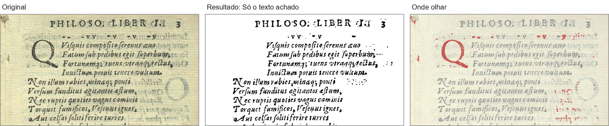

Na escola de Jesus, p. 197: **somem os números "1 -", "2 -", "3 -" da margem esquerda** (fica "2" e "3" sem
o traço, e o "1" some inteiro). Página que parece só de texto, e mesmo assim perdeu algo.

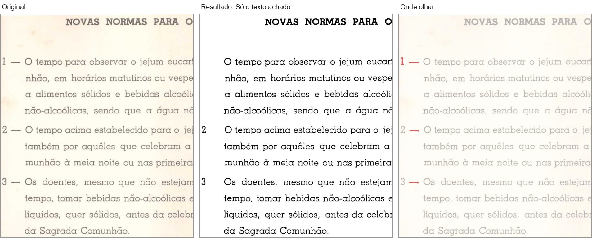

Graduale, p. 222: **a música inteira some.**

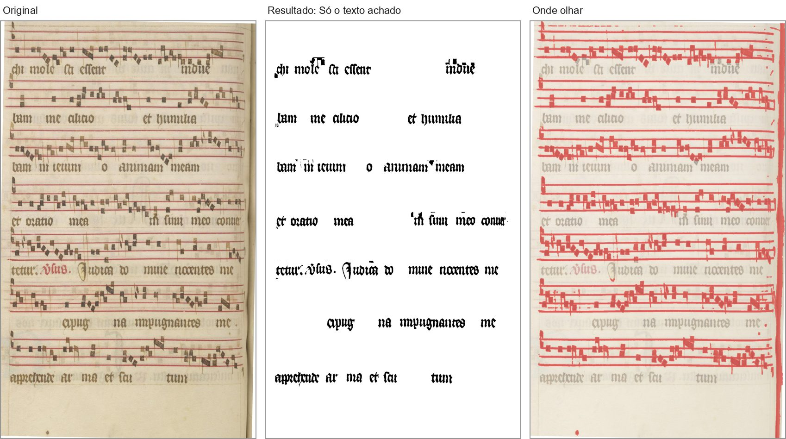

Rhetorica, p. 129: **a gravura de página inteira some**; sobram quatro letras que o leitor achou.

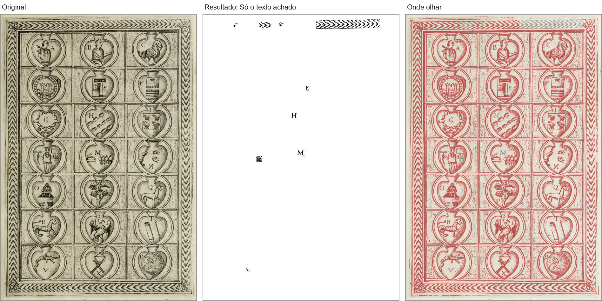

---

## 3. O que eu testei

- **59 páginas**: as 34 do gabarito do Misto (32 folhas; o Siebmacher 7 e 9 dão duas páginas cada) e mais 25
  páginas de 13 livros do acervo (somente leitura), escolhidas olhando miniaturas para ter de tudo: música com
  iluminura, manuscrito com diagrama, tabela, capitular gravada, moldura, gravura com texto, texto puro,
  livro moderno, papel escuro.
- Cada página rodou **pelo mesmo caminho do programa** (a página preparada, a marcação de gravura, o leitor de
  texto rápido, os três jeitos do Misto e o Preto e branco de hoje), **uma de cada vez**.
- **Olhei todas as 59 páginas**, cada uma com o original, o "Guardar a tinta forte", o "Só o texto achado" e um
  mapa do que ficou e do que sumiu, e dei um veredito para cada jeito: **certa**, **leve** (defeito pequeno, ou o
  mesmo que o Preto e branco de hoje já tem, como uma moldura não achada que sai em preto e branco) ou
  **errada** (algo impresso sumiu, foi comido pela metade, ou entrou sujeira em cor). Os detalhes estão no fim.
- No jeito de fábrica: 7 erradas, 12 leves. No "Só o texto achado": 43 erradas.

**Os sinais que medi** (todos só fora das gravuras achadas):

| Sinal | Em uma frase |
|---|---|
| O de hoje | quanta tinta forte sobrou fora do texto achado |
| Linha atravessada (a sua pergunta) | o leitor achou uma linha de texto que um traço comprido de desenho atravessa |
| Linha encostada na gravura | uma linha de texto achada encosta numa gravura achada |
| **(1) Desenho comido** | o jeito de fábrica apagou tinta, e ela estava **amontoada** num lugar (um desenho, não um pontinho solto da mancha) |
| **(2) Figura passou da beirada** | um pedaço grande de tinta encosta na gravura achada pelo lado de fora: a figura é maior do que o detector marcou |
| **(3) Muita tinta apagada** | o jeito de fábrica apagou mais de 2,5% da tinta da página |
| Pedaço forte grande | sumiu (no "Só o texto achado") um pedaço forte do tamanho de uma letra e meia ou maior |

## 4. A tabela

**No jeito de fábrica, "Guardar a tinta forte"** (7 páginas erradas de 59):

| Critério (no jeito de fábrica, "Guardar a tinta forte") | Vão para revisar | Erradas de verdade entre elas | Com defeito leve | Certas (à toa) | Erradas que ficam de fora |
|---|---|---|---|---|---|
| **Hoje:** tinta forte fora do texto acima de 10% | 35 | 7 | 8 | 20 | 0 de 7 |
| O de hoje, com 30% | 23 | 4 | 7 | 12 | 3 de 7 |
| O de hoje só no "Só o texto achado" (no de fábrica, nunca) | 0 | 0 | 0 | 0 | 7 de 7 |
| Sua pergunta: o leitor pegou pedaço de figura, capitular ou borda como texto | 35 | 6 | 6 | 23 | 1 de 7 |
| Linha de texto encostada numa gravura achada | 21 | 3 | 6 | 12 | 4 de 7 |
| Novo (1): desenho comido - tinta apagada amontoada (2% ou mais) | 6 | 3 | 2 | 1 | 4 de 7 |
| Novo (2): figura passou da beirada da gravura achada (10% ou mais) | 7 | 3 | 1 | 3 | 4 de 7 |
| Novo (3): muita tinta apagada fora do texto (2,5% ou mais) | 11 | 4 | 4 | 3 | 3 de 7 |
| Novos (1) ou (2) | 13 | 6 | 3 | 4 | 1 de 7 |
| **Novos (1), (2) ou (3) - a opção 1** | 18 | 7 | 5 | 6 | 0 de 7 |
| Todas as páginas | 59 | 7 | 12 | 40 | 0 de 7 |

**No "Só o texto achado"** (43 páginas erradas de 59):

| Critério (no "Só o texto achado") | Vão para revisar | Erradas de verdade entre elas | Com defeito leve | Certas (à toa) | Erradas que ficam de fora |
|---|---|---|---|---|---|
| **Hoje:** tinta forte fora do texto acima de 10% | 35 | 31 | 0 | 4 | 12 de 43 |
| O de hoje, com 30% | 23 | 22 | 0 | 1 | 21 de 43 |
| Sua pergunta: o leitor pegou pedaço de figura como texto | 35 | 30 | 1 | 4 | 13 de 43 |
| Novos (1), (2) ou (3) (os do jeito de fábrica) | 18 | 16 | 0 | 2 | 27 de 43 |
| **Sumiu um pedaço forte do tamanho de uma letra e meia ou maior - a opção 1** | 55 | 43 | 1 | 11 | 0 de 43 |
| Todas as páginas | 59 | 43 | 2 | 14 | 0 de 43 |

Só nas 34 páginas do gabarito: hoje vão 18 para revisar (o comentário no programa diz 19; nesta rodada foram 18),
e só 2 estavam erradas no jeito de fábrica (Palatino 66 e 67). Com a opção 1 iriam 7, com as mesmas 2 erradas.

**Tempo:** os sinais (1), (2) e (3) usam o que o Misto já calcula, mais uma conta de "janela" e uma de "pedaços
encostados". Todos os sinais juntos, inclusive os que não recomendo, levaram 0,55 s na página do Palatino e
2,1 s na página maior do Livro de Horas, num script meu, não otimizado. Os três da opção 1 devem custar uma
fração disso (estimado, não medido isolado).

---

## 5. O que você escolhe

Pela sua regra, a escolha vira o padrão de fábrica e as outras podem continuar como opção.

**Opção 1 - medir o que foi apagado (recomendada).**
- *Guardar a tinta forte:* vai para revisar quando o programa **apagou parte de um desenho** (sinais 1 ou 3) ou
  quando **uma figura passou da beirada da gravura achada** (sinal 2). Frase sugerida: *"Apaguei parte de um
  desenho que não reconheci como figura (ou uma figura passou da beirada). Confira."*
- *Só o texto achado:* vai para revisar sempre que **sumiu um pedaço forte do tamanho de uma letra e meia ou
  maior**. Frase sugerida: *"Apaguei coisas fora do texto (capitular, moldura, música, número). Confira."*
- *Tudo em preto e branco:* nada muda.
- Ganha: no jeito de fábrica, 18 páginas em vez de 35, com as 7 erradas; a frase diz o que olhar. No "Só o texto
  achado", nenhuma página errada fica de fora (hoje ficam 12).
- Perde: os números foram acertados nestas 59 páginas (pode ter "decorado" estes livros); 6 páginas certas ainda
  vão (beirada preta do scanner, gravura de página inteira). As páginas em que uma moldura ou capitular escura sai
  em preto e branco (igual ao Preto e branco de hoje) deixam de ir.

**Opção 2 - deixar como está (10%).**
- Ganha: nada a mudar; pegou as 7 erradas do jeito de fábrica.
- Perde: 35 de 59 páginas para revisar, 20 delas à toa; o Kaique tende a deixar de olhar. No "Só o texto achado",
  12 páginas erradas ficam de fora (capitular, número, letra dourada).

**Opção 3 - opção 1, e o aviso de hoje vira uma observação mais fraca.**
- Igual à opção 1, mais: a página com muito desenho fora do texto (que sai em preto e branco) ganha uma marca
  "tem desenho que saiu em preto e branco", que **não** entra em "Para revisar".
- Ganha: nada se perde de informação. Perde: é uma mudança de tela (um tipo de marca novo); precisa da sua
  aprovação antes.

**Opção 4 - subir o limite para 30%.**
- Ganha: 23 páginas em vez de 35.
- Perde: 3 páginas erradas do jeito de fábrica ficam de fora (Antiphon 260, Marial 454, Pesel 21) e 21 do "Só o
  texto achado". **Não recomendo.**

Se quiser manter as outras como opção, o lugar natural é uma escolha "Quanto o programa avisa: o essencial
(opção 1) / como antes (opção 2)" nas opções do livro. Isso é mudança de tela; só com a sua aprovação.

---

## 6. Ressalvas

- **Os limites (2%, 2,5%, 10%) foram acertados nestas mesmas 59 páginas.** Antes de virar padrão, o certo é
  conferir num livro que não entrou aqui.
- **Escolhi de propósito páginas com desenho.** Num livro de texto corrido, quase nenhuma página vai para revisar
  em nenhuma das opções; a diferença entre elas aparece nos livros decorados.
- **O veredito de cada página é o meu olho**, em imagens reduzidas e em alguns detalhes ampliados. Defeito muito
  pequeno pode ter escapado.
- O erro do tipo 3 (**gravura achada onde não tem**) não depende do leitor de texto e nenhum sinal o pega bem:
  o sinal (2) pegou o Marial 454 e o Antiphon 260 por causa da beirada, não pela mancha. Um aviso próprio para
  isso é outro estudo.
- **Página em que o leitor não acha nenhuma linha** (li no código, `core/pipeline.py`, `_filtrar_no_misto`): o
  Misto sai como "Tudo em preto e branco", sem aviso, e se a página já tinha o aviso de antes, ele fica como estava
  (não é tirado nem posto). Não é perigoso (nada é apagado), mas o aviso pode ficar velho.
- Usei só o leitor de texto rápido, como o programa faz de fábrica; o segundo leitor (manuscrito) não foi ligado.
- Não testei o "Tudo em preto e branco" página por página: nele só acontecem os erros 2 e 3, que também aparecem
  no jeito de fábrica.
- As imagens grandes da rodada ficaram fora do projeto (pasta temporária); refazem-se pelos scripts em
  `scripts/` (`rodar.py`, `medir.py`, `tabela.py`, `figuras.py`). Os números e vereditos estão em
  `dados/sinais-e-vereditos.json`.

---

## 7. Página por página

"Vai hoje?" = o aviso de hoje (entre parênteses, a tinta forte fora do texto). "Vai na opção 1" = no jeito de
fábrica.

| Página | Guardar a tinta forte | Só o texto achado | Vai hoje? | Vai na opção 1 (no jeito de fábrica)? | O que eu vi |
|---|---|---|---|---|---|
| Antiphon p. 088 | leve | **errada** | sim (60%) | não | A: a capitular B colorida pega um pedaco da pauta vermelha (fica em cor ao lado da pauta preta). C: a musica fora das linhas some. |
| Antiphon p. 260 | **errada** | **errada** | sim (12%) | sim | A: a zona de gravura cobre pautas inteiras: a musica fica desbotada, como no original, e a borda de folhas sai picotada. |
| Boecio p. 003 | certa | **errada** | sim (64%) | sim | C: a xilogravura e o carimbo somem; so o 'IHS' (que o leitor achou como texto) fica boiando. |
| Boecio p. 007 | certa | **errada** | não (3%) | não | C: a capitular Q e os sinais de metrica somem. |
| Boecio p. 008 | certa | **errada** | não (4%) | não | C: a capitular O e uma linha de sinais de metrica somem. |
| Boecio p. 022 | certa | **errada** | não (2%) | não | C: as duas capitulares Q e sinais de metrica somem. |
| Cursus p. 003 | certa | **errada** | sim (17%) | não | C: a capitular xilografica e o 'AD' do titulo somem. |
| Cursus p. 314 | certa | certa | sim (15%) | não | So a beirada preta do scanner (corte). |
| Escola p. 007 | certa | certa | não (1%) | não | - |
| Escola p. 035 | certa | certa | não (0%) | não | - |
| Escola p. 113 | certa | **errada** | não (0%) | não | C: o 'O' inicial de duas linhas some. |
| Escola p. 197 | certa | **errada** | não (0%) | não | C: os numeros '1 -', '2 -', '3 -' perdem pedacos. |
| Graduale p. 221 | certa | **errada** | sim (72%) | não | C: a musica some. |
| Graduale p. 222 | certa | **errada** | sim (76%) | não | C: a musica some. |
| Graduale p. 223 | certa | **errada** | sim (75%) | não | C: a musica some. |
| Graduale p. 269 | leve | **errada** | sim (29%) | sim | A: a borda de ramos sai meio em cor, meio preta. C: pedacos de pauta e notas somem. |
| Graduale p. 588 | leve | **errada** | sim (66%) | não | A: a capitular azul nao achada sai preta (igual ao Preto e branco). C: musica e capitulares somem. |
| Horas p. 011 | certa | certa | não (0%) | não | - |
| Horas p. 013 | certa | certa | não (4%) | não | - |
| Horas p. 014 | leve | **errada** | sim (55%) | não | A: a moldura dourada nao achada sai preta e grossa (igual ao Preto e branco). C: moldura e reguas da tabela somem ou ficam picotadas. |
| Horas p. 016 | certa | certa | não (1%) | não | - |
| Horas p. 026 | certa | certa | não (5%) | não | - |
| Horas p. 027 | certa | **errada** | não (3%) | não | C: letras douradas do comeco das linhas somem. |
| Horas p. 047 | certa | certa | não (0%) | não | - |
| Horas p. 175 | leve | **errada** | não (2%) | não | A: a capitular S decorada nao achada sai como bloco preto (igual ao Preto e branco). C: a capitular some, fica um quadrado vazio. |
| Ljs47 p. 026 | certa | **errada** | sim (55%) | sim | C: as iniciais azuis e vermelhas somem. |
| Ljs47 p. 049 | leve | leve | não (0%) | não | A pagina inteira virou gravura: manchas impressas em cor. |
| Ljs47 p. 064 | leve | leve | não (1%) | não | Quase toda a pagina virou gravura: manchas da margem em cor. |
| Ljs47 p. 103 | **errada** | **errada** | sim (65%) | sim | A: o diagrama vermelho de tracos finos (nao achado como gravura) fica picotado - somem tracos que o Preto e branco guarda. C: o diagrama some. |
| Marial p. 007 | leve | **errada** | não (5%) | não | A: o canto manchado foi marcado como gravura (mancha em cor). C: '& o' somem numa linha. |
| Marial p. 454 | **errada** | **errada** | sim (13%) | sim | A: um remendo de papel e a mancha do verso foram marcados como gravura: saem impressos em marrom. |
| Marial p. 840 | certa | certa | sim (15%) | não | - |
| Matematica p. 032 | certa | certa | sim (24%) | sim | As faixas pretas do scanner (assunto do corte, nao do Misto). |
| Matematica p. 072 | certa | certa | sim (34%) | sim | As faixas pretas do scanner (assunto do corte, nao do Misto). |
| Opus majus p. 003 | certa | **errada** | sim (13%) | não | C: o selo da editora some; sobra 'PRESS' picotado. |
| Opus majus p. 011 | certa | **errada** | não (1%) | não | C: a capitular C some. |
| Opus majus p. 020 | certa | certa | não (8%) | não | - |
| Opus majus p. 165 | certa | **errada** | não (6%) | não | C: as linhas dos dois diagramas somem; sobram as letrinhas. |
| Opus majus p. 256 | certa | **errada** | sim (37%) | não | C: reguas e numeros da tabela picotados. |
| Palatino p. 005 | certa | certa | não (0%) | não | - |
| Palatino p. 007 | certa | **errada** | não (1%) | não | C: a capitular V e letras do titulo somem. |
| Palatino p. 009 | certa | **errada** | sim (46%) | não | C: a capitular Q e a moldura somem; sobra um pedaco de fio. |
| Palatino p. 010 | certa | **errada** | sim (31%) | não | C: a moldura some. |
| Palatino p. 057 | certa | **errada** | sim (61%) | não | C: moldura, floreios e capitulares somem; sobram pedacos soltos. |
| Palatino p. 066 | **errada** | **errada** | sim (42%) | sim | A: a letra ornamental 'M' do rodape, de contorno claro, fica pela metade (o Preto e branco guarda inteira). |
| Palatino p. 067 | **errada** | **errada** | sim (42%) | sim | A: a capitular xilografica M perde quase todo o desenho de dentro (o Preto e branco guarda). |
| Palatino p. 076 | **errada** | **errada** | sim (37%) | sim | A: a capitular xilografica S some quase inteira; fica so a moldura dela. |
| Palatino p. 104 | certa | **errada** | sim (20%) | não | C: reguas da tabela picotadas. |
| Palatino p. 113 | certa | **errada** | sim (42%) | sim | C: a moldura em pergaminho some. |
| Pesel p. 021 | **errada** | **errada** | sim (21%) | sim | A e C: a legenda no papel escuro vira tarja preta (o Preto e branco faz o mesmo; nao e do Misto). |
| Rhetorica p. 018 | certa | **errada** | sim (10%) | não | C: fios da moldura picotados. |
| Rhetorica p. 034 | certa | certa | não (6%) | não | - |
| Rhetorica p. 073 | certa | **errada** | sim (26%) | não | C: chaves e ornamentos somem. |
| Rhetorica p. 129 | certa | **errada** | sim (91%) | sim | C: a gravura de pagina inteira some; sobram 4 letras. |
| Rhetorica p. 160 | certa | **errada** | não (9%) | não | C: fios da moldura somem. |
| Siebmacher p. 007 (direita) | leve | **errada** | sim (92%) | sim | A: moldura de floreios nao achada sai em preto e branco. C: a moldura some. |
| Siebmacher p. 007 (esquerda) | leve | **errada** | sim (45%) | sim | A: idem. C: moldura e capitular somem. |
| Siebmacher p. 009 (direita) | leve | **errada** | sim (91%) | sim | A: idem. C: a moldura some. |
| Siebmacher p. 009 (esquerda) | leve | **errada** | sim (53%) | sim | A: idem. C: moldura e capitular somem; a assinatura fica picotada. |
